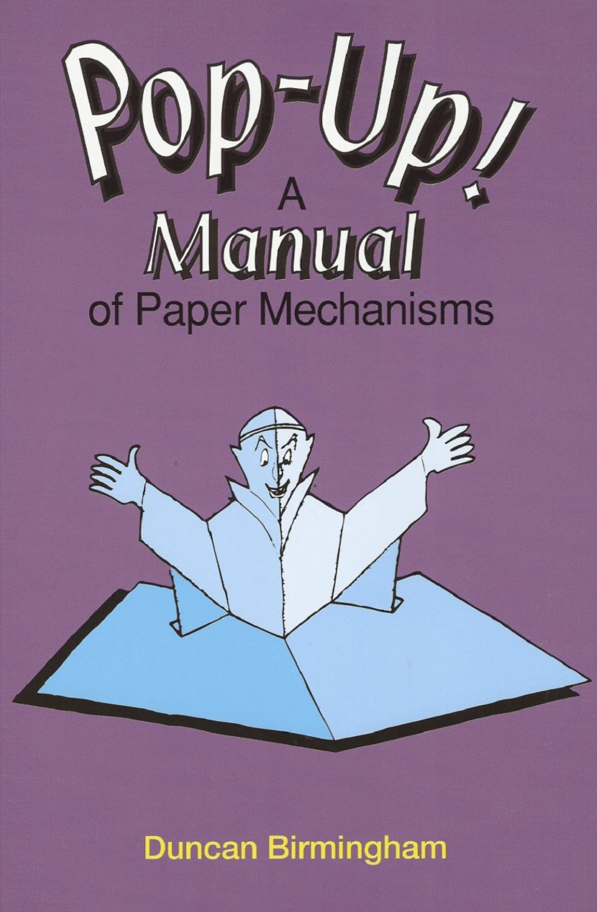
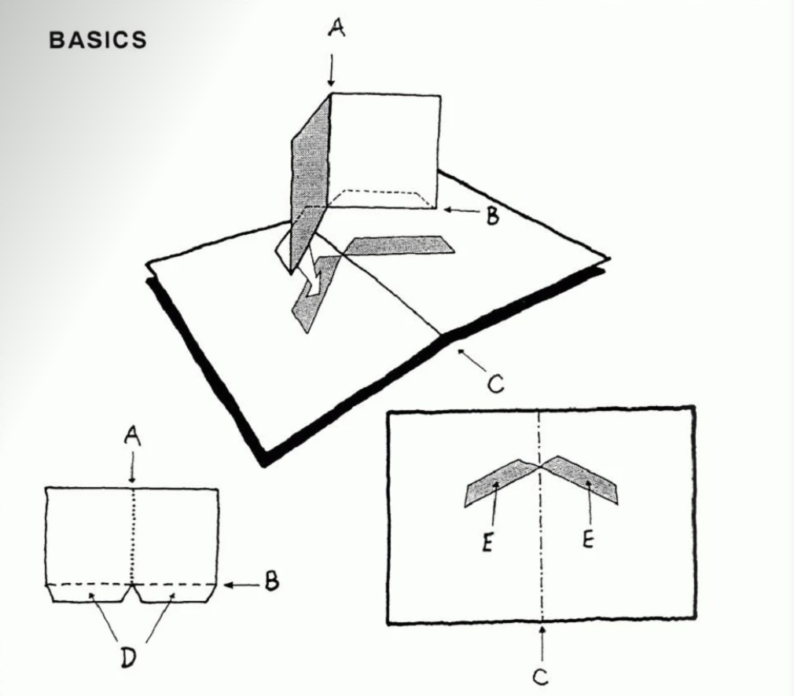

《Pop-Up Design and Paper Mechanics》

this book foucs on how to create dimensinal(维度) paper structures that appear flat(平坦的) but pop up when opened using various folding techniques.the techniques allow for making creative dimensional design and shapes using only paper

                                            -- Duncan Brimingham

> well,i can't find that book online,only one blurred(模糊),so,i change it.

《Pop-Up ! A Manual of Paper Mechanisms》

                                            -- Duncan Brimingham

# basic

1. term(术语)

***Base***: the double-page  which the pop-up is glued to

three kinds of folded line:
- **Valley folds**: A
- **Mountain folds**: B
- **The Spine**(脊柱): C

there also
- **Gluing-tabs**: D
- **Sticking-strips**: E

# the simple v-fold

> ok,the english book is really hard to read,i try to follow the Chinese vedio 

---

# introduction

所有弹出窗口的基础
- 收敛折痕
- 平行折痕

原则：
- 每一个pop必须横跨base页面
- 每一个pop必须在base的每一侧保持平衡

