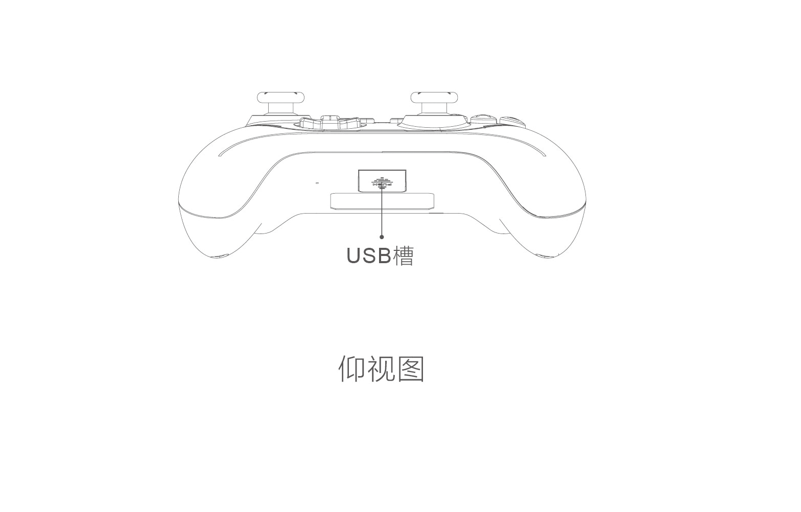

<!-- use.md -->

# 阿修罗2PRO+游戏手柄🎮

***布局介绍***

***按键功能介绍***

- 开机：短按`北通键`
- 关机：长按`Back`+`B`
- 连发：`Turbo`+`目标键`
    > 再次按住即可关闭
- 十字键遥杆互换：`shift`
- 摇杆校准：
    - 按下`北通键`开机
    - 按下`Start`+`Back`+`RS`
    - 顺时针转动左右摇杆2-3圈
    - 再次按下`Start`+`Back`+`RS`退出校准
- 清除配对：关机下按`RB`+`Back`+`RS`+`北通键`

***连接***

- 电脑

蓝牙模式
1. `RB`+`北通键`
2. 连接

- switch
# 

1. 启动Switch主机，在桌面进入【手柄-更改手柄的握法/顺序】；
2. 手柄处于关机状态（如已经开机长按BACK+B关机），先按住【LB键】不松开+按一次【LOGO键】，直到Logo处指示灯快速炫彩闪烁后松手；然后长按【LB+RB】不松开直到连接上为止；
3. 手柄再次蓝牙连接NS，只需将手柄开机，即可自动回连。

