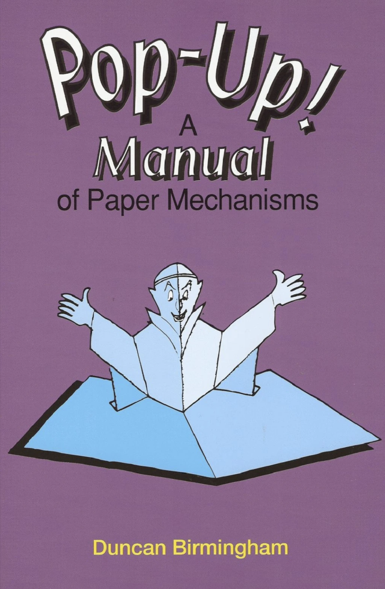
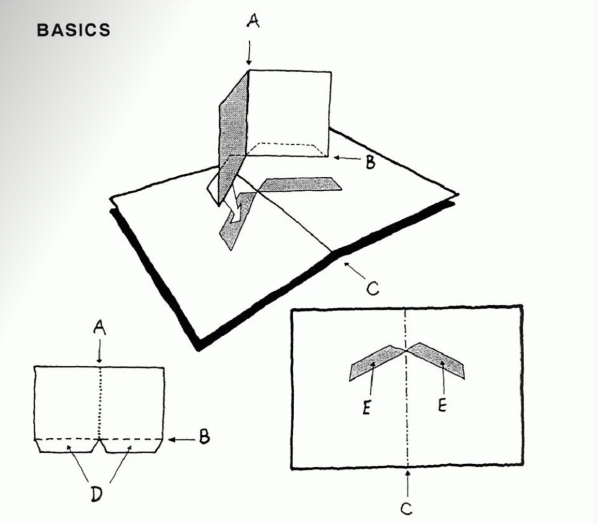
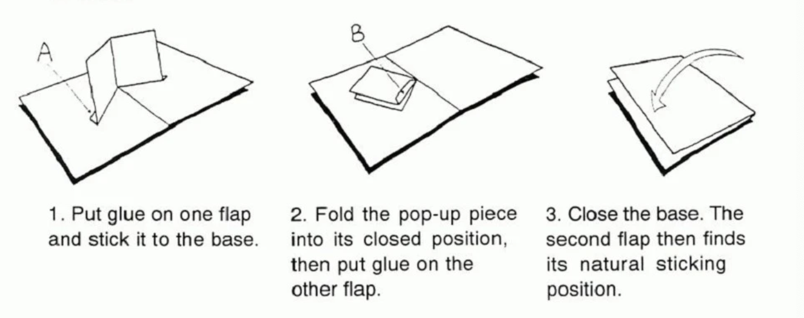

《Pop-Up Design and Paper Mechanics》

this book foucs on how to create dimensinal(维度) paper structures that appear flat(平坦的) but pop up when opened using various folding techniques.the techniques allow for making creative dimensional design and shapes using only paper

                                            -- Duncan Brimingham

> well,i can't find that book online,only one blurred(模糊),so,i change it.

《Pop-Up ! A Manual of Paper Mechanisms》

                                            -- Duncan Brimingham

# basic

1. term(术语)

***Base***: the double-page  which the pop-up is glued to

three kinds of folded line:
- **Valley folds**: A
- **Mountain folds**: B
- **The Spine**(脊柱): C

there also
- **Gluing-tabs**: D
- **Sticking-strips**: E

# the simple v-fold

> ok,the english book is really hard to read,i try to follow the Chinese vedio 

---

# introduction

所有弹出窗口的基础
- 收敛折痕
- 平行折痕

原则：
- 每一个pop必须横跨base页面
- 每一个pop必须在base的每一侧保持平衡

# 计划

1. 电影院，人潮汹涌，可以扩展到很多一起看的剧
8. 第一次相遇时的教室座位，我反过来看她
6. 我晚上提前睡着了你还在刷手机的样子

2. 我们打过的游戏
    - 饥荒
    - 双人成行
    - 王者荣耀
    - 香肠派对

3. 我们去过的地方和拍的照片
    - 做一个中国地图，然后贴图片
4. 高中晚上一起回家，牵手
5. 异地恋隔着屏幕坐在桌子上的样子
7. 我们以后结婚典礼
9. 第一页可以介绍一下此时此刻，未来，曾经

