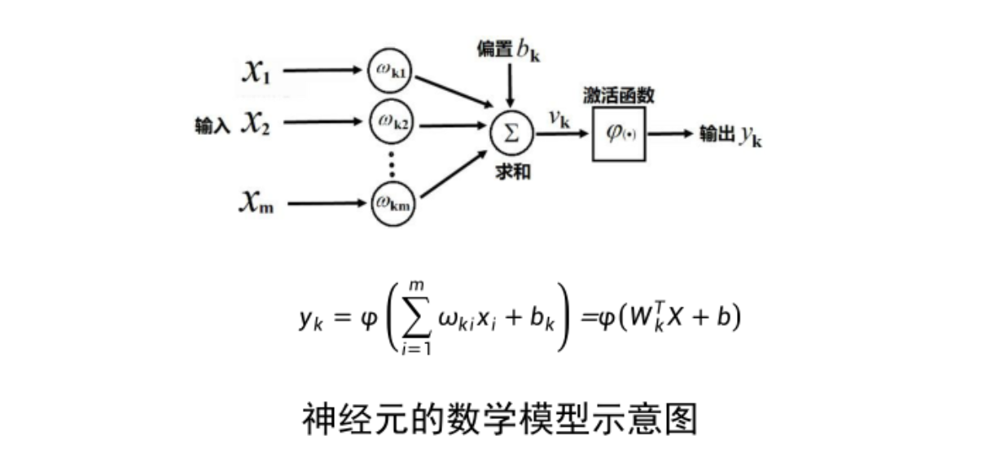
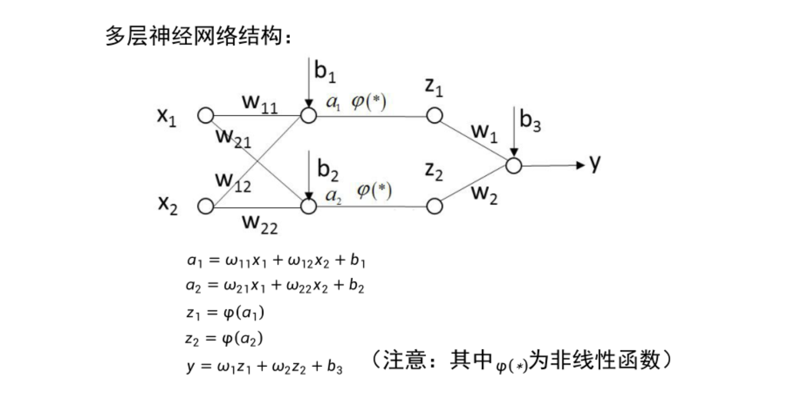
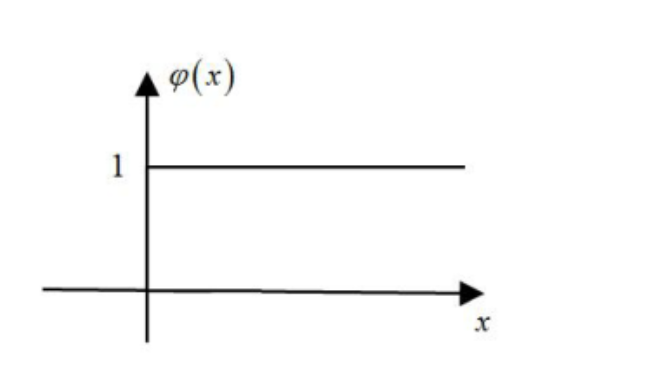

# k引入

## 什么是神经网络

神经网络是一种受生物神经系统启发的计算模型，由大量“神经元”或“节点”构成，用于处理复杂的模式识别、分类、预测等任务。在神经网络中，节点之间通过权重相连，信息在节点之间传播，通过计算和权重调整完成输入到输出的映射。

## 神经网络的发展

1. 1940年代:萌芽期

    M-P模型，Hebb学习规则

2. 1958-1969:繁荣期

    感知器，Adaline

3. 1969:冰河期

    Minsky&Papert "Perceptrons"

4. 1985-1995:繁荣期
    
    Hopfield,BP

5. 1995:沉寂期

    SVM及统计学兴起

6. 2010-至今：繁荣期

    深度学习

> 交替模式：热十年，冷十五年

# 算法

## M-P神经元模型

## 感知器

感知器算法：设定$f(x) = signn(w^TX+b)$，从一堆输入输出中自动学习，获得$w$和$b$

1. 随机选取$w$和$b$
2. 取一个训练样本$(X,y)$
    1. 若$w^TX+b > 0$，且$y = -1$，则
        $$w = w -x ,b = b-1$$
    2. 若$w^TX+b < 0$，且$y = 1$，则
        $$w = w +x ,b = b+1$$
3. 再取另一个$X,y$，回到步骤2 
4. 终止条件：直到所有输入和输出对$(X,y)$都不满足步骤2中的两个条件之一，退出循环

- 意义

1. 第一个机器学习算法的思想
2. 线性可分的情况下，感知器收敛性证明
3. 计算量和存储量少，并应用于深度学习

##  《Perceptrons》

日常生活中很多分类问题是非线性可分！导致了机器学习的冷淡期

## 多层神经网络

定理：如果非线性函数从用$\varphi (x)$为阶越函数时，多层神经网络可以模拟任何非线性模型

