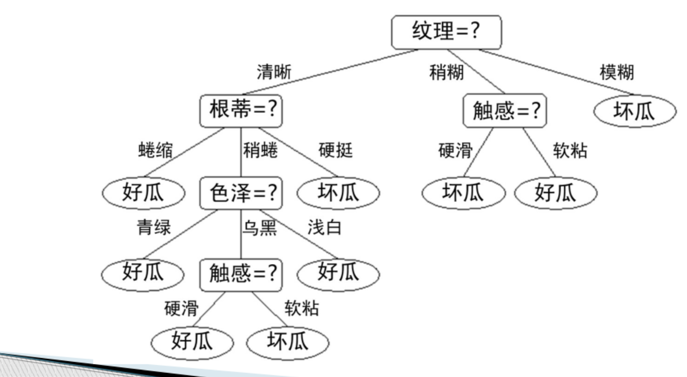
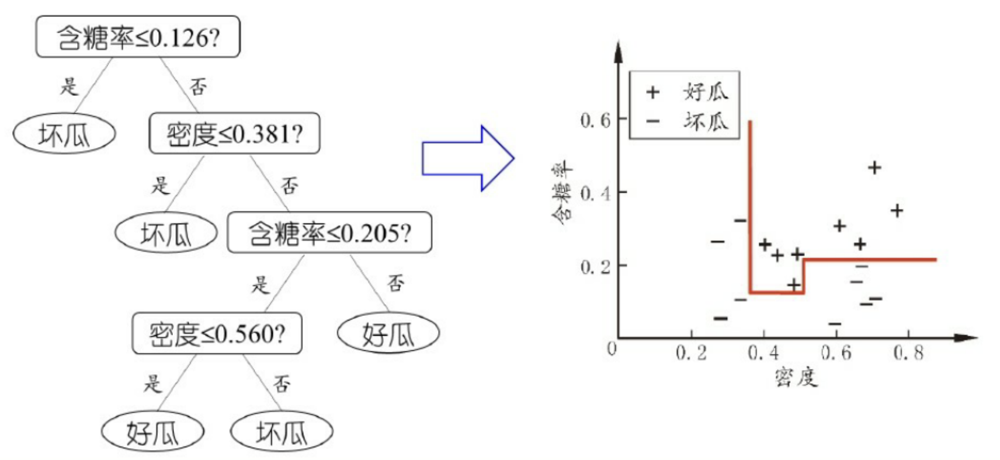
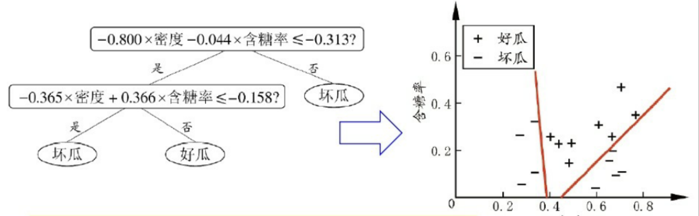

[toc]

# 1. 介绍

决策树基于“树”结构进行决策
- 每个“非叶节点”对应某个属性上的一个测试（test）
- "非叶节点"下的每个分支对应于该测试的一种可能结果（即该属性的某个取指）
- 每个“叶结点”对应于一个“预测结果“

学习过程：通过对训练样本的分析来确定”划分属性”(即非叶节点所对应的属性）建树的过程

预测结果：将测试数据从根节点开始，沿着划分属性所构成的“判定测试序列”下行，直到叶结点



# 2. 建树流程


## 2.1 算法

1. 策略

- 自根至叶的递归过程
- 在每个中间结点寻找一个“划分”（split or test） 属性

2. 算法描述

- **输入**:  
训练集 $D = \{(x_1, y_1), (x_2, y_2), \dots, (x_m, y_m)\}$;  
属性集 $A = \{a_1, a_2, \dots, a_d\}$

- **过程**:  
函数 `TreeGenerate(D, A)`

```c
TreeGenerate(D,A){
    生成结点node;

    // 当前结点包含的样本全属于同一类别，无需划分；
    if (D 中样本全属于同一类别 yi){
        将 node 标记为 yi 类叶结点;
        return;
    }

    // 当前属性集空，或是所有样本在所有属性上取值相同，无法划分；
    if (A == 空 OR D 中样本在 A 上取值相同){
        将 node 标记为叶结点，其类别标记为 D 中样本数最多的类;
        return;
    }

    // 决策树算法的核心：根据后面的划分依据进行划分
    从 A 中选择最优划分属性 ai;

    for (属性 ai 的每一个取值 aiv){
        为 node 生成一个分支;
        令 Dv 表示 D 中在 ai 上取值为 aiv 的样本子集;

        // 当前结点包含的样本集合为空，不能划
        if (Dv == 空)
            将分支结点标记为叶结点，其类别标记为 D 中样本最多的类; 
            return;
        else
            以 TreeGenerate(Dv, A - ai) 建立分支结点;
            return;
    }
}
```

- **输出**:  
以 `node` 为根结点的一棵决策树


## 2.2 寻找最优划分属性依据

###  信息增益

1. 信息熵

假定当前样本集合 $D$ 中第 $k$ 类样本所占的比例为 $p_k$，则 $D$ 的信息熵定义为

$$
\text{Ent}(D) = -\sum_{k=1}^{|\mathcal{y}|} p_k \log_2 p_k
$$

- $|y|$为样本集合$D$中所含的种类数
- 若 $p = 0$，则 $p \log_2 p = 0$。
- $\text{Ent}(D)$ 的最小值为 0，最大值为 $\log_2|y|$。
- $\text{Ent}(D)$ 的值越小，则样本集合$D$的纯度越高。


2. 信息增益

以属性$a$对数据集$D$进行划分所得到的信息增益为：
$$Gain(D,a) = 划分前信息熵 - 划分后信息熵 = Ent(D) - \sum_{v=1}^V \frac{|D_v|}{|D|} Ent(D_v)$$

- $V$表示为属性$a$的所有可能取值数，$v$表示$V$中某一取值，$D_v$表示在属性$a$上所有取值为$a_v$的样本的集合
- $|D_v|$为数据子集$D_V$的样本数目，$|D|$为数据集$D$的样本数目，$\frac{|D_v|}{|D|}$表示属性$a$上取值为$a_v$的样本所占比例
- $Ent(D)$为数据集$D$的信息熵，$Ent(D_v)$为数据子集$D_v$的信息熵


划分思想：将所有可选属性的信息增益求出，选取信息增益最大的当前节点的划分属性

###  增益率


> 使用信息增益作为划分标准的缺点：可取值数目较多的属性（例如id），其信息增益会偏大

信息增益率的定义：
$$Gain\_ration(D,a) = \frac{Gain(D,a)}{-\sum_{v=1}^V \frac{|D^V|}{|D|} log_2 \frac{|D^V|}{|D|}}$$

- 若属性$a$的可能取指越多，V越大，则分母的值通常就越大


### 基尼指数


基尼指数$Gini(D)$反映了从$D$中随机抽取两个样例，其类别标记不一致的概率

1. 数据集的Gini指数

对于一个数据集  D ，假设共有  K  类，记第  k  类样本所占的比例为  $p_k$ 。则数据集  D  的基尼指数定义为：

$$
\text{Gini}(D) = 1 - \sum_{k=1}^K p_k^2
$$


2. 属性的Gini指数

属性$a$的基尼指数：

$$Gini\_index(D,a) = \sum_{v=1}^V \frac{|D^v|}{|D|} Gini(D^v)$$
- $a$是当前考察的属性。
- $V$是属性$a$的所有可能取值的个数。
- $D$是当前数据集。
- $D^v$是$D$中在属性$a$上取值为$v$的样本子集。
- $|D^v|$是子集$D^v$的样本数量。
- $|D|$是数据集$D$的样本总数量。

在候选属性集合中，选取那个使划分后基尼指数最小的属性


# 3. 剪枝

划分选择的各种准则
- 虽然对决策树的尺寸有较大影响
- 但对泛化性能的影响很有限

剪枝方法和程度对决策树泛化性能的影响更显著


预剪枝和后剪枝是两种用于防止模型 ***过拟合*** 的方法
- 它们的目的都是减少决策树的复杂度
- 但实现方式和时机不同


### 预剪枝：提前终止某些分支的生长

在树生成过程中
- 对于每个节点的分裂，先进行评估
- 如果分裂不能显著提高模型的效果，则停止分裂，即进行剪枝

> 评估 基于以下一些条件：
> - 分裂前后的精度
> - 分裂前后的信息增益
> - ...


### 后剪枝：生成一颗完全树，在“回头”剪枝

生成完整决策树后，通过验证集评估节点的剪枝效果，移除对模型效果贡献不大的分支。具体步骤包括：
- 从树的叶子节点开始，逐步剪掉节点
- 如果剪掉节点后模型在验证集上的准确性不降低，则剪枝
- 重复这一过程，直到进一步剪枝会降低模型的准确性


### 对比

时间开销
- 预剪枝：训练时间开销降低，测试时间开销降低
- 后剪枝：训练时间开销增加，测试时间开销降低

过/欠拟合风险
- 预剪枝：过拟合风险降低，欠拟合风险增加
- 后剪枝：过拟合风险降低，欠拟合风向基本不变


泛化能力
- 后剪枝 通常优于 预剪枝

# 4. 特殊情况

## 连续值

基本思路：连续属性离散化

常见做法：二分法

1. **排序数据**: 首先对连续值特征进行排序。假设特征属性是 $x$，有 $n$ 个样本，排序后得到：
   $$x_1 \leq x_2 \leq \dots \leq x_n$$

2. **计算候选分割点**: 对于相邻的数值 $x_i$ 和 $x_{i+1}$，计算它们的中点作为候选分割点 $s$：
   $$s=\frac{x_i+x_{i+1}}{2}$$

3. **选择最佳分割点**  : 对每个候选分割点，将样本划分为左右两部分，然后计算分裂后的指标（如信息增益、信息增益率或基尼指数）。选择最优的分割点作为最终分割点。

4. **递归分裂**  : 找到最优分割点后，可以递归地对数据进行划分，直到满足停止条件（如达到最大深度或没有更多可分割的特征）。


## 缺失值

缺失现象：部分记录在指定属性的取指为空


对于存在缺失值的信息增益计算（第一步只需要关注不存在缺失值的记录）：
$$1. \quad  Gain(D,a) = Ent(D) - \sum_{v=1}^V \frac{|D^V|}{|D|} Ent(D^V)$$

$$2. \quad Gain'(D,a) = \frac{缺失项数目}{总体数目} \cdot Gain(D,a)$$


## 多变量决策树(轴倾斜划分)

1. 单变量决策树
- 在每个非叶节点仅考虑一个划分属性
- 会产生轴平行分类面
    

2. 多变量决策树
- 每个非叶节点考虑多个属性
- 可产生轴倾斜划分
    

> 更复杂的决策树甚至可以在节点引入神经网络或其他非线性模型


# 5. 实验部分

1. 所用模型

```python
clf = tree.DecisionTreeClassifier(
    criterion="gini",       # 用于衡量分裂质量的指标
                            # "gini" 表示基尼系数
                            # "entropy" 表示信息增益。
    splitter="best",        # 用于选择分裂点的策略
                            # "best" 表示依据重要性得分选择最优分裂
                            # "random" 表示随机选择分裂点
    max_depth=None,         # 树的最大深度。None不做限制
    min_samples_split=2,    # 内部节点再划分所需的最小样本数
    min_samples_leaf=1,     # 叶子节点所需的最小样本数
    min_weight_fraction_leaf=0,  # 每个叶子节点的最小权重总和，0表示没有限制。
    max_features=None,      # 每次分裂时考虑的最大特征数
    random_state=None,      # 随机数种子，用于控制随机性。None 表示随机种子。
    max_leaf_nodes=None,    # 最大叶子节点数。None 表示不限制。
    min_impurity_decrease=0.0,  # 分裂所需的最小不纯度减少值。
    ccp_alpha=0.0           # 复杂度惩罚修剪参数，控制后剪枝的强度。默认不剪枝。
)
```

2. 代码实现

```python
# 导入决策树模块，用于创建和训练决策树模型。
from sklearn import tree
# 机器学习算法库中的数据分割方法，用于将数据集随机分成训练集和测试集
from sklearn.model_selection import train_test_split

# 按3，7比例分割训练集和测试集
x_train,x_test,y_train,y_test = train_test_split(X,Y,test_size=0.3)

# 初始化一个 决策树分类器 对象 clf，并进行训练
clf = tree.DecisionTreeClassifier(criterion="entropy")
clf.fit(x_train,y_train)

# 获取模型得分（准确率）
score = clf.score(x_test,y_test)
# 获取X中每个属性的重要性得分数组，用于最优属性划分
importances = clf.feature_importances_
```
