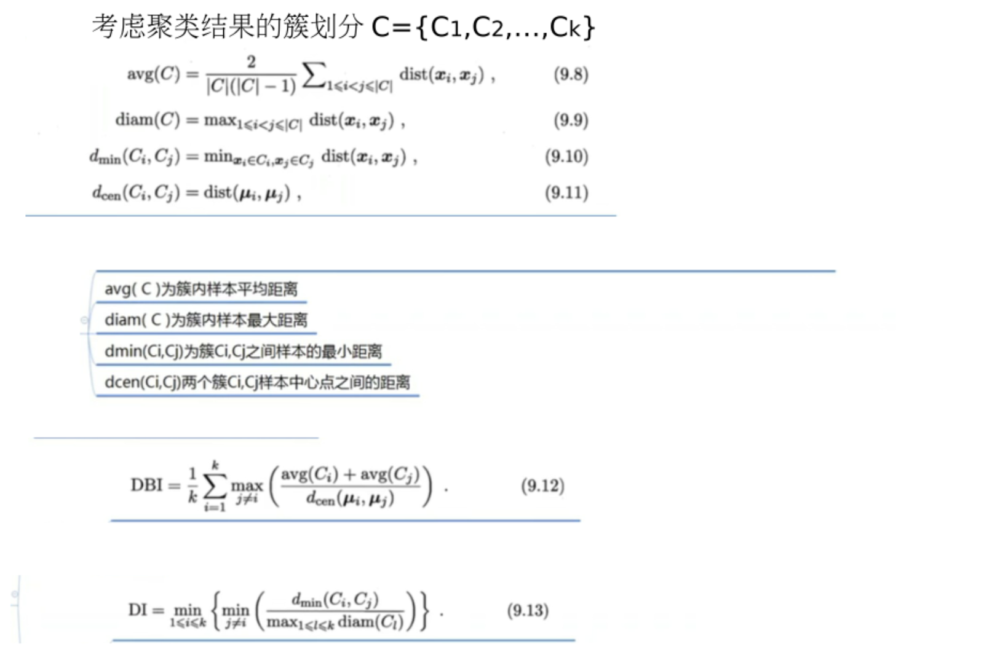

[toc]

# 1. 绪论

1. 经典定义

利用经验（数据）改善系统自身的性能

2. 目的
- 分类(Classification): 预测的结果是离散值
    - 二分类: 结果只涉及两个类别的
        - 一个称为正类（ positive class ）
        - 另一个称为反类（ negative class ）
- 回归(Regression)：预测的结果是连续值
- 聚类(clustering)：将训练集中的数据分为若干组
    - 簇（cluster）：聚类后的每个组，称为簇

3. 分类

- 监督学习(supervised learning): 从给定的训练数据集中学习出一个函数（模型参数），当新的数据到来时，可以根据这个函数预测结果
- 无监督学习(unsupervised learning): 输入数据没有被标记，没有确定的结果
> 分类和回归都是有监督学习，聚类则是无监督学习

## 1.1 基本术语

1. 记录

- 数据集(Dataset)：记录的集合
- 实例(Instance)或样本(Sample): 每条记录是关于一个事件或对象的描述,称为一个实例或者样本

- 属性(Attribute) 或 特征(Feature)：反映事件或对象在某方面的表现或性质的事项
- 属性值 (Attribute value) ：记录在某一属性上的取值
- 属性空间 （ Attribute space）：数据样本各个属性组成的空间
- 特征向量(feature vector)：属性空间中的每个点对应一个坐标向量，因此一个实例被称为一个“特征向量”（feature vector）

- 标记（Label）：示例结果
- 标记空间（Label space）：所有标记的集合
- 样例（Example）：拥有了标记信息的示例

2. 训练

- 训练 （training）：从数据中学得模型的过程称为“训练”或学习（learning）。

- 训练数据 （training data）：训练过程中使用的数据。

- 训练样本（training sample）：训练数据中每个样本称为训练样本。

- 训练集（training set）：训练样本组成的集合。

3. 测试

- 测试(testing): 学得模型后，使用其进行预测的过程。

- 测试数据 （testing data）：测试过程中使用的数据。

- 测试样本（testing sample）：被预测的样本。

- 测试集（testing set）：训练样本组成的集合。

4. 其他

- 模型(model)：输入自变量$X$和因变量$Y$和之间的关系

- 泛化 （generalization）：模型适用于新样本的能力称为泛化能力。

- 独立同分布: 样本空间中全体样本服从一个未知分布，而每个样本都是独立的从此分布上采样获得

# 2. 模型评估与选择

## 2.1 误差

误差：学习器的实际预输出与样本的真实输出之间的差异

- 经验误差(训练误差): 在训练集上的误差
- 泛化误差: 在“未来”样本上的误差

> 过拟合和欠拟合：对测试数据的要求过于苛刻或宽松

## 2.2 测试集划分

- 留出法(hold-out)
    - 将数据集随机划分为两部分：训练集和测试集
    - 可以重复多次划分，并对结果取平均值
- k-折交叉验证(cross validation)
    - 将数据集划分为k个大小相近的子集
    - 每次用 k-1 个子集作为训练集，剩下的 1 个子集作为测试集
    - 重复第二步 k 次，最终的性能是 k 次测试的平均值。
- 自助法(bootstrap)
    - 从原始数据集中有放回地抽取样本生成训练集，未被抽中的样本作为测试集
    - 样本数与原始数据集相同，但由于有放回抽样，部分样本可能被重复采样

## 2.3 性能度量

性能度量是衡量模型某一泛化能力的评价标准，反应了任务需求

1. 均方误差

$$\frac{1}{n}\sum_{i=1}^{n}(f(x_i)-y_i)^2$$

2. 精度Accuracy和错误率Error rate

$$\text{Accuracy} = \frac{1}{n}\sum^n_{i=1}count(f(x_i)=y_i)$$

$$\text{Error rate} = \frac{1}{n}\sum_{i=1}^{n}count(f(x_i)\not=y_i) = 1 - \text{Accuracy}$$

3. 查准率Precision和查全率Recall

- 分类混淆矩阵  

- 查准率: 在所有预测为正例中实际为正例的占比（竖着看第一列）

$$\text{Precision} = \frac{TP}{TP + FP}$$

- 查全率: 在所有实际为正例中被预测为正例的占比（横着看第一排）

$$\text{Recall} = \frac{TP}{TP + FN}$$

4. PR曲线

多个PR图的选择依据

- 平衡点: PR曲线与$y=x$的交点称为平衡点，越大越好
- 面积比较法: 面积越大越好
- F1度量: 查准率Precision和查准率Recall的**调和平均值**，偏向于较小的部分
    - 

5. ROC曲线

- ROC曲线的绘制：
    - 更改模型打分的阈值（预测值的得分大于该阈值，可预测出它属于正类）
    - 我们可以得到多个混淆矩阵，可得到多个 **(FPR,TPR)** 值
    - 在二维坐标中描绘出来，将他们相连起来即可得到ROC曲线

6.  AUC值的计算
- 法一：绘制ROC曲线，ROC曲线下面的面积就是AUC的值
- 法二：通过样本对的概率计数比较AUC值
    - 设总共有(m+n)个样本，其中正样本m个，负样本n个，共有m\*n个正负样本对
    - 对正负样本对中的每一对进行遍历
        - 正样本预测为正样本的概率（打分）大于负样本预测为正样本的概率记为1
        - 相等记为0.5 
        - 小于记为0
    - 累加计数，然后除以(m*n)就是AUC的值

# 3. 集成学习

通过组合多个模型来提升预测精度
- 有效地解决单一模型在训练数据上的局限性
- 并提高模型的泛化能力

它的工作原理是
- 生成多个分类器/模型
- 最后将这些模型的预测结合成最终预测结果
- 因此优于任何一个单分类的做出预测

## Boosting

- 在训练集T上训练一个弱分类器，并根据其表现为训练数据分配权重
- 更新训练集中的样本权重，生成新的训练集T’
    - 对错误分类的样本分配更高的权重
    - 而正确分类的样本则降低权重
- 在更新后的训练集T’上训练下一个弱分类器
- 重复步骤 2 和 3，直到达到指定的迭代次数X。
- 将所有训练好的弱分类器进行组合，使用加权投票或其他结合策略，得到最终的强学习器

## Bagging

1. 核心思想

Bagging算法的核心思想是
- 通过对原始数据的重采样
- 多个子模型的集成  
来提高模型的泛化能力

2. 步骤

- 通过自助采样的方法，每次从数据集中随机选择一个subset，然后放回初始数据集，下次取时，该样本仍然有一定概率取到
- 然后根据对每subset训练出一个基学习器，然后将这些基学习器进行结合
- 对于分类任务可以通过vote来输出结果，回归任务可以求平均值

## Boosting和Bagging比较

1. 数据处理
- Boosting: 根据前一轮学习结果调整数据权重
- Bagging:  对数据进行采样训练

2. 学习起权重
- Boosting: 对所有学习器进行加权投票
- Bagging:  所有学习器权重一致

3. 学习顺序
- Boosting: 学习器将有依赖关系，并行训练
- Bagging:  学习器间没有依赖关系，并行训练

4. 作用
- Boosting: 降低偏差，解决欠拟合，提高训练精度
- Bagging:  降低方差，解决过拟合，提高泛化能力

# 4. 聚类

聚类的过程：
- 将一组物理的或抽象的对象
- 根据它们之间的相似程度，分为若干簇
    > 簇：聚在一起的对象
- 相似的对象构成一组

聚类的目标：将数据样本划分为若干个通常 ***不相交*** 的簇
- 即可作为一个单独过程
- 也可为分类等其他学习任务的前驱过程

## 4.1 性能度量

平均的基本思想：
- 簇内相似度高
- 簇间相似度低

### 内部指标

直接参考聚类结果而不用任何参考模型

### 外部指标

将聚类结果与某个“参考模型”进行比较

## 4.2 K-means

K-均值聚类算法中，簇的个数K需要实现给定
- 随机选取K个样本点 作为K个簇中心
- 根据样本点与簇中心的举例，将其划分给最近的类
- 更新各簇中心
- 若所有簇中心不再发生变化，则停止

## 4.3 DBSCAN

DBSCAN是基于一组邻域来描述样本集的紧密程度的，参数($\epsilon$, MinPts)用来描述邻域的样本分布紧密程度
- ϵ描述了某一样本的邻域距离阈值
- MinPts描述了某一样本的距离为ϵ的邻域中样本个数的阈值

1. 术语概念

- $\epsilon$-邻域  
    设$x_i$是样本集$D$中的一个属性，$\epsilon-$邻域包含$D$中与$x_i$举例不大于$\epsilon$的样本子集，即
$$N_{\epsilon}(x_i) = {x_j \in D | distance(x_i,x_j) < \epsilon}$$

- 核心对象
    对于任意一样本$x_i \in D$，如果其$\epsilon$-领域中包含至少$MinPts$个样本，则$x_i$是核心对象，即
$$|N_{\epsilon}(x_i)| \ge MinPts$$

- 密度直达
    如果$x_i$位于$x_j$的$\epsilon$-邻域内，且$x_j$是核心对象，则称$x_i$由$x_j$密度直达

- 密度可达（密度直达的传递性）
    对于$x_i$和$x_n$，如果存在样本序列$x_1,x_2,...,x_n$，其中的样本满足$x_n$由$x_{n-1}$密度直达，则称$x_n$由$x_1$密度可达
    > 此时$x_1,x_2,...,x_{n-1}$均为核心对象

- 密度相连
    对于$x_i$和$x_j$，如果存在核心对象$x_k$，使$x_i$和$x_j$均有$x_k$密度可达，则称$x_i$和$x_j$密度相连

2. 算法步骤

- 根据给出定参数$(\epsilon,MinPts)$找出所有核心对象
- 以所有核心对象为出发点，找到其所有密度可达样本生成聚类簇
- 直到所有的核心对象均被访问为止

