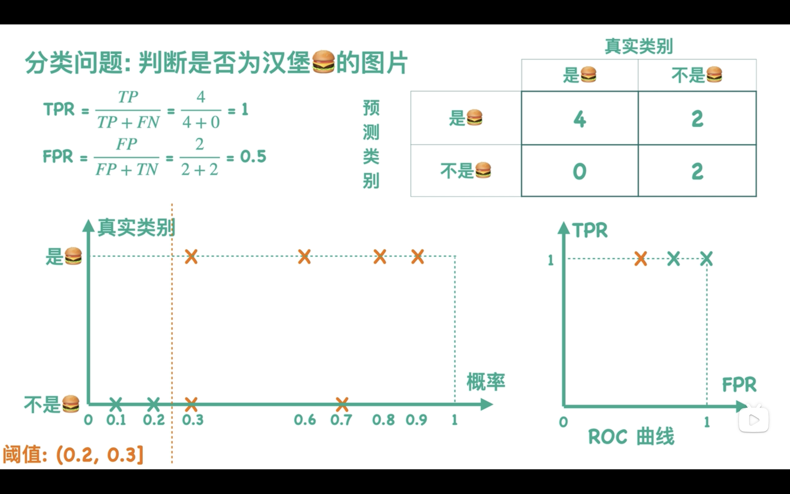

[toc]

# 绪论

**定义**

利用经验（数据）改善自身的性能

**目的**
- 分类
- 回归
- 聚类

> 分类和回归都是有监督学习，聚类则是无监督学习

**基本术语**

- 模型(model)：因变量y和自变量x之间的关系即模型

- 数据集(Dataset)：记录的集合。

- 实例（Instance）或样本（Sample）：每条记录是关于一个事件或对象的描述,称为一个实例或者样本。

- 属性(Attribute) 或 特征(Feature)：反映事件或对象在某方面的表现或性质的事项。

- 属性值 (Attribute value) ：反映事件或对象在某方面的表现或性质的事项

- 属性空间 （ Attribute space）：
属性张成的空间，也称为样本空间（Sample space）或输入空间。每个实例都可在这个空间中找到自己的坐标位置。

- 特征向量(feature vector)
：属性空间中的每个点对应一个坐标向量，因此一个实例被称为一个“特征向量”（feature vector）

- 标记（Label）：示例结果的显示。

- 样例（Example）：拥有了标记信息的示例。

- 标记空间（Label space）：所有标记的集合，也称为输出空间。

- 训练 （training）：从数据中学得模型的过程称为“训练”或学习（learning）。

- 训练数据 （training data）：训练过程中使用的数据。

- 训练样本（training sample）：训练数据中每个样本称为训练样本。

- 训练集（training set）：训练样本组成的集合。

- 测试 （testing）：学得模型后，使用其进行预测的过程。

- 测试数据 （testing data）：测试过程中使用的数据。

- 测试样本（testing sample）：被预测的样本。

- 测试集（testing set）：训练样本组成的集合。

- 分类 （Classification）：若预测的是离散值，此类学习任务称为分类。

- 回归 （Regression）：若预测的是连续值，此类学习任务称为回归。

- 二分类（Binary classification）：只涉及两个类别的，称为二分类。其中一个称为正类（ positive class ），另一个称为反类（ negative class ）

- 聚类 （clustering）：将训练集中的数据分为若干组。

- 簇（cluster）：聚类后的每个组，称为簇。

- 监督学习 （supervised learning）：从给定的训练数据集中学习出一个函数（模型参数），当新的数据到来时，可以根据这个函数预测结果。

- 无监督学习 （unsupervised learning）：输入数据没有被标记，也没有确定的结果。

- 泛化 （generalization）：学得模型能很好的适用于 “新样本”，不仅仅只在训练样本上工作良好。学得模型适用于新样本的能力称为泛化能力。

- 独立同分布（independent and identically distributed）：假设样本空间中全体样本服从一个未知分布，而获得的每个样本都是独立的从此分布上采样获得，即独立同分布。

# 模型评估与选择

**误差**

学习器的实际预输出与样本的真实输出之间的差异

- 泛化误差:在“未来”样本上的误差
- 经验误差:在训练集上的误差，亦称“训练误差”

> 过拟合和欠拟合：对测试数据的要求过于苛刻过宽松

**获得测试集合**

- 留出法 (hold-out)：将数据随机分为训练集和测试集，并划分取平均值
- 交叉验证法 (cross validation)：数据集被分为k个子集，模型在k-1个子集上训练，并在剩下的子集上测试
- 自助法 (bootstrap)：每当选中一个样本，它等可能地被再次选中并被再次添加到训练集中。

**指标**

- 精度Accuracy和错误率Error rate

$$\text{Accuracy} = \frac{\text{Number of correct predictions}}{\text{Total number of predictions}} 
$$

$$\text{Error Rate} = \frac{\text{Number of incorrect predictions}}{\text{Total number of predictions}}$$

- 查准率Precision和查全率Recall

$$\text{Precision} = \frac{TP}{TP + FP}$$

> 查准率就是在所有预测为正例中实际为正例的占比（竖着看第一列）

$$\text{Recall} = \frac{TP}{TP + FN}$$

> 查全率就是在所有实际为正例中被预测为正例的占比（横着看第一排）

**PR曲线**

多个算法的BEP图选择

- 平衡点
- 面积比较法
- F1度量

> F1度量法是查准率Precision和查准率Recall的**调和平均值**，偏向于较小的部分

**ROC**

- RCO曲线的绘制：

更改模型打分的阈值，我们可以得到多个混淆矩阵，可得到多个 **(FPR,TPR)** 值，可在二维坐标中描绘出来，将他们相连起来即可得到ROC曲线
> 即更改左下角图中的橘色直线的位置
> 

- AUC值的计算
    - 法一：绘制ROC曲线，ROC曲线下面的面积就是AUC的值
    - 法二：设总共有(m+n)个样本，其中正样本m个，负样本n个，共有m\*n个样本对；计数，`正样本预测为正样本`的概率（打分）大于`负样本预测为正样本`的概率记为1，累加计数，然后除以(m*n)就是AUC的值

