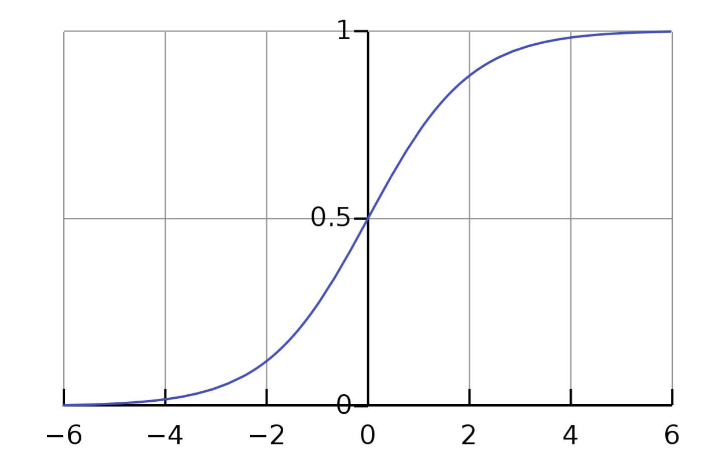

线性模型（linear model）: 得到一个通过属性的线性组合来进行预测的函数

[toc]


# 1. 单元线性回归

$$f(x) = w_1x_1 + w_2x_2 + ... + w_dx_d + b$$
- 向量形式: $f(x) = w^Tx + b$
- 目标：$f(x_i) \approx y_i$  

令均方误差最小化，有
$$(w^*,b^*) = \arg \min_{(w,b)}\sum^m_{i=1}(f(x_i)-y_i)^2 = \arg \min_{(w,b)} \sum^m_{i=1}(y_i -w x_i -b )^2$$

对$\sum_{i=1}^m (y_i -wx_i -b )^2$进行最小二乘参数估计，分别对$w$和$b$求导


$$\frac{\partial E(w, b)}{\partial w} = 2 \left( w \sum_{i=1}^{m} x_i^2 - \sum_{i=1}^{m} (y_i - b) x_i \right)$$
$$\frac{\partial E(w, b)}{\partial b} = 2 \left( m b - \sum_{i=1}^{m} (y_i - w x_i) \right)$$

令导数为0，得到闭式解（closed-form）解

$$w = \frac{\sum_{i=1}^{m} y_i (x_i - \bar{x})}{\sum_{i=1}^{m} x_i^2 - \frac{1}{m} \left( \sum_{i=1}^{m} x_i \right)^2}$$

$$b = \frac{1}{m} \sum_{i=1}^{m} (y_i - w x_i)$$

> 最小二乘法核心思想：通过最小化预测值和真实值直接的误差平方和，找到最优的拟合函数


# 2. 多元线性回归

$$f(x) = w^Tx_i + b,x_i = (x_{i1};x_{i2};...;x_{id}) , y_i \in R$$

将$x$和$b$用一个向量$\overline{w} = (w,b)$表示，此时数据集可表示为
$$
X = 
\left[
\begin{matrix}
x_{11}&x_{12}&...&x_{1d}&1\\
x_{21}&x_{22}&...&x_{2d}&1\\
.&.&.&.&1\\
x_{m1}&x_{m2}&...&x_{md}&1 
\end{matrix}
\right]=
\left[
\begin{matrix}
x_1^t&1\\
x_2^t&1\\
.&.\\
x_m^t&1\\
\end{matrix}
\right],
Y = (y_1;y_2;..;y_m)
$$

目标：
$$f(x_i) \approx y_i $$

同样使用最小二乘法求解，有
$$\overline{w} = \arg \min_{\overline{w}}(y - X \overline{w})^T(y - X \overline{w})$$

令$E_{\overline{w}} = (y-X\overline{w})^T(y-X\overline{w})$对$\overline{w}$求导
$$\frac{\partial E_{\overline{w}}}{\partial \overline{w}} = 2 X^T(X \overline{w} - y)$$

令其等于0，可有

- 若$X^TX$满秩或正定，则$\overline{w} = (X^TX)^{-1}X^Ty$
- 若$X^TX$不满秩，可解除多个$\overline{w}$，此时需要借助归纳偏好或引入正则化


# 3. 线性模型拓展

## 3.1 广义线性模型

一般形式：
$$y = g^{-1}(w^Tx +b )$$

其中$g^{-1}$为单调可微的联系函数（link function），$w^Tx +b $为自变量取值

### 对率回归

以对率函数为联系函数

$$y = \frac{1}{1+e^{-(w^Tx+b)}}$$
$$ln\frac{y}{1-y} = w^Tx + b$$

若将y视为样本作为正例的可能性，则1-y是其反例的可能性，两者的比值称为“几率”，反映了样本作为正例的相对可能性.

对几率取对数则可得到“对数几率”

对数几率回归实际上是在用线性回归模型的预测结果去逼近真实标记的对数几率

## 3.2 二分类任务

将获得的y再当作自变量投入单位阶越函数中，得到的z只能有两个取值

但是单位阶越函数性质不好，通常使用对数几率函数$y = \frac{1}{1+e^{-z}}$代替，其
- 单调可微
- 任意阶可导
- 是一种Sigmoid函数，它将y值转化为一个接近0或者1的z值





## 3.3 线性模型做“分类”

模型的上方为一类，下方为另一类


## 3.4 多分类学习

拆解法：将一个多分类任务拆分为若干个二分类任务进行任务求解


# 4. 实验部分

1. 使用`LinearRegression`模型

```python
model = LinearRegression(
  fit_intercept=True,  # 是否计算截距。True 表示计算截距，False 表示数据已中心化，不需要截距。
  normalize=False,     # 已被弃用，建议使用数据预处理工具进行归一化处理。
  copy_X=True,         # 是否在拟合时复制输入数据。True 表示复制数据，避免原数据被覆盖。
  n_jobs=None,         # 指定使用的 CPU 核心数。None 表示使用单个核心，-1 表示使用所有核心。
  positive=False       # 是否对回归系数进行非负约束。True 表示所有系数均为非负。
)
```
2. 代码部分

```python
# 实验 基于多维数据的线性回归模型建立(一维类似)

# 数据输入: 前两列为属性(集合)X、第三列为标签(结果)Y
data = np.array([[100, 4, 9.3], [50, 1, 4.8], [100, 4, 8.9],
                 [40, 4, 7.3], [70, 1, 6.7], [65, 1, 5.9],
                 [95, 2, 8.2], [45, 3, 8.4]])
# 获取属性
x = data[:,0:2]
# 获取标签
y = data[:,2]

# 建立模型
model = LinearRegression()
# 开始训练
model.fit(x,y)

# 斜率
print("coefficients:",model.coef_)
# 截距
print("intercept:",model.intercept_)
b = model.intercept_
# 预测
x_test = [[90,3]]
predict = model.predict(x_test)
print("predict:",predict)
```
