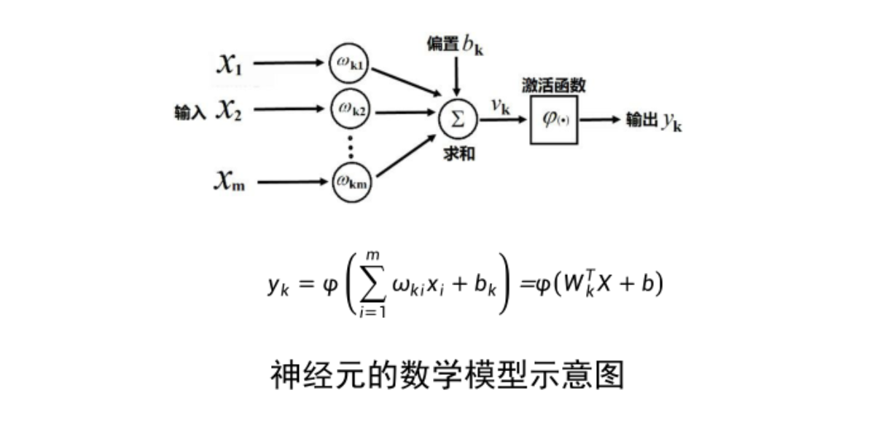
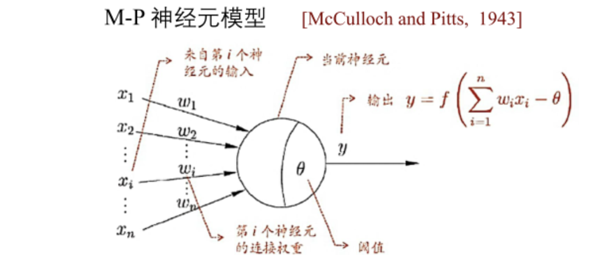
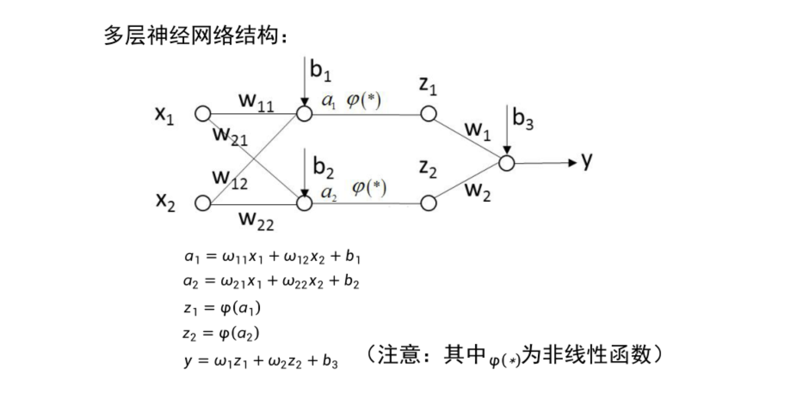
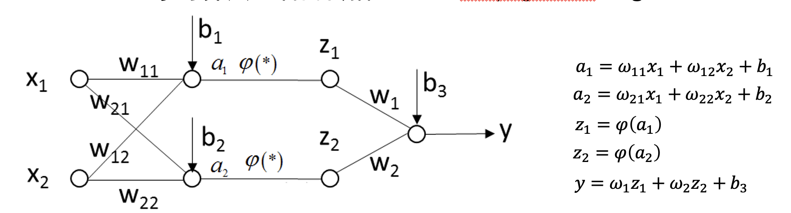
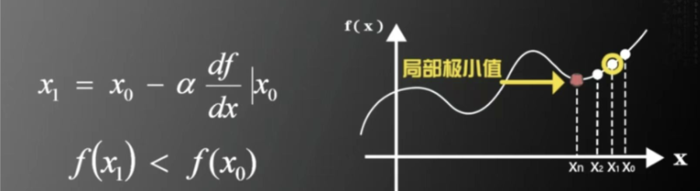

[toc]

# 1. 什么是神经网络


1. 人类神经元

- 组成：主要由胞体（细胞核所在）、树突（接收信号）和轴突（传递信号）组成
- 信号传递：通过电化学信号（动作电位）在轴突上传递，并通过突触释放神经递质传递到下一个神经元。
- 复杂度：一个神经元可以连接数千到上万个其他神经元，形成复杂的网络

2. 机器学习神经元


- 组成：由一个或多个输入、一个权重（weight）向量、一个偏置（bias）和一个激活函数（activation function）组成。
- 信号传递：通过数学计算传递信号（线性组合的输入 + 激活函数）。
- 简单性：单个神经元的连接和计算较简单，复杂性依赖于神经网络层数和结构。


3. 神经网络

神经网络是由具有适应性的 ***简单神经元*** 组成的广泛并行互联的 ***网络*** ，简单神经元节点之间通过 ***权重相连*** ， ***信息在节点之间传播*** ，通过计算和权重调整完成输入到输出的映射。


# 2. 神经元模型

单个神经元的数学模型被称为**MP模型**




- 输入($X_1,X_2...X_m$)：提供原始数据给神经元，也可以是来自其他神经元的输出
- 权重($w_{k1},w_{k2}...w_{km}$)：调整不同输入的重要性
    - 每个输入对于一个权重$w_i$
    - 决定每个输入对神经元输出的影响重要性
    - 权重是神经网络的可调参数，通过训练不断优化
- 偏置($b_k$)：提供额外的自由度，使模型更灵活
    - 权重是一个固定值，加到所有权重输入的总和上
    - 权重允许神经元的输入不完全依赖于输入数据
- 激活函数$\varphi(*)$：引入非线性，使神经元能学习和表示复杂的关系
    - 如果没有非线性，整个神经网络只是线性映射，无法拟合非线性数据
    - 激活函数接受加权输入和偏执计算的结果$W_k^TX+b$，并将其映射到一个输出范围


> 

# 3. 感知器

感知器算法：设定$f(x) = signn(w^TX+b)$，从一堆输入输出中自动学习，获得$w$和$b$

1. 随机选取$w$和$b$
2. 取一个训练样本$(X,y)$
    1. 若$w^TX+b > 0$，且$y = -1$，则
        $$w = w -x ,b = b-1$$
    2. 若$w^TX+b < 0$，且$y = 1$，则
        $$w = w +x ,b = b+1$$
3. 再取另一个$(X,y)$，回到步骤2 
4. 终止条件：直到所有$(X,y)$都不满足步骤2中的两个条件之一，退出循环

- 意义

1. 第一个机器学习算法的思想
2. 线性可分的情况下，感知器收敛性证明
3. 计算量和存储量少，并应用于深度学习


> 《Perceptrons》指出日常生活中很多分类问题是非线性可分！导致了机器学习的冷淡期


# 4. 多层神经网络的万有逼近性




**任意**一个连续函数在下述条件下都可以被一个具有**足够复杂性**的**神经网络**以**任意精度逼近**
- 激活函数是非线性且连续的
- 隐藏层神经元数量要足够多


# 5. 误差逆传播算法（BP）

后向传播（Back Propogation Algorithm）


###  5.1 核心思想

1. 信号前向传播

输入数据从输入层经过隐含层，最后到达输出层，得到当前神经网络的输出


2. 误差后向传播

误差从输出层经过隐含层，最后到输入层，依次调节各层神经元的权重和偏置


### 5.2 步骤




1. 对神经网络的每一层的各个神经元，随机选取相应的w，b的值
2. 前向传播：对当前$w,b$构成的神经网络求得输入数据的输出结果$y$
2. 设置损失函数$E(w,b)=\frac{1}{2}[(Y-y)^2]$    
    > - $y$表示通过当前神经网络得到的结果，$Y$表示真实结果
    > - 损失函数表示它们之间的差值，目标是调整$w,b$的值使$E$最小
3. 用后向传播算法对每一个$w$和$b$，计算$\frac{\partial E}{\partial w}$和$\frac{\partial E}{\partial b}$

3. 利用如下迭代公式（梯度下降算法），更新$w$和$b$的值，使得损失函数$E$最小

$$w^{(new)} = w^{(old)} - \alpha \frac{ \partial E}{\partial w}|_{w^{(old)},b^{(old)}}$$
$$b^{(new)} = b^{(old)} - \alpha \frac{ \partial E}{\partial b}|_{w^{(old)},b^{(old)}}$$

4. 回到步骤2，直到所有$|\frac{\partial E}{\partial w}|_{w^{(n)},b^{(n)}}$，$|\frac{\partial E}{\partial b}|_{w^{(n)},b^{(n)}}$很小为止，退出循环


### 5.3 梯度下降法

1. 在一维函数中的应用


- 对于输入$x$，调整$x$的值，使f(x)的值最小，梯度下降算法即寻找局部最小值算法
- 这里的$\alpha$表示步长，可描述下降的速度
- 新值等于旧值减去步长乘以在该点的导数值



2. 在神经网络中的应用

- 即多维函数中的应用，损失函数存在多个$w,b$可调整，使用偏导数

- 核心思想: 利用损失函数对权重的偏导数（梯度），指出了损失函数在当前点变化最快的方向

- 在BP算法中，计算误差对权重的梯度后，通过调整权重朝负梯度方向移动，从而使损失函数逐步减小


# 6. 实验部分

1. 模型

```python
clf = MLPClassifier(
    hidden_layer_sizes=(100,...),  # 隐藏层的神经元数量
                                # 元组的长度表示层数，每个元素表示对应层的神经元数量
    activation='relu',          # 激活函数类型
                                # 'identity'：线性函数 f(x) = x
                                # 'logistic'：Sigmoid 函数
                                # 'tanh'：双曲正切函数
                                # 'relu'：修正线性单元
    solver='adam',              # 优化算法选择
                                # 'lbfgs'：拟牛顿法，适合小数据集。
                                # 'sgd'：随机梯度下降。
                                # 'adam'：适合大数据集的高效优化算法。
    alpha=0.0001,               # L2 正则化惩罚项系数，用于防止过拟合。
    batch_size='auto',          # 批量大小。'auto' 表示 min(200, n_samples)，可以是整数
    learning_rate='constant',   # 学习率调节策略
                                # 'constant'：保持学习率不变。
                                # 'invscaling'：逐渐减小学习率。
                                # 'adaptive'：在验证分数停止提高后减少学习率。
    max_iter=200,               # 最大迭代次数。达到此次数后仍未收敛则停止。
    tol=1e-4,                   # 优化的容差。变化低于此值时停止优化。
    early_stopping=False,       # 是否在验证集上性能不提升时提前停止训练。
    n_iter_no_change=10,        # 当早停策略生效时，允许的最大迭代次数无变化。
    shuffle=True,               # 每次迭代是否对数据进行洗牌
    random_state=None,          # 随机数种子，用于控制结果的可重复性。
    verbose=False,              # 是否输出训练过程的详细信息。
    warm_start=False,           # 是否使用上一次调用的结果继续训练。
    validation_fraction=0.1,    # 用于验证集的训练数据比例，仅在 early_stopping=True 时有效。
    beta_1=0.9,                 # Adam 优化器的一阶矩估计参数。
    beta_2=0.999,               # Adam 优化器的二阶矩估计参数。
    epsilon=1e-8,               # Adam 优化器中数值稳定性的参数。
    max_fun=15000,              # 'lbfgs' 优化器的最大函数调用次数。
    learning_rate_init=0.001,   # 初始学习率，仅适用于 'sgd' 和 'adam'。
    power_t=0.5,                # 学习率指数，仅适用于 'sgd' 且 learning_rate='invscaling'。
    momentum=0.9,               # 动量，仅适用于 'sgd'。
    nesterovs_momentum=True,    # 是否使用 Nesterov 动量，仅适用于 'sgd'。
)
```

2. 实验

```python
from sklearn.neural_network import MLPClassifier
from sklearn.model_selection import train_test_split
from sklearn.preprocessing import StandardScaler

# 数据标准化
scaler = StandardScaler()
X = scaler.fit_transform(X)

# 拆分训练集和测试集
X_train, X_test, y_train, y_test = train_test_split(X, Y, test_size=0.3)

# 创建 MLP 分类器
clf = MLPClassifier(solver='lbfgs',alpha=1e-5,hidden_layer_sizes=(5,2))
# 训练模型
clf.fit(X_train,y_train)

# 输出模型得分
score = clf.score(X_train, y_train)

# 使用模型进行预测
y_pred_test = clf.predict(X_test)
```


