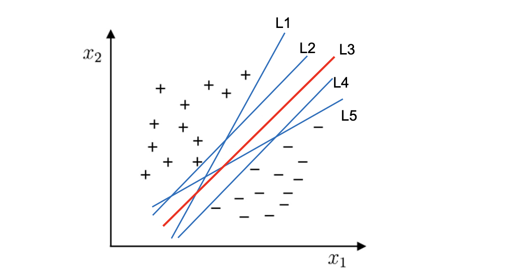

第六章、支持向量机

线性可分定义的最简化形式

$$若y_i = +1,则w^Tx_i + b > 0$$
$$若y_i = -1,则w^Tx_i + b < 0$$

若$y_i = +1 或 -1$，一个训练集${(X_i,y_i)}$在$i=1 \rightarrow N$线性可分，是指存在$(w,b)$，使得对$i = 1 \rightarrow N$，有
$$y_i(w^TX_i + b) > 0$$

线性分类器的选择

支持向量机寻址的最优直线分类应满足
1. 该直线分开了两类
$$即满足y_i(w^TX_i + b) > 0$$

2. 该直线最大化间隔
3. 该直线处于间隔的中间，到所有支持向量距离相等
