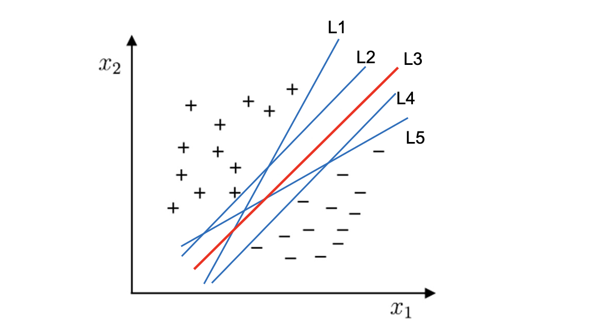
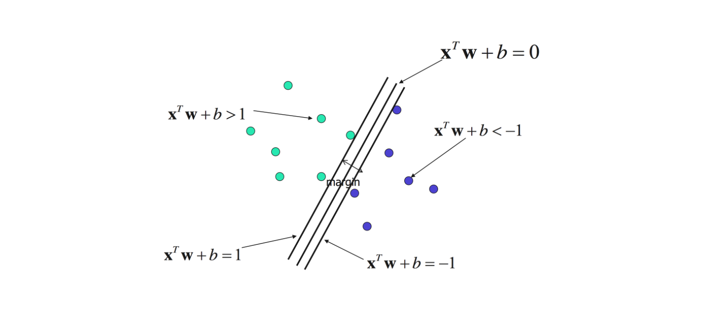
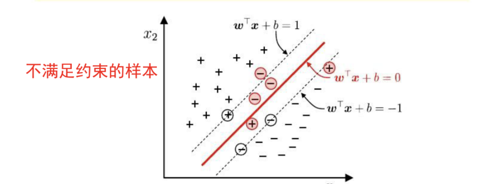
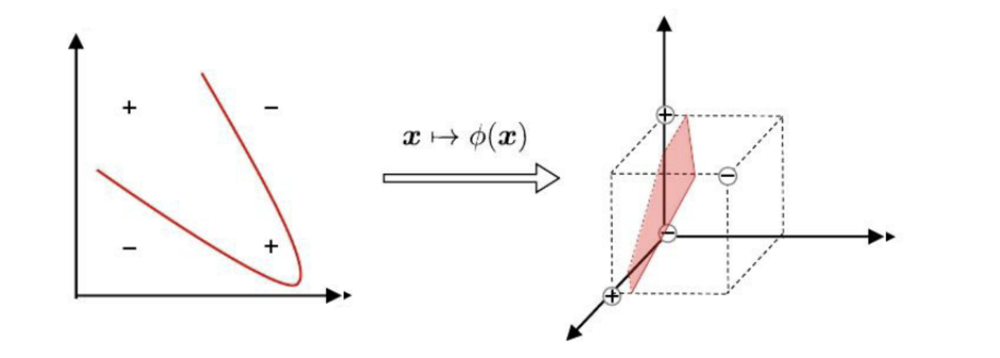
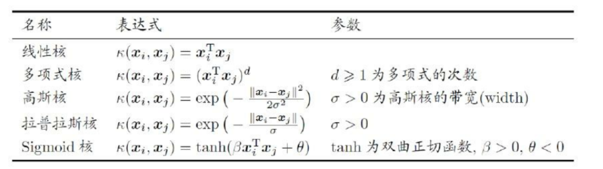

第六章、支持向量机

SVM就是一种二类分类模型，他的基本模型是的定义在特征空间上的间隔最大的线性分类器，SVM的学习策略就是间隔最大化。

[toc]


# 1. 线性可分定义

若$y_i = \pm1$，一个训练集${(X_i,y_i)}$线性可分，是指存在$(w^T,b)$，使得对$i = 1 \rightarrow N$，有

$$y_i(w^TX_i + b) > 0$$

即


$$若y_i = +1,则w^Tx_i + b > 0$$
$$若y_i = -1,则w^Tx_i + b < 0$$

# 2. SVM的分类

1. 线性可分SVM

当训练数据线性可分时，通过硬间隔(hard margin最大化可以学习得到一个线性分类器，即硬间隔SVM

2. 线性SVM

当训练数据不能线性可分但是可以近似线性可分时，通过软间隔(soft margin)最大化也可以学习到一个线性分类器，即软间隔SVM

3. 非线性SVM

当训练数据线性不可分时，通过使用核技巧(kernel trick)和软间隔最大化，可以学习到一个非线性SVM。


# 3. 线性分类器的选择


支持向量机寻找的最优直线$y = w^TX + b$分类应满足（如下图的L3）
1. 该直线分开了两类：即不在最优直线上的点应满足$y_i(w^TX_i + b) > 0$
2. 该直线最大化间隔
3. 该直线处于间隔的中间，到所有**支持向量**距离相等




# 4. 间隔与支持向量

令超平面方程为$w^T \cdot x + b = 0$，如下图

- $|w^T \cdot x + b | = 1$上的点称为支持向量
    - 在决定最佳超平面的推导过程中只有支持向量起作用，而其他数据点并不起作用
- $|w^T \cdot x + b | = 1$两条直线之间的距离被称为间隔
- 间隔大小为$\frac{2}{||w||}$（推导过程略）

## 软间隔

软间隔：允许一些样本不满足约束条件，即可在间隔区域内



## 支持向量

支持向量机（Support Vector Machine, SVM）之所以被称为“支持向量机”，是因为在训练过程中，模型的决策边界（超平面）完全由一组关键样本决定，这些关键样本称为支持向量
- 只有那些使约束条件接近等号的样本（即支持向量）会使SVM目标优化函数中的拉格朗日乘子非零，这些样本对优化结果有贡献
- 非支持向量为0，不起作用


# 5. 基本向量机基本型

## 硬间隔

最大间隔：寻找参数$w$和$b$是的间隔最大

$$arg_{w,b} \quad max\frac{2}{||w||} \Rightarrow arg_{w,b} \quad min\frac{1}{2}||w||^2 $$
$$s.t.y_i(w^Tx_i+b) \geq 1,i=1,2...m$$

- 属于凸二次规划问题：目标是二次项，限制条件是一次项
- 凸二次问题可用优化计算包求解，要么无解，要么有唯一的最小值
- 求解过程
    - 应用拉格朗日乘子法构造拉格朗日函数(Lagrange function)
    - 再通过求解其对偶问题(dual problem)得到上述问题的最优解。


## 软间隔

引入软间隔
- SVM可以允许少量样本点违背分类间隔的约束
- 但会对这些样本施加“惩罚”，从而在模型的准确性和泛化能力之间寻求平衡

1. 惩罚项


最终的目标函数变为

$$ arg_{w,b} \quad  min(\frac{1}{2}||w|^2 + C \sum_{i=1}^nmax(0,1-y_i(wx_i+b)))$$

- C>0 称为惩罚参数
    - C 越小时对误分类惩罚越小，越小越容易欠拟合
    - C 越大时对误分类惩罚越大，越大越容易过拟合，当 C 取正无穷时就变成了硬间隔优化
- $\sum_{i=1}^nmax(0,1-y_i(wx_i+b))$称为惩罚项
    - 对所有“越界”的点计算误差，并将这些误差累积起来

2. 松弛变量

为每个样本引入一个松弛变量，引入松弛变量后的目标函数变为

$$ arg_{w,b} \quad  min(\frac{1}{2}||w||^2 + C \sum_{i=1}^n\zeta_i) $$
$$s.t.y_i(w^Tx_i+b) \geq 1-\zeta_i,i=1,2...m$$

- 若C无穷大时，$\zeta_i$必然无穷小


## 核函数

1. 升维

若不存在一个能正确划分两类样本的超平面，则将样本从原始空间映射到一个更高纬的特征空间，使样本在这个样本空间内线性可分

> 如果原始空间是有限维（属性数有限），那么一定存在一个高纬特征空间使样本线性可分

2. 核函数

通过设计核函数，绕过显示考虑特征映射、以及高纬内积的困难




# 6. 实验代码

1. 模型


```python
model = SVC(
    C=1.0,                 # 正则化参数，越大越倾向于更少的分类错误，可能导致过拟合
    kernel='rbf',          # 使用径向基核函数（rbf），适合处理非线性问题
    gamma='scale',         # 核函数的系数，'scale' 会自动根据样本特征调整
    probability=True,      # 启用概率估计，预测时返回类别的概率
    decision_function_shape='ovr',  # 决策函数形状，'ovr' 表示一对多策略
    random_state=42        # 设置随机种子，保证结果可复现
)
```

2. 实现

```python

from sklearn import svm
from sklearn.model_selection import train_test_split

# 数据标准化
scaler = StandardScaler()
X = scaler.fit_transform(X)

# 拆分训练集和测试集
X_train, X_test, y_train, y_test = train_test_split(X, Y, test_size=0.3)

# 线性支持向量机模型的建立与训练
clf = svm.LinearSVC()  # 创建线性支持向量机模型
clf.fit(X_train, y_train)  # 在训练集上训练模型
# 输出测试集准确率
score = clf.score(X_test, y_test))  

# 基于核函数的支持向量机模型的建立与训练
clf1 = svm.SVC()  # 创建基于核函数的支持向量机模型（默认 RBF 核）
clf1.fit(X_train, y_train)  # 在训练集上训练模型

# 输出测试集准确率
score = clf.score(X_test, y_test))  
score1 = clf1.score(X_test, y_test))  
```


