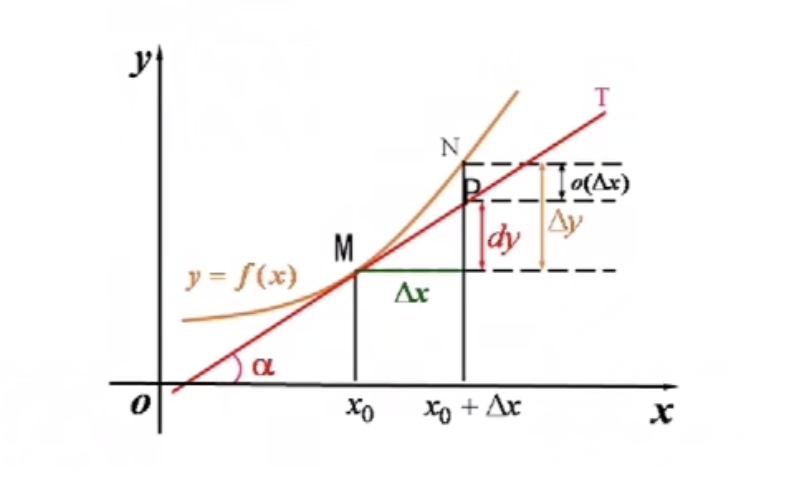

# 导数

## 第一节、导数的概念

引例

1. 变速直线运动瞬时速度

- 匀速

$$v = \frac{f(b)-f(a)}{b-a}$$

- 变速

$$\frac{f(t_0 + \Delta t)-f(t_0)}{\Delta t} = \overline{v} \approx v(t_0)$$
$$\lim_{\Delta \to 0}\frac{f(t_0 + \Delta t)-f(t_0)}{\Delta t} = v(t_0)$$

1. 导数的定义

定义：若
$$\lim_{\Delta \to 0}\frac{f(x_0+\Delta x)-f(x_0)}{\Delta x}$$
存在，则称$f(x)$在$x_0$点可导，$x_0$处的导数可记作$f'(x_0)=y'|_{x=x_0}=\frac{dy}{dx}|_{x=x_0}$

- 若以上极限不存在，则称$f(x)$在$x_0$处**不可导**
- 若极限为无穷大，则称$f(x)$在$x_0$处**导数为无穷大**

> f(x)在$x_0$处的导数是一个数，是一个特殊的极限，是函数改变量和自变量改变量之比的极限

左导数

$$f_-'(x_0) = \lim_{\Delta x \to 0^-}\frac{f(x_0+\Delta x)-f(x_0)}{\Delta x} = \lim_{x \to x_0^-}\frac{f(x)-f(x_0)}{x - x_0}$$

右导数
$$f_+'(x_0) = \lim_{\Delta x \to 0^+}\frac{f(x_0+\Delta x)-f(x_0)}{\Delta x} = \lim_{x \to x_0^+}\frac{f(x)-f(x_0)}{x - x_0}$$

> 左右导数就是导数定义的极限的左右极限，因此导数与左右导数的关系就是极限与左右极限的关系  
$$可导 \Leftrightarrow 左右导数存在且相等$$

2. 导函数的定义

区间上可导：$f(x)$在区间$I$的每一点上都可导  
导函数：$f'(x),x \in I$
> 两侧($[a,b]$)如果可取，需要证明由里向外的可导性  

## 第五节、微分的定义

1. 微分的定义

引例

$$f(x)=x^2$$
$$\Delta f(x)=f(x_0+ \Delta x)=f(x_0)=2x_0 \Delta x + (\Delta x)^2$$

定义

若存在形式$f(x_0+ \Delta x) -  f(x_0) = A \Delta x + o(\Delta x)$，则称$f(x)$在$x_0$处**可微**，$A \Delta x$称为$f(x)$在$x_0$点的**微分**，记作$dy=A \Delta x$
- 这里$A$是一个常数 
- $dy$是$\Delta y$的线性主部分
    - $A \Delta x$: 呈线性
    - 副部$0(\Delta x)$较小，可省略
> 微分是函数改变量的近似值

定理

函数$y=f(x)$在点$x_0$处可微的充分必要条件是$f(x)$在点$x_0$处可导，且有$dy=f'(x)\Delta x = f'(x_0)dx$
> 将可微分的判断和计算归结为导数的判断和计算

2. 微分的几何意义

微分$dy=f'(x)dx$在几何上表示曲线$y=f(x)$的切线上的增量

- 用微分$dy$代替$\Delta y$
- 用直线代替了曲线
- 用均匀变化代替了非均匀变化

> 微积分的核心思想：处理非均匀变化的问题的时候，在一个微小的局部，把一个非均匀的量近似看作均匀，然后利用均匀来代替非均匀得到近似值，再通过取直线渐进化，来处理非均匀变化的问题

3. 基本微分函数的微分公式与微分运算法则

- 基本初等函数的微分公式
    - $dy = f'(x) dx$
    > - 将其中的$y$用目标函数表示
    > - 将其中的$f'(x)$换成目标函数的导数

- 四则运算法则：设$u,v$都可微
    - $d(u \pm v) = du \pm dv$
    - $d(uv) = vdu+ udv$
    - $d(\frac{u}{v}) = \frac{vdu - udv}{v_2}(v \ne 0)$

> 利用可导证明可微
> 

- 复合函数的微分法则（微分形式不变形）

设$y=f(u)$可微，$u=g(x)$可微，则$y=f(g(x))$可微，且$dy={y'}_xdx = y_u'u_x'dx = y_u'du$

