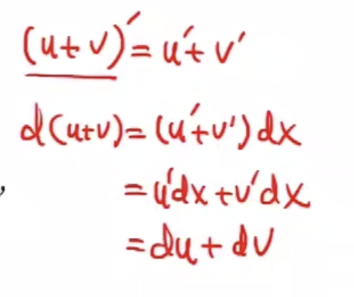

<!-- /study_md/basic/limit.md -->

[toc]

---

积化和差

$$sinacosb=\frac{sin(a+b)+sin(a-b)}{2}$$
$$cosasinb=\frac{sin(a+b)-sin(a-b)}{2}$$
$$cosacosb=\frac{cos(a+b)+cos(a-b)}{2}$$
$$sinasinb=\frac{cos(a+b)-cos(a-b)}{2}$$

和差化积

$$sina+sinb = 2sin\frac{a+b}{2}cos\frac{a-b}{2}$$
$$sina-sinb = 2cos\frac{a+b}{2}sin\frac{a-b}{2}$$
$$cosa+cosb = 2cos\frac{a+b}{2}cos\frac{a-b}{2}$$
$$cosa-cosb = -2sin\frac{a+b}{2}sin\frac{a-b}{2}$$

# 绪论

高数的核心内容：《微积分》
> 概念、理论、方法、应用

- 上册：一元微积分
- 下册：多元微积分

***微积分研究的主要内容***

主要研究：事物运动中的数量变化规律

$$函数y=f(x) (a<=x<=B)的变化规律$$

两种变化：
- 均匀变化：初代数学
- 非均匀变化：高等数学主要内容
    > 利用分割，得到均匀，合并成整体

两个侧面：
- 微观（局部，变化率）：微分
- 宏观（整体，改变量）：积分

思想方法：
- 利用已知->求得未知
> 均匀变化->非均匀变化
- 局部均匀化求近似，利用极限得精确

本质：
- 导数: 处理均匀量的 商 在处理非均匀量中的发展
- 积分: 处理均匀量的 积 在处理非均匀量中的发展

发展的关键：
极限思想--微积分的基础

# 第一章、函数与极限

背景：高代数学主要的内容是微积分，微积分研究的主要对象是函数，研究函数的主要工具是极限

## 第一节、映射与函数

### 映射

定义：映射(mapping)指从一个集合到另一个集合的元素对应关系。通常记作：
$$f: A \to B $$
其中，A 是定义域，B 是值域。

- 每个 A 中的元素都与 B 中的某个元素对应
- 同一个 A 中的元素不能同时与 B 中的多个元素对应（即映射是确定的）。

函数是映射的特殊形式
- 每个自变量  x  都唯一对应一个因变量  y ；

### 函数

定义：如果对于每个数$x \in D$，变量$x$按照一定的法则总有一个确定的$y$和它对应，则称$x$是$y$的**函数**。计作$y = f(x)$。常称$x$为**自变量**，$y$为**因变量**，$D$为**定义域**

- 定义域$D_f=D$
- 值域：$R_f=f(D)=\{y|y=f(x),x \in D \}$

> 函数的两个基本概念：定义域、对应法则  
> 如果需要判断两函数是不是同一个函数，只需证明这两个函数的定义域和对应法则是否相同

---
几种常见的函数:

- 绝对值函数$y=|x|$

- 符号函数$y=sgn(x)$
$$
y=sgn(x)=\begin{cases}
1,& x>0 \\
0,& x=0 \\
-1,& x<0 
\end{cases}

$$

- 取整函数$y=[x]$
> 不超过x的最大整数称为x的整数部分，记为\[x\]  
> 其值$x-1<[x]<=x$

---

函数的四大特性

1. 有界性

设$X \subset D$

- 有上界: $\forall x \in X,f(x) \leq M_1$
- 有下界: $\forall x \in X,f(x) \geq M_2$
- 有界: $\forall x \in X,|f(x)| \leq M$
- 无界: $\forall M >0, \exist x_0 \in X,|f(x_0)| \geq M$

2. 单调性

设区间$I \subset D$

- 单调增: $\forall x_1,x_2 \in I,当x_1 <x_2时，恒有f(x_1)<f(x_2)$
- 单调减: $\forall x_1,x_2 \in I,当x_1 <x_2时，恒有f(x_1)>f(x_2)$

3. 奇偶性

设D关于原点对称

- 奇函数: $f(-x)=f(x) ,  x \in D$
- 偶函数: $f(-x)=f-f(x),x\in D$

> - 偶函数的图形关于y轴对称，奇函数的图形关于原点对称
> - 且若f(x)在x=0处有定义，则f(x)=0

4. 周期性

定义：若存在实数$T>0$对于任意$x$，恒有$f(x+T)=f(x)$，则称$y=f(x)$为**周期函数**。使得上式成立的最小整数$T$称为**最小正周期**，简称为函数$f(x)$的周期

> 不是所有的函数都有最小正周期，例如y=c

--- 
反函数和复合函数

1. 反函数

定义：设函数$y=f(x)$的定义域为$D$，值域为$R$，若对任意$y \in R_y$，有唯一确定的$x \in D$，使得$y=f(x)$，则记作$x=f^{-1}(y)$ ，称其为函数$y=f(x)$的**反函数**
> 即：x和y只能是一一对应关系

特点：
- 函数$t=f(x)$与其反函数$y=f^{-1}(x)$的图形关于直线$y=x$对称

求反函数：反解
- 将$x$用$y$表示
- 再替换$x$和$y$，变成直观的方式

2. 复合函数

定义：设$y=f(u)$的定义域为$D_f$，$u=g(x)$的定义域为$D_g$，值域为$R_g$，若$D_f \cap R_g \neq \emptyset$，则称函数$y=f[g(x)]$为函数$y=f(u)$与$u=g(x)$的复合函数，它们的定义域为
$$\{x|x \in D_g,g(x) \in D_f\}$$

求复合函数：使用代入法

---
函数的运算

- $f \pm g$ : $(f \pm g)(x)$ = $f(x) \pm g(x)$
- $f \cdot g$ : $(f \cdot g)(x)$ = $f(x) \cdot g(x)$
- $\frac{f}{g}$ : $(\frac{f}{g})(x)$ = $\frac{f(x)}{g(x)}$

---

初等函数

**五类基本初等函数：**
- 幂函数: $x^u(u为实数)$
- 指数函数: $y=a^x(a>0,a \neq 1)$
- 对数函数: $\log_ax(a>0,a \neq 1)$
- 三角函数: $y=\sin(x),y=\cos(x),y=\tan(x)$
- 反三角函数: $y = \arcsin(x),y=\arccos(x),y=\arctan(x)$

初等函数

**初等函数的定义：**
- 由常数和基本初等函数经过有限次的加、减、乘、除和复合所得到
- 且能用一个解析式中表示的函数  

## 第二节、数列极限

### 数列极限的定义

数列是按照一定规律排列的一系列数的集合。数学上，数列通常用符号表示为 $\{a_n\}$，其中$n$表示项数，$a_n$ 表示数列的第 $n$ 项。

数列$\{a_n\}$的极限定义为：当对于任意的 $\varepsilon>0$，总存在一个正整数$N$，使得$n>N$时，数列的第$n$项$a_n$满足
$$|a_n-L|<\varepsilon$$

> 证明数列极限时，有时需要进行缩放得到目标$N$  

其中$L$是常数，这时称数列${a_n}$的极限为$L$，记作
$$\lim_{n \to \infty} a_n = L\$$

### 收敛数列的性质

1. 唯一性：数列的极限是唯一的
2. 有界性：收敛数列必有界
3. 保号性：若
$$\lim_{n \to \infty} x_n = a\$$  
且$a>0(或a<o)$，则$\exist N$，若$n>N$时，都有$x_n>0(或x_n<0)$
> 推导：如果存在$N>0$，当$n>N$时，$x_n \leq 0(或x_n \geq 0)$，则$a \leq 0(或a \geq 0)$
4. 收敛数列及其子列之间的关系

$$\lim_{n \to \infty}x_n = a \Leftrightarrow \lim_{k \to \infty}x_{2k-1} = \lim_{k \to \infty}x_{2k} = a$$

> 性质的证明：[P5](https://www.bilibili.com/video/BV1gA411j7Ta?spm_id_from=333.788.videopod.episodes&p=5)

## 第三节、函数的极限

### 函数极限的定义

1. 自变量趋于有限值时函数的极限

***极限***的定义: 若函数$f(x)$在点$x_0$的某个**去心邻域**内有定义，若$\forall \varepsilon > 0 ,\exist \delta > 0$，$当0<|x-x_0|<\delta$时，恒有$|f(x)-A|<\varepsilon$，则称$a$为$x \rightarrow x_0$时$f(x)$的极限，记作
$$\lim_{x \to x_0}f(x)=A$$

> $x_0$处的函数值可以不存在，也可以不等于$A$

***左极限***的定义: 若$\forall \varepsilon > 0 ,\exist \delta > 0$，$当0<x_0-x<\delta$时，恒有$|f(x)-A|<\varepsilon$，则称$a$为$x \rightarrow x_0$时$f(x)$的极限，记作
$$\lim_{x \to x_0^-}f(x)=f(x_0^-)=f(x_0-0)=A$$

***右极限***的定义：若$\forall \varepsilon > 0 ,\exist \delta > 0$，$当0<x-x_0<\delta$时，恒有$|f(x)-A|<\varepsilon$，则称$a$为$x \rightarrow x_0$时$f(x)$的极限，记作
$$\lim_{x \to x_0^+}f(x)=f(x^+)=f(x_0+0)=A$$

极限与左极限、右极限之间的关系：

$$\lim_{x \to x_0}f(x) = A \Leftrightarrow \lim_{x \to x_0^+}f(x) = \lim_{x \to x_0^-}f(x) = A$$

---

2. 自变量趋于无穷大时函数的极限

函数$f(x)$的正极限定义为：当对于任意的 $\varepsilon>0,\exist X > 0$，使得$x>X$时，恒有$|f(x)-A|<\varepsilon$，记作

$$\lim_{x \to +\infty}f(x)=A$$

函数$f(x)$的负极限定义为：当对于任意的 $\varepsilon>0,\exist X>0$，使得$x<-X$时，恒有$|f(x)-A|<\varepsilon$，记作
$$\lim_{x \to -\infty}f(x)=A$$

函数$f(x)$的极限定义为：当对于任意的 $\varepsilon>0,\exist X>0$，使得$|x|>X$时，恒有$|f(x)-A|<\varepsilon$，记作
$$\lim_{x \to \infty}f(x)=A$$
> 直线$y=A$为曲线$y=f(x)$的水平渐进线

极限和正极限、负极限的关系

$$\lim_{x \to \infty}f(x) = A \Leftrightarrow \lim_{x \to -\infty}f(x) = \lim_{x \to +\infty}f(x) = A$$

---

极限的统一定义

$lim(x)=A \Leftrightarrow \forall \varepsilon > 0$，$\exist$时刻，从此时刻以后，恒有$|f(x)-A|<\varepsilon$

### 函数极限的证明

1. 定义法: 找到一个X使得定义成立
2. 使用极限的三者之间关系

### 函数极限的性质

对于
$$\lim_{x \to x_0}f(x)=A$$

1. 唯一性
2. 局部有界性: $\exist M>0$与$\delta >0$，使得$\forall x \in \mathring{U}  (x_0,\delta)$有$|f(x)| \geq M$
3. 局部保号性: 如果$A>0(或A<0)$，则存在$\delta >0$，当$x \in \mathring{U}(x_0,\delta)$时，$f(x)>0(或f(x)<0)$
> - 推论1： 如果存在$\delta >0$，当$x \in \mathring{U}(x_0,\delta)$时，$f(x)\geq0(或f(x)\leq0)$，那么$A\geq0(或A\leq0)$  
> - 推论2：如果$A \ne 0$，则存在$\delta>0$，当$x \in \mathring{U}(x_0,\delta)$时，$|f(x)|>\frac{|A|}{2}$

4. 函数极限与数列极限的关系  

若函数
$$\lim_{x \to x_0}f(x)=A$$
且数列
$$\lim_{x \to \infty}x_n = x_0,x_n \ne x_0$$
则
$$\lim_{n \to \infty}f(x_n)=A$$

## 第四节、无穷小和无穷大

### 无穷小

定义1 如果函数$f(x)$当$x \rightarrow x_0(或x \rightarrow \infty)$时的极限为***零***，则称$f(x)$为$x \rightarrow x_0(或x \rightarrow \infty)$时的无穷小量

> - 无穷小量是变量，不能与很小的数混淆
> - 零是可以作为无穷小的唯一的数（取其极限，值为0）

定理1 $limf(x)=A \Leftrightarrow f(x) = A + \alpha(x)$，其中$\alpha(x)=0$
> $\alpha(x)$即一个无穷小量  
> 函数值和极限值只差一个无穷小量

### 无穷大

定义2 若$\lim_{x \to x_0}f(x) = \infty$，则称$f(x)$是$x \rightarrow x_0$时的无穷大量

若$\lim_{x \to x_0}f(x) = +\infty$，则称$f(x)$是$x \rightarrow x_0$时的正无穷大量

若$\lim_{x \to x_0}f(x) = -\infty$，则称$f(x)$是$x \rightarrow x_0$时的负无穷大量

定理2 在同一极限过程中，如果$f(x)$时无穷大，则$\frac{1}{f(x)}$是无穷小；反之，如果$f(x)$是无穷小，且$f(x) \ne 0$，则$\frac{1}{f(x)}$是无穷大。

## 第五节、极限运算法则

定理1 两个无穷小的和是无穷小
> 推论：有限个无穷小的和为无穷小

定理2 有界函数与无穷小的乘积是无穷小
> - 推论1：常数与无穷小的乘积是无穷小
> - 推论2：有限个无穷小的乘积仍是无穷小

> 定理2的证明：
> 

定理3 若$limf(x)=A,limg(x)=B$，那么：
$$lim(f(x) \pm g(x)) = limf(x) \pm limg(x)$$
$$lim(f(x) · g(x)) = limf(x) · limg(x)$$
$$lim(\frac{f(x)}{g(x)}) = \frac{limf(x)}{limg(x)}(B \ne 0)$$
> - 推论1 如果$limf(x)$存在，而$c$为常数，那么$lim(c*f(x))=c*limf(x)$
> - 推论2 如果$limf(x)$存在，而$n$是正整数，那么$lim(f(x))^n=(limf(x))^n$
> - 定理4 定理3对数列同样适用

> 乘法证明：
> 

>技巧：0/0型消去零因子；∞/∞型除去最高幂项

定理5 如果$f(x) \geq g(x)$，而$limf(x)=A,limg(x)=B$，那么$A \geq B$
> 定理5的证明： 
> 

定理6 设$y=f(g(x))$是由$y=f(x),u=g(x)$复合而成
$$\lim_{x \to x_0}g(x) = u_0 且 \lim_{u \to u_0}f(u)=a$$
当$x \in \mathring{U}(x_0,\delta_0)$时，$g(x) \ne u_0$，则
$$\lim_{x \to x_0}f(g(x))=a$$

## 第六节 极限存在法则和两个重要极限

1. 夹逼准则

准则1 如果数列${x_n},{y_x},{z_n}$满足以下条件：  
$$存在N，当n>N时，x_n \leq y_n \leq z_n，且$$
$$\lim_{x \to \infty}x_n = \lim_{n \to \infty}z_n = a,则$$
$$\lim_{n \to \infty}y_n = a.$$

> 夹逼准则的证明：
> 

准则2 如果
$$当x \in \mathring{U}(x_0,\delta)时，f(x) \leq g(x) \leq h(x);$$
$$\lim_{x \to x_0}f(x) = \lim_{x \to x_0}h(x) = a,$$
$$则\lim_{x \to x_0}g(x)=a.$$

--- 

$$重要极限1: \lim_{n \to 0}\frac{x}{sinx} = 1$$

> 整体类似于$\frac{0}{0}$形式可以凑凑试试看

证明: 

考虑单位圆中的几何关系。设单位圆上某点与圆心连线的角为$x$（弧度），圆心角为 $x$，该角对应的弧长为 $x$，垂线对应正弦的值为$sin x$。

可以从图形中得到不等式：

$$\sin x(S_{三角形BOA}) < x(S_{扇形BOA}) < \tan(S_{三角形AOC}) x$$

两边同时除以 sin x，得：

$$1 < \frac{x}{\sin x} < \frac{1}{\cos x}$$

取倒数（因为各项均为正值）并保持不等式方向不变：

$$\cos x < \frac{\sin x}{x} < 1$$

当 \x \to 0 时，\cos x \to 1。因此根据夹逼定理可得：

$$\lim_{x \to 0} \frac{\sin x}{x} = 1$$

2. 单调有界准则

准则3 单调有界数列必有极限
> 即单调增（减）有上（下）界的数列必极限

--- 
$$重要极限2 \lim_{x \to \infty}(1+ \frac{1}{n})^n = e$$

> 整体类似$1^\infty$的形式可以凑

<!-- NOTE: 利用均值不等式和单调增有上届证明 -->
<!-- TODO: 弄懂 -->

## 第七节、无穷小的比较

定义1 无穷小的比较
1. 若$lim(\frac{f(x)}{g(x)})=0$，则称$f(x)$是$g(x)$的***高阶无穷小***；记为$f(x)=o(g(x))$
2. 若$lim(\frac{f(x)}{g(x)})=\infty$，则称$f(x)$是$g(x)$的***低阶无穷小***；
3. 若$lim(\frac{f(x)}{g(x)}) = a \ne 0$，则称$f(x)$是$g(x)$的***同阶无穷小***；
4. 若$lim(\frac{f(x)}{g(x)})=1$，则称$f(x)$是$g(x)$的***等价无穷小***；记作$f(x) \sim g(x)$
5. 若$lim(\frac{f(x)}{|g(x)|^k})=a \ne 0,k>0$，则称$f(x)$是$g(x)$的***k阶无穷小***；

等价无穷小的结论---等价无穷小代换求极限

定理1 $f(x) \sim g(x)$的充要条件是 $f(x)=g(x)+o(g(x))$
> 等价时，可以把复杂的用另一个简单的进行代替

定理2 设$f(x) \sim f_1(x),g(x) \sim g_1(x)$，且$lim \frac{f_1(x)}{g_1(x)}$存在，则$lim \frac{f(x)}{g(x)}= lim \frac{f_1(x)}{g_1(x)}$
> 只有分子分母都是一个整体的时候可以进行替换，否则需要变形

常用的等价无穷小替换：
- $x \sim \sin{x} \sim \tan{x} \sim \arcsin{x} \sim \arctan{x}$
- $\sqrt[n]{1+x}-1 \sim \frac{1}{n}x,1-\cos{x} \sim \frac{1}{2}x^2$

## 第八节、函数连续性与间断点

### 函数的连续性

$f(x)$在$x_0$处连续: 
$$\lim_{\Delta x \to 0}\Delta y = 0 或 \lim_{x \to x_0}f(x)=f(x_0)$$
> 需满足三个条件
> - $f(x)$在$x_0$处有定义
> - $\lim_{x \to x_0}f(x)$存在
> - $\lim_{x \to x_0}f(x)=f(x_0)$

- 左连续
$$\lim_{x \to x_0^-}f(x)=f(x_0)$$
- 右连续
$$\lim_{x \to x_0^+}f(x)=f(x_0)$$

> $连续 \Leftrightarrow 左连续且右连续$  
> 判断分段函数连续性

$f(x)$在区间上连续：
- (a,b): 只需证明在该区间中的每个点都连续
- \[a,b]: 不仅证明在该区间中的每个点都连续，而且还需证明在闭的那一端存在有里向外的单向连续性

### 间断点

$f(x)$在$x_0$某去心领域有定义，但不满足函数连续的三个条件之一，则在该区间内存在间断点
- $f(x)$在$x_0$处无定义
- $\lim_{x \to x_0}f(x)$不存在
- $\lim_{x \to x_0}f(x) \ne f(x_0)$

1. 第一类间断点：左右极限都存在
    1. 可去间断点：左右极限存在且相等,$f(x_0^-)=f(x_0^-)$
    2. 跳跃间断点：左右极限存在不相等,$f(x_0^-) \ne f(x_0^-)$
2. 第二类间断点：左右极限至少有一个不存在
    1. 振荡间断点：函数值来回振荡
    2. 无穷间断点：函数值趋向于无穷

## 第九节、连续函数的运算与初等函数的连续性

1. 连续函数的和、差、积、商连续性

定理1 设函数$f,g$在$x_0$连续，则$f \pm g,fg,\frac{f}{g}(g(x_0) \ne 0)$都在$x_0$连续

2. 反函数和复合函数的连续性

定理2（反函数的连续性） 设$f:[a,b] \to R$是严格单调增（减）的连续函数，则其反函数在$[f(a),f(b)]([f(b),f(a)])$，上也是连续的

定理3（复合函数的连续性） 设$y=f(g(x))$是由$y=f(u)$与$u=g(x)$复合而成的，若$g(x)$在$x_0$处连续，$f(u)$在$u_0$处连续，$u_0=g(x_0)$，则$f(g(x))$在$x_0$处连续

3. 初等函数的连续性

> 由定理1、2、3可推得

定理4 基本初等函数在其定义域内是连续的

定理5 初等函数在其定义区间内是连续的

---
常用的等价无穷小

- $x \sim \sin{x} \sim \tan{x} \sim \arcsin{x} \sim \arctan{x} \sim e^x-1 \sim \ln(1+x)$
- $(1+x)^\alpha -1 \sim \alpha x$
- $1-\cos{x} \sim \frac{1}{2}x^2$
- $a^x -1 \sim x\ln a$

$1^{\infty}$型极限常用结论

若$limf(x)=0,limg(x)= \infty$，且$lim a(x)b(x) = A$，则$lim(1+a(x))^{b(x)} = e^A$

可归纳为以下三步
- 写标准形式: $原式=lim[1+f(x)]^{g(x)}$
- 求极限: $limf(x)g(x)=A$
- 写结果: $原式=e^A$

## 第十节、闭区间上连续函数性质

1. 有界性与最大最小值定理

定理1（最大最小值定理） 设函数$f(x)$在区间$[a,b]$上连续，则$f(x)$在$[a,b]$上必有最大值和最小值

定理2（有界性定理） 设函数$f(x)$在区间$[a,b]$上连续，则$f(x)$在$[a,b]$上必有界

2. 零点定理和介值定理

定理3（零点定理） 设函数$f(x)$在区间$[a,b]$上连续，且$f(a)f(b)<0$，则$\exist c \in (a,b)$使$f(x)=0$
> 可看作介值定理的特例

定理4（介值定理） 设函数$f(x)$在区间$[a,b]$上连续，且$f(a) \ne f(b)$，$u$为介于$f(a)与f(b)$之间的任何值，则至少存在一个$x \in (a,b)$，使$f(x)=u$
> 推论：设函数$f(x)$在区间$[a,b]$上连续，则$f(x)$在$[a,b]$上能取得介于它的最大值$M$和最小值$m$之间的任何值

# 第二章、导数与微分

## 第一节、导数的概念

引例

1. 变速直线运动瞬时速度

- 匀速

$$v = \frac{f(b)-f(a)}{b-a}$$

- 变速

$$\frac{f(t_0 + \Delta t)-f(t_0)}{\Delta t} = \overline{v} \approx v(t_0)$$
$$\lim_{\Delta \to 0}\frac{f(t_0 + \Delta t)-f(t_0)}{\Delta t} = v(t_0)$$

1. 导数的定义

定义：若
$$\lim_{\Delta \to 0}\frac{f(x_0+\Delta x)-f(x_0)}{\Delta x}$$
存在，则称$f(x)$在$x_0$点可导，$x_0$处的导数可记作$f'(x_0)=y'|_{x=x_0}=\frac{dy}{dx}|_{x=x_0}$

- 若以上极限不存在，则称$f(x)$在$x_0$处**不可导**
    - 若极限为无穷大，则称$f(x)$在$x_0$处**导数为无穷大**

> f(x)在$x_0$处的导数是一个数，是一个特殊的极限，是函数改变量和自变量改变量之比的极限

左导数

$$f_-'(x_0) = \lim_{\Delta x \to 0^-}\frac{f(x_0+\Delta x)-f(x_0)}{\Delta x} = \lim_{x \to x_0^-}\frac{f(x)-f(x_0)}{x - x_0}$$

右导数
$$f_+'(x_0) = \lim_{\Delta x \to 0^+}\frac{f(x_0+\Delta x)-f(x_0)}{\Delta x} = \lim_{x \to x_0^+}\frac{f(x)-f(x_0)}{x - x_0}$$

> 左右导数就是导数定义的极限的左右极限，因此导数与左右导数的关系就是极限与左右极限的关系  
$$可导 \Leftrightarrow 左右导数存在且相等$$

2. 导函数的定义

区间上可导：$f(x)$在区间$I$的每一点上都可导  
导函数：$f'(x),x \in I$
> 两侧($[a,b]$)如果可取，需要证明由里向外的可导性  

3. 导数的几何意义

导数$f'(x_0)$在几何上表示曲线$y=f(x)$在点$(x_0,f(x_0))$处**切线的斜率**

切线方程：$y-y_0=f'(x_0)(x-x_0)$  
法线方程：$y-y_0=-\frac{1}{f'(x_0)}(x-x_0)$

4. 可导与连续的关系

可导：
$$\lim_{\Delta x \to 0}\frac{\Delta y}{\Delta x} = f'(x)$$

连续：
$$\lim_{\Delta x \to 0}\Delta y = 0$$

关系：
$$可导 \rightarrow 连续$$
> $\Delta x \to 0,\Delta y = \frac{\Delta y}{\Delta x}\Delta x \to 0$
$$连续 \nrightarrow 可导$$
> 可能存在折角，不光滑，如$y=|x|$  
> 目标处导数不存在，无穷大

5. 关于导数的问题

- 求导数的最基本的方法：由定义求导数
- 判断可导性
    - 不连续，一定不可导
    - 连续
        - 直接用定义
        - 看左右导数是否存在且相等

## 第二节、函数的求导法则

1.  函数的和、差、积、商的求导法则

定理1 设$u(x),v(x)$都可导，则
$$(u \pm v)' = u' \pm v'$$
$$(uv)' = u'v+uv'$$
$$(\frac{u}{v})' = \frac{u'v-v'u}{v^2},(v \ne 0)$$

> 证明：加上一个再减去一个
> 

鉴于加减简单，乘除复杂，我们可以通过同时取对数ln，将乘除化为加减减少计算量

2. 反函数的求导法则
定理2 设区间$I$上严格单调且连续的函数$x=f(y)$在$y$处可导，且$f'(y) \ne 0$，则它的反函数$y=f^{-1}(x)$在对应点可导，且
$$(f^{-1})'(x) = \frac{1}{f'(y)},\frac{dy}{dx} = \frac{1}{\frac{dx}{dy}}$$

- 严格单调且连续保证存在反函数

3. 复合函数的求导法则

定理3（链式法则） 设$u=g(x)$在$x$可导，$y=f(u)$在对应$u$处可导，则$y=f[g(x)]$在$x$处可导，且
$$\frac{dy}{dx} = f'(u)g'(x),\frac{dy}{dx}=\frac{dy}{du} \frac{du}{dx}$$

--- 

基本初等函数的导数公式

$$(C)'=0$$
$$(x^a)'=ax^{a-1}$$
$$(a^x)'=a^xlna,(e^x)'=e^x$$
$$(log_ax)'=\frac{1}{xlna}$$
$$(ln|x|)'=\frac{1}{x}$$
$$(sinx)'=cosx,,(cscx)'=-cscxcotx,(arcsinx)' = \frac{1}{\sqrt{1-x^2}}$$
$$(cosx)'=-sinx,(secx)'=secxtanx,(arccosx)' = - \frac{1}{\sqrt{1-x^2}}$$
$$(tanx)'=sec^2x,(cotx)'=-csc^2x$$
$$(arctanx)' = \frac{1}{1+x^2},(arccotx)' = - \frac{1}{1+x^2}$$

> 将基本初等函数的导数和上面的求导法则相结合，可决解所有初等函数的求导

## 第三节、高阶导数

$$y^{(n)}=\frac{d^ny}{dx^n}=[f^{(n-1)}(x)]'$$
$$=\lim_{\Delta x \to 0}\frac{f^{(n-1)}(x_0+\Delta x)-f^{(n-1)}(x_0)}{\Delta x}$$
$$=\lim_{x \to x_0}\frac{f^{(n-1)}(x)-f^{(n-1)}(x_0)}{x-x_0}$$

若$f^{(n)}$在区间$I$上连续，称$f(x)$在$I$上$n$**阶连续可导**
> 4阶及4阶以上则不用$'$，而是用$(n)$

求n阶导数：
- 归纳
> 写出$y',y''...$，然后归纳找特点

结论：$(sinx)^{(n)}=sin(x+n \cdot \frac{\pi }{2});(cosx)^{(n)}=cos(x+n \cdot \frac{\pi}{2})...$
- 定理 设$u,v$都是$n$阶可导，则
$$(u \pm v)^{(n)} = u^{(n)} \pm v^{(n)}$$
$$Leibniz公式:(uv)^{(n)} = \sum_{k=0}^nC^k_nu^{(u-k)}v^{(k)}$$
> 类似于多项式展开，不过幂变成了n阶导

## 第四节、隐函数及由参数方程确定的函数的导数

### 隐函数的导数

隐函数：因变量不能用关于自变量的一个解析式表示出来  
对隐函数$F(x,y)=0$求导的步骤：
1. 对两边同时对$x$求导
2. 对$y$的项应用链式法则
    > 由于y是x的隐函数，所以当对y求导时将其乘以$\frac{dy}{dx}$。
3. 移项求出$\frac{dy}{dx}$

> 幂指函数求导法：
> - 取对数再求导
> - 加e取幂再求导

### 由参数方程所确定的函数的导数

定理 设$x=f(t),y=g(t)$在$(a,b)$上可导，$a'(t) \ne 0$，则
$$\frac{dy}{dx} = \frac{g'(t)}{f'(t)}$$

若$f(t),g(t)$二阶可导，则
$$\frac{d^2y}{dx^2}=\frac{\frac{dy}{dx}}{dx}=\frac{d(\frac{g'(t)}{f'(t)})}{dt} \cdot \frac{dt}{dx}=\frac{g''(t)f'(t)-f''(t)g'(t)}{f'^3(t)}$$

> $x=f(t) \Rightarrow t = f^{-1}(x)$，又$y=g(t)$，所以$y=y(x)$，将此函数称为由参数方程所确定的函数

### 相关变化率

$$已知x=x(t),y=y(t)$$
问题：知道x的关于t的变化率，求y的关于t变化率  
解题步骤：
1. 建立两个相关量之间的关系$F(x,y)=0$
2. 对变量t求导
3. 将其中已知的变化率带进去，求出另一个变化率

## 第五节、微分的定义

1. 微分的定义

引例

$$f(x)=x^2$$
$$\Delta f(x)=f(x_0+ \Delta x)=f(x_0)=2x_0 \Delta x + (\Delta x)^2$$

定义

若存在形式$f(x_0+ \Delta x) -  f(x_0) = A \Delta x + o(\Delta x)$，则称$f(x)$在$x_0$处**可微**，$A \Delta x$称为$f(x)$在$x_0$点的**微分**，记作$dy=A \Delta x$
- 这里$A$是一个常数 
- $dy$是$\Delta y$的线性主部分
    - $A \Delta x$: 呈线性
    - 副部$0(\Delta x)$较小，可省略
> 微分是函数改变量的近似值

定理

函数$y=f(x)$在点$x_0$处可微的充分必要条件是$f(x)$在点$x_0$处可导，且有$dy=f'(x)\Delta x = f'(x_0)dx$
> 将可微分的判断和计算归结为导数的判断和计算

2. 微分的几何意义

微分$dy=f'(x)dx$在几何上表示曲线$y=f(x)$的切线上的增量

- 用微分$dy$代替$\Delta y$
- 用直线代替了曲线
- 用均匀变化代替了非均匀变化

> 微积分的核心思想：处理非均匀变化的问题的时候，在一个微小的局部，把一个非均匀的量近似看作均匀，然后利用均匀来代替非均匀得到近似值，再通过取直线渐进化，来处理非均匀变化的问题

3. 基本微分函数的微分公式与微分运算法则

- 基本初等函数的微分公式
    - $dy = f'(x) dx$
    > - 将其中的$y$用目标函数表示
    > - 将其中的$f'(x)$换成目标函数的导数

- 四则运算法则：设$u,v$都可微
    - $d(u \pm v) = du \pm dv$
    - $d(uv) = vdu+ udv$
    - $d(\frac{u}{v}) = \frac{vdu - udv}{v_2}(v \ne 0)$

> 利用可导证明可微
> 

- 复合函数的微分法则（微分形式不变形）

设$y=f(u)$可微，$u=g(x)$可微，则$y=f(g(x))$可微，且$dy={y'}_xdx = y_u'u_x'dx = y_u'du$

> 即对目标函数的微分永远是目标函数对目标变量的导数乘以对目标变量的微分

# 第三章、微分中值定理与导数应用

## 第一节、微分中值定理

利用微分中值定理，建立函数值和导数值之间的关系，为我们用导数来研究函数奠定了基础。使得我们可以利用导数来研究函数的一系列性态。

### 罗尔定理

定义（极值） 若$\exist \delta  > 0$，使得
$$\forall x \in U(x_0,\delta)恒有f(x) \ge f(x_0)，则称f(x)在x_0取极小值$$
$$\forall x \in U(x_0,\delta)恒有f(x) \le f(x_0)，则称f(x)在x_0取极大值$$

费马引理 若$f(x)$在$x_0$处取得极值，且$f(x)$在$x_0$处可导，则$f'(x)=0$
> 

罗尔定理 若
- $f$在$[a,b]$上连续
- $f$在$(a,b)$内可导
- $f(a) = f(b)$  
则$\exist \xi \in (a,b)，使f'(\xi ) = 0$

> 

### 拉格朗日中值定理

1. 定义 若
- $f$在$[a,b]$上连续
- $f$在$(a,b)$上可导  
则$\exist \xi \in (a,b)，使得f(a) - f(b) = f'(\xi )(b-a)$

推论 设$f(x)$在区间$I$上连续，在$I$内可导，则在$I$上$f(x) = C \Leftrightarrow f'(x)=0$

2. 目标题型
- 使用拉格朗日中值定理证明不等式：当不等式中出现同一函数在两点处的函数差时进行考虑
- 证明一函数恒等于一常数

3. 证明

构造辅助函数，利用罗尔定理进行证明

4. 常用不等式
- $\sin(x)<x<\tan(x),x \in (0,\frac{\pi }{2})$ 
- $\frac{x}{1+x}<ln(1+x)<x,x>0$

5. 有限增量公式
$$f(b) = f(a) = f'(\xi )(b-a)$$
$$f(b) = f(a) = f'(a +(\xi -a))(b-a)$$
$$f(b) = f(a) = f'(a +\frac{(\xi -a)}{b-a}(b-a))(b-a)$$
令$\frac{\xi -a}{b-a} = \theta$，有$0 < \theta < 1$，可得到
$$f(b) - f(a) = f'[a+\theta (b-a)](b-a),0< \theta < 1$$
令$b = x_0 + \Delta x,a = x_0$，可得到有限增量公式
$$f(x_0 + \Delta x) - f(x_0) = f'[x_0 + \theta \Delta x]\Delta x,0< \theta < 1$$
> 左式为函数值改变量$\Delta y$，右式为自变量改变量乘两点之间某一点处的导数值  

微分中类似形式有$\Delta y \approx f'(x_0)\Delta x$

### 柯西中值定理
若
- $f,F$在$[a,b]$上连续
- $f,F$在$(a,b)$内可导，且$\forall x \in (a,b),F'(x) \ne 0$  
则$\exist \xi \in (a,b)，使\frac{f(b)-f(a)}{F(b)-F(a)}=\frac{f'(\xi )}{F'(\xi )}$

> 拉格朗日中值定理是$F(x)=x$时的特例

证明

同样构造辅助函数，再利用罗尔定理进行证明

### 小结

- 意义
    - 建立了局部与整体的关系
    - 建立了函数值$f(x)$与导数值$f'(x)$的关系

- 关系
    - 拉格朗日中值定理是柯西中值定理中$F(x)=x$时的特例
    - 罗尔定理是拉格朗日中值定理中$f(a)=f(b)$时的特例
    > 用的较多的是罗尔定理和拉格朗日中值定理

- 应用
    - 证明恒等式
    - 证明不等式
    - 证明有关中值问题的结论：构造辅助函数利用罗尔定理进行证明

## 第二节、洛必达法则

若
$$\lim_{x \to x_0}f(x) = \lim_{x \to x_0}g(x)=0;$$
$$f(x)和g(x)在 \mathring{U}(x_0, \xi )内可导，且g'(x) \ne 0;$$
$$\lim_{x \to x_0}\frac{f'(x)}{g'(x)}存在（或=\infty )$$
则
$$\lim_{x \to x_0}\frac{f(x)}{g(x)} = \lim_{x \to x_0}\frac{f'(x)}{g'(x)}$$

> 证明：利用柯西中值定理
> 

适用类型
- $\frac{0}{0};\frac{\infty }{\infty }$
- $0 \cdot \infty ;\infty - \infty$
> 可通过通分转换为第一种类型后使用洛必达
- $1^{\infty };{\infty }^0;0^0$
> 将目标函数$[f(x)]^{g(x)}=e^{g(x)lnf(x)}$转换为求$lim(g(x)lnf(x))$的极限，进入$0 \cdot \infty$第二种类型进行求解

步骤：
- 化简
    - 等价代换
    - 极限等于非零常数因子可以先算出来
    - 分数有理化
- 洛必达

## 第三节、泰勒公式

微分中值定理建立了函数与一阶导数的关系，而泰勒公式建立了函数与多阶导数之间的关系

### 引入 

若$f(x)$在$x_0$处可微，则$\Delta y \approx dy$
$$f(x) - f(x_0) \approx   f'(x_0)(x-x_0)$$
$$f(x) \approx f(x_0) + f'(x_0)(x-x_0)$$
> 左边是一个一般函数，右边是一个一次多项式，该式子意义为: 在$x_0$临近，可以用一个一次多项式来代替目标函数，即可以用直线来代替曲线；用一次多项式代替误差较大，我们可以增大多项式的次数，用多项式曲线来代替一般曲线

进一步，可通过可微的定义得到
$$f(x) = f(x_0) + f'(x_0)(x-x_0) + o(x - x_0)$$
> 取等号产生的误差应该是比$x-x_0$的一次方更高阶的无穷小

---

令$P_1(x)=f(x_0)+f'(x_0)(x-x_0)$，则应有$P_1(x_0)=f(x_0)且P_1'(x_0)=f'(x_0)$

对于此条件，考虑问题：
若$f(x)$在$x_0$处$n$阶可导，是否存在$n$次多项式
$$P_n(x) = a_0 + a_1(x-x_0) + a_1(x-x_0)+a_2(x-x_0)^2+...+a_n(x-x_0)^n$$
使得$f(x) = Pn(x) + o((x-x_0)^n)?$

对于满足条件的$P_n(x)$，当满足条件$P_n^{(k)}(x_0) = f^{(k)}(x_0),k=0,1...n$

所以可有
$$a_0=f(x_0),a_k=\frac{f^{(k)}(x_0)}{k!}(k=0,1...n)$$

### Taylor定理

1. 带Peano余项的Taylor公式；

定理1（Taylor定理） 设$f(x)$在$x-0$处$n$阶可微，则
$$f(x) = \sum_{k=0}^n\frac{f^{(k)}(x_0)}{k!}(x-x_0)^k+o((x-x_0)^n)$$
上式称为**带Peano余项的Taylor公式；

$$P_n(x)=\sum_{k=0}^n\frac{f^{(k)}(x_0)}{k!}(x-x_0)^k$$
$P_n(x)$为$f(x)$在$x_0$处的$n$次$Taylor$多项式

$$R_n(x) = o((x-x_0)^n)$$
$R_n(x)$为$f(x)$的$Peano$余项

对于$R_n$存在不足：
- 只给出余项的定性描述，不能进行定量分析
- 只能在$x_0$附近领域的一小范围内使用，$(x-x_0)^n$会随$x-x_0$增大而大幅度增大

证明

2. 带$Lagrange$余项的$Taylor$公式(泰勒中值定理)

定理2（Taylor定理） 设$f(x)$在区间$I$中$n+1$阶可导，$x_0 \in I$，则$\forall x \in I,\exist \xi \in I(\xi 在x_0 和 x 之间)$，使
$$f(x) = \sum_{k=0}^n\frac{f^{(k)(x_0)}}{k!}(x-x_0)^k + \frac{f^{(n+1)}(\xi )}{(n+1)!}(x-x_0)^{n+1}$$
上式称为带$Lagrange$余项的$Taylor$公式

$$R_n(x) = \frac{f^{(n+1)}(\xi )}{(n+1)!}(x - x_0)^{n+1}$$
$R_n(x)$称为$f(x)$的$Lagrange$余项

若$|f^{(n+1)}(x)| \leq M,则|R_n(x)| = \frac{f^{(n+1)}(\xi )}{(n+1)!}|x-x_0|^{n+1} \leq \frac{M}{(n+1)!}|x - x_0|^{n+1}$
> 若$f(x)$进行$n+1$阶求导后如果有界，并且$n$趋于无穷大时，则用多项式代替一般函数所产生的误差$R_n(x)$会趋于$0$，也就是两边可以画上等号  

只需在满足$|f^{(n+1)}| \leq M$的区间类，误差都可趋于0，所以说带$Lagrange$余项的$Taylor$是整体的，而不是像$Peano$只能在$x_0$附近领域的一小范围内使用

### MacLaurin公式

$MacLaurin$公式: 即零点处($x_0=0$)的泰勒公式
$$f(x) = f(0) + f'(x)x + \frac{f''(x)}{2!}x^2+...+ \frac{f^{(n)}(0)}{n!}x^n+ \frac{f^{(n+1)}(\theta x)}{(n+1)!}x^{n+1}$$
上式称为$f(x)$的$Maclaurin$公式

几个初等函数的Maclaurin公式

$$e^x = 1+x+\frac{x^2}{2!}+...+\frac{x^n}{n!}+\frac{x^{n+1}}{(n+1)!}e^{\theta x}$$
$$\sin(x) = x-\frac{x^3}{3!}+...+(-1)^{m-1}\frac{x^{2m-1}}{(2m-1)!}+(-1)^m\frac{\cos(\theta x)}{(2m+1)!}x^{2m+1}$$
$$\cos(x) = 1-\frac{x^2}{2!}+...+(-1)^{m}\frac{x^{2m}}{(2m)!}+(-1)^{m+1}\frac{\cos(\theta x)}{(2m+2)!}x^{2m+2}$$
$$\ln(1+x) = x-\frac{x^2}{x}+...+(-1)^{n-1}\frac{x^n}{n}+(-1)^n\frac{x^{n+1}}{n+1}(1+\theta x)^{-n-1}$$
$$(1+x)^{\alpha} = 1 + \alpha x + ...+ \frac{\alpha (\alpha -1)...(\alpha -n +1)}{n!}x^n+ \frac{\alpha (\alpha -1)...(\alpha -n)(1+ \theta x)^(\alpha -n -1)}{(n+1)!}x^{x^{n+1}},x \in (-1,+\infty)$$

> 其中$ x_0 + \theta (x-x_0) = \xi$

### 小结

- 本质
    - 用多项式逼近$f(x)$
    - 用已知点($x_0$)的信息表示未知点(临近点$x$)

- 余项的特点与应用
    - $Peano$: 定性；局部
        - 极限
        - 极值
    - $Lagrange$: 定量；整体
        - 最值
        - 不等式
- $Lagrange$定理时$Taylor$定理中$n=0$时的特例
- 四大中值定理
    - 前三个建立$f(x)$与一阶导数的关系
    - $Taylor$建立$f(x)$与高阶导数的关系

