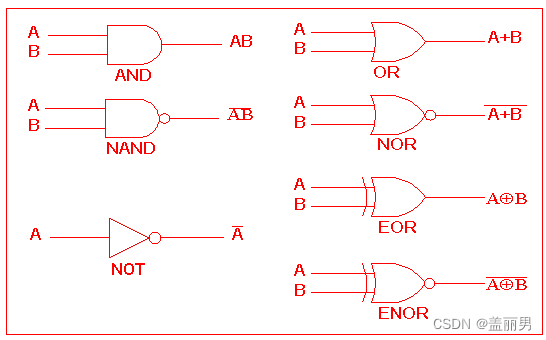
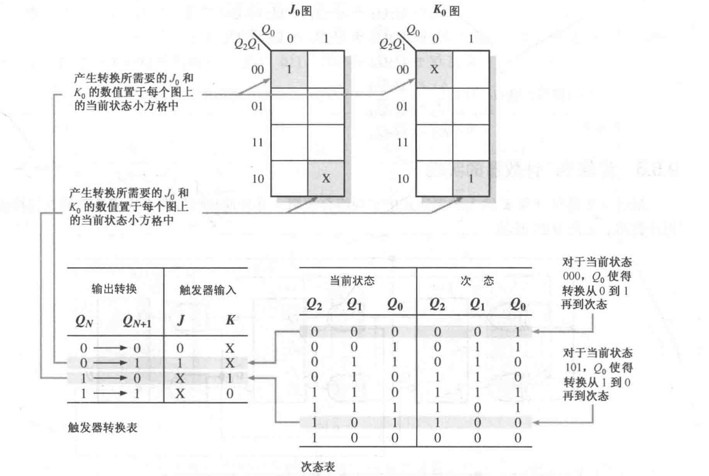
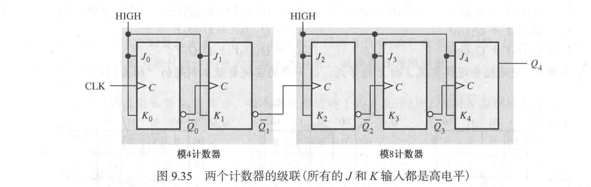
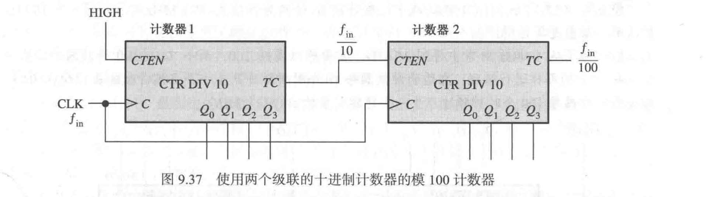

[toc]

# 逻辑代数基础
## 概述

1. 数字电路研究的问题
- 基本电路元件：逻辑门电路、触发器
- 基本数字电路：组合逻辑电路、时序逻辑电路、数模转换器

2. 数字信号逻辑和逻辑电平
- 二值(0,1)数字逻辑：表示事物状态时称为二值逻辑，表示数量时称为二进制数  
- 逻辑电平：在电路中用低、高电平表示(正逻辑:高电平为逻辑1,低电平为逻辑0、副逻辑相反)

## 数制
1. 概念
- 数码：一个位置的数可能的取值(2进制：0/1)
- 权: 各个位置上的权重，$2^i$(其中i表示当前的位置)
- 基数：数码的多少

2. 表示
在右下角添加各进制数的基数或者其相对于的字母,如二进制：$(xxx)_2$ 或 $(xxx)_B$

| xxx进制 | 字母 |
| --- | --- |
| 二进制数 | B(inary) |
| 八进制数 | O(ctal) |
| 十进制数 | D(ecimal) |
| 十六进制数 | H(exadecimal) |

3. 不同进制间的转换

| 进制转换 | 步骤 |
| --- | --- |
 二，八，十六进制转换为十进制|按位权展开
十进制转换为二，八，十六进制|整数部分采用“除基取余(数部分)法”，小数部分采用“乘基取整(数部分)法”
二进制与八，十六进制相互转换|三位二进制数代表一位八进制数，四位二进制数代表一位六进制数，不足补0

## 码制
1. 二进制代码：将若干个二进制数码0和1按一定规则排列起来表示某种特定含义的代码成为二进制代码，简称二进制码。

2. 编码：用数码的特定组合表示特定信息的过程成为编码。

- BCD码：将一位十进制数(0～9十个数)用四位二进制数码表示的代码,多于的没有十进制对应的码称为伪码。

| 分类 | 概念和简介 |
| --- | --- |
| 有权码 |  可人为定义各个位置上的权重，形成8421,5421,2421等BCD码，其中按顺序为各个位上的权重|
| 无权码 | 比8421BCD码多3,例如0011表示0，BCD码中0000表示0 |

- 可靠性代码  
-- 格雷码(Gray码,循环码)
相邻两个位中只有一个数字不相同，可认为从低位一次+1递增。

--  奇偶校验码
由两部分组成：信息码+1位校验位(取值为0或1,当其中“1”的个数为奇数时称为奇校验，“1“的个数为偶数时称为偶校验)

## 基本逻辑运算和复合逻辑运算
1. 基本逻辑运算

| 逻辑运算名 | 条件 | 逻辑表达式 |
| --- | --- | --- |
| 与运算AND | 决定某一事件的所有条件都具备时，该事件才发生 | Y=AB |
| 或运算OR | 决定某一时间的诸条件中，只要有一个或一个以上具备时，就会发生 | Y=A+B |
| 非运算NOT | 决定某一事件的条件满足时，时间不发生，反之事件发生 | Y=$\overline{A}$ |

2. 复合逻辑运算(由基本逻辑运算符构成)

| 逻辑运算名 | 条件 | 逻辑表达式 |
| --- | --- | --- |
| 与非运算NAND | 先与后非 | $Y=\overline{AB}$ | 
| 或非运算NOR | 先或后非 | $Y=\overline{A+B}$ |
| 异或运算EOR | 相同为0,不同为1 | $Y=A⊕ B$ |
| 同或运算ENOR | 相同为1,不同为0 | $Y=A⊙ B$ |

## 逻辑代数的基本定律及规则
1. 定律  
0-1律，同一律，互补律，还原律，交换律，结合律  

|分配律|$A+BC=(A+B)(A+C)$|
| ---| --- |
摩根定律|$\overline{AB}=\overline{A}+\overline{B}$;$\overline{A+B}=\overline{A}*\overline{B}$;(可扩展为更多变量)  
吸收律|$A+\overline{A}B=A+B$
冗余律|$AB+\overline{A}C+BC=AB+\overline{A}C$

2. 规则  

| 带入规则 | 将逻辑等式两边的某一变量用同一个逻辑函数代替，等式仍成立 |
| --- | --- |
| 反演规则 | 对Y=xxx,将Y中所有乘换为加，所有加换为乘(不可改变原先运算顺序)，0换成1,1换成0,原变量换为反变量，反变量换为原变量(只对当个变量起作用，长非号保持不变)，则得到$\overline{Y}$|
| 对偶规则 | 对$Y$,将所有乘变加，加变乘，0换1,1换0,可得到$Y$的对偶式$\overline{Y}$($Y=\overline{Y}$) |

## 逻辑函数表示方法及其转换

1. 逻辑函数的建立
- 分析逻辑问题，建立逻辑函数的真值表
- 根据真值表写出逻辑表达式  
- 画出逻辑图  

2. 逻辑函数的表示  
逻辑函数是用以描述数字逻辑系统输出与输入变量之间逻辑关系的表达式
$$Y=F(A,B,C...)=.....$$

1. 逻辑表达式
- 逻辑函数的标准形式：组织为最小项相加的形式
- 最小项：在逻辑函数中，若一个**与项**(乘积项)包含该逻辑函数的全部变量，且每个变量只出现一次，则称该与项为最小项。  
最小项编号$m_i$：将最小项中的原变量当作1,反变量当作0(即取最小项为真时的各变量取值),则得一组二进制数，其对应的十进制数便为最小项的编号i
> 若表达式中与项并不是最小项，可利用$\overline{A}+A=1$的形式补充缺少的变量,将逻辑表达式变成最小项之和的形式。

2. 真值表
3. 逻辑图
4. 波形图：输入变量与对应的输出变量随时间变化的波形

## 逻辑函数的化简
不同形式逻辑式有不同的最简式，一般先求取最简与或式，然后通过变换得到所需最简式

1. 逻辑函数的公式化简法

| 并项法|$AB+A\overline{B}=A$|
| --- | :---: |
 |吸收法|$A+AB=A$ |
 |消去法|$A+\overline{A}B=A+B$|
 |配项法|利用$A+\overline{A}=1$将一项展开为两项，增加冗余项，可能对化简有帮助|

2. 卡诺图化简
- 相邻最小项：两个最小项中只有一个变量互为反变量，其余变量相同，则称为相邻最小项，两个相邻最小项相加可合并为一项，消去相反变量。

- 卡诺图的组成：n个变量，有$2^n$个最小项，每个最小项都用一个小方格表示。按循环码的编码顺序排列，可以使相邻最小项在几何位置上也相邻且循环相邻。

- 用卡诺图来表示逻辑函数  
-- 求逻辑函数的真值表、标准或一般与或式。  
-- 根据变量的个数画出变量卡诺图(按照循环码的编码顺序)。  
-- 根据真值表、标准或一般与或式填卡诺图(在对应位置填入1)。

- 卡诺图化简步骤
-- 画出函数的卡诺图   
-- 将相邻(逻辑相邻+物理相邻)的“1”方格按$2^n$(1,2,4...)圈为一组，直到所有的“1”被圈完。  
-- 将各卡诺图分别化简。  
-- 将卡诺图的化简结果相加。  
> 圈'1'得到的是$Y$的最简式，圈'0'得到的是$\overline{Y}$的最简式

- 无关项(约束项)
无关项(约束项)指的是没有输出的输入，在卡诺图中用X代替，可视为1,与1组合为圈。

# 组合逻辑电路
1. 组合逻辑电路根据逻辑功能特点分为
- 组合逻辑电路：任一时刻的输出之取决于该时刻的输入信号，而与电路原有的状态无关的电路。
- 时序逻辑电路：任一时刻的输出不仅取决于该时刻的输入信号，而且与电路原有的状态有关的电路(利用触发器)。

2. 组合逻辑电路的分析  
- 分析思路：根据给定的逻辑图，找出输出间的逻辑关系，从而确定电路的逻辑功能。

- 基本步骤：逻辑图 -> 逻辑表达式 -> 化简/变换 -> 真值表 -> 功能说明  

3. 组合逻辑电路的设计
- 设计思路：分析给定逻辑要求，设计出能实现该功能的组合逻辑电路。

- 基本步骤：设计要求 -> 逻辑抽象 -> **列出真值表** -> 求最简输出逻辑式(卡诺图) -> **画逻辑图**

4. 半加器  
- 数字系统中除了进行逻辑运算，还经常进行算术运算，而系统中的加减乘除都是靠加法来实现的，所以加法器便成为了数字系统中最基本的运算单元。

- 两个1位二进制相加，不考虑低位进位的加法。实现半加功能的电路成为半加器。

- 半加规则：两个1位二进制数相加，结果有两个输出，半加和S(本位和),半加进位C。

5. 全加器
- 将本位的2个二进制数和相邻低位来的进位数进行相加的加法。实现全加功能的电路称为全加器。

6. 数值比较器
74LS85：比较两个4位二进制数时，从高位向低位比较，如需比较多位二进制数，则需要使用扩展端连接另外的74LS85

7. 编码器
- 编码：用文字、字符或数字表示特定对象的过程，在数字电路中，采用二进进行编码。

- 编码器：被编信号 ---编码器---> 二进制代码

- 普通编码器：任何时刻只允许一个输入信号有效，否则产生错误输出

- 优先编码器：允许多个输入信号同时有效，输出时对优先级别高的输入信号进行编码

> 优先编码器添加了无关项，只有一行中存在取值的变量(0和1都需要取值)同时取值才可有输出，而普通编码器只用一行中取值为1的变量便可输出

8. 译码器/数据分配器
- 译码：将具有特定含义的二进制码转换为对应的输出信号。具有姨妈功能的逻辑电路称为译码器。

- 二进制译码器：将一些列代码转换成与之一一对应的有效信号。
- 代码转换器：将一种代码转换为另一种代码。

# 锁存器、触发器、定时器

## 锁存器

1. S-R（置位set-复位reset）锁存器

低电平有效输入$\overline{S}$-$\overline{R}$锁存器的真值表

| $\overline{S}$ | $\overline{R}$ | Q | $\overline{Q}$ | 说明 |
| --------------- | --------------- | --------------- | --------------- | --------------- |
| 1 | 1 | NC | NC | 没有变化，锁存器保持当前状态 |
| 0 | 1 | 1 | 0 | 置位(set 1) |
| 1 | 0 | 0 | 1 | 复位(reset 0) |
| 0 | 0 | 1 | 1 | 无效情况 |

2. 门控S-R锁存器

门控S-R锁存器需要一个使能输入EN(ABLE),使能状态下S和R输入控制锁存器的状态，否则状态不会改变。

4. 门控D锁存器

不同于S-R锁存器，它除了EN输入外只有一个D输入端，当EN为高电平使能时，输出Q跟随输入D。

## 边沿触发器

边沿触发器自爱始终脉冲的上升沿或者下降沿上改变状态，并且只能在始终的状态转换瞬间才对它的输入做出响应。

> 作用相当于一个短暂的EN使能信号

1. 上升沿触发的D触发器

| D | CLk | Q | 说明 |
| --------------- | --------------- | --------------- | --------------- |
| 0 | ↑ | 0 | Q = D,reset 0 |
| 1 | ↑ | 1 | Q = D,set 1 |

2. 上升沿触发的j-k触发器

| j | k | CLk | Q | 说明 |
| --------------- | --------------- | --------------- | --------------- | --------------- |
| 0 | 0 | ↑ | $Q_0$ | 无变化 |
| 0 | 1 | ↑ | 0 | reset 0 |
| 1 | 0 | ↑ | 1 | set 1 |
| 1 | 1 | ↑ | $\overline{Q_0}$ | 切换 |

> 对于下降沿触发的触发器，只是在CLK时钟为“↓”时检测状态并进行输出。

3. T触发器

T输入为1时,每来一个时钟脉冲就翻转一次的电路，称为T触发器。

> T'触发器，无论T输入如何，每来一个始终就翻转一次。

4. 异步预置位和清零输入

预置位有效输入时将触发器置位(set 1)  
- PRE,$S_D$

清零有效输入时使得触发器复位(reset 0)
- CLR,$R_D$

> 这两种输入可无视同步输入（D或jk）和时钟（CLK）的影响。

## 触发器运算特性

## 触发器应用

1. 并行数据存储
2. 分频
3. 计数

# 移位寄存器

## 移位寄存器的功能

寄存器可以由一个或多个用以存储和移位数据的触发器构成。

## 移位寄存器数据输入/输出类型

1. 串行输入/串行输出移位寄存器
2. 串行输入/并行输出移位寄存器
3. 并行输入/串行输出移位寄存器  
4. 并行输入/并行输出移位寄存器

> "SRG n"表示具有n位容量的移位及存取(SRG)   
> CLK INH：输入有效时，禁止时钟  
> 并行输入原理：存在一个数据输入线$D_0,D_1..D_n$和一个SHIFT/$\overline{LOAD}$（移位/置位）输入,置有效时，允许D上的数据进入寄存器。  
> SER：具有并行/串行输入功能的寄存器可利用SER端进行串行数据的输入

## 双向移位寄存器(Bidirectional shift registers)

存在$RIGHT/\overline{LEFT}$控制寄存器内部数据的移动方向

> 有时是$S_0$和$S_1$两个输入端，分别代表右移位和左移位,SR SER和SL SER表示右移串行输入和左移串行数据输入。

## 移位寄存器计数器

1. 约翰逊计数器(johnson counter) 

将最后一个触发器输出的反码回接到低一个触发器的D输入上，如果计数器开始位于零状态，则这种连接会产生一个特有的循环状态序列。

> 当计数器中级的个数是n时，约翰计数器会产生模2n中状态并进行循环。

2. 环形计数器(rings counter)

环形计数器对其状态序列中的每个状态都使用一个触发器，将最后一个触发器的输出直接接回到低一个触发器的D输入上。

## 移位寄存器应用

1. 时间延迟
串行输入/输出移位寄存器可以用来提供输入到输出的时间延迟，此时间延迟是寄存器中级数n和时钟频率的函数。

# 计数器

## 有限状态机

- Moore状态机：除了时钟就没有输入，下一状态仅有当前状态决定

- Mealy状态机：下一状态由当前状态和输入决定

## 异步计数器

由于触发器存在传输延迟，并列的触发器永远不会同时被触发，因此称为异步。

> 异步计数器的时钟输入总是只连接到最低有效位的触发器上，下一级的时钟输入由上一级的输出Q控制

> 计数器中的最大累积迟延必须小于时钟波形的周期。

## 同步计数器

同步计数器的时钟连接每个触发器

## 加/减同步计数器

对于加(UP)序列，$Q_{n+1}$在$Q_n$的下一个始终脉冲到来时改变状态；对于减(DOWN)序列，$Q_{n+1}$在$Q_n$=0的下一个时钟脉冲到来时改变状态。
$$J_{n+1}=K_{n+1}=(Q_n*UP)+(\overline{Q_n}*DOWN)$$

## 同步计数器的设计

1. 状态图

状态图给出了计数器在时钟的作用下状态行进的历程（循环）

2. 次态表

列出计数器每一个状态（当前状态）和相应的下一个状态（次态）

3. 触发器转换表

对于j-k触发器存在

| $Q_N$ | $Q_{N+1}$ | J | K |
| --------------- | --------------- | --------------- | --------------- |
| 0 | 0 | 0 | X |
| 0 | 1 | 1 | X |
| 1 | 0 | X | 1 |
| 1 | 1 | X | 0 |

> $Q_N$和$Q_{N+1}$分别是当前状态和次态，X是无关项。

4. 卡诺图

卡诺图用来确定计数器每个触发器的J和K输入所需要的逻辑,对于每个触发器的J和K输入都分别需要一个卡诺图。  

> 卡诺图中数据的填写需要借助次态图和对应的触发器转换表

5. 触发器输入的逻辑表达式

从卡诺图中得到每个触发器的每个J和K端的逻辑表达式

6. 计数器的实现

将逻辑表达式连接成电路

## 级联计数器

级联计数器的总的模等于单个模的积

1. 异步级联

2. 同步级联

计数器1的终端计数(TC)输出连接到计数器2的计数使能(CTEN)输入上，只有计数器1到达最后状态(TC = 1)计数器2才能工作，在下一个脉冲到来时，计数器1重头开始计数，计数器2到达下一个状态，此时TC = 0

3. 具有截断序列的级联计数器

当所有计数器达到最终状态后，触发并行数据输入，调整初始值，可实现具有截断序列的级联计数器

## 计数器译码

将各级触发器的$Q,\overline{Q}$进行与操作组合，得到最后的输出

> 译码假信号，由于存在传输延迟，可能产生短期的不希望得到的电压窄脉冲（假信号）。  
> 解决对策：选通：在假信号消失后才使译码输出,为译码器添加EN使能端
> > 对于上升沿触发器，选在在上升沿后的第一个下降沿后的低电压阶段进行使能，可以规避上升沿后的各触发器间的迟延导致的假信号。

