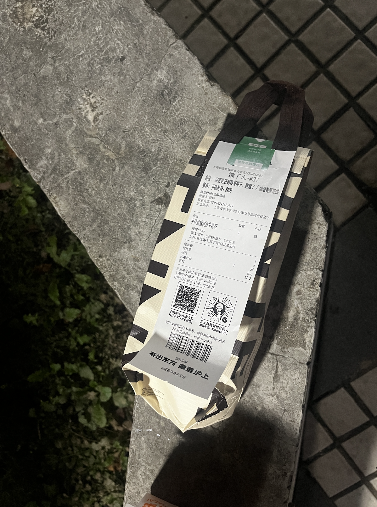
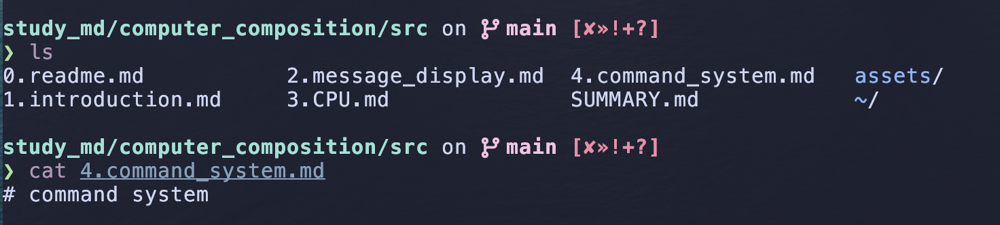
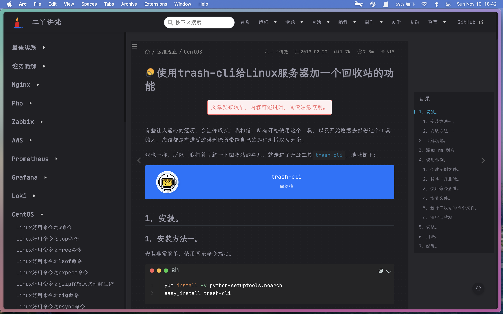

everyday record

# 2024

## 11/5 


1. 今天学会了一个新软件，`karabiner-ejement`，用于改mac键位的，还挺牛，解决了我不能用fn键进行键位映射的问题，并且还让我有了超高优先级的快捷键（以前在b站里面，快捷键option和command就不能用了）。它可以用json文件进行配置文件的书写，但也有gui界面。挺好的，挺喜欢它的。

2. 在 macOS 上，终端自动显示上次登录时间是因为默认开启了 lastlogin 命令。你可以通过修改 ~/.hushlogin 文件来关闭这个信息显示


```bash
touch ~/.hushlogin 
```


## 11/9 


今天宝宝给我买了一大杯小奶茶嘿嘿嘿，今天她体测了，提前一天去，跑完小腹有点点小痛，买了一杯热热的啥啥炖奶喝，还给我也买了一杯，嘿嘿，看看图片
> ok了，高这里搞了半个晚上，因为拍摄的图片太大了，3mb，我的image.nvim够加载半年emmmm，所以好慢，我还以为是插件出问题了呃呃呃，迫不得已只能压缩了。好一个png图片的无损压缩，压缩不了一点，使用imagemagic压缩后，居然还变大了，13mb，这样我还咋插入拍摄的图片呀

好了，我又有一招，我去试试。我有点不理解，我对图片进行截图，截图的大小没有减小，还是3mb，但是此时加载起来就是很快，emmm这是为啥嘞，类目了




嘿嘿，好多芋泥，不过感觉喝起来，一般般好吃，感觉还是和你在一起，你一口我一口喝好喝一点，可能是这里只有芋泥，没有啵啵吧呜呜呜，嘿嘿


## 11/10

今天研究mdbook时候，可能是使用mv指令不当，把我的学习笔记覆盖了，天塌了呜呜呜呜







