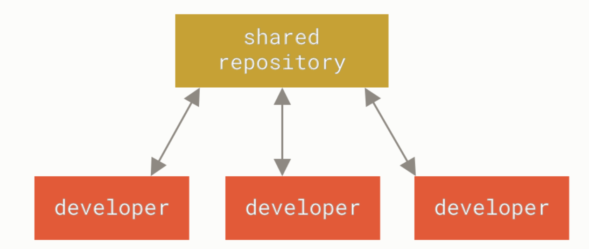
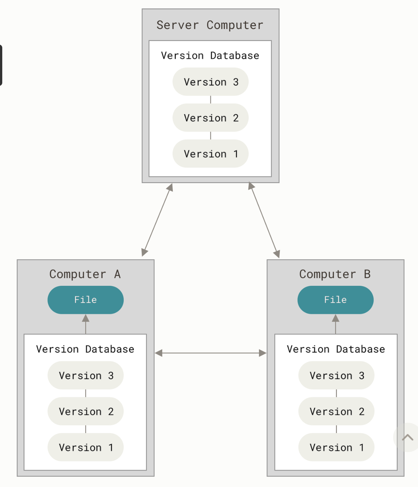
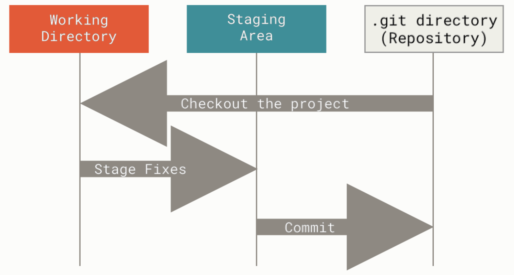
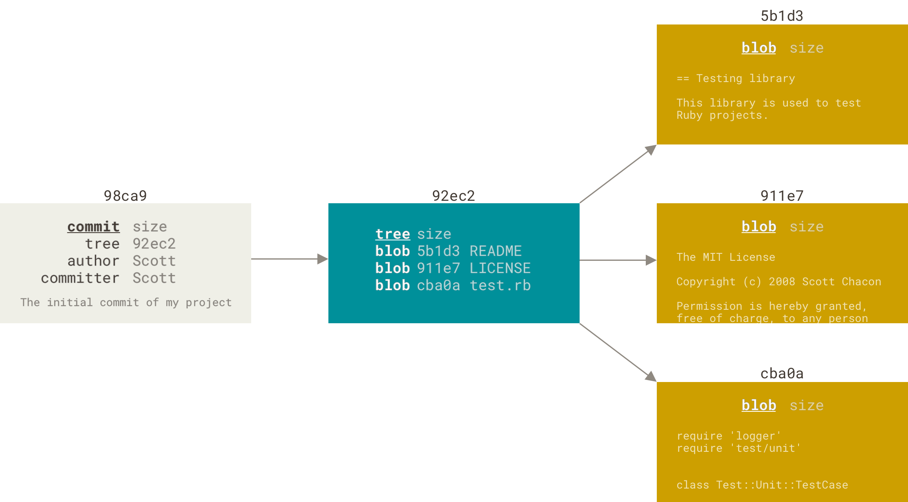
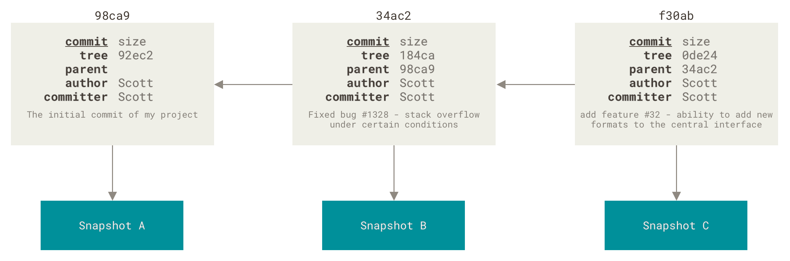
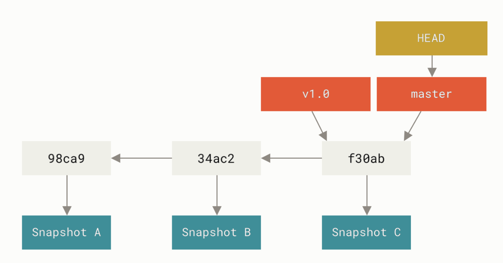

git.md

[toc]

# github配置ssh key
往github上push项目的时候，走https的方式，每次都需要输入账号和密码，二采用ssh的方式，则只需在github账号下配置一个ssh key即可。

步骤：
1. 使用密钥生成工具生存rsa密钥和公钥
2. 将rsa公钥添加掉代码托管平台
3. 将rsa密钥添加到ssh-agent中，为ssh client指定使用的密钥文件

```bash
//检查是否存在rsa公钥
cd ~/.ssh 
ls
//若存在id_rsa和id_rsa.pub文件说明已经有ssh key

//生成ssh key
ssh-keygen -t rsa -C "xxx@xxx.com"

//在github上添加公钥
settings->SSH and GPG keys->New SSH key

//验证是否成功
ssh -T git@github.com
```

# 初次运行git前的配置
git自带一个git config的工具来设置git外观和行为的配置变量
| 配置文件 | 说明 |
| --- | --- |
| /etc/gitconfig | 包含系统上每一个用户及他们仓库的通用配置。 如果在执行 git config 时带上 --system 选项，那么它就会读写该文件中的配置变量。 |
| \~/.gitconfig或~/.config/git/config | 只针对当前用户。 你可以传递 --global 选项让 Git 读写此文件，这会对你系统上 所有 的仓库生效。 |
| workspace/.git/config | 针对该仓库。 你可以传递 --local 选项让 Git 强制读写此文件，虽然默认情况下用的就是它。  |

```bash
//配置用户信息
git config --global user.name "upup1215"
git config --global user.email tianqi1251@outlook.com
git config --global core.editor neovim

//检查配置信息
git config --list
// 查看所有配置以及它们所在的文件
git config --list --show-origin
```


# 起步

## 关于版本控制

版本控制是一种记录一个或若干文件内容变化，以便将来查阅特定版本修订情况的系统。

1. 本地版本控制系统

许多人习惯用复制整个项目目录的方式来保存不同的版本，或许还会改名加上备份时间以示区别。


2. 集中化的版本控制系统

接下来人们又遇到一个问题，如何让在不同系统上的开发者协同工作？ 于是，集中化的版本控制系统（Centralized Version Control Systems，简称 CVCS）应运而生。

有一个单一的集中管理的服务器，保存所有文件的修订版本，而协同工作的人们都通过客户端连到这台服务器，取出最新的文件或者提交更新。





3. 分布式版本控制系统

客户端并不只提取最新版本的文件快照， 而是把代码仓库完整地镜像下来，包括完整的历史记录。 这么一来，任何一处协同工作用的服务器发生故障，事后都可以用任何一个镜像出来的本地仓库恢复。 因为每一次的克隆操作，实际上都是一次对代码仓库的完整备份。




## git特点


1. 直接记录快照，而非差异比较

从概念上来说，其它大部分系统以文件变更列表的方式存储信息，这类系统（CVS、Subversion、Perforce 等等） 将它们存储的信息看作是一组基本文件和每个文件随时间逐步累积的差异 （它们通常称作 基于差异（delta-based） 的版本控制）。

Git 更像是把数据看作是对小型文件系统的一系列快照。 在 Git 中，每当你提交更新或保存项目状态时，它基本上就会对当时的全部文件创建一个快照并保存这个快照的索引。 为了效率，如果文件没有修改，Git 不再重新存储该文件，而是只保留一个链接指向之前存储的文件。 Git 对待数据更像是一个 快照流。

2. 近乎所有操作都是本地执行

在 Git 中的绝大多数操作都只需要访问本地文件和资源，一般不需要来自网络上其它计算机的信息。 因为你在本地磁盘上就有项目的完整历史，所以大部分操作看起来瞬间完成。


3. Git保证完整性

Git 中所有的数据在存储前都计算校验和，然后以校验和来引用。 这意味着不可能在 Git 不知情时更改任何文件内容或目录内容。

Git 用以计算校验和的机制叫做 SHA-1 散列（hash，哈希）。 这是一个由 40 个十六进制字符（0-9 和 a-f）组成的字符串，基于 Git 中文件的内容或目录结构计算出来。 SHA-1 哈希看起来是这样：24b9da6552252987aa493b52f8696cd6d3b00373  

Git 中使用这种哈希值的情况很多，你将经常看到这种哈希值。 实际上，Git 数据库中保存的信息都是以文件内容的哈希值来索引，而不是文件名。


4. Git一般只添加数据

你执行的 Git 操作，几乎只往 Git 数据库中 添加 数据。 你很难使用 Git 从数据库中删除数据，也就是说 Git 几乎不会执行任何可能导致文件不可恢复的操作。

5. 三种状态

- 已提交(committed): 已提交表示数据已经安全地保存在本地数据库中。
- 已修改(modified): 已修改表示修改了文件，但还没保存到数据库中。
- 已暂存(staged): 已暂存表示对一个已修改文件的当前版本做了标记，使之包含在下次提交的快照中。




术语解释：

- 工作区: 对项目的某个版本独立提取出来的内容。 这些从 Git 仓库的压缩数据库中提取出来的文件，放在磁盘上供你使用或修改。
- 暂存区: 一个文件，保存了下次将要提交的文件列表信息，一般在 Git 仓库目录中。 按照 Git 的术语叫做“索引”，不过一般说法还是叫“暂存区”。
- Git仓库目录: Git用来保存项目的元数据和对象数据库的地方。这是 Git 中最重要的部分，从其它计算机克隆仓库时，复制的就是这里的数据。


基本的 Git 工作流程如下：

- 在工作区中修改文件。
- 将你想要下次提交的更改选择性地暂存，这样只会将更改的部分添加到暂存区。
- 提交更新，找到暂存区的文件，将快照永久性存储到 Git 目录。

如果 Git 目录中保存着特定版本的文件，就属于 已提交 状态。 如果文件已修改并放入暂存区，就属于 已暂存 状态。 如果自上次检出后，作了修改但还没有放到暂存区域，就是 已修改 状态。

## 获取帮助

若你使用 Git 时需要获取帮助，有三种等价的方法可以找到 Git 命令的综合手册（manpage）：

```fish
$ git help <verb>
$ git <verb> --help
$ man git-<verb>
```

如果你不需要全面的手册，只需要可用选项的快速参考，那么可以用`-h`选项获得更简明的`help`输出：

```fish
$ git add -h

<!-- output brief help  -->
```


# git基础

学习完本章之后，你应该能够配置并初始化一个仓库（repository）、开始或停止跟踪（track）文件、暂存（stage）或提交（commit）更改。 本章也将向你演示了如何配置 Git 来忽略指定的文件和文件模式、如何迅速而简单地撤销错误操作、如何浏览你的项目的历史版本以及不同提交（commits）之间的差异、如何向你的远程仓库推送（push）以及如何从你的远程仓库拉取（pull）文件。

## 获得git仓库

1. 将尚未进行版本控制的本地目录转换为 Git 仓库；
```bash
git init
```

该命令将创建一个名为 .git 的子目录，这个子目录含有你初始化的 Git 仓库中所有的必须文件

2. 从其它服务器**克隆**一个已存在的 Git 仓库。

```bash
git clone <url> [LocalName]
```

新创建一个目录，并在这个目录下初始化一个 .git 文件夹， 从远程仓库拉取Git仓库中的每一个文件的每一个版本，并放入 .git 文件夹，然后从中读取最新版本的文件的拷贝放入工作区

## 记录每次更新到仓库

工作目录下的每一个文件都不外乎这两种状态：
- 已跟踪 
- 未跟踪
已跟踪的文件是指那些被纳入了版本控制的文件，在上一次快照中有它们的记录，在工作一段时间后， 它们的状态可能是未修改，已修改或已放入暂存区。简而言之，已跟踪的文件就是 Git 已经知道的文件。


### 检查当前文件状态

可以用`git status`命令查看哪些文件处于什么状态。

```bash
git status

# 输出简短状态
git status -s # git status --short
M README    #修改过的文件
MM Rakefile 
A  lib/git.rb   #新添加到暂存区的文件
M  lib/simplegit.rb #修改过的文件
?? LICENSE.txt      #新添加的未跟踪文件
```

### 跟踪新文件

使用命令`git add <files>`开始跟踪一个文件。

> 如果参数是目录的路径，该命令将递归地跟踪该目录下的所有文件。


### 忽略文件`.gitignore`

文件.gitignoew的格式
- 所有空行或以#开头的行都会被Git忽略
- 可以使用glob模式匹配
- 匹配模式可以以/开头防止递归
- 匹配模式可以以/结尾指定目录
- 要忽略指定模式外的文件或目录，可以在模式前加上！取反


glob 模式是指 shell 所使用的简化了的正则表达式。 
- 星号（*）匹配零个或多个任意字符；
- \[abc] 匹配任何一个列在方括号中的字符； 
- 问号（?）只匹配一个任意字符；
- 如果在方括号中使用短划线分隔两个字符， 表示所有在这两个字符范围内的都可以匹配（比如 \[0-9] 表示匹配所有 0 到 9 的数字）。 
- 使用两个星号（\*\*）表示匹配任意中间目录，比如 a/\*\*/z 可以匹配 a/z 、 a/b/z 或 a/b/c/z 等。
[github/gitignore: A collection of useful .gitignore templates](https://github.com/github/gitignore)

###  查看已暂存和未暂存的修改

想知道具体修改了什么地方，可以用`git diff`命令，通过文件补丁的格式更加具体地显示哪些行发生了改变。

```bash
git diff
# 用于比较工作目录和暂存区之间的差异。

git diff --cached|--staged
# 查看暂存区中的更改与上一次提交之间的差异
```


### 提交更新

每次准备提交前，先用`git status`看下，你所需要的文件是不是都已暂存起来了， 然后再运行提交命令`git commit`
```bash
$ git commit -m "commit message"
# -m: 添加提交信息

git commit -a -m "commit message"
# 给 git commit 加上 -a 选项，Git 就会自动把所有已经跟踪过的文件暂存起来一并提交，从而跳过 git add 步骤
```
提交时记录的是放在暂存区域的快照。

### 移除文件

可以用`git rm`命令完成此项工作，并连带从工作目录中删除指定的文件，这样以后就不会出现在未跟踪文件清单中了。

```bash
gir rm file [-r directory]

git rm --cached filename
# 解除跟踪，但不在工作区删除文件

git rm -f file 
# 如果文件有修改且未暂存，force强制删除
```


### 移动文件

运行`git mv`就相当于运行了下面三条命令：

```bash
mv README.md README
git rm README.md
git add README
```


## 查看提交历史

git log 会按时间先后顺序列出所有的提交，这个命令会列出每个提交的SHA-1校验和、作者的名字和电子邮件地址、提交时间以及提交说明。

<!-- TODO: `git log` 有许多选项可以帮助你搜寻你所要找的提交 -->


## 撤销操作

### 修改提交

```bash
git commit --amend
```
这个命令会将暂存区中的文件提交。 如果自上次提交以来你还未做任何修改， 那么快照会保持不变，而你所修改的只是提交信息。


### 取消暂存的文件

```bash
git reset HEAD <file>…
```

### 撤销对文件的修改

```bash
git checkout -- <file>...
```

将它还原成上次提交时的样子

## 远程仓库的使用

远程仓库是指托管在因特网或其他网络中的你的项目的版本库。

### 查看远程仓库

运行`git remote`命令。 它会列出你指定的每一个远程服务器的简写。 

也可以指定选项`-v`，会显示需要读写远程仓库使用的 Git 保存的简写与其对应的 URL。

### 添加远程仓库

运行`git remote add <shortname> <url>`添加一个新的远程 Git 仓库，同时指定一个方便使用的简写

### 从远程仓库中啦取

```bash
$ git fetch <remote>
```
这个命令会访问远程仓库，从中拉取所有你还没有的数据。 执行完成后，你将会拥有那个远程仓库中所有分支的引用，可以随时合并或查看。

如果你使用 clone 命令克隆了一个仓库，命令会自动将其添加为远程仓库并默认以 “origin” 为简写。 所以，git fetch origin 会抓取克隆（或上一次抓取）后新推送的所有工作。

> 必须注意 git fetch 命令只会将数据下载到你的本地仓库——它并不会自动合并或修改你当前的工作。 当准备好时你必须手动将其合并入你的工作。

运行 git pull 通常会从最初克隆的服务器上抓取数据并自动尝试合并到当前所在的分支。


### 推送到远程仓库

将`branch`分支推送到`remote`仓库
```bash
git push <remote> <branch>
```


### 查看某个远程仓库

```bash
git remote show <remote>
```


### 重命名与移除

```bash
git remote rename <oldname> <newname>

git remote remove <remote>
```

## 打标签

Git 可以给仓库历史中的某一个提交打上标签

### 列出标签

这个命令以字母顺序列出标签，但是它们显示的顺序并不重要。
```bash
git tag
```

### 创建标签

```bash
git tag -a <tagname> -m <tag message>
```

`-m`选项指定了一条将会存储在标签中的信息。
> 使用`git show`命令可以看到标签信息和与之对应的提交信息

### 轻量标签

轻量标签本质上是将提交校验和存储到一个文件中——没有保存任何其他信息。

创建轻量标签，不需要使用 -a、-s 或 -m 选项，只需要提供标签名字
```bash
git tag <tagname>
```
这时，如果在标签上运行 git show，你不会看到额外的标签信息。 命令只会显示出提交信息

### 后期标签

可以对过去的提交打标签。

```bash
git tag -a <tagname> <commit-hash>
```

### 共享标签

默认情况下，git push 命令并不会传送标签到远程仓库服务器上。 在创建完标签后你必须显式地推送标签到共享服务器上。

这个过程就像共享远程分支一样——你可以运行
```bash
git push <remote> <tagname>
```

如果想要一次性推送很多标签，也可以使用带有 --tags 选项的 git push 命令。 这将会把所有不在远程仓库服务器上的标签全部传送到那里。
```bash
git push <remote> --tags
```

现在，当其他人从仓库中克隆或拉取，他们也能得到你的那些标签。


### 删除标签

要删除掉你本地仓库上的标签，可以使用命令
```bash
git tag -d <tagname>
```

删除远程标签
```bash
git push origin --delete <tagname>
```


### 检出标签

如果你想查看某个标签所指向的文件版本，可以使用`git checkout`命令
```bash
git checkout <tagname>
```
> 这会使你的仓库处于“分离头指针（detached HEAD）”的状态


## git别名

如果不想每次都输入完整的 Git 命令，可以通过 git config 文件来轻松地为每一个命令设置一个别名。

```bash
git config --global alias.<alias_name> commit/status...
```

需要输入`git commit/status...`时，只需要输入`git <alias_name`即可


# Git分支

使用分支意味着你可以把你的工作从开发主线上分离开来，以免影响开发主线。

## 分支简介

Git 保存的不是文件的变化或者差异，而是一系列不同时刻的快照 。在进行提交操作时，Git 会保存一个提交对象（commit object）。该提交对象会包含一个指向暂存内容快照的指针(但不仅仅是这样，该提交对象还包含了作者的姓名和邮箱、提交时输入的信息以及指向它的父对象的指针)。

为了更加形象地说明，我们假设现在有一个工作目录，里面包含了三个将要被暂存和提交的文件。
- 暂存操作会为每一个文件计算校验和（SHA-1 哈希算法）
- 然后会把当前版本的文件快照保存到Git仓库中(Git使用blob对象来保存它们)
- 最终将校验和加入到暂存区域等待提交

```bash
git add README test.rb LICENSE
git commit -m 'The initial commit of my project'
```

- 使用git commit进行提交操作时，Git 会先计算每一个子目录（本例中只有项目根目录）的校验和， 然后在 Git 仓库中这些校验和保存为树对象。
- 随后，Git 便会创建一个提交对象， 它除了包含上面提到的那些信息外，还包含指向这个树对象（项目根目录）的指针。 如此一来，Git 就可以在需要的时候重现此次保存的快照。


现在，Git 仓库中有五个对象：三个 blob 对象（保存着文件快照）、一个 树 对象 （记录着目录结构和 blob 对象索引）以及一个 提交 对象（包含着指向前述树对象的指针和所有提交信息）。



做些修改后再次提交，那么这次产生的提交对象会包含一个指向上次提交对象（父对象）的指针。



Git 的分支，其实本质上仅仅是指向提交对象的可变指针。 Git 的默认分支名字是 master。 在多次提交操作之后，你其实已经有一个指向最后那个提交对象的 master 分支。 master 分支会在每次提交时自动向前移动。





### 分支创建

它只是为你创建了一个可以移动的新的指针，它可以指向commit
```bash
git branch <branch_name>
```
这会在当前所在的提交对象上创建一个指针。

有一个名为 HEAD 的特殊指针，指向当前所在的本地分支（译注：将 HEAD 想象为当前分支的别名）。


### 分支切换

要切换到一个已存在的分支，你需要使用
```bash
git checkout <branch_name>
```
此时，`HEAD`指针就指向了目标分支


由于 Git 的分支实质上仅是包含所指对象校验和（长度为 40 的 SHA-1 值字符串）的文件，所以它的创建和销毁都异常高效。 创建一个新分支就相当于往一个文件中写入 41 个字节（40 个字符和 1 个换行符）


## 分支的新建与合并

### 新建分支

```bash
git checkout -b <brnach>
# 新建一个分支并同时切换到那个分支上

# 它是下面两条命令的简写
git branch <branch>
git checkout <branch>
```

### 分支的合并

Git 会使用两个分支的末端所指的快照以及这两个分支的公共祖先，做一个简单的三方合并。


### 遇到冲突时的分支合并

有时候合并操作不会如此顺利。 如果你在两个不同的分支中，对同一个文件的同一个部分进行了不同的修改，Git 就没法干净的合并它们。

此时 Git 做了合并，但是没有自动地创建一个新的合并提交。 Git 会暂停下来，等待你去解决合并产生的冲突。 你可以在合并冲突后的任意时刻使用 git status 命令来查看那些因包含合并冲突而处于未合并（unmerged）状态的文件

任何因包含合并冲突而有待解决的文件，都会以未合并状态标识出来。 Git 会在有冲突的文件中加入标准的冲突解决标记，这样你可以打开这些包含冲突的文件然后手动解决冲突。

出现冲突的文件会包含一些特殊区段，看起来像下面这个样子：

```html
<<<<<<< HEAD:index.html
<div id="footer">contact : email.support@github.com</div>
=======
<div id="footer">
 please contact us at support@github.com
</div>
>>>>>>> iss53:index.html
```

这表示 HEAD 所指示的版本（也就是你的 master 分支所在的位置，因为你在运行 merge 命令的时候已经检出到了这个分支）在这个区段的上半部分（======= 的上半部分），而 iss53 分支所指示的版本在 ======= 的下半部分。 为了解决冲突，你必须选择使用由 ======= 分割的两部分中的一个，或者你也可以自行合并这些内容。

 在你解决了所有文件里的冲突之后，对每个文件使用 git add 命令来将其标记为冲突已解决。 一旦暂存这些原本有冲突的文件，Git 就会将它们标记为冲突已解决。


## 分支管理

`git branch`命令不只是可以创建与删除分支。 如果不加任何参数运行它，会得到当前所有分支的一个列表

```bash
$ git branch
  iss53
* master
  testing
```

注意 master 分支前的 * 字符：它代表现在检出的那一个分支（也就是说，当前 HEAD 指针所指向的分支）。

`git branch --merged`: 查看哪些分支已经合并到当前分支  
`git branch --no-merged`: 查看所有包含未合并工作的分支  


## 分支开发工作流

## 远程分支

## 变基

## 总结
