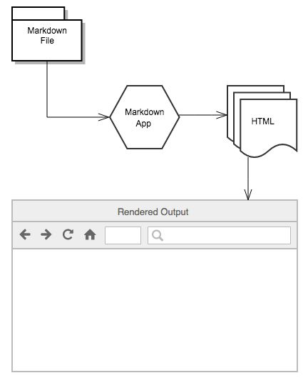

`Markdown`是一种轻量级标记语言，它允许人们使用易读易写的纯文本格式编写文档，Markdown文件的后缀名是“.md”。

[toc]

# 入门

Markdown 是一种轻量级的标记语言，可用于在纯文本文档中添加格式化元素。Markdown 由 John Gruber 于 2004 年创建，如今已成为世界上最受欢迎的标记语言之一。


## markdown的工作原理

使用 Markdown 格式书写时，文本内容存储在带有 .md 或 .markdown 扩展名的纯文本文件中。你的 Markdown 格式的文件如何转换为 HTML 或可打印的文档呢？

简单来说，你需要一个能够处理 Markdown 文件的 Markdown 应用程序。有许多应用程序可供选择，尽管它们在视觉上有所不同，但所有应用程序都执行相同的操作。它们都是将 Markdown 格式的文本转换为 HTML，以便可以在 Web 浏览器中显示。

Markdown 应用程序使用一种称为 Markdown 处理器（也通常称为“解析器”或“实现”）的东西将获取到的 Markdown 格式的文本输出为 HTML 格式。此时，可以在 Web 浏览器中查看你的文档，或者将其与样式表组合并打印。你可以在下图看到此过程的直观表示。




> 注意： Markdown 应用程序和处理器是两个单独的组件。为了简洁起见，在下图中，我将它们组合为一个元素（即 “Markdown应用程序”）。

总而言之，这是一个四步的过程：

1. 使用文本编辑器或 Markdown 专用的应用程序创建 Markdown 文件。该文件应带有 .md 或 .markdown 扩展名。
2. 在 Markdown 应用程序中打开 Markdown 文件。
3. 使用 Markdown 应用程序将 Markdown 文件转换为 HTML 文档。
4. 在 web 浏览器中查看 HTML 文件，或使用 Markdown 应用程序将其转换为其他文件格式，例如 PDF。


## markdown方言

实际上每个 Markdown 应用程序都实现了稍有不同的 Markdown 语法。Markdown 的这些变体通常被称为 flavors（方言）。掌握你的应用程序所实现的 Markdown 语法是你需要注意的。


# 速查

## 基本语法

| 元素           | Markdown 语法                        |
|----------------|--------------------------------------|
| 标题（Heading） | `# H1` <br> `## H2` <br> `### H3`    |
| 粗体（Bold）    | `**bold text**`                     |
| 斜体（Italic）  | `*italicized text*`                 |
| 引用块（Blockquote） | `> blockquote`               |
| 有序列表（Ordered List） | `1. First item` <br> `2. Second item` <br> `3. Third item` |
| 无序列表（Unordered List） | `- First item` <br> `- Second item` <br> `- Third item` |
| 代码（Code）    | `` `code` ``                        |
| 分隔线（Horizontal Rule） | `---`                   |
| 链接（Link）    | `[title](https://www.example.com)` |
| 图片（Image）   | ``           |

## 扩展语法

| 元素                    | Markdown 语法                                                                                     |
|-------------------------|--------------------------------------------------------------------------------------------------|
| 表格（Table）           | `| Syntax      | Description |` <br> `| ----------- | ----------- |` <br> `| Header      | Title       |` <br> `| Paragraph   | Text        |` |
| 代码块（Fenced Code Block） | `` ``` `` <br> `{` <br> `"firstName": "John",` <br> `"lastName": "Smith",` <br> `"age": 25` <br> `}` <br> `` ``` `` |
| 脚注（Footnote）        | `Here's a sentence with a footnote. [^1]` <br> `[^1]: This is the footnote.`                    |
| 标题编号（Heading ID）  | `### My Great Heading {#custom-id}`                                                              |
| 定义列表（Definition List） | `term` <br> `: definition`                                                                 |
| 删除线（Strikethrough） | `~~The world is flat.~~`                                                                        |
| 任务列表（Task List）   | `- [x] Write the press release` <br> `- [ ] Update the website` <br> `- [ ] Contact the media`  |

# 基本语法

Markdown使用易读易写的纯文本格式编写文档，可与HTML混编，可导出 HTML、PDF 以及本身的 .md 格式的文件。

## 标题

1. 要创建标题，请在单词或短语前面添加井号(`#`)。`#`的数量代表了标题的级别。

2. 还可以在文本下方添加任意数量的`==`号来标识一级标题，或者`--` 号来标识二级标题。

> 不同的Markdown应用程序处理#和标题之间的空格方式并不一致。为了兼容考虑，请用一个**空格**在#和标题之间进行分隔。


## 段落

1. 要创建段落，请使用空白行将一行或多行文本进行分隔。
2. 使用HTML中的`<p>...</p>`标签


> 不要用空格（spaces）或制表符（ tabs）缩进段落。


## 换行

1. 在一行的末尾添加两个或多个空格，然后按回车键,即可创建一个换行
2. 使用HTML中的`<br>`标签


## 强调

### 粗体(Bold)

1. 要加粗文本，请在单词或短语的前后各添加两个星号（asterisks）或下划线（underscores）。
> 如需加粗一个单词或短语的中间部分用以表示强调的话，请在要加粗部分的两侧各添加两个星号（asterisks）。

2. 使用HTML中的`<strong>...</strong>`标签


### 斜体(Italic)

1. 要用斜体显示文本，请在单词或短语前后添加一个星号（asterisk）或下划线（underscore）。
> 要斜体突出单词的中间部分，请在字母前后各添加一个星号，中间不要带空格。

2. 使用HTML中的`<em>...</em>`标签


### 粗体(Bold)和斜体(Italic)

1. 要同时用粗体和斜体突出显示文本，请在单词或短语的前后各添加三个星号或下划线。
> 要加粗并用斜体显示单词或短语的中间部分，请在要突出显示的部分前后各添加三个星号，中间不要带空格。

2. 使用HTML中的`<strong><em>...</strong></em>`标签

## 引用

1. 要创建块引用，请在段落前添加一个`>`符号。
2. 块引用可以包含多个段落。为段落之间的空白行添加一个`>`符号。
3. 块引用可以嵌套。在要嵌套的段落前添加一个`>>`符号。
> 块引用可以包含其他 Markdown 格式的元素。（但并非所有的元素都可以）


## 列表

### 有序列表

1. 要创建有序列表，请在每个列表项前添加数字并紧跟一个英文句点。数字不必按数学顺序排列，但是列表应当以数字 1 起始。
2. 使用HTML中的`<ol><li>...</li><li>...</li>...</ol>`标签


### 无须列表

1. 要创建无序列表，请在每个列表项前面添加破折号 (-)、星号 (*) 或加号 (+) 。缩进一个或多个列表项可创建嵌套列表。
2. 使用HTML中的`<ul><li>...</li><li>...</li>...</ul>`标签

> 要在保留列表连续性的同时在列表中添加另一种元素，请将该元素缩进四个空格或一个制表符

## 代码

1. 要将单词或短语表示为代码，请将其包裹在反引号(`)中。

> 如果你要表示为代码的单词或短语中包含一个或多个反引号，则可以通过将单词或短语包裹在双反引号(``)中。

## 分隔线

要创建分隔线，请在单独一行上使用三个或多个星号 (***)、破折号 (---) 或下划线 (___) ，并且不能包含其他内容。

> 为了兼容性，请在分隔线的前后均添加空白行。

## 链接

1. 链接文本放在中括号内，链接地址放在后面的括号中，链接title可选。`[超链接显示名](超链接地址 "超链接title")`
    > 链接title是当鼠标悬停在链接上时会出现的文字，这个title是可选的，它放在圆括号中链接地址后面，跟链接地址之间以空格分隔。

2. 使用HTML中的`<a href="超链接地址" title="超链接title">超链接显示名</a>`标签

- 网址和Email地址

直接使用尖括号可以很方便地把URL或者email地址变成可点击的链接。

- 带格式化的链接

强调链接, 在链接语法前后增加星号。 要将链接表示为代码，请在方括号中添加反引号。

- 引用类型链接
    - 链接的第一部分格式，引用类型的链接的第一部分使用两组括号进行格式设置。
        - 第一组方括号包围应显示为链接的文本。
        - 第二组括号显示了一个标签，该标签用于指向您存储在文档其他位置的链接。
    - 链接的第二部分格式
        - 放在括号中的标签，其后紧跟一个冒号和至少一个空格
        - 链接的URL，可以选择将其括在尖括号中。
        - 链接的可选标题，可以将其括在双引号，单引号或括号中。

```html
<!-- 第一部分 -->
[hobbit-hole][1]
[hobbit-hole] [1]

<!-- 第二部分 -->
[1]: https://en.wikipedia.org/wiki/Hobbit#Lifestyle
[1]: https://en.wikipedia.org/wiki/Hobbit#Lifestyle "Hobbit lifestyles"
[1]: https://en.wikipedia.org/wiki/Hobbit#Lifestyle 'Hobbit lifestyles'
[1]: https://en.wikipedia.org/wiki/Hobbit#Lifestyle (Hobbit lifestyles)
[1]: <https://en.wikipedia.org/wiki/Hobbit#Lifestyle> "Hobbit lifestyles"
[1]: <https://en.wikipedia.org/wiki/Hobbit#Lifestyle> 'Hobbit lifestyles'
[1]: <https://en.wikipedia.org/wiki/Hobbit#Lifestyle> (Hobbit lifestyles)
```


## 图片

1. 要添加图像，请使用感叹号 (!), 然后在方括号增加替代文本，图片链接放在圆括号里，括号里的链接后可以增加一个可选的图片标题文本。``

- 链接图片

给图片增加链接，请将图像的Markdown 括在方括号中，然后将链接添加在圆括号中。`[](https://markdown.com.cn)`


## 转义字符语法

1. 要显示原本用于格式化 Markdown 文档的字符，请在字符前面添加反斜杠字符`\`。


- 特殊字符自动转换

在 HTML 文件中，有两个字符需要特殊处理：`<` 和`&` 。 
- < 符号用于起始标签，使用`&lt;`代替
- & 符号则用于标记HTML实体，使用`&amp;`代替

## 内嵌HTML标签

对于 Markdown 涵盖范围之外的标签，都可以直接在文件里面用 HTML 本身。如需使用 HTML，不需要额外标注这是 HTML 或是 Markdown，只需 HTML 标签添加到 Markdown 文本中即可。

### 行级内联标签

- HTML 的行级內联标签如 \<span>、\<cite>、\<del> 不受限制
- 当你需要更改元素的属性时（例如为文本指定颜色或更改图像的宽度），使用 HTML 标签更方便些。
- 在HTML內联标签的范围内，Markdown的语法是可以解析的。

### 区块标签

- 区块元素──比如 \<div>、\<table>、\<pre>、\<p> 等标签，必须在前后加上空行，以便于内容区分。
- 这些元素的开始与结尾标签，不可以用tab或是空白来缩进。
- Markdown 语法在 HTML 区块标签中将不会被进行处理。


# 扩展语法

## 表格

要添加表
- 请使用三个或多个连字符（---）创建每列的标题，并使用管道（|）分隔每列。您可以选择在表的任一端添加管道。


- 对齐

在标题行中的连字符的左侧，右侧或两侧添加冒号（`:`），将列中的文本对齐到左侧，右侧或中心。

- 格式化表格中的文字

- 在表中转义管道字符

您可以使用表格的HTML字符代码（&#124;）在表中显示竖线（|）字符。


## 围栏代码块

在代码块之前和之后的行上使用三个反引号（(```）或三个波浪号（~~~）。

- 语法高亮

要添加语法突出显示，请在受防护的代码块之前的反引号旁边指定一种语言。

## 脚注

当您创建脚注时，带有脚注的上标数字会出现在您添加脚注参考的位置。读者可以单击链接以跳至页面底部的脚注内容。

要创建脚注参考
- 请在方括号（\[^1]）内添加插入符号和标识符。标识符可以是数字或单词，但不能包含空格或制表符。
- 在括号内使用另一个插入符号和数字添加脚注，并用冒号和文本（\[^1]: My footnote.） 
### My Great Heading {#custom-id}

## 标题编号

添加自定义ID允许您直接链接到标题并使用CSS对其进行修改。

1. 要添加自定义标题ID，请在与标题相同的行上用大括号括起该自定义ID。`### My Great Heading {#custom-id}`
2. 使用HTML中的`<h3 id="custom-id">My Great Heading</h3>`

- 链接导标题

通过创建带有数字符号（#）和自定义标题ID的\[标准链接]，可以链接到文件中具有自定义ID的标题。

1. `[Heading IDs](#heading-ids)`
2. `<a href="#heading-ids">Heading IDs</a>`


## 定义列表

1. 创建定义列表，请在第一行上键入术语。在下一行，键入一个冒号，后跟一个空格和定义。

2. 使用HTML中的`<dl><dt>...</dt><dd>...</dd>...</dl>`

## 删除线

在单词前后使用两个波浪号`~~`。

## 任务列表语法

创建任务列表
1. 请在任务列表项之前添加破折号-和方括号\[ ]，并在\[ ]前面加上空格。
2. 要选择一个复选框，请在方括号\[x]之间添加x 。

## 使用Emojo标签

### 复制和粘贴表情符号

`Ctrl+C/V`

### 使用表情符号简码

以冒号开头和结尾，并包含表情符号的名称。[Complete list of github markdown emoji markup](https://gist.github.com/rxaviers/7360908)

## 自动网址链接

许多Markdown处理器会自动将URL转换为链接。  

如果您不希望自动链接URL，则可以通过将URL表示为带反引号的代码来删除该链接。


