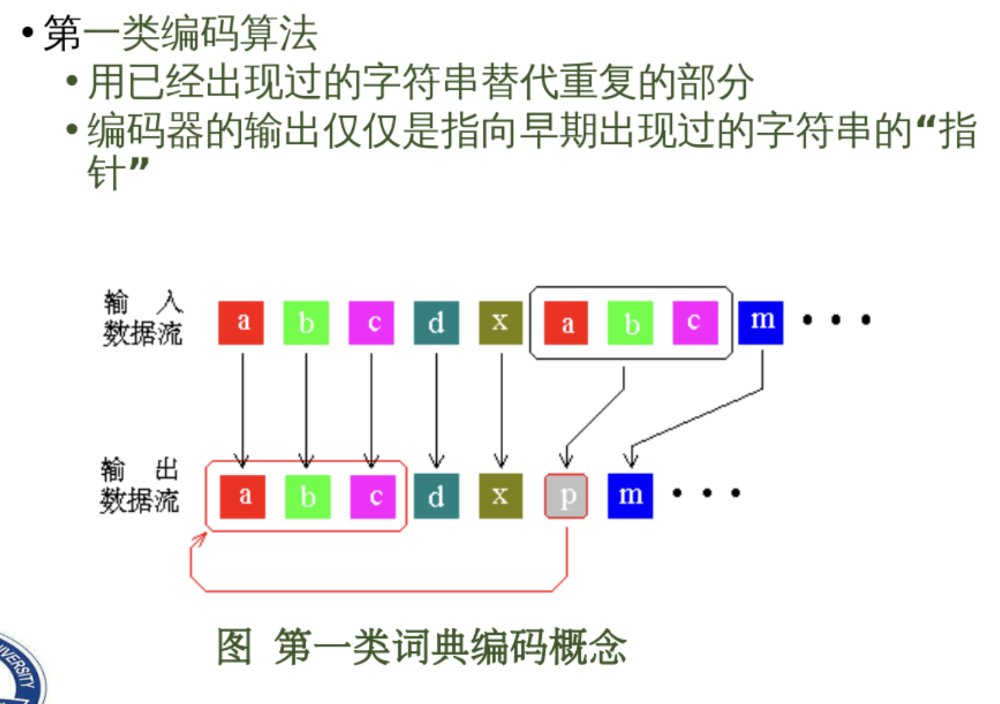

多媒体考试重点

[toc]

# 1. 颜色度量体系

颜色感知三要素：
- 光源
- 物体
- 观察者

颜色是视觉系统对可见光的感知结果，感知到的颜色由光波波长决定

## 1.2 颜色的三个特性

1. 色调

视觉系统对一个区域呈现颜色的感觉，即对可见物体辐射或发射的光波波长的感觉

2. 饱和度

区别颜色明暗程度
- 一种颜色参入其他光成分越多，饱和度越低
- 完全饱和的颜色指没有参入白光所呈现的颜色

3. 明度

视觉系统对物体辐射光或发射光多少的感知属性

# 2. 彩色数字图像基础

## 2.1 视觉系统对颜色的感知

颜色是视觉系统对可见光(波长在380-780nm间的电磁波)的感知结果

眼睛是照相机，视网膜通过神经元感知颜色
- 每个神经元是对颜色敏感的锥体或是不敏感的杆状体
- 红，绿和蓝三种锥体细胞对不同频率的光感知不同

## 2.2 图像的颜色模型

1. 颜色模型：用数值指定颜色的方法

- 颜色叠加模型

>颜色模型指用不同的基本色叠加而构成别的颜色

- CMY相减混色模型

使用不发光波的物体吸收视觉系统识别颜色需要的反射光

- HSL模型

    - H: 定义颜色的波长，称为色调
    - S: 定义颜色饿的强度，表示饱和度
    - L: 定义参入的白光量，称为亮度

2. 颜色空间：用空间中点的集合描述颜色的方法

## 2.3 图片的三个属性

### 分辨率

1. 屏幕分辨率

衡量显示设备显示图像时可到达的精细程度，用水平方向和垂直方向所能显示的像素数目表示，表示为
$$水平像素数 x 垂直像素数$$

2. 图像分辨率

图像精细程度的度量方法

### 像素深度

存储每个像素所用的位数

#### alphe通道

表示彩色图像时，除了使用R，G，B分量外，还增加一位或多位属性位。

属性位T称位alpha通道，指定该像素所具有的性质，称为透明位，用于图片重叠时控制透明度

### 真/伪彩色

1. 真彩色

每个像素的颜色值用R，G，B表示颜色

2. 伪彩色

每个像素的颜色不是由基本色分量的数值决定，而是把该值作为表项地址在彩色查找表中寻找对应的颜色

## 2.4 图像的种类

# 3. 彩色电视

1. 彩色电视使用的颜色模型

采用$YUV$模型进行采样
- “Y”表示明亮度
- “U”和“V”则是色度、浓度

2. 采样格式

$$A:B:C$$
- A: 表示水平上存在A个采样点
- B: 第一行有B个色度样本
- C: 第二行有C个色度样本

#  4. 压缩

1. 数据被压缩的依据

- 数据本身存在冗余
- 听觉系统的敏感度有限
- 视觉系统的敏感性有限

##  4.1 压缩的理论--信息论

香农指出：任何信息都存在冗余，冗余大小与信息中每个符号出现的概率有关

1. 决策量

在有限数目的互斥集合中，决策量是事件数的对数值，数学表示为
$$H_0 = log(n)$$
- n: 事件数
> 决策数的单位由对数的底数决定
> - Sh/Nat/Hart: 以2/e/10为底

2. 信息量

具有确定概率事件的信息的定量度量，定义为
$$I(x) = \log_2{\frac{1}{p(x)}} = - log_2{p(x)}$$
- p(x): 事件x出现的功率

3. 熵

在有限的互斥的联合穷举事件的集合中，熵为事件的信息量的平均值
$$H(X) = \sum_{i=1}^nh(x_i) = \sum_{i=1}^np(x_i)I(x_i) = -\sum_{i=1}^np(x_i)log_2p(x_i)$$

4. 数据的冗余量

数据的冗余量$R$定义为决策量$H_0$超过熵$H$的量
$$R = H_0 - H$$

##  4.2 三种多媒体数据类型的压缩

- 文字数据：无损压缩
    - 数据本身的冗余

- 声音数据：有损压缩
    - 数据本身存在冗余
    - 听觉系统的敏感度有限

- 图像/视频数据：有损压缩
    - 数据本身存在冗余
    - 视觉系统的敏感度有限

## 4.3 无损压缩

### 香农-范诺编码

1. 根据符号出现的频率对符号进行降序排序
2. 分为两部分，使左边部分的总频率和尽可能接近右边部分的总频率和
    - 第一部分编码0
    - 第二部分编码1 
3. 递归：对每一小份进行类似划分，直到每一小部分符号集合不可划分为止

### 霍夫曼编码

1. 按符号出现概率大小对符号进行排序
2. 将概率最小的两个符号组成一个新的节点P1
3. 重复步骤二，得到节点P2,P3...Pn，形成一颗树，其中Pn为根节点
4. 从根节点开始，从上到下编上0和1
5. 从根节点顺着数枝读出每个符号的代码

### 行程长度编码

利用重复的数据单元有相同的数值这一特点对数据进行压缩，对相同的数值只编码一次，同时计算出相同值重复的次数

### 字典编码

文本中的词用它在词典中表示位置的号码替代

1. 动态/静态词典编码技术

- 静态词典编码：
    - 编码器需要实现构造词典
    - 解码器需要事先知道词典

- 动态词典编码：
    - 编码器从被压缩的文本中导出词典
    - 解码器解码时编解码编构造词典

2. 两种类型的编码算法

- 
- 

# 5. 小波

1. 什么是小波

小波是在有限时间范围内变化且其平均值为0的数学函数

2. 小波变换

用小波对函数在空间和时间上进行局部化分析的数学变换
- 通过平移母小波获得信号的时间（位置）信息
- 通过放缩母小波的宽度获得信号的频率特性
- 对母小波的缩放和平移是为了计算小波的系数

小波变化继承和发展了傅立叶变换、哈尔变换和短傅立叶变换的思想，不仅可提供信息包含的频率，还可以提供信号的时间和频率之间的关系

##  4.1 连续小波变换(CWT)

用连续小波(没有经过数字化的小波)表示函数的数学变换，用于对连续函数在时间和空间上进行局部化分析

1. CWT的变换过程

- 将小波f(t)和原始信号g(t)的开始部分进行比较
- 计算系数C -- 该部分信号与小波的近似程度
- 小波右移k后得到小波函数f(t-k)
- 重复步骤1,2,3，直到信号结束
- 扩展小波，如果扩展一倍，得到的小波函数位f(t/2)
- 重复步骤1-5

## 5.2 离散小波变化

使用离散小波(连续小波通过采样和量化后的小波)的小波变换

连续小波变化：实际用离散数据计算，缩放因子和平移参数较小
离散小波变换：缩放因子和平移参数选择2的整数倍

## 5.3 离散小波变换和连续小波变换区别

| 特征                | CWT                              | DWT                              |
|---------------------|----------------------------------|----------------------------------|
| **尺度**            | 连续尺度（任意尺度）            | 离散尺度（通常是 2 的幂次方）    |
| **平移**            | 连续平移（任意位置）            | 离散平移（固定间隔）             |
| **计算复杂度**      | 高，计算量大，冗余信息多        | 低，计算量小，层次分解          |
| **输出结果**        | 细致的时频信息，冗余信息较多    | 多级分解，通常较为简洁          |
| **应用领域**        | 信号分析、精细时频分析          | 图像/视频压缩、实时信号处理    |
| **频率-时间分辨率** | 更高的分辨率，适合细致分析      | 时间或频率分辨率相对较低        |

# 5. 图像编码标准

## 5.1 JPEG标准

JPEG是静态数字图像数据压缩标准，JPEG开发了两种基本的压缩算法
- 采用以离散余弦变换为基础的有损压缩算法
- 采用预测技术为基础的无损压缩算法

1. 算法概述

- 用正向离散余弦变换FDCT将空间域表示的图变换成频率域表示的图
- 用加权函数对DCT进行量化，该加权函数对人的视觉系统最佳
- 使用霍夫曼编码对量化系数进行编码

### 5.1.1 JPEG算法的计算步骤

JPEG会分析图片的各个部分，找到并删除人眼不易插察觉的元素

- 色彩空间转换(无损，可逆)
    - 根据每个像素都有的R，G，B三个值
    - 计算出三个新的值: 亮度Y，蓝色色度Cb，红色色度Crmuti
        - Cr反映RGB输入信号红色部分与RGB信号亮度值之间的差异
        - Cb反映RGB输入信号蓝色部分与RGB信号亮度值之间的差异
        

- 色度缩减取样(有损)
    - 利用人眼对亮度敏感，色度不敏感的原理
    - 将蓝色和红色色度分量上的像素按2x2个像素成一个分块进行划分
    - 计算每个区块的平均值，将这四个区块的值用一个计算出的平均值代替
    - 亮度保持不变
        

- 离散余弦变换FDCT(有损)
    - 利用人眼不擅长感知图像中的高频元素实现
        - 便利图像的各个部分，找到具有高频率的色度或亮度的像素频繁出现的区域
        - 然后将它们删去
    - 以亮度为例
        - 将整个图像按8x8分成多个区块
        - 每个区块拥有64个像素，每个像素用0-255表示其亮度
        - 每个像素的亮度值减去128，-128为黑色，127为白色
        - 使用64张基础图像的组合来重建64个像素组成的区块
        - 通过给出单个基础图像都要取乘的一个数值，表示该基础图像的使用份量
            > 这64个基础图像乘以个字的使用份量的叠加最终可以复原64个像素组成的区块图
        - 因此，代表64个像素组成的区块被转换为64个数值， 以代表每个基础图像所使用的次数
            
    - 蓝色和红色色度需要进行同样的操作
- 量化(有损)
    - 将上一步得到的基础图像使用表中的各个值除以给出的量化表中的对应值
        
        - 量化表右下角是人眼不易辨别的高频部分，数值较高
        - 左上角相反

- Z字形编码(无损)
    
- 用行程长度编码RLE对交流系数AC进行编码(无损)
- 哈夫曼编码(无损)

## 5.2 JPEG 2000标准

以小波技术为基础的JPEG标准

1. 步骤

- 源图像分块，各块大小无限制
- 小波变化
- 系数量化
- 熵编码
- 输出位流

# 6. MPEG数字电视编码标准

MPEG-1，MPEG-2，h.261，h.263
- 基于图像块、变换、统计编码

MPEG-4 
- 基于模型/对象的压缩编码技术
- 基于视频内容内容进行编码，抓住了图像信息传输的本质

## 6.1 MPEG-1

压缩的基本方法
- 空间上：采用与JPEG类似的算法去掉空间冗余数据
- 时间上：采用移动补偿算法去掉时间冗余数据，只存储相邻视频帧之间的差异而非每一帧的完整信息

### 三种类型图像

三种类型图像，采用不同算法压缩
- 帧内图像(I帧): 包含内容完整的图像，用于为其他帧图像的编码和解码提供参考，称为关键帧，采用类似与JPEG的压缩
- 预测图像(P帧): 以在它之前出现的I帧作为参考的图像，对预测图像P进行编码就是对它们之间的差值进行编码
- 双向预测图像(B帧): 以在它之前和之后的帧图像(I和P)为参考的图像，对B帧的编码就是对I帧和P帧的差值分别进行编码

## 6.2 MPEG-2 

相比与MPEG-1的优点
- 支持更高的压缩效率，更高的分辨率
- 采用更复杂的运动补偿和变换编码技术，使图像质量更高
- 支持将音频、视频和其他数据流组合在一起

## 6.3 MPEG-4

相比于MPEG-2
- 对MPEG-2的帧内和帧间压缩算法进行了优化
- 更细粒度的压缩
- 面向对象编码：支持在视频中对不同的对象（人树等）进行单独编码

### 面向对象的编码技术

面向对象的编码方式将视频图像分解成多个“对象”，每个对象都可以单独编码。比如在一个视频中，背景、前景、人物等可以作为独立的对象进行编码
- 更高的压缩效率：不同对象的特性（如运动、纹理等）可能不同，独立编码可以针对每个对象的特点进行优化，从而达到更高的压缩效率
- 更强的可操作性：可以独立控制视频中不同对象的显示、编辑和交互，这对于需要实时修改的应用（如视频会议、互动视频）非常有用。

# 7. H.264和H.265

## 7.1 H.264

- 视频预处理模块：包括颜色空间转换、去噪等
- 预测编码: 分为帧内预测和帧间预测，通过参考前后帧或同一帧的区域来预测当前帧，减少冗余数据
- 变换编码: 将视频块从时域转换到频域（通常使用 4x4 或 8x8 的块），并对这些频域数据进行量化
- 熵编码: 使用 CABAC（Context-based Adaptive Binary Arithmetic Coding）或 CAVLC（Context-based Adaptive Variable Length Coding）来对量化后的系数进行高效编码
- 运动补偿: 通过估计和编码视频帧中运动的变化来减少数据量
- 量化: 将变换后的系数进行量化，通常会损失一些数据，但通过控制量化过程的精度可以平衡压缩率和视频质量。

## 7.2 H.265（HEVC）

H.265 在 H.264 的基础上进行了许多改进和增强
- 视频预处理模块：和 H.264 相似，但 H.265 对色彩空间和色度采样有更好的支持，提升了图像质量
- 预测编码
    - H.265 采用了 更大的预测单元，比 H.264 更加精细
    - 更先进的帧内预测：H.265 引入了 33 种帧内预测模式，相比 H.264 的 9 种模式，在编码时能够更加精确地预测块的内容
- 变换编码
    - H.265 支持 更大的变换块（最大 64x64），而 H.264 只能使用 4x4 和 8x8 块，这能提高编码效率
    - 更多的变换类型，增强了对视频中的复杂图像区域的处理能力
- 熵编码：h.265 完全采用 cabac 编码方式，比 h.264 的 cabac 编码效率更高
- 运动补偿：h.265 支持更大的运动补偿块（最多 64x64），比 h.264 的 16x16 的运动补偿块更大，能更精确地预测图像的运动变化
- 量化：h.265 引入了更为灵活的量化方式，提高了压缩比。

## 7.3 变换和熵编码

1. 变换（Transform Coding）

变换编码是视频压缩中的一个重要步骤，将图像数据从时域转换为频域，去除图像中冗余的信息
- H.264 使用的是 整数离散余弦变换（Integer DCT），将图像块（通常是 4x4 或 8x8）转换成频域系数。变换后的系数会在量化步骤中被减少精度，从而达到压缩效果
- H.265 使用 整数离散余弦变换（Integer DCT） 或 整数四叉树变换（Integer T-Transform），根据不同的块大小采用不同的变换方法，允许更大范围的块大小（最大 64x64），这样能够在复杂场景中更好地捕捉信息，获得更高的压缩比

2. 熵编码（Entropy Coding）

熵编码是一种无损的数据压缩方法，主要用于对量化后的数据进行进一步的压缩
- H.264 支持 CAVLC 和 CABAC
    - CAVLC 是较为简单的编码方式，效率较低，但计算量小
    - CABAC 是更为复杂的编码方式，具有更高的压缩效率，但计算量较大
- H.265 只支持 CABAC
    - CABAC相较 H.264 的 CAVLC 更高效，能够进一步提高压缩率
    - 但由于其计算复杂度较高，对硬件解码要求较高。

## 7.4 差异

1. 压缩效率
- H.265 相比 H.264 提供了约 50% 的压缩效率提升
- H.264 在过去广泛应用于蓝光、在线视频流媒体等，但相比于 H.265，其在同等质量下需要更多的带宽或存储空间

2.  编码复杂度
- H.265 的编码复杂度显著高于 H.264。H.265 支持更多的预测模式、更大的运动补偿块、更大的变换块等，虽然这些功能提高了压缩率，但也增加了编码和解码的计算量
- 因此，H.265 对硬件的要求较高，尤其是在实时编码和解码时

3. 网络带宽
- H.265 的网络带宽要求比 H.264 低，特别是在高清视频（如 4K、8K）播放时，H.265 的压缩效率能显著降低所需的网络带宽，提升流媒体传输体验

4. 兼容性

- H.264 已经广泛被支持，包括大多数视频播放设备、浏览器和平台
- H.265 虽然压缩效率更高，但其解码支持相对较少，尤其是在早期设备和老旧硬件中不一定能解码 H.265 视频

5. 应用领域	
- H.264 主要应用于网络视频流、高清视频广播、视频会议、蓝光光盘等
- H.265 更多应用于 4K、8K 视频流传输、视频存储、超高清电视（UHD）等。

