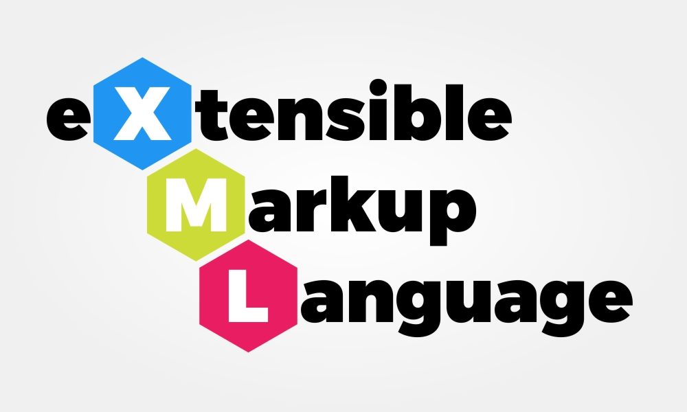
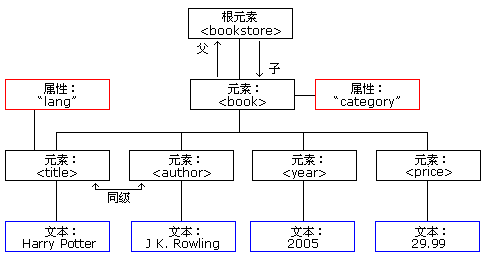

[toc]


# xml教程

## 简介

> 从标准通用标记语言（SGML）中简化修改出来的。


1. 什么是XML

- XML 指可扩展标记语言（EXtensible Markup Language）。
- XML 是一种很像HTML的标记语言。
> XML 被设计用来传输和存储数据，HTML 被设计用来显示数据。
- XML 的设计宗旨是传输和存储数据，而不是显示数据。
- XML 标签没有被预定义。您需要自行定义标签。
- XML 被设计为具有自我描述性。
- XML 是 W3C 的推荐标准


## XML树结构

XML 文档形成了一种树结构，它从"根部"开始，然后扩展到"枝叶"。


1. 一个xml实例
```xml
<?xml version="1.0" encoding="UTF-8"?>
<note>
<to>Tove</to>
<from>Jani</from>
<heading>Reminder</heading>
<body>Don't forget me this weekend!</body>
</note>
```
- 第一行是 XML 声明。它定义 XML 的版本（1.0）和所使用的编码（UTF-8 : 万国码, 可显示各种语言）。
- 下一行描述文档的根元素（像在说："本文档是一个便签"）：
```xml
<note>
```
- 接下来 4 行描述根的 4 个子元素（to, from, heading 以及 body）：
```xml
<to>Tove</to>
<from>Jani</from>
<heading>Reminder</heading>
<body>Don't forget me this weekend!</body>
```

- 最后一行定义根元素的结尾：

```xml
</note>
```

2. XML文档形成一种树结构

- XML 文档必须包含根元素。该元素是所有其他元素的父元素。
- XML 文档中的元素形成了一棵文档树。这棵树从根部开始，并扩展到树的最底端。
- 所有的元素都可以有子元素：

```xml
<root>
<child>
<subchild>.....</subchild>
</child>
</root>
```

> 父、子以及同胞等术语用于描述元素之间的关系。父元素拥有子元素。相同层级上的子元素成为同胞（兄弟或姐妹）。所有的元素都可以有文本内容和属性（类似 HTML 中）。


实例：
```xml
<bookstore>
    <book category="COOKING">
        <title lang="en">Everyday Italian</title>
        <author>Giada De Laurentiis</author>
        <year>2005</year>
        <price>30.00</price>
    </book>
    <book category="CHILDREN">
        <title lang="en">Harry Potter</title>
        <author>J K. Rowling</author>
        <year>2005</year>
        <price>29.99</price>
    </book>
    <book category="WEB">
        <title lang="en">Learning XML</title>
        <author>Erik T. Ray</author>
        <year>2003</year>
        <price>39.95</price>
    </book>
</bookstore>
```





## XML语法

1. XML声明

XML 声明文件的可选部分，如果存在需要放在文档的第一行，如下所示：
```xml
<?xml version="1.0" encoding="utf-8"?>
```
以上实例包含 XML 版本（version="1.0"），甚至包含字符编码（encoding="utf-8"）。
> UTF-8 也是 HTML5, CSS, JavaScript, PHP, 和 SQL 的默认编码。


2. XML文档必须有跟元素

XML 必须包含根元素，它是所有其他元素的父元素，比如以下实例中 root 就是根元素：

```xml
<root>
  <child>
    <subchild>.....</subchild>
  </child>
</root>
```
XML文档由元素构成，每个元素包括开始标签、结束标签和元素内容。


3. 属性

元素可以包含属性，属性提供有关元素的附加信息。属性位于开始标签中，例如：
```xml
<person age="30" gender="male">John Doe</person>
```

4. XML单标签

单标签是指在一个标签中同时包含了开始和结束标签，形式类似于 HTML 中的空元素标签。

```xml
<!-- 使用空元素标签 -->
<exampleTag />

<!-- 使用开始和结束标签，但是不包含任何内容 -->
<exampleTag></exampleTag>
```

5. XML 标签对大小写敏感


6. XML 必须正确嵌套

7. XML 属性值必须加引号


8. 实体引用

在 XML 中，一些字符拥有特殊的意义。我们需要用**实体引用**来代替拥有特殊含义的字符

| 实体引用 | 特殊字符 | 含义 |
| --- | --- | --- |
| \&lt; | < | less than |
| &ft | > | more than |
| \&amp; | & | ampersnad(&符号) |
| &apos; | ' | apostrophe(撇号) |
| \&quot; | " | quotation mark(引号) |

9. XML中的注释

```xml
<!-- This is a comment -->
```

10. XML中，空格会被保留


11. XML中以`LF`存储换行
- windows: 回车符(CR)和换行符(LF)
- Unix,Mac OSX: LF
- 旧的Mac: CR
- XML: LF


## XML元素

XML 元素指的是从（且包括）开始标签直到（且包括）结束标签的部分。一个元素可以包含：
- 其他元素
- 文本
- 属性
- 或混合以上所有...

1. XML元素案例

```xml
<bookstore>
    <book category="CHILDREN">
        <title>Harry Potter</title>
        <author>J K. Rowling</author>
        <year>2005</year>
        <price>29.99</price>
    </book>
    <book category="WEB">
        <title>Learning XML</title>
        <author>Erik T. Ray</author>
        <year>2003</year>
        <price>39.95</price>
    </book>
</bookstore>
```
- \<bookstore> 和 \<book> 都有元素内容，因为他们包含其他元素。
- \<book> 元素也有属性（category="CHILDREN"）。
- \<title>、\<author>、\<year> 和 \<price> 有文本内容，因为他们包含文本。


2. XML元素是可扩展的

```xml
<note>
    <to>Tove</to>
    <from>Jani</from>
    <body>Don't forget me this weekend!</body>
</note>
```

让我们设想一下，我们创建了一个应用程序，可将 \<to>、\<from> 以及 \<body> 元素从 XML 文档中提取出来，并产生以下的输出：

```text
MESSAGE
To: Tove
From: Jani
Don't forget me this weekend!
```


## XML属性

属性（Attribute）提供有关元素的额外信息。


XML 元素 vs. 属性

1. 引入

XML元素
```xml
<person sex="female">
<firstname>Anna</firstname>
<lastname>Smith</lastname>
</person>
```
属性
```xml
<person>
<sex>female</sex>
<firstname>Anna</firstname>
<lastname>Smith</lastname>
</person>
```

- 第一个实例中，sex 是一个属性。在第二个实例中，sex 是一个元素。这两个实例都提供相同的信息。

- 在 HTML 中，属性用起来很便利，但是在 XML 中，您应该尽量**避免**使用属性。如果信息感觉起来很像数据，那么请使用元素吧。

2. XML属性的弊端

- 属性不能包含多个值（元素可以）
- 属性不能包含树结构（元素可以）
- 属性不容易扩展（为未来的变化）


3. 如何选择

元数据（有关数据的数据）应当存储为属性，而数据本身应当存储为元素。


## XML DTD

通过 DTD 验证的XML是"合法"的 XML。

DTD 的目的是定义 XML 文档的结构。它使用一系列合法的元素来定义文档结构：

```xml
<!-- Note.dtd文件 -->
<!DOCTYPE note
[
<!ELEMENT note (to,from,heading,body)>
<!ELEMENT to (#PCDATA)>
<!ELEMENT from (#PCDATA)>
<!ELEMENT heading (#PCDATA)>
<!ELEMENT body (#PCDATA)>
]>
```


使用DTD验证XML文档

```xml
<?xml version="1.0" encoding="ISO-8859-1"?>

<!-- 1. 引入外部文件 -->
***<!DOCTYPE note SYSTEM "Note.dtd">***

<!-- 2. 直接给出-->
<!DOCTYPE note [
  <!ELEMENT note (to,from,heading,body)>
  <!ELEMENT to      (#PCDATA)>
  <!ELEMENT from    (#PCDATA)>
  <!ELEMENT heading (#PCDATA)>
  <!ELEMENT body    (#PCDATA)>
]>

<note>
<to>Tove</to>
<from>Jani</from>
<heading>Reminder</heading>
<body>Don't forget me this weekend!</body>
</note>
```


## 查看xml文件

1. 使用浏览器查看原始的XML文件


2. 使用CSS显示XML文件


3. 使用 XSLT 显示 XML

- 通过使用 XSLT，您可以把 XML 文档转换成 HTML 格式。
- XSLT 是首选的 XML 样式表语言。
- XSLT（eXtensible Stylesheet Language Transformations）远比 CSS 更加完善。
- XSLT 是在浏览器显示 XML 文件之前，先把它转换为 HTML：
    - 当浏览器读取 XML 文件时，XSLT 转换是由浏览器完成的。
    - 在使用 XSLT 来转换 XML 时，不同的浏览器可能会产生不同结果。为了减少这种问题，可以在服务器上进行 XSLT 转换。


# xml and javascript

## XML HTTP Request

XMLHttpRequest 对象用于在后台与服务器交换数据。作用：
- 在不重新加载页面的情况下更新网页
- 在页面已加载后从服务器请求数据
- 在页面已加载后从服务器接收数据
- 在后台向服务器发送数据


创建一个XMLHttpRequest对象

```javascript
// 创建 XMLHttpRequest 对象的语法
xmlhttp = new XMLHttpRequest();

// 旧版本的Internet Explorer（IE5和IE6）中使用 ActiveX 对象
xmlhttp=new ActiveXObject("Microsoft.XMLHTTP");
```

## XML解析器

XML 解析器把 XML 文档转换为 XML DOM 对象(可通过 JavaScript 操作的对象)


1. 解析XML文档

下面的代码片段把 XML 文档解析到 XML DOM 对象中
```javascript
if (window.XMLHttpRequest)
{// code for IE7+, Firefox, Chrome, Opera, Safari
    xmlhttp=new XMLHttpRequest();
}
else
{// code for IE6, IE5
    xmlhttp=new ActiveXObject("Microsoft.XMLHTTP");
}
xmlhttp.open("GET","books.xml",false);
xmlhttp.send();
xmlDoc=xmlhttp.responseXML;
```

2. 解析XML字符串

下面的代码片段把 XML 字符串解析到 XML DOM 对象中

```javascript
txt="<bookstore><book>";
txt=txt+"<title>Everyday Italian</title>";
txt=txt+"<author>Giada De Laurentiis</author>";
txt=txt+"<year>2005</year>";
txt=txt+"</book></bookstore>";

if (window.DOMParser)
{
    parser=new DOMParser();
    xmlDoc=parser.parseFromString(txt,"text/xml");
}
else // Internet Explorer
{
    xmlDoc=new ActiveXObject("Microsoft.XMLDOM");
    xmlDoc.async=false;
    xmlDoc.loadXML(txt);
}
```
> Internet Explorer 使用 loadXML() 方法来解析 XML 字符串，而其他浏览器使用 DOMParser 对象。


3. 跨域访问

出于安全方面的原因，现代的浏览器不允许跨域的访问。

这意味着，网页以及它试图加载的 XML 文件，都必须位于相同的服务器上。


## XML DOM


1. HTML DOM

- TML DOM 定义了访问和操作 HTML 文档的标准方法。
- H所有 HTML 元素可以通过 HTML DOM 来访问。

2. XML DOM

- XML DOM（XML Document Object Model）定义了访问和操作 XML 文档的标准方法。
- XML DOM 把 XML 文档作为树结构来查看。
- 所有元素可以通过 DOM 树来访问。可以修改或删除它们的内容，并创建新的元素。元素，它们的文本，以及它们的属性，都被认为是节点。


3. 加载一个XML文件

下面的实例把 XML 文档（"note.xml"）解析到 XML DOM 对象中，然后通过 JavaScript 提取一些信息：


```xml
<html>
    <body>
        <h1>W3Schools Internal Note</h1>
        <div>
            <b>To:</b> <span id="to"></span><br />
            <b>From:</b> <span id="from"></span><br />
            <b>Message:</b> <span id="message"></span>
        </div>

        <script>
        if (window.XMLHttpRequest)
          {// code for IE7+, Firefox, Chrome, Opera, Safari
          xmlhttp=new XMLHttpRequest();
          }
        else
          {// code for IE6, IE5
          xmlhttp=new ActiveXObject("Microsoft.XMLHTTP");
          }
        xmlhttp.open("GET","note.xml",false);
        xmlhttp.send();
        xmlDoc=xmlhttp.responseXML;
        document.getElementById("to").innerHTML=
        xmlDoc.getElementsByTagName("to")[0].childNodes[0].nodeValue;
        document.getElementById("from").innerHTML=
        xmlDoc.getElementsByTagName("from")[0].childNodes[0].nodeValue;
        document.getElementById("message").innerHTML=
        xmlDoc.getElementsByTagName("body")[0].childNodes[0].nodeValue;
        </script>

    </body>
</html>
```

如需从上面的 XML 文件（"note.xml"）的 \<to> 元素中提取文本 "Tove"，语法是：
```xml
getElementsByTagName("to")[0].childNodes[0].nodeValue
```
请注意，即使 XML 文件只包含一个 \<to> 元素，您仍然必须指定数组索引 [0]。这是因为 getElementsByTagName() 方法返回一个数组。


4. 加载一个XML字符串

下面的实例把 XML 字符串解析到 XML DOM 对象中，然后通过 JavaScript 提取一些信息：

```xml
<html>
    <body>
        <h1>W3Schools Internal Note</h1>
        <div>
        <b>To:</b> <span id="to"></span><br />
        <b>From:</b> <span id="from"></span><br />
        <b>Message:</b> <span id="message"></span>
        </div>

        <script>
        txt="<note>";
        txt=txt+"<to>Tove</to>";
        txt=txt+"<from>Jani</from>";
        txt=txt+"<heading>Reminder</heading>";
        txt=txt+"<body>Don't forget me this weekend!</body>";
        txt=txt+"</note>";
        if (window.DOMParser)
          {
              parser=new DOMParser();
              xmlDoc=parser.parseFromString(txt,"text/xml");
          }
        else // Internet Explorer
          {
              xmlDoc=new ActiveXObject("Microsoft.XMLDOM");
              xmlDoc.async=false;
              xmlDoc.loadXML(txt);
          }
        document.getElementById("to").innerHTML=
        xmlDoc.getElementsByTagName("to")[0].childNodes[0].nodeValue;
        document.getElementById("from").innerHTML=
        xmlDoc.getElementsByTagName("from")[0].childNodes[0].nodeValue;
        document.getElementById("message").innerHTML=
        xmlDoc.getElementsByTagName("body")[0].childNodes[0].nodeValue;
        </script>
    </body>
</html>
```


## HTML页面中显示XML数据

在下面的实例中，我们打开一个 XML 文件（"cd_catalog.xml"），然后遍历每个 CD 元素，并显示HTML 表格中的 ARTIST 元素和 TITLE 元素的值：

```javascript
<html>
    <body>
        <script>
            if (window.XMLHttpRequest)
              {// code for IE7+, Firefox, Chrome, Opera, Safari
              xmlhttp=new XMLHttpRequest();
              }
            else
              {// code for IE6, IE5
              xmlhttp=new ActiveXObject("Microsoft.XMLHTTP");
              }
            xmlhttp.open("GET","cd_catalog.xml",false);
            xmlhttp.send();
            xmlDoc=xmlhttp.responseXML; 
            document.write("<table border='1'>");
            var x=xmlDoc.getElementsByTagName("CD");
            for (i=0;i<x.length;i++)
              { 
              document.write("<tr><td>");
              document.write(x[i].getElementsByTagName("ARTIST")[0].childNodes[0].nodeValue);
              document.write("</td><td>");
              document.write(x[i].getElementsByTagName("TITLE")[0].childNodes[0].nodeValue);
              document.write("</td></tr>");
              }
            document.write("</table>");
        </script>
    </body>
</html>
```

# xml进阶

## XMLM命名空间

在 XML 中，元素名称是由开发者定义的，当两个不同的xml文档使用相同的元素名时，就会发生命名冲突。


1. 使用名称前缀

```xml
<namespace:name>
...
</namespace:name>
```


    1. xmlns属性

当在 XML 中使用前缀时，一个所谓的用于前缀的命名空间必须被定义。

命名空间是在元素的开始标签的 xmlns 属性中定义的。命名空间声明的语法如下。
```xml
xmlns:前缀="URI"
```
> 命名空间 URI 不会被解析器用于查找信息。其目的是赋予命名空间一个唯一的名称。
> > 不过，很多公司常常会作为指针来使用命名空间指向实际存在的网页，这个网页包含关于命名空间的信息。

命名空间被定义在元素的开始标签中时，所有带有相同前缀的子元素都会与同一个命名空间相关联。


2. 默认的命名空间

为元素定义默认的命名空间可以让我们省去在所有的子元素中使用前缀的工作。它的语法如下：
```xml
xmlns="namespaceURI"
```
随后可以不显示指出名称前缀
```xml
<name>
...
</name>
```


3. 实际中使用的命名空间

XSLT 是一种用于把 XML 文档转换为其他格式的 XML 语言，比如 HTML。

在下面的XSLT文档中，非HTML的标签都有前缀xsl，并由此命名空间标识：xmlns:xsl="http://www.w3.org/1999/XSL/Transform"


## XML CDATA 

术语 CDATA 是不应该由 XML 解析器解析的文本数据。

XML 文档中的所有文本均会被解析器解析。只有 CDATA 区段中的文本会被解析器忽略。

CDATA 部分由 "<![CDATA[" 开始，由 "]]>" 结束：

```html
<script>
<![CDATA[
function matchwo(a,b){
    if (a < b && a < 0) then{
        return 1;
    }
    else{
        return 0;
        }
    }
]]>
</script>
```


## XML 编码

- 始终使用编码属性
- 使用支持编码的编辑器
- 确保您知道编辑器使用什么编码
- 在您的编码属性中使用相同的编码

## XML服务器

1. 生成XML
    1. 通过ASP生成XML 
    2. 通过PHP生成
    3. 从数据库生成

2. 在服务器上通过XSLT转换XML


## XML DOM高级

1. 获取元素的值

下面的实例检索第一个 \<title> 元素的文本值

```javascript
txt=xmlDoc.getElementsByTagName("title")[0].childNodes[0].nodeValue;
```

2. 获取属性的值

下面的实例检索第一个 \<title> 元素的 "lang" 属性的文本值
```javascript
txt=xmlDoc.getElementsByTagName("title")[0].getAttribute("lang");
```

3. 改变元素的值

下面的实例改变第一个 \<title> 元素的文本值
```javascript
x=xmlDoc.getElementsByTagName("title")[0].childNodes[0];
x.nodeValue="Easy Cooking";
```

4. 创建新的属性

XML DOM 的 setAttribute() 方法可用于改变现有的属性值，或创建一个新的属性。


```javascript
x=xmlDoc.getElementsByTagName("book");
x[0].setAttribute("edition","first");
```

5. 创建元素


- XML DOM 的 createElement() 方法创建一个新的元素节点。
- XML DOM 的 createTextNode() 方法创建一个新的文本节点。
- XML DOM 的 appendChild() 方法向节点添加子节点（在最后一个子节点之后）。

```javascript
newel=xmlDoc.createElement("edition");
newtext=xmlDoc.createTextNode("First");
newel.appendChild(newtext);

x=xmlDoc.getElementsByTagName("book");
x[0].appendChild(newel);
```

6. 删除元素

```javascript
x=xmlDoc.getElementsByTagName("book")[0];
x.removeChild(x.childNodes[0]);
```


## XML总结

- XML 可用于交换、共享和存储数据。
- XML 文档形成 树状结构，在"根"和"叶子"的分支机构开始的。
- XML 有非常简单的 语法规则。带有正确语法的 XML 是"形式良好"的。有效的 XML 是针对 DTD 进行验证的。
- XSLT 用于把 XML 转换为其他格式，比如 HTML。
- 所有现代的浏览器有一个内建的 XML 解析器，可读取和操作 XML。
- DOM（Document Object Model）定义了一个访问 XML 的标准方式。
- XMLHttpRequest 对象提供了一个网页加载后与服务器进行通信的方式。
- XML 命名空间提供了一种避免元素命名冲突的方法。
- CDATA 区域内的文本会被解析器忽略。


