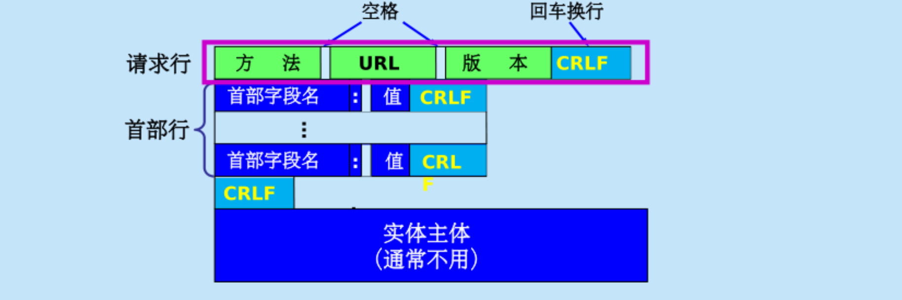

[toc]

作用：精确定义不同主机中的多个**多个应用进程之间**的通信规则  
- 应用程序交换的报文类型，如请求报文和响应报文；
- 各种报文类型的语法，如报文中的各个字段及其详细描述；
- 字段的语义，即包含在字段中的信息的含义；
- 进程何时、如何发送报文，以及对报文进行响应的规则。

# 1. 域名系统DNS(Domain Name System)

- 用来把人们使用的机器名字（域名）转换为IP地址

- 域名采用层次树状结构的命名方法

任何一个连接在互联网上的主机或路由器，都有一个唯一的层次结构的名字，即域名(Domain name)

> 域(domain)  
> - 名字空间中一个可被管理的划分
> - 可以划分为子域，而子域还可以继续划分为子域的子域，这样就形成了顶级域、二级域、三级域等等

域名结构：层次结构，有标号序列组成，各标号之间用点(.)隔开，各标号分别代表不同级别的域名


- DNS是一个联机分布式数据库系统，采用客户服务器方式

一个服务器所负责的管辖的范围叫做区，一个区中的所有节点必须是能够连通的。

- 域名到IP地址的解析是若干个域名服务器程序共同完成的

- 域名服务器程序在专设的节点上运行，运行该程序的机器称为域名服务器

4种域名服务器

1. 根域名服务器

知道所有的顶级域名服务器的域名和IP地址

不管是哪个本地域名服务器，若需要进行域名解析服务，就首先求出域根域名服务器

> 根域名服务器并不直接把域名转换为IP地址（不保存这种信息），而是告诉下一步该找哪个顶级域名服务器进行查询

2. 顶级域名服务器

负责管理在该顶级域名服务器注册的所有二级域名

3. 权限域名服务器

负责一个区的域名服务器

4. 本地域名服务器

当一个主机发出DNS查询请求时，该查询请求报文就发送给本地域名服务器

域名解析过程

1. 递归查询：主机向本地域名服务器查询时使用，若本地域名服务器无法解析，该服务器就以DNS客户端的身份，继续向其他根域名服务器继续发出查询请求报文  
2. 迭代查询：本地域名服务器向根域名服务器查询时使用，要么给出目标IP要么告诉下一个要查询的域名服务器IP地址，本地域名服务器继续后续查询

高速缓存

存放最近使用过的名字以及从何处获得名字映射信息的记录

当为每项内容设置计时器，并处理超过合理时间的项


# 2. FTP文件传输协议

# 3. 远程终端协议TELNET

# 4. 万维网WWW


## 4.1 万维网概述

万维网是一个大规模的、联机式的**信息存储所**

万维网用链接的方法能非常方便的从互联网上的一个站点访问另一个站点

> 分布式超媒体
> 是超文本系统（由多个信息源链接成，是万维网的基础）的扩充
> 超媒体和超文本的区别：文档内容不同，超文本仅包含文本信息，超媒体还包含图像、视频、声音等。

万维网的工作方式

客户服务器方式CS：客户程序向服务器程序发出请求，服务器程序向客户程序送回客户所要的万维网文档。

> 客户程序：浏览器  
> 服务器程序：在万维网文档所驻留的主机上运行，这个计算机也称为万维网服务器。


统一资源定位符URL(Uniform Resource Locater) 
作用：标志分布在整个互联网上的万维网文档，使每一个文档在整个互联网的范围内具有唯一的标识符URL  
格式：
$$<协议>://<主机>:<端口>/<路径>$$


## 4.2 超文本传输协议HTTP

使用TCP连接  
定义了浏览器和万维网服务器通信的格式和规则  

> HTTP不仅传送完成超文本跳转所需的信息，而且也传送任何可从互联网上得到的信息，如文本、超文本、声音和图像等。


HTTP的操作过程

```c
1. 浏览器发出请求，建立TCP连接
2. 浏览器发出请求
3. 服务器返回响应，发出HTTP响应报文
4. 通信结束，释放TCP连接
```

HTTP发展

非持续连接 ->  持续连接（流水线方式/非流水线方式）

> 持续连接：服务器发送响应后仍在一段时间内保持这条连接不放，可以在这条连接上传送后续的HTTP请求报文和响应报文
> 持续链接包含两种模式
> - 非流水线方式：客户在收到前一个响应后才能发出下一个请求
> - 流水线方式：客户在受到前一个响应前就能接着发送新的请求报文


## 4.3 代理服务器

代理服务器(proxy server)又称万维网高速缓存，它代表浏览器发出HTTP请求  

> 若告诉缓存已经存放了所请求对象，则将此对象放入HTTP响应报文中返回给浏览器
> 若未存放，高速缓存就代表浏览器与互联网上的源点服务器建立TCP连接，并发送HTTP请求报文，
> 源点服务器将所请求的对象放在HTTP请求报文中返回给高速缓存，高速缓存先复制该对象到本地存储器中（留待以后用），然后将该对象返回浏览器


## 4.4 HTTP的报文结构

两类报文
- 请求报文
- 响应报文

三个组成部分
- 开始行：区分是请求报文还是响应报文
- 首部行：说明浏览器、服务器或者报文主体的一些信息
- 实体主体：请求报文中一般不用，响应报文也可以没有该字段


请求报文结构


HTTP请求报文的一些方法

| 方法   | 意义    |
|--------------- | --------------- |
| OPTION   | 请求一些选项的信息   |
| GET   | 请求读取有URL所标识的信息   |
| HEAD   | 请求读取URL所标识的信息的首部   |
| POST   | 给服务器添加信息（例如注释）   |
| PUT   | 在指明的URL下存储一个文档    |
| DELETE   | 删除指明URL所标识的资源   |
| TRACE   | 用来进行环回测试的请求报文   |
| CONNECT   | 用于代理服务器   |


响应报文结构

- 状态码：服务器操作完成的状态  

|  状态码  | 意义    |
|--------------- | --------------- |
| 1xx   | 通知信息，如请求收到了或正在进行处理   |
| 2xx   | 成功，如接受或者知道了   |
| 3xx   | 重定向，表示要完成请求还需要采取进一步的行动   |
| 4xx   | 客户的差错，如请求中有错误的语法或不能完成   |
| 5xx   | 服务器的差错，如服务器失效无法完成请求   |

- 短语：解释状态码

> 万维网使用Cookie跟踪HTTP服务器和客户之间传递的状态信息，服务器在后台数据库中新建一个唯一标识cookie字段，在进行http通信时带上该首部进行标识  

## 4.5 万维网的文档

- 静态万维网文档：内容不会改变，简单
- 动态万维网文档：文档的内容由应用程序动态创建
> 文档的内容在浏览器访问万维网服务器时才由应用进程动态创建  
> > 通用网关CGI(Common Gateway Interface)：定义动态文档应当如何建立  
> > 本质为一个CGI脚本
- 活动万维网文档：由浏览器改变文档的内容

把屏幕连续更新的工作转移到浏览器端  
每当浏览器请求一个活动文档时，服务器就返回一段程序副本（例如Java中使用小应用程序applet）在浏览器运行  

## 4.6 信息检索系统

- 全文检索搜索引擎
    - 通过搜索软件到互联网上的各网站收集信息
    - 建立在线索引数据库
    - 查询时输入关键字即可在索引数据库中查询

- 分类目录搜索引擎
    - 利用各网站向搜索引擎提供的关键字和网站描述进行分类
    - 查询时只需要按照分类搜索

- 元搜索引擎（搜索引擎上的搜索引擎）
    - 把用户提交的检索发送到多个独立的搜索引擎上，并把结果统一处理

> Google搜索技术  
> 对搜索结果按重要性排序  
> 对链接的数目进行加权统计，来自重要网站的连接，其权重较大。  

# 7. 邮件

# 8. 动态主机配置协议DHCP

动态主机配置协议DHCP(Dynamic Host Configuration Protocl)提供了即插即用联网的机制，允许一台计算机加入网络和自动获取IP地址而不需要手动配置

连接到互联网的计算机的协议软件需要正确配置的参数包括
- IP地址
- 子网掩码
- 默认路由器的IP地址
- 域名服务器的IP地址

步骤
```c
1. 需要IP地址的主机在启动时向DHCP服务器广播发现报文(DHCPDISCOVER),成为DHCP客户
2. DHCP服务器回答此报文 //一般一个网络中至少有一个DHCP中继代理，配置了DHCP服务器的IP信息
    1. 首先在数据库中查找该计算机的配置信息，若找到则返回；
    2. 否则从IP地址池中取一个地址分配给该计算机，回复提供报文(DHCPOFFER)
```

## 8.1 租用期

DHCP服务器分配给DHCP客户端的IP地址是临时的，这段时间成为租用期。

```c
//DHCP客户更具服务器所提供的租用期$T$设置两个计时器$T_1=0.5T$和$T_2=0.875T$ 
T1 = 0.5*T;
T2 = 0.875*T;
if(now = T1){
    DHCP发送请求报文DHCPREQUEST，要求更新租用期;
    if(DHCP服务器同意){
        发送确认报文DHCPPACK；
        DHCP客户端得到新的租用期间；
    }
    else if(DHCP服务器不同意){
        发送否认报文DHCPNACK；
        DCHP客户立即停止使用原来的IP地址，重新申请IP地址；
    }
    else if(DHCP服务器无响应){
        if(now == T2){
            重新发送请求报文DHCPREQUEST;
        }
    }
}
```

> DHCP客户可随时提前终止租用期，只需向DHCP服务器发送释放报文DHCPRELEASE

