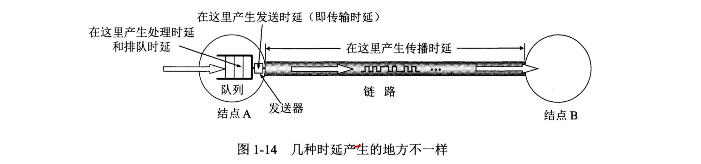

本章内容：

1. 互联网边缘部分和核心部分的功能，其中包含分组交换的概念。
2. 计算机网的性能指标。
3. 计算机网络分层次的体系结构，包含协议和服务的概念。

# 1. 互联网概述

## 1.1 网路的网络

计算机网络由若干节点（可以是计算机、集线器、交换机或路由器等）和连接这些节点的链路组成。

> 小的计算机网络之间还可以通过路由器连接，这就构成了一个覆盖范围更大的计算机网络，这就是互连网，因此互连网是网络的网络。

## 1.2 三个阶段

> internet（互连网）是一个通用名词，泛指由多个计算机网络互连而形成的计算机网络。  
> Internet（互联网）是一个专用名词，指当前全球、最大的、开放的、由众多网络相连而成的特定互连网。

1. 单个网络（分组交换网络）APRANET向互连网发展的过程

2. 三级结构的互联网

分为主干网、地区网和校园网。覆盖了美国的主要大学和研究所。

3. 多层次ISP结构的互联网

互联网不再归美国政府管辖，出现“互联网服务提供者ISP(Internet Service Previder)”，其是一个进行商业活动的公司，可以从互联网管理机构申请到很多IP地址，用于租售。

互联网交换点IXP(Internet eXchange Point)

IXP常采用工作在数据链路层的网络交换机，这些网络交换机都用局域网互连起来用以传输分组。

> IXP允许两个网络直接相连并交换分组，而不需要通过地三个网络来转发分组。  

# 2. 互联网组成

## 2.1 边缘部分

所有连接在互联网上的主机组成,用户直接使用

计算机之间通信：主机A的某个进程和主机B上的另外一个进程进行通信。

两种通信方式：
1. 客户-服务端方式（C/S方式）
2. 对等方式（P2P方式）

## 2.2 核心部分

由大量网络和连接这些网络的路由器组成,为边缘部分提供服务。

使边缘部分中的任何一台主机都能向其他主机通行。其中起特殊作用的是路由器(router),它是一种专有计算机，任务是转发收到的分组。

1. 电路交换：建立连接（占用通信资源）->通话（一直占用通信资源）-> 释放连接（归还通信资源）  
> 计算机数据是突发式的出现在传输线路上，线路上传送数据的时间往往不到10%，线路的传输效率的。

2. 分组交换：存储转发技术

# 3. 计算机网络的类别

## 3.1 计算机网络的定义

计算机网络主要是一些通用的、可编程的硬件互连而成，而这些硬件并非专门用来实现某一特定目的（例如，传送数据或视频信号）。

## 3.2 计算机网络的类别

- 网络的作用范围分类：
1. 广域网WAN(Wide Area Network)
2. 城域网MAN(Matropolitan Area Network)：范围一般是一个城市
3. 局域网LAN(Local Area Network)
4. 个人区域网PAN(Persional Area Network)：个人工作的地方把属于个人使用的电子设备用无线技术连接起来的网络

- 按照网络的使用者进行分类

1. 公用网：所有愿意按电信公司规定缴纳费用的人都可以使用这种网络
2. 专用网：某个部门为满足本单位特殊业务工作而建立的网络

- 接入网AN(Access Network)  
接入网就是某个用户端系统到互联网的第一个路由器（边缘路由器）之间的一种网络。

# 4. 计算机网络的性能

1. 速率：数据的传送速率，单位是bit/s（比特每秒）
2. 带宽
    1. 频域：某个信号具有的频带宽度（所包含的频率成分所占据的频率范围）。
    2. 时域：单位时间内网络中某信道所能通过的“最高数据率”
3. 吞吐量：单位时间内通过某个网络的实际的数据量
4. 时延：数据从一端传送到另一端所需的时间
    1. 发送时延：发送数据帧所需要的时间
    2. 传播时延：电磁波在信道中传播一定距离需要花费的时间
    3. 处理时延：主机或路由器收到分组后进行处理的时间
    4. 排队时延：在路由器队列中等待处理和转发所需的时间

5. 时延带宽积：传播时延 X 带宽
> 表示在发送的第一个比特即将到达终点时，发送端已发送的数据量
6. 往返时间RTT：两端主机双向交互一次所需的时间
7. 利用率
    $$D = D_0 / (1 - U )$$
    > $D_0$表示网络空闲时间的时延，D表示网络当前的时延，U表示利用率。
    > 利用率到达50%时时延就会加倍

# 5. 计算机网络体系结构

## 5.1 网络协议

为网络中的数据交换而建立的规则成为网络协议(network protocol),由下面三部分组成：
1. 语法：即数据与控制信息的结构或格式；
2. 语义：需要发出何种控制信息，完成何种动作以及做出何种响应；
3. 同步：时间实现顺序的详细说明。

## 5.2 具有五层协议的体系结构

- 应用层  
通过引用进程间的交互来完成特定网络应用，应用层协议定义的是应用进程间通信和交互的规则。

- 运输层  
运输层的任务就是负责向两台主机中进程之间的通信提供通用的数据传输服务，提供端(口)到端(口)的通信  
负责向两台主机中的进程之间的通信提供通用的数据传输服务。
    - 传输控制协议TCP
    - 用户数据报协议UDP

- 网络层  
负责为分组交换网上的不同主机提供通信服务,发送数据时，网络层把运输层产生的报文段或用户数据报封装成分组或包进程传送。

- 数据链层  
在两个相邻节点间的链路上传输数据时，数据链路层将网络层交下来的IP数据组装成帧，在两个相邻结点间的链路上传送帧。

- 物理层
负责在两台相邻主机上传输比特流

# 6. 总结
- 计算机网络把许多计算机连接在一起，而互连网则把许多网络连接在一起，是网络的网络
- 以小写字母i开始的internet（互连网）是通用名词，它泛指由多个计算机网络互连而成的网络。这些网络之间的通信协议可以是任意的
- 以大写字母I开始的Internet（互联网）是专用名词，它指当前全球最大的、开放的、由众多网络相互连接而成的特定互连网，并采用TCP/IP协议族作为通信协议，且其前生为美国的ARPANET
- 互联网现在采用存储转发的分组交换技术，以及三层ISP结构
- 互联网按工作方式可划分为边缘部分和核心部分，主机在网络的边缘部分，其作用是进行信息处理。路由器在网络的核心部分，其作用是按存储转发方式进行分组交换
- 计算机通信是计算机中的进程（即运行这的程序）之间的通信。计算机网络采用的通信方式是客户-服务器方式和对等连接方式（P2P方式）
- 客户和服务器是指通信中所涉及的应用程序。客户是服务请求方，服务器是服务提供方
- 按作用范围的不同，计算机网络可分为广域网WAN、城域网MAN、局域网LAN和个人区域网PAN
- 计算机网络最常用的性能指标是：速率、带宽、吞吐量、时延（发送时延、传播时延、处理时延、排队时延）、时延带宽积、往返时间和信道（或网络）利用率
- 网络协议即协议，是为了进行网络中的数据交换而建立的规则。计算机网络的各层及其协议的集合，成为网络的体系结构
- 五层协议的体系结构由应用层、运输层、网络层、数据链路层和物理层组成。运输层最重要的是TCP或UDP协议，而网络层最重要的协议的是IP协议
