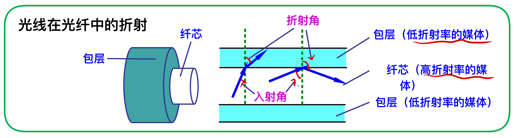

本章内容：

1. 物理层的主要任务；
2. 几种常用的信道复用技术；
3. 几种常用的宽带接入技术，主要是ADSL和FTTx

# 物理层的基本概念

物理层考虑的是怎样才能连接各种计算机的传输媒体上传输数据的比特流，而不是指具体的传输媒体。
> 尽可能疲敝掉各种传输媒体和通信手段的差异，使物理层上面的数据链路层感受不到这些差异。

物理层的主要任务可描述为确定与传输媒体的接口有关的一些特性：
1. 机械特性：指明接口所用接线器的形状与尺寸、引脚数目和排列等。
2. 电气特性：指明在接口电缆的各条线上出现的电压的范围；
3. 功能特性：指明某条线上出现的某一电平的电压的意义；
4. 过程特性：指明对于不同功能的各种可能时间的出现顺序。

# 数据通信的基本知识

## 数据通信系统的模型

## 有关信道的几个基本概念

信道一般用来表示向某一个方向发送信息的媒体。

从通信双方信息交互的方式可分为以下三种基本格式：
1. 单向通信（单工通信）
2. 双向交替通信（半双工通信）
3. 双向同时通信（全双工通信）

### 调制

来自信源的信号称为基代信号，其往往包含较多的低频成分甚至直流成分，许多信道不能传输这种低频分量或者直流分量，为了解决这一问题需要对基带信号进行调制。

- 基带调制（编码）  
把数字信号转换成另一种形式的数字信号

> 曼切斯特编码和差分曼切斯特编码可以从信号波形本身提取信号的时钟频率，称为同步能力

- 带通调制  
使用载波进行调制，把基带信号的频率范围搬移到较高的频带，并转换为模拟信号

> 正交振幅调制QAM：一种多元制的振幅相位混合调制方法，将12种相位和2种振幅进行组合，达到16中组合，即16种码元。
> 码元：在使用时间域的波形表示数据信号时，代表不同离散数值的基本波形，表示信息的最小单位。

## 信道的极限容量

奈氏准则
$$码元传输的最高速率 = 2*W（码元/秒）$$
> W表示信道的带宽（Hz）
> 若超过该速率，则会出现码间串扰现象
> 码间串扰：接收端收到的信号波形失去了码元间清晰的的界限

信噪比  
信号的平均功率和噪声的平均功率之比
$$信噪比(dB) = 10*log_{10}(S/N)$$

香农公式：
$$信道的极限信息传输速率C = W*log_2(1+S/N)$$
> W为信道的带宽(Hz),S为信道内所传信号的平均功率，N为信道内的高斯噪音功率  
> 表明信道的带宽或信噪比越大，信号的极限传输速率就越高

提高信息传输速率的方法：用编码的方式

# 物理层下的传输媒体

传输媒体是数据传输系统中在发送器和接收器之间的物理通路。

## 引导型传输媒体

1. 双绞线  

两根互相绝缘的铜导线并排放在一起，然后用规则的方法绞合起来就构成了双绞线。

绞合程度越高，可用的数据传输率越高

- 无屏蔽双绞线UTP
    - 无屏蔽层
    - 价格较便宜
- 屏蔽双绞线STP
    - 带屏蔽层
    - 都必须有接地线

2. 同轴电缆
- 由内导体铜质芯线（单股实心线或多股绞合线）、绝缘层、网状编制的外导体屏蔽层以及保护塑料外层所组成。

- 具有很好的抗干扰特性，广泛用于传输高速率的数据。

3. 光缆
- 光缆是光纤通信的传输媒体，通过传递光脉冲来进行通信

- 发送端：要有光源（发光二极管、半导体激光器等），在电脉冲作用下产生出光脉冲。
- 接收端：要有光检测器，利用光电二极管做出，在坚持到光脉冲时还原出电脉冲。

> 入射角足够大时，会产生全反射，光沿直线传播。

- 多模光纤：存在多条不同角度入射的管线在一条光纤中传输，适合近距离传输。
- 单模光纤：其直径减小到只有一个光的波长，可使光线一直向前传播，而不会产生多次反射；制造成本高，光源需要昂贵的半导体激光器。
## 非引导型媒体

# 信道复用技术

复用器将各个用户的数据进行复用，将所有用户的数据放入高速信道中进行传送 
分用器将告诉信道传送来的数据进行分用，分别交到对应的用户

1. 频分复用：用户在同样的时间占用不同的频率带宽
2. 时分复用：用户在不同的时间占用相同的频率带宽

> 统计时分复用：与时分复用不同，统计时分复用不是固定分配时间间隙，而是按需动态地分配时间空隙，可提高线路的利用率。

3. 波分复用：光的频分复用
4. 码分复用：用户在同样的时间时使用相同的频带，各个用户使用经过特殊挑选的不同码形，因此不会造成干扰。

> 码分多纸CDMA(Code Division Mulitple Access)原理：  
> 将一个比特时间划分为m个短的间隙，称为码片。  
> 为每个站派一个唯一的m bit码片序列  
> 每个站分配的码片序列各不相同，而且必须相互正交。
> > - 码片序列和自己的规格化内积为1,和自己的反码的规格化内积为-1  
> > - 码片序列和与其正交的码片序列规格化内积为0  

> 发送比特1就是发送自己的m bit码片序列，发送比特0就是发送自己码片序列的反码。    
> 利用正交的性质，将目标站的码片序列与信道中序列进行规格化内积，可过滤其余站发送的码片序列，复原目标站的码片序列

