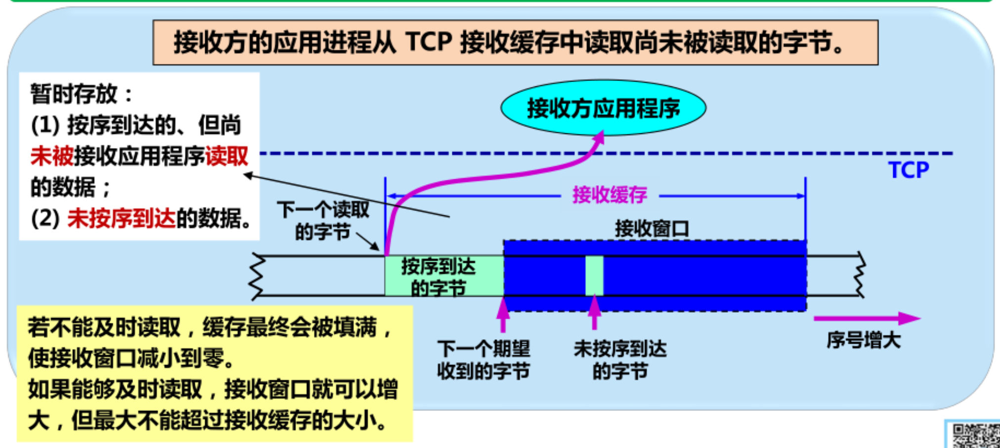
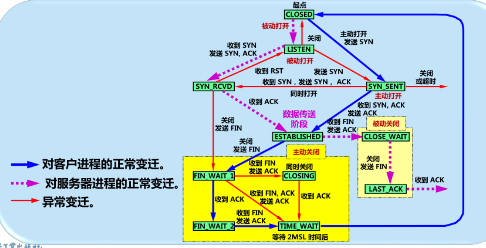

[toc]


# 1. 运输层协议概述

## 1.1 进程之间的通信

地位：用户功能层的最底层，通信部分的最高层  
运输层提供应用程序间的逻辑通信(提供端口到端口的通信)

## 1.2 运输层的两个主要协议

- 用户数据报协议UDP(User Datagram Protocol)
    - 传输数据前不需要先创立连接
    - 受到UDP报后，不需要给出任何确认
    - 不提供可靠交付，但是一种有效的方式
- 传输控制协议TCP(Transmission Control Protocol)
    - 提供可靠、面向连接的运输服务
    - 不提供广播或多播服务
    - 开销较大

运输协议数据单元  
两个对等运输实体在通信时传送的数据单元叫做**运输协议数据单元TPDU**(Transport Protocol Data Unit)
> TCP中是TCP报文段，UDP中是UDP报文或用户数据报 

## 1.3 运输层的端口

运输层的复用和分用
- 复用：应用程序都可以通过运输层再传送到网络层
- 分用：运输车从网络层受到发送给应用进程的数据后,必须分别交付给指定的各应用程序（使用协议端口号）

端口号用一个16位的端口号进行标志  
端口号只具有本地意义，只是为了标志本计算机应用层中的各进程  

两大类、三种类型的端口
- 服务器使用的端口号：0-49151
    - 熟知端口：0-1023
        > 全球通用端口号，IANA负责分配
    - 登记端口：1024-49151
        > 在IANA登记
- 客户端使用的端口：49152-65535
    > 短暂接口，通信结束后，被系统回收

# 2. 用户数据报协议UDP

UDP只在IP数据报服务上增加了以下功能：
- 复用和分用
- 差错检测

特点
- 无连接
- 使用尽最大努力交付
- 面向报文
    - 发送方UDP对应用层交下来的报文不合并也不拆分,照样发送
    - 接收方UDP对网络层上交的报文去除首部后原封不动的交付到上层的应用程序
        > 应用程序必须选取合适大小的报文，避免网络层的切片，或者IP数据报的首部长度相对较大
- 没有拥塞控制
- 支持一对一、一对多、多对一、多对多等交互通信
- 首部开销小，只有八字节
> UDP通信的特点：简单方便，但不可靠


UDP的首部格式


检验和

> UDP的检验和是把首部和数据部分一起都检验


# 3. 传输控制协议TCP概述

## 3.1 特点  
- 面向连接
- 每一条TCP连接只能有两个端点，一对一的
    > TCP连接的端口：套接字(socket)或插口
- 可靠交付
- 全双工通信
- 面向字节流
    > 虽然应用程序和TCP的交互是一次一个数据块，但TCP把应用程序交下来的数据看成仅仅是一连串无结构的字节流  
    > TCP不关心应用程序一次把多长的报文发送到TCP缓存中，而是更具对方给出的**窗口值**和当前网络的**拥塞程度**来决定一个报文段应包含多少字节。

## 3.2 TCP的连接


TCP连接的端口：套接字(socket)或插口。

$$套接字socket = (IP地址：端口号)$$

$$TCP连接::=\{socket_1,socket_2\} = \{(IP_1:port_1),(IP_2:port_2)\}$$
> 每一条TCP连接唯一的被通信两端的两个端口（即两个套接字）所确定


# 4. 可靠传输的工作原理

理想传输条件的特点
- 传输信道不产生差错
- 不管发送方以多快的速度发送数据，接收方总是来得及处理受到的数据

## 4.1 停止等待协议

要点：停止等待，暂存，编号，超时重传

### 4.1.1 原理

- 无差错情况  
每发送完一个分组就停止发送，等待对方确认，收到确认后再发送下一个分组

- 出现差错
    - 接收方受到出现了差错的报文，丢弃该报文，其他什么也不做
    - 报文在传输过程中丢失，接收方什么也不错
> 发送方为每一个已发送的分组设置一各**超时计时器**，计时器规定时间内没有受到接收方的确认ACK,就重发该分组

- 迟到的分组  
1. 接收方对报文的确认ACK迟到了，因此发送方在超时计时器到期后重传报文  
2. 接收方会收到重复的报文，丢弃重复的报文，并重传确认分组ACK  
3. 发送方会收到重复的确认ACK,丢弃重复的确认报文。

### 4.1.2 缺点


解决办法：流水线传输


> 连续ARQ协议和滑动窗口协议采用流水线传输方式

## 4.2 连续ARQ协议

- 发送窗口：发送方维持一个发送窗口，位于发送窗口内的分组都可以被连续发送出去，而不需要对方的确认
- 发送窗口滑动：发送方每收到一个确认，就把发送窗口向前滑动一个分组的位置
- 累积确认：接收方对按序到达的最后一个分组发送确认，表示：到这个分组为止的所有分组都已经正确受到

连续ARQ协议使用Go-Back-N（回退N）

Go-Back-N（回退N）：表示需要再退回来重传已发送过的N个分组。


# 5. TCP报文段的首部格式

TCP虽然是面向字节流的，但TCP传送的数据单元确实报文段  


- 序号：TCP连接中传送的数据流中的每一个字节都有一个序号。序号字段的值指的是本报文段所发送的数据的第一个字节的序号。
- 确认号：期望收到对方的下一个报文段的数据的第一个字节的序号。
- 数据偏移：即首部长度，单位是4字节
- 保留：保留为今后用，目前置0
- URG：为1时，表面紧急指针字段有效，传送优先级高
- ACK：为1时，确认号字段有效
- PSH：为1时，就尽快发送数据，而不是等整个缓存满了才发送
- RST：为1时，复位，释放连接后重新建立连接
- SYN：为1时，表面这是一个连接请求或连接接受报文
    - ACK=0：连接请求报文
    - ACK=1：连接接受报文
- FIN：为1时，用来释放连接
- 窗口：窗口值告诉对方，从本报文首部中的确认位算起，接收方目前欲寻对方发送的数据流（以字节为单位）
- 检验和：检验的范围包括首部和数据两部分，计算检验和时，要在TCP报文段的前面加上12字节的伪首部  
- 紧急指针：指出本报文段中紧急数据的字节数（紧急数据结束后就是普通数据）
- 选项：长度可变，最多40各字节
- 填充：使整个TCP首部长度是4字节的整数倍

# 6. TCP可靠传输的实现

## 6.2 以字节为单位的滑动窗口

发送缓存和发送窗口


接受缓存和接收窗口


强调三点：
- 发送窗口是根据接受窗口设置的，由于有一定的时间滞后，两个窗口并不总是一样大
- TCP没有规定对不按序到达的数据应如何处理，通常是先存放在接受窗口，等补全所缺少的字节后在按序上交
- TCP接收方必须有累积确认的功能，以减小开销

## 6.3 超时重传时间的选择

加权平均往返时间$RTT_s$（平滑的往返时间）

$$新的RTT_s=(1-a)*(旧的RTT_s)+a*(新的RTT样本)$$
> 推荐的a值为0.125


超时重传时间RTO

RTO应略大于$RTT_s$

$$RTO = RTT_s+4*RTT_D$$
$$新的RTT_s = (1-a)*(旧的RTT_D)+a*|RTT_s-新的RTT样本|$$
> 推荐的a值是0.25


RTT往返时间的测量相当复杂

超时重传报文段后，如何确定此确认报文段是对原来报文段的确认还是对重传报文段的确认？

```c
//Karn算法
在计算往返时间RRT时，只要报文段重传了，就不采用其往返时间样本
//新问题：当报文段的时延突然增大很多，超时重传时间无法更新，造成很多不必要的重传 

//修正后的Karn算法
新的RTO = a * (旧的RTO)
//a推荐取2 
//当不再发送重传时，才更具报文段的往返时延更新RRT和RTO
```

## 6.4 选择确认SACK

在首部的可选项中添加SACK选项，以便报告收到的不连续的字节块的边界  
原来首部中确认号用法不变（累计确认）  

例子🌰

> 弥补**累积确认**的不足


# 7. TCP的流量控制

流量控制：让发送方的发送速率不要太快，使接收方来得及接受

## 7.1 使用滑动窗口实现流量控制

持续计时
```c
只要TCP连接的一方收到对方的零窗口通知，就启动该持续计时器  
若持续计时器设置的时间到期，就发送一个 零窗口探测报文段，对方在确认这个探测报文段时给出当前窗口值
如果不是零，可打破死锁的僵局，否则重新设置计时器
```

## 7.2 TCP的传输效率

控制TCP发送报文的时机
- 当缓存中存放的数据达到最大报文段长度MSS字节长度后，组装成报文发送
- 发送方应用程序制定push操作
- 发送方的计时器期限到了，把当前缓存已有的缓存数据发送

糊涂窗口综合征

- 发送方
发送方TCP每次收到一字节数据后就发送


- 接收方
接收方应用进程消耗数据太慢，例如一次只读取一个字节
> 让接收方等待一段时间，使得或者接受缓存中已有空间容纳一个最长的报文段，或者等到接受缓存已有一半空闲的空间时就发送确认报文，并通知当前窗口大小。


# 8. TCP的拥塞控制

## 8.1 拥塞控制的一般原理

拥塞：某段时间，若对网络中某资源的需求超过了该资源所能提供的可用部分，网络的性能就要明显变差，整个网络的吞吐量将随输入的增大而下降


拥塞控制和流量控制的区别
- 拥塞控制：防止过多的数据注入到网络中，防止网络中的路由器或链路过载（全局控制）
- 流量控制：抑制发送端发送数据的速率，以使接收方来得及接受（点对死通信量的控制）

## 8.2 TCP的拥塞控制

TCP发送端将维持一个**拥塞窗口cwnd**(Congestion Window),其取决于网络的拥塞程度动态变化

$$真正的发送窗口值= Min(接收方的发送窗口，拥塞窗口值)$$


判断拥塞
- 超时重传计时器
    > 因传输出差错而丢失分组的几率很小
- 收到3个重复的确认


TCP拥塞控制算法

```c
1. 慢开始
目的：探测网络的负载能力或拥塞程度
原理：有小到大逐渐增大注入网络中的数据字节，即由小到大逐渐增大拥塞窗口数值  
- 拥塞窗口cwnd
    初始值存在两种设置方法
    - 1至2个最大报文段MSS（旧标准）
    - 2至4个最大报文段MSS
- 慢开始门限ssthresh
    防止拥塞窗口增长过大引起网络拥塞
    cwnd < ssthresh时，使用慢开始算法
    cwnd > ssthresh时，停止使用慢开始算法，改用拥塞避免算法
    cwnd = ssthresh时，两者都可

算法：拥塞窗口增大,每收到一个对新的报文段的确认
          拥塞窗口cwnd每次的增加量 = min(N,SMSS)
          //N：原先未被确认的、但现在收到的确认报文段所确认的字节数
          //SMSS:发送方的最大报文段SMSS(Sender Maximum Segment Size)的数值
```


```c
//解决重传定时器超时问题
2. 拥塞避免
目的：让拥塞窗口cwnd缓慢地增大，避免出现拥塞  
原理：缓慢加大拥塞窗口大小
算法：每经过一个往返时间RTT（不管其中收到多少确认）,发送方的拥塞窗口cwnd++

无论是慢开始阶段还是在拥塞避免阶段，只要发送端判断网络出现拥塞:
    1. ssthresh = max(cwnd/2,2)
    2. cwnd = 1 
    3. 执行慢开始算法
```

```c
//解决受到三个重复的确认
3. 快重传
目的：让发送方尽早知道发生了个别报文段的丢失
原理：发送方只要联系收到三个重复的确认，就立刻进行重传，这样就不会出现超时  


4. 快恢复
当发送端受到三个重复的确认时，不执行慢开始算法，而是执行快恢复算法：
    1. ssthresh = cwnd/2 
    2. cwnd = ssthresh 
    3. 执行拥塞避免算法
```

> 发送窗口的上限值=min{rwnd,cwnd}  
> rwnd：接收方的接受窗口的大小  
> cwnd：网络拥塞窗口大小  


## 8.3 主动队列管理AQM

主动：不要等路由器的队列长度已经达到最大值时才不得不丢弃后面的分组，而是在队列长度达到某个值得警惕的数值时（即当网络拥塞有了某些拥塞征兆时）,就主动丢弃到达的分组  
```c
//随即早期检测RED  
- 队列长度最小门限THmin
- 队列长度最大门限THmax

for each 到达的分组{
    计算平均队列长度Lav;
    if(lav < THmin){
        将分组加入队列
    }
    else if(lav > THmax){
        将分组丢弃
    }
    else {
        以某一概率p丢弃分组
    }
}
```

# 9. TCP的运输连接管理

## 9.1 TCP的连接建立

采用三报文握手：在客户和服务器之间交换三个TCP报文段，以防止已失效的连接请求报文突然有传送到了，而产生TCP连接建立错误
1. A的TCP向B主动发出连接请求报文段，其中首部的SYN=1,并选择序号seq=x,表明传送数据时的第一个数据字节的序号是x。
    > SYN报文段不能携带数据，但要消耗掉一个序号
2. B的TCP受到请求报文段后，同意则发送确认，设置首部SYN=1,ACK=1,确认号ack=x+1,自己选择的序号seq=y
    > 不能携带数据，同样消耗掉一个序号
3. A收到此报文段后向B给出确认，其ACK=1,ack=y+1，连接建立
    > ACK报文段可以携带数据。如果不携带数据，则不消耗序号

## 9.2 TCP的连接释放

四报文握手
1. A发出连接释放报文段，其首部FIN=1,seq=u,并停止发送数据，主动关闭TCP连接,等待B确认
    > FIN报不携带数据，消耗序号
2. B发出确认ACK=1,确认号ack=u+1,seq=v,TCP连接处于半关闭状态，从A到B这个方向的连接关闭了
3. 若B已经没有要向A发送的数据，B发送连接释放报文，其首部FIN=1,ACK=1,确认号ack=u+1,序号seq=2
4. A收到连接释放报文段后，必须发出确认，ack=1,确认号ack=w+1,序号seq=u+1
> 其后还需要等待2MSL的时间TCP连接才释放
> - 保证发送的最后一个ACK报文段能到达B 
> - 防止”已失效的连接请求报文段“出现在本连接中

## 9.3 TCP的有限状态机




# 10. 本章的重要概念

- 运输层提供应用进程间的逻辑通信，即运输层之间的通信并不是真正在两个运输层之间直接传送数据。运输层向应用层屏蔽了下面网络的细节（如网络拓扑、所采用的路由选择协议等），它使应用进程看见的就是好像在两个运输层实体之间有一条端到端的逻辑通信信道
- 网路层为主机之间提供逻辑通信，运输层为应用进程之间提供端到端的逻辑通信
- 运输层有两个主要的协议：TCP和UDP.他们都有复用和分用，以及检错的功能。当运输层采用面向连接的TCP协议时，尽管下面的网络是不可靠的（只提供尽最大努力交付），但这种逻辑通信信道就相当于一条全双工通信的可靠信道。当运输层采用无连接的UDP协议时，这种逻辑通信信道仍是一条不可靠信道
- 运输层用一个16位端口号来标识一个端口。端口只具有本地意义，它是为了标志本计算机应用层中各个进程在和运输层交互时的层间接口。在互联网的不同计算机中，相同的端口号是没有关联的
- 两台计算机中的进程要相互通信，不仅要知道对方的IP地址（为了找到对方的计算机），还要知道对方的端口号（为了找到对方计算机中的应用进程）
- 运输车的端口号分为服务器使用的端口号（0～1023指派给熟知端口，1024～49151是登记端口）和客户端使用的端口号（49152～65536）
- UDP的主要特点是：1.无连接；2.尽最大努力交付；3.面向报文；4.无拥塞控制；5.支持一对一，一对多，多对一和多对多的交互通信；6.首部开销小（只有四个字段：源端口，目的端口，长度，检验和）
- TCP的主要特点：1.面向连接；2. 每一条TCP连接只能是点对点的（一对一）；3.提供可靠交付；4.提供全双工通信；5.面向字节流
- TCP用主机的IP地址加上主机的端口号作为TCP连接的端点。这样的端点叫做套接字(socker)或插口。套接字用（IP地址：端口号）来表示
- 停止等待协议能够在不可靠的传输网络上实现可靠的通信。每发送完一个分组就停止发送，等待对方的确认。在受到确认后再发送下一个分组。分组需要编号
- 超时重传是指只要超过了一段时间人没有受到确认后，就重传前面发送过的分组（认为刚刚发送的分组丢失了）。因此每发送一个分组就要设置一个超时计时器，其重传时间应比数据在分组传输的平均往返时间更长一些。这种自动重传方式常称为自动重传请求ARQ
- 在停止等待协议中，若接收方收到重复分组，就丢弃该分组，但同时还要发送确认
- 连续ARQ协议可以提高信道利用率。发送方维持一个发送窗口，凡位于发送窗口内的分组都可以连续发送出去，而不需要对方的确认。接收方一般采用累计确认，对按序到达的最后一个分组发送确认，表面到这个分组为止的所有分组都已正确收到
- TCP报文段首部的前20各字节是固定的，后面有4N字节是根据需要而增加的选项（N是整数）。在一个TCP连接中传送的字节流中的每一个字节都要按序编号。首部中的序号字段值指出本报文段所发送的数据的第一个字节的序号
- TCP首部中的确认号是期望收到对方的下一个报文段的第一个数据字节的序号。若确认号是N，则表明：到序号N-1所有的所有数据都已正确收到
- TCP首部的窗口字段指出了现在允许对方发送的数据量。窗口值是经常动态变化的
- TCP使用滑动窗口机制。发送窗口里面的序号表示允许发送的序号。发送窗口后沿的后面部分表示已发送且已收到了确认，而发送窗口前沿的前面部分表示不允许发送。发送窗口后沿的变化情况有两种可能，即不懂（没有受到新的确认）和前移（收到了新的确认）。发送窗口前沿通常是不断向前移动
- 流量控制就是让发送方的发送速率不要太空，让接收方来的及接收
- 在某段时间，若对网络中某一资源的需求超过了该资源所能提供的可用部分，网络的性能就要变坏。这种情况叫拥塞。拥塞控制就是防止过多的数据注入到网络中，这样可以使网络中的路由器或链路不会过载
- 流量控制是一个端到端的问题，TCP的发送方要维持一个拥塞窗口cwnd的状态变量。拥塞窗口的大小取决于网络的拥塞程度，并且动态的变化。发送方要让自己的发送窗口取为拥塞窗口和接收方的接收窗口中较小的一个
- TCP的拥塞控制采用了四种算法，即慢开始、拥塞控制、快重传和快恢复。在网络层，也可以使路由器采用适当的分组丢弃策略（如主动队列管理AQM），以减轻网络拥塞的发生
- 运输连接有三个阶段：连接建立、数据传送和连接释放
- 主动发起TCP连接建立的应用进程叫客户，而被动等待连接建立的应用进程叫做服务器。TCP的连接建立采用三报文握手。服务器要确认客户的连接请求，然后客户要对服务器的确认进行确认
- TCP的连接释放采用四报文握手机制。任何一方可以在数据传送结束后发出连接释放的通知，待对方确认就进入半关闭状态。当另一方也没有数据再发送时，则发出连接释放通知，对方确认后就完全关闭了TCP连接。
