本章最重要的内容：
1. 数据链路层的点对点信道和广播信道的特点，以及这两种信道所使用的协议（PPP协议以及CSMA/CD协议）的特点
2. 数据链路层的三个基本问题：封装成帧、透明传输和差错检验
3. 以太网MAC层的硬件地址
4. 适配器、转发器、集线器、网桥、以太网交换机的作用和使用场合


# 1. 数据链路层信道类型

1. 点对点信道
2. 广播信道


# 2. 使用点对点信道的数据链路层

## 2.1 基本步骤

点对点信道的数据链路层在进行通信时的主要步骤如下：
1. 结点A的数据链路层把网络层交下来的IP数据报添加首部和尾部封装成帧
2. 节点A把封装好的帧发送给结点B的数据链路层
3. 若结点B的数据链路层收到的帧无差错，则从收到的帧中提取IP数据报交给上面的网络层；否则丢弃这个帧


> 链路：一条无源的点到点的物理线路段，中间没有任何其他的交换结点。  
> 数据链路：把实现控制数据传输的协议的硬件和软件加到链路上，就构成了数据链路。


## 2.2 三个基本问题

1. 封装成帧

在一段数据的前后分别添加首部和尾部，构成一个帧

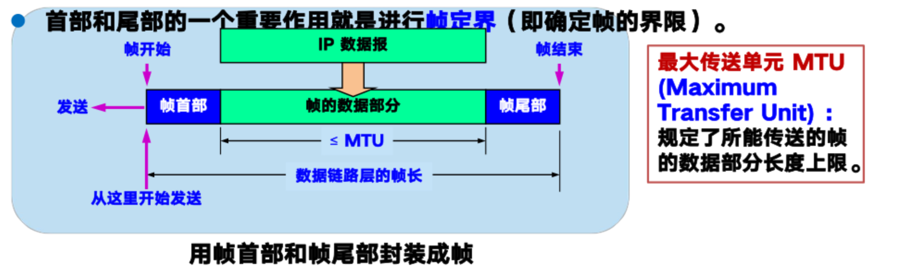

> 用控制字符作为帧定界符
> - SOH(Start of Header)放在一帧的最前面表示帧的开始
> - EOT(End of Transmission)放在一帧的末尾表示帧的结束

2. 透明传输

如果数据中的某个字节的二进制恰好哈SOH或EOT一样，数据链路层会错误的找到“帧的边界”，导致错误。


> 解决办法：
> - 字节填充
> - 字符填充

3. 差错检测

误码率：在一段时间内，传输错误的比特占所传输比特总数的比率成为误码率BER(Bit Error Rate)

> 循环冗余检验CRC(Cyclic Redundancy Check)原理  
> 1. 发送端先把数据划分为N组，每个组k个比特。  
> 2. CRC运算在每组M后面添加供差错检验用的n为冗余吗，然后构成一个帧发送出去，一共发送(n+k)位。
> > CRC冗余码的计算
> > 1. 用二进制的模2运算进行$2^n$乘M的运算，相当于在M后添加n个0；
> > 2. 得到的(k+n)位数除以事先选定好的长度为(n+1)位除数P,得出商为Q,余数是R,余数R比除数P少1位；
> > 3. 将余数R作为冗余吗拼接在数据M后，一起发送出去。  
> > 这种为了进行检错而添加的冗余码称为帧检测序列FCS(Frame Check Sequence).

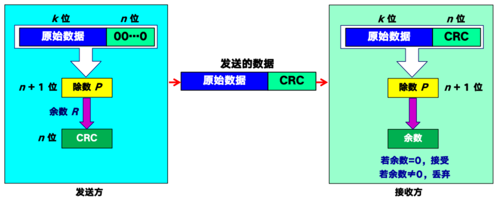


# 3. 点对点协议PPP(Point-to-Point Protocol)

## 3.1 PPP协议的组成

PPP协议有三个组成部分：
- 一个将IP数据报封装到串行链路的方法
- 一个用来建立、配置和测试数据链路连接的链路控制协议LCP(Ling Control Protocol)
- 一套网络控制协议NCP(Network Control Protocol),用来支持不同的网络层协议

## 3.2 PPP协议的帧格式


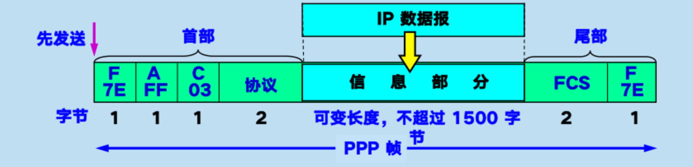
> PPP是面向字节的，所有的PPP帧的长度都是字节的整数字节。

- 首部：四个字段
1. 标志字段F：0x7E。连续两帧之间只需要一个标志字段。
2. 地址字段A：只为0xFF,实际不起作用。
3. 控制协议C：通常为0x03。
4. 协议字段：标明数据部分的类别
    - 0x0021：IP数据报
    - 0x8021：网络控制数据
    - 0xC021：PPP链路控制数据
    - 0xC023：鉴别数据
    
- 尾部：两个字段
    - FCS：帧检验序列
    - 标志字段F：0x7E,结束标志


## 3.3 透明传输问题


- 当PPP用在异步传输（逐个字符地传送）时，采用字节填充法，对数据部分出现了标志字段的值，进行替换
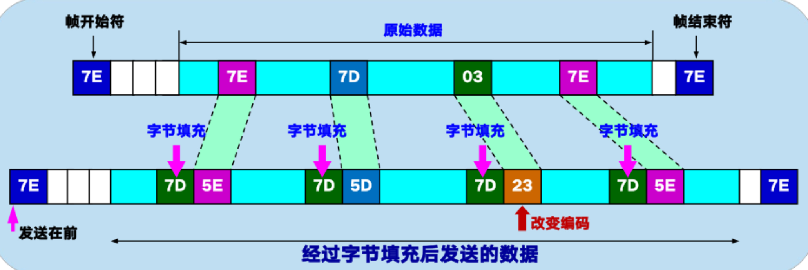

- 当PPP用在同步传输（一连串的比特连续传送）时，采用零比特填充法
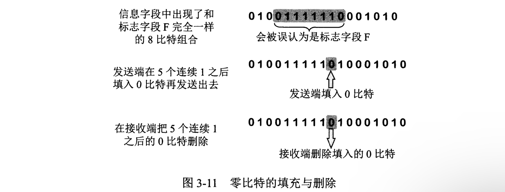
    > 发现有5个连续的1,则立即填入一个0

## 3.4 PPP协议的工作状态

<!-- TODO:工作细节 -->

1. 用户接入ISP后，就建立一条从用户个人电脑到ISP的物理连接；
2. 用户个人电脑向ISP发送一系列**链路控制协议LCP**分组（封装成多个PPP帧），以建立LCP连接；
3. 进行网络层配置。**网络控制协议NCP**给用户分配临时的IP地址。
4. 通信完后，NCP释放网络层连接，收回IP地址，LCP释放数据链路层连接。最后释放物理层连接。

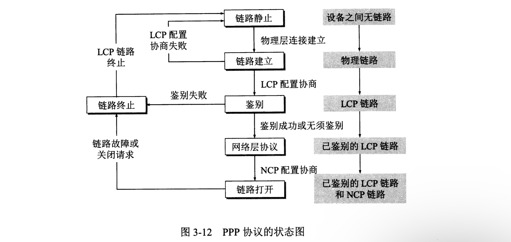


# 4. 使用广播信道的数据链路层

## 4.1 媒体共享技术

静态划分信道
1. 频分复用
2. 时分复用
3. 波分复用
4. 码分复用
> 这种划分信道的方法代价较高，不适合局域网使用

动态媒体接入控制（多点接入）
1. 随即接入：所有用户可随即的发送消息
    > 以太网
2. 受控接入：用户必须服从一定的控制，如轮询
    > 较少使用
> 动态媒体接入控制的特点：信道并非在用户通信时**固定分配**给用户


## 4.2 LLC和MAC层

逻辑链路控制LLC(Logical Link Control)子层：与传输媒体无关；
媒体接入控制MAC(Medium Access Control)子层：与传输媒体有关。
> 不管采用何种传输媒体和MAC子层的局域网对LLC子层来说都是透明的

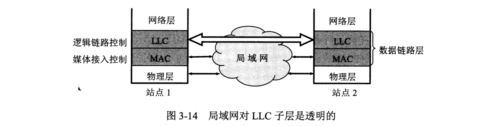

## 4.3 适配器的作用

计算机通过适配器和局域网进行通信
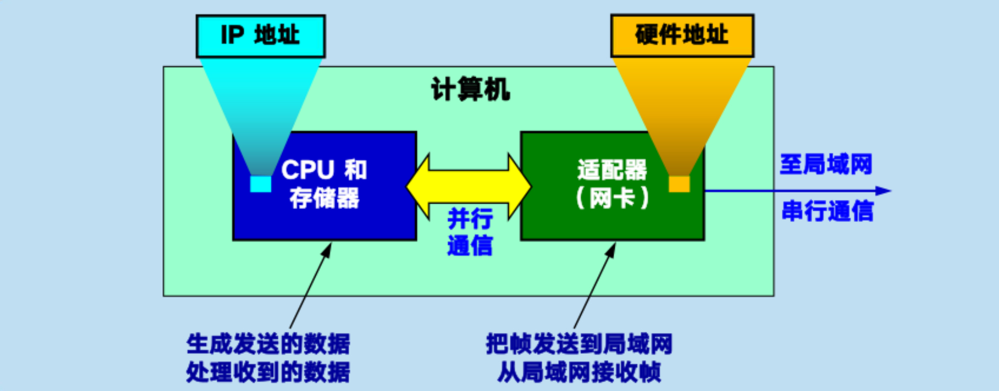

1. 进行串行/并行转换
2. 对数据进行缓存
3. 在计算机操作系统按照设备驱动程序
4. 实现以太网协议


## 4.4 以太网

1. 无连接工作方式
2. 曼切斯特编码


## 4.5 CSMA/CD(Carrier Sense Mutiple Access with Collision Detection)协议

载波监听多点接入/碰撞检测

- 多点接入：允许许多计算机以多点接入的方式连接在一条总线上；
- 载波监听：边发送边监听
- 碰撞检测：适配器边发送数据边检测信道上信号电压变化，电压摆动超过阈值则认为总线上至少两个站同时发送数据

检测到碰撞后

- 适配器立即停止发送
- 等待一段随即时间后再次发送

争用期

以太网端到端的往返时延2t称为争用期，或碰撞窗口。
> 具体时间为51.2us，经过争用期才能肯定这次发送没有发生碰撞  
> > 对于10Mbit/s以太网，在争用期可发送512bit,即64字节,意味着
> > - 以太网发送数据时，若前64字节没有发生冲突，则后续也不会
> > - 以太网规定最短有效帧长为64字节。
> > - 以太网最大端到端单程时延必须小于争用期的一半(25.6us)，相当于以太网最大端到端长度约为5km

碰撞后重传的时机

```c
//截断二进制指数退避
1. 基本退避时间2*t  
2. 参数k = Min[重传次数，10]
3. 从整数集合[0,1,...,($2^k-1$)]中随即取出一个数，记为r。

        重传所需的时延 = r * 基本退避时间

4. 重传16次仍不能成功时即丢弃该帧，并向高层汇报
```


> 强化碰撞：人为干扰信号
> 检测到碰撞后，立刻停止发送，随后发送32或64位比特的人为干扰信号，再进入等待重发状态


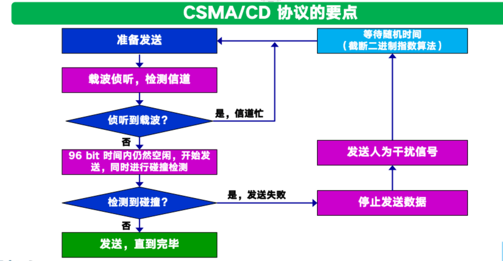


## 4.5 集线器hub

- 使用电子器件来模拟实际电缆线的工作，整个系统仍像一个传统的以太网那样运行
- 像一个多接口的转发器，工作在物理层
- 采用专门芯片，进行自适应串音回消


## 4.6 MAC层

1. MAC层的硬件地址

48位的全球唯一地址，固化在适配器的ROM中


- IEEE管理机构向厂家分配前3个IP地址，称为组织唯一标识符OUI(Organizationally Unique Identifier)
- 厂家自行指派后三个字节，称为扩展标识符(extended identitier)

适配器存在过滤功能

每收到一个MAC帧，先用硬件检查帧中的MAC地址，如果是发送本站的帧则收下，否则丢弃

> 发送本站的帧：
> - 单播
> - 广播
> - 多播


2. MAC帧的格式

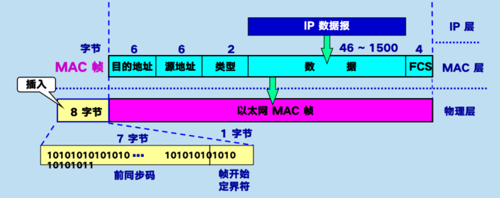

- 类型：标志上一层使用的是什么协议，以便把收到的MAC帧的数据部分上交给上一层的这个协议。
- IP数据部分：46-1500字节
> 其余标志字节总长为18，最短数据帧长度64-18=46
- FCS：差错检验
- 前同步码和帧开始定界符：由硬件在物理层在帧的前面插入8字节，第一个字段共7个字节，用来迅速实现MAC帧的比特同步。第二个字段一个字节是帧开始定界符，表示后面的信息是MAC帧。


## 4.7 扩展的以太网

1. 在物理层扩展

- 使用光纤
- 使用集线器
    - 扩大了覆盖范围
    - 碰撞域扩大了，总的吞吐量未提高
    - 集线器只能连接相同技术的网络（数据率相同等）

> 碰撞域：网络中一个站点发出的帧与其他站点发出的帧产生碰撞的那部分网络


2. 在数据链路层扩展以太网

早期用网桥，现在使用交换机

网桥
- 根据mac帧目的地址对收到的帧进行转发
- 工作在数据链路层

交换机
- 工作在数据链路层
- 实质上是一个多接口网桥
- 全双工通信
- 并行性
- 接口有存储器，存储转发
- 即插即用，内部的交换表（地址表）通过自学习算法自动建立。
- 使用专门的交换结构芯片，用硬件转发，比使用软件转发的网桥快

> 交换机的自学习功能：  
> A向B发送一帧，该帧从接口1进入交换机；  
> 交换机收到帧后，先查找交换表，没有查到B的信息；/找到B信息；  
> 交换机把这个帧的源地址A和接口1写入交换表中；  
> 交换机向除了接口1以外的所有接口广播这个接口。/ 交换机把该帧进行转发。  
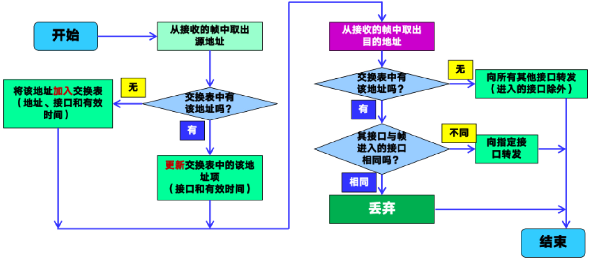
> > 交换表中的每个项目都设有一定的有效时间，过期项目自动删除。

两个交换机相连会产生回路

生成树协议STP(Spanning Tree Protocol)：
使得从一台主机到所有其他主机的路径是无环路的树状结构，从而消除了兜圈子现象


# 5. 虚拟局域网

以太网存在的问题
- 广播风暴：交换机之间的冗余链路形成广播风暴
- 安全问题：交换机所连接的每个网络都处于同一个广播域中

利用以太网交换机可以很方便的实现虚拟局域网VLAN(Virtual LAN)

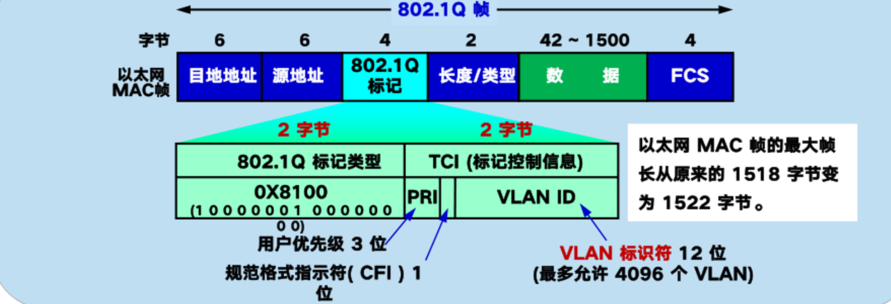

> 需要广播的帧在发送方主机A和交换机中仍是标准的以太网帧，在交换机中间按802.1Q帧转发，在下一个交换机和主机B之间变回标准的以太网帧。


# 6. 高速以太网
<!-- TODO:100BASE-T以太网、吉比特以太网、10吉比特以太网和更快的以太网,使用以太网进行宽带接入 -->


# 7. 本章的重点概念

- 链路是从一个结点到另一个结点的一段物理线路，数据链路则是在链路的基础上增加了一些必要的硬件（如网络适配器）和软件（入协议的实现）
- 数据链路层使用的信道主要有点到点信道和广播信道两种
- 数据链路层传送的协议数据单元是帧。数据链路层的三个基本问题是：封装成帧、透明传输和差错检验
- 循环冗余检验CRC是一种检错方法，而帧检验序列FCS是添加在数据后面的冗余码
- 点对点PPP协议是数据链路层使用最多的一种协议，他的特点是：简单；只检测差错，而不是纠正差错；不使用序号，也不进行流量控制；可同时支持多种网络层协议
- PPPoE是宽带上网的主机使用的链路层协议
- 局域网的优点是：具有广播功能，从一个站点可很方便的访问全网；便于系统的扩展和逐渐演变；提高了系统的可靠性、可用性和生存性
- 共享通信媒体资源的方法有二：一是静态划分信道（各种复用技术），二是动态媒体借入控制，又称多点接入（随即接入或受控接入）
- IEEE 802委员会曾把局域网的数据链路层拆成两个子层，即逻辑链路控制(LLC)子层（与运输媒体无关）和媒体接入控制(MAC)子层（与传输媒体有关）。但现在LLC子层已成为历史
- 计算机与外界局域网的通信要通过通信适配器（网络适配器），它又称为网络接口卡或网卡。计算机的硬件地址就在适配器的ROM中
- 以太网采用无连接的工作方式，对发送的数据帧不进行编号，也不要求对方发回确认。目的站受到有差错帧就把它丢弃，其他什么也不做
- 以太网采用的协议是具有冲突检测的载波监听多点介入CSMA/CD。协议的要点是：发送前先监听，边发送边监听，一旦发现总线上发生了碰撞，就立即停止发送。然后按照退避算法等待一小段时间后再次发送。因此，每个站在自己发送数据之后的一小段时间内，存在遭遇碰撞的可能。以太网上各站点平等的争用以太网信道
- 传统的总线以太网基本上都是使用集线器的双绞线以太网。这种以太网在物理上是星形网，但在逻辑上则是总线形网。集线器工作在物理层，它的每个接口仅仅简单的转发比特，不进行碰撞检测
- 以太网的硬件地址，即mac地址实际上就是适配器地址或适配器标识符，与主机所在的地点无关。源地址和目的地址都是48位长
- 以太网的适配器具有过滤功能，它只接收单播帧、广播或多播帧
- 使用集线器可以在物理层扩展以太网（扩展后的以太网仍是一个网络）
- 交换式集线器常称为以太网交换机或第二层交换机（工作在数据链路层）。它就是一个多接口的网桥，而每个接口都直接与某台单主机或另一个集线器相连，且工作在全双工方式。以太网交换机能同时连通许多对接口，使每一对相互通信的主机都能像独占通信媒体那样，无碰撞的传输数据
- 高速以太网有100Mbit/s的快速以太网，吉比特以太网和10Gbit/s吉比特以太网。最近还发展到100吉比特以太网。在宽带接入技术中，也常用高速以太网进行接入

