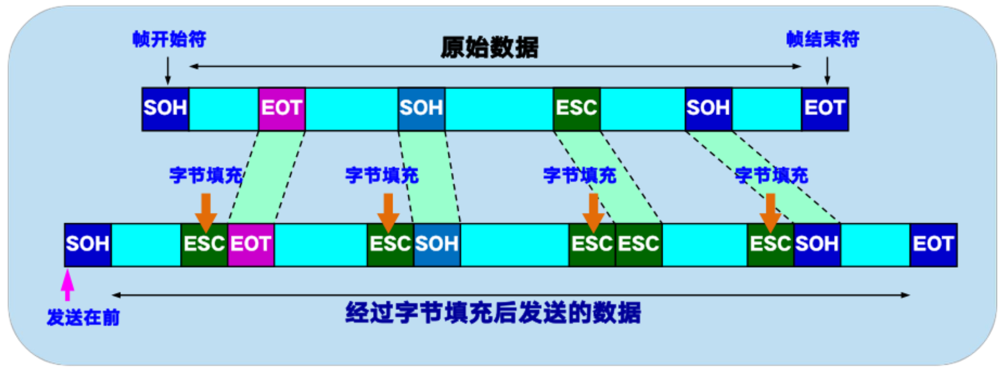
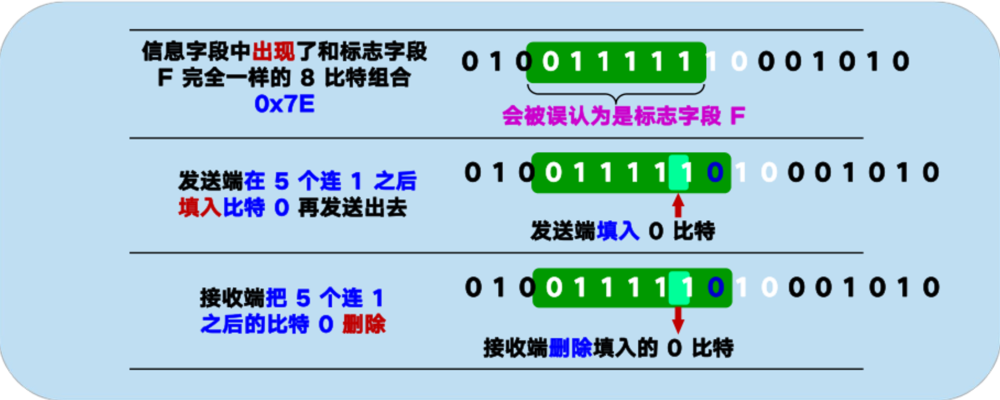
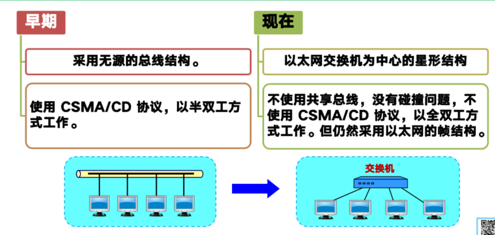

# 数据链路层信道类型

1. 点对点信道

2. 广播信道

# 使用点对点信道的数据链路层


## 数据链路

链路：一条无源的点到点的物理线路段，中间没有任何其他的交换结点。
数据链路：把实现控制数据传输的协议的硬件和软件加到链路上，就构成了数据链路。


## 三个基本问题

1. 封装成帧

在一段数据的前后分别添加首部和尾部，构成一个帧


> 用控制字符作为帧定界符
> - SOH(Start of Header)放在一帧的最前面表示帧的开始
> - EOT(End of Transmission)放在一帧的末尾表示帧的结束

2. 透明传输

如果数据中的某个字节的二进制恰好哈SOH或EOT一样，数据链路层会错误的找到“帧的边界”，导致错误。

采用“字节填充”或“字符填充”法



3. 差错检测

误码率：在一段时间内，传输错误的比特占所传输比特总数的比率成为误码率BER(Bit Error Rate)

> 循环冗余检验CRC(Cyclic Redundancy Check)原理  
> 1. 发送端先把数据划分为N组，每个组k个比特。  
> 2. CRC运算在每组M后面添加供差错检验用的n为冗余吗，然后构成一个帧发送出去，一共发送(n+k)位。
> > CRC冗余码的计算
> > 1. 用二进制的模2运算进行$2^n$乘M的运算，相当于在M后添加n个0；
> > 2. 得到的(k+n)位数除以事先选定好的长度为(n+1)位除数P,得出商为Q,余数是R,余数R比除数P少1位；
> > 3. 将余数R作为冗余吗拼接在数据M后，一起发送出去。  
> > 这种为了进行检错而添加的冗余码称为帧检测序列FCS(Frame Check Sequence).


# 点对点协议PPP(Point-to-Point Protocol)

## 组成
- 一个将IP数据报封装到串行链路的方法
- 一个链路控制协议LCP(Ling Control Protocol)
- 一套网络控制协议NCP(Network Control Protocol)

## PPP协议的帧格式


> PPP是面向字节的，所有的PPP帧的长度都是字节的整数字节。

- 首部：四个字段
1. 标志字段F：0x7E。连续两帧之间只需要一个标志字段。
2. 地址字段A：只为0xFF,实际不起作用。
3. 控制协议C：通常为0x03。
4. 协议字段：标明数据部分的类别
    - 0x0021：IP数据报
    - 0x8021：网络控制数据
    - 0xC021：PPP链路控制数据
    - 0xC023：鉴别数据
    
- 尾部：两个字段
    - FCS：帧检验序列
    - 标志字段F：0x7E,结束标志


## 透明传输问题


- 当PPP用在异步传输时，采用字节填充发，对数据部分出现了标志字段的值，进行替换


- 当PPP用在同步传输时，采用零比特填充法


> 同步传输中，发送方和接收方的时钟是同步的，即两端使用同一个时钟信号来确定数据传输的时序;  
> 异步传输中，发送方和接收方的时钟是独立的。数据传输时，发送方通过在每个数据字节前后添加起始位和停止位来标记数据的开始和结束，接收方通过这些标记来识别数据字节。


## PPP协议的工作状态

1. 用户接入ISP后，就建立一条从用户个人电脑到ISP的物理连接；
2. 用户个人电脑向ISP发送一系列**链路控制协议LCP**分组（封装成多个PPP帧），以建立LCP连接；
3. 进行网络层配置。**网络控制协议NCP**给用户分配临时的IP地址。
4. 通信完后，NCP释放网络层连接，收回IP地址，LCP释放数据链路层连接。最后释放物理层连接。


# 使用广播信道的数据链路层

## 媒体共享技术

静态划分信道
1. 频分复用
2. 时分复用
3. 波分复用
4. 码分复用

动态媒体接入控制（多点接入）
1. 随即接入：所有用户可随即的发送消息
2. 受控接入：用户必须服从一定的控制，如轮询


## LLC和MAC层

逻辑链路控制LLC(Logical Link Control)子层：与传输媒体无关；
媒体接入控制MAC(Medium Access Control)子层：与传输媒体有关。

## 适配器的作用

计算机通过适配器和局域网进行通信


1. 进行串行/并行转换
2. 对数据进行缓存
3. 在计算机操作系统按照设备驱动程序
4. 实现以太网协议


## 以太网

1. 无连接工作方式
2. 曼切斯特编码


## CSMA/CD(Carrier Sense Mutiple Access with Collision Detection)协议

载波监听多点接入/碰撞检测

- 多点接入：允许许多计算机以多点接入的方式连接在一条总线上；
- 载波监听：边发送边监听
- 碰撞检测：适配器边发送数据边检测信道上信号电压变化，电压摆动超过阈值则认为总线上至少两个站同时发送数据

检测到碰撞后

- 适配器立即停止发送
- 等待一段随即时间后再次发送

争用期

以太网端到端的往返时延2t称为争用期，或碰撞窗口。
> 具体时间为51.2us，经过争用期才能肯定这次发送没有发生碰撞  
> > 对于10Mbit/s以太网，在争用期可发送512bit,即64字节,意味着
> > - 以太网发送数据时，若前64字节没有发生冲突，则后续也不会
> > - 以太网规定最短有效帧长为64字节。
> > - 以太网最大端到端单程时延必须小于争用期的一半(25.6us)，相当于以太网最大端到端长度约为5km

碰撞后重传的时机

```c
//截断二进制指数退避
1. 基本退避时间2*t  
2. 参数k = Min[重传次数，10]
3. 从整数集合[0,1,...,($2^k-1$)]中随即取出一个数，记为r。

        重传所需的时延 = r * 基本退避时间

4. 重传16次仍不能成功时即丢弃该帧，并向高层汇报
```


> 强化碰撞：人为干扰信号
> 检测到碰撞后，立刻停止发送，随后发送32或64位比特的人为干扰信号，再进入等待重发状态


## 集线器

- 使用电子器件来模拟实际电缆线的工作，整个系统仍像一个传统的以太网那样运行
- 像一个多接口的转发器，工作在物理层
- 采用专门芯片，进行自适应串音回消

## MAC层

1. MAC层的硬件地址

48位的全球唯一地址，固化在适配器的ROM中


- IEEE管理机构向厂家分配前3个IP地址，称为组织唯一标识符OUI(Organizationally Unique Identifier)
- 厂家自行指派后三个字节，称为扩展标识符(extended identitier)

适配器存在过滤功能

每收到一个MAC帧，先用硬件检查帧中的MAC地址，如果是发送本站的帧则收下，否则丢弃

> 发送本站的帧：
> - 单播
> - 广播
> - 多播


2. MAC帧的格式


- 类型：标志上一层使用的是什么协议，以便把收到的MAC帧的数据部分上交给上一层的这个协议。
- IP数据部分：46-1500字节
> 其余标志字节总长为18，最短数据帧长度64-18=46
- FCS：差错检验
- 前同步码和帧开始定界符：由硬件在物理层在帧的前面插入8字节，第一个字段共7个字节，用来迅速实现MAC帧的比特同步。第二个字段一个字节是帧开始定界符，表示后面的信息是MAC帧。


## 扩展的以太网

1. 在物理层扩展

- 使用光纤
- 使用集线器
    - 扩大了覆盖范围
    - 碰撞域扩大了，总的吞吐量未提高
    - 集线器只能连接相同技术的网络（数据率相同等）

> 碰撞域：网络中一个站点发出的帧与其他站点发出的帧产生碰撞的那部分网络


2. 在数据链路层扩展以太网

早期用网桥，现在使用交换机

网桥
- 根据mac帧目的地址对收到的帧进行转发
- 工作在数据链路层

交换机
- 工作在数据链路层
- 实质上是一个多接口网桥
- 全双工通信
- 并行性
- 接口有存储器，存储转发
- 即插即用，内部的交换表（地址表）通过自学习算法自动建立。
- 使用专门的交换结构芯片，用硬件转发，比使用软件转发的网桥快

> 交换机的自学习功能：  
> A向B发送一帧，该帧从接口1进入交换机；  
> 交换机收到帧后，先查找交换表，没有查到B的信息；/找到B信息；  
> 交换机把这个帧的源地址A和接口1写入交换表中；  
> 交换机向除了接口1以外的所有接口广播这个接口。/ 交换机把该帧进行转发。  

> > 交换表中的每个项目都设有一定的有效时间，过期项目自动删除。

两个交换机相连会产生回路

生成树协议STP(Spanning Tree Protocol)：
使得从一台主机到所有其他主机的路径是无环路的树状结构，从而消除了兜圈子现象




# 虚拟局域网

以太网存在的问题
- 广播风暴：交换机之间的冗余链路形成广播风暴
- 安全问题：交换机所连接的每个网络都处于同一个广播域中

利用以太网交换机可以很方便的实现虚拟局域网VLAN(Virtual LAN)


> 需要广播的帧在发送方主机A和交换机中仍是标准的以太网帧，在交换机中间按802.1Q帧转发，在下一个交换机和主机B之间变回标准的以太网帧。


