# 4.1 网络层提供的两种服务  

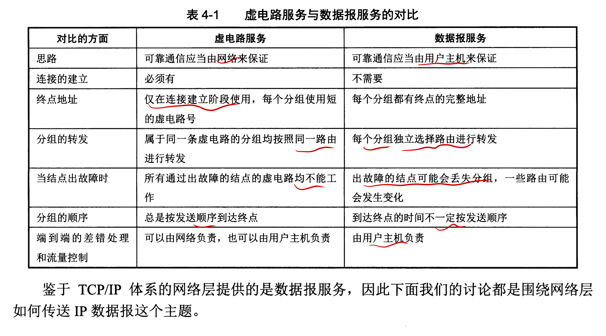

互联网所采用的设计思路：网络层向上只提供简单灵活的、无连接的、尽最大努力交付的数据报服务。

> 互联网的先驱者认为电信网提供的端到端的可靠传输服务对电话业务无疑是很合适的，因为电信网的终端（电话机）非常简单，没有智能也没有差错处理能力。因此电信网必须负责把用户电话机产生的语音信号可靠的传送给对方。但计算机网络的端系统是智能的，计算机有很大的差错处理能力（这点和传统的电话机有本质上的差别）。

网络在发送分组时不需要建立连接。每一个分组（也就是IP数据报）独立发送，与其前后的分组无关（不进行编号）,独立的选择路由。网络层不提供服务质量的保障。

# 4.2 网际协议IP

与IP协议配套使用的还有三个协议：
- 地址解析协议ARP(Address Resolution Protocol)
- 网际控制协议ICMP(Internet Control Message Protocol)
- 网际组管理协议IGMP(Internet Group Management Protocol)
> 本来还有个逆地址解析协议RARP(Reverse Address Resolution Protocol)，现在被淘汰了。

ARP画在最下面因为IP经常要使用这个协议。ICMP和IGMP画在最上面因为它们要使用IP协议。

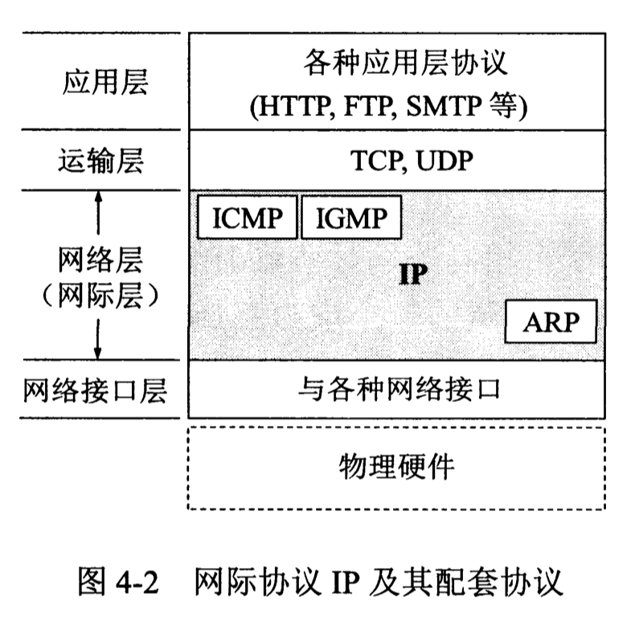

## 4.2.1 虚拟互连网络
如果要在全世界范围内把数以百万计的网络互连起来，没有单一的网络能够适应所有用户的需求，将网络互连起来要使用一些中间设备。  
根据中间设备所在的层次可以有以下四种不同的中间设备：  
1. 物理层使用的中间设备叫做**转发器**
2. 数据链路层使用的中间设备叫做**网桥**或者**桥接器**
3. 网络层使用的中间设备叫做**路由器**
4. 网络层以上使用的中间设备叫做**网关**

> 中间设备是转发器或网桥时，仅仅是把一个网络扩大了，仍是一个网络。路由器其实就是一台专用计算机，用来在互联网中进行路由选择。

由于参加互连的计算机网络都使用相同的网际协议IP,因此可以把互连后的计算机网络看作一个虚拟互连网络

> 互连起来的各种物理网络的异构性本来是客观存在的，但是我们用IP协议就可以使这些性能各异的网络在网络层上看起来好像是一个统一的网络。

## 4.2.2 分类的IP地址
### 1. IP地址及其表示方法

整个互联网就是一个单一的、抽象的网络，IP地址就是给互联网上的每一台主机（或路由器）的每一个接口分配一个在全世界范围内是唯一的32位的标识符。

IP地址的三个历史阶段
  1. 分类的IP地址
  2. 子网的划分
  3. 构成超网

$$IP地址 ::= {<网络号>,<主机号>}$$
> "::="表示”定义为“

"分类的IP地址"由两个固定长度的字段组成，其中第一个字段称为**网络号(net-id)**,它标志主机（或路由）所连接的网络。第二个字段是主机号（host-id），它标志该主机（或路由器）  

点分十进制

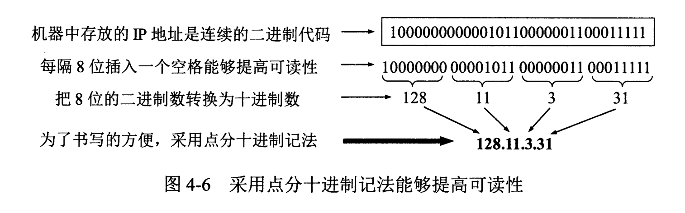

### 2. 常用的三中类别的IP地址  
A类地址的网络字段只占1个字节，只有七位可用（该字段的第一位已固定为0），但可指派的网络号是$2^7-2$个。减2的原因是因为：
1. IP地址全为0表示”这个(this)”。网络字段全为0的IP地址表示本网络。
2. 网络号为127（即01111111）保留为本地软件环回测试本主机的进程之间的通信之用。

A类地址的主机好占3个字节，因此每个A类地址网络中最大主机数为$2^{24}-2$，这里减2的原因是：
1. 全0的主机号字段表示“本主机”所连接到的单个网络。
2. 全1代表该网络上的所有主机。

> 对于B类和C类地址，可以类似分析。但注意他们没有那连个特殊的网络号(前两位分别为01和011,不存在全0或全1)，而是多了B类中不可指派的128.0.0.0和C类中的192.0.0.0。

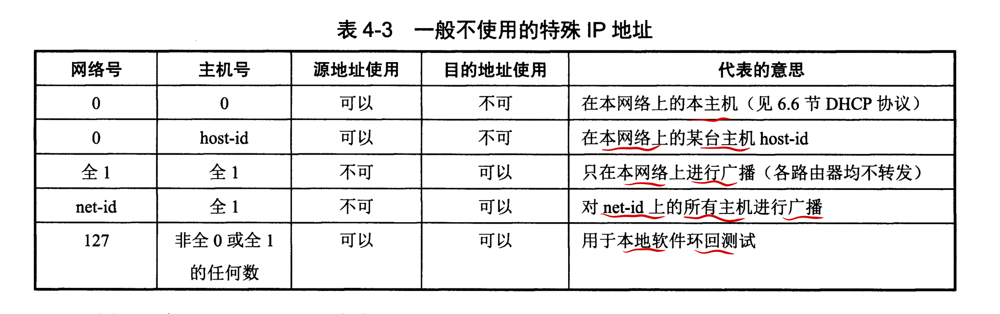

IP地址的特点：
1. IP地址是一种分等级的地址结构，IP地址管理机构分配IP时只分配网络号，剩下的主机号可自行分配；路由器仅根据目的主机所连接的网络号来转发分组，减少开销。
2. 多归属主机：当一台主机同时连接两个或两个以上的网络，该主机会有对个IP,其网络号不同。
3. 一个网络是指具有相同网络号net-id的集合，因此用转发器或网桥连接起来的若干个局域网仍为一个网络。

---
对于下图的网络：
- 路由器总是具有两个或两个以上的IP地址。即路由器的每一个接口都有一个不同的网络号的IP地址。
- 当两个路由器直接相连时，在连线两端的接口处，如果分配了IP地址，则这条线构成了一种只含一段线路的特殊”网络“(N1,N2,N3)。没分配IP地址则称为无编号网络或无名网络。

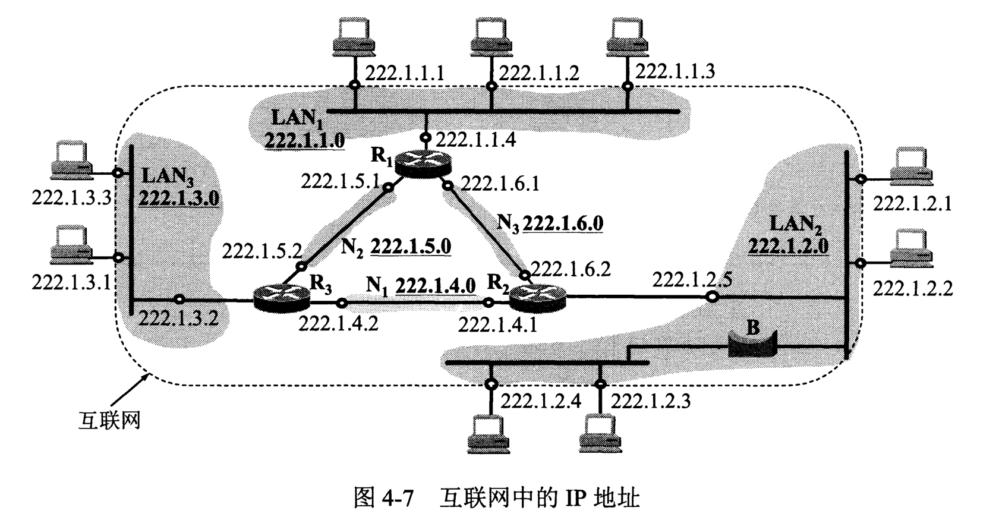

## 4.2.3 IP地址与硬件地址
物理地址是数据链路层和物理层使用的地址，IP地址是网络层和以上各层所使用的地址，是一种逻辑地址

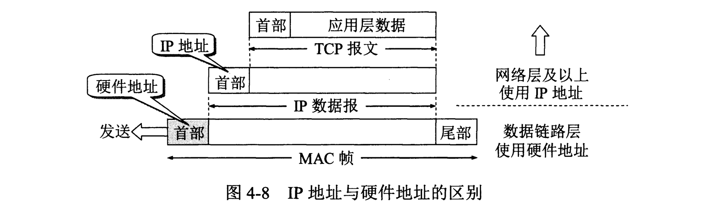
> 由于硬件地址已固化在网卡的ROM中，因此硬件地址常称为物理地址。因为在局域网的MAC帧的源地址和目的地址都是硬件地址，因此硬件地址又成为MAC地址。

## 4.2.4 地址解析协议ARP

ARP协议用途：从网络层使用的IP地址，解析出数据链路层使用的硬件地址。
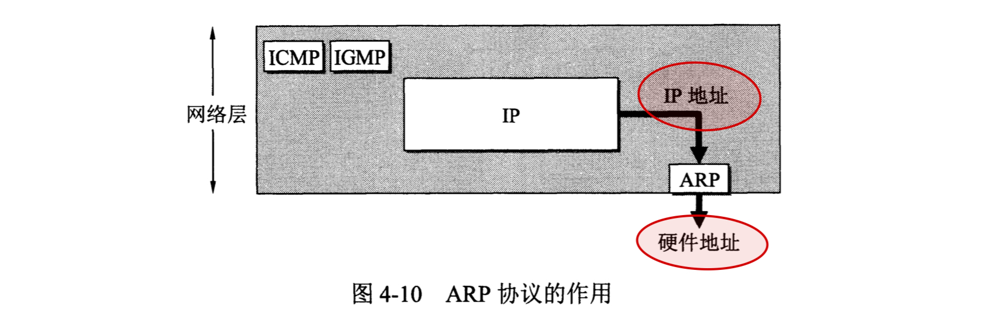

ARP的原理：在每一台主机设有一个ARP高速缓存，其中存放从IP地址到硬件地址的映射表，并且这个映射表还经常动态更新（新增或超时删除）。

对于ARP映射表中不存在的主机映射：
1. 主机A的ARP进程在本局域网上广播一个ARP分组请求。ARP请求分组的主要内容是”我的IP地址是xxx，硬件地址是xxx,我想知道ip为xxx主机的硬件地址。“  
2. 在本局域网上的所有运行ARP进程的主机都会收到ARP请求分组。
3. 主机B的IP地址与ARP请求分组中查询的IP地址一致，就收下这个ARP请求分组并向主机A发送ARP响应分组。同时主机B的ARP的高速缓存映射表。
4. 主机A收到主机B的ARP响应分组后，在其ARP高速缓存中写入主机B的映射。
> 虽然ARP请求分组是广播发送的，但是ARP响应分组是普通的单播，即从一个源地址发送到另一个源地址。

ARP对保存在高速缓存中的每一个映射地址设置**生存时间**，但凡超过生存时间的项目就从高速缓存中删除掉。

ARP中的所有可能情形
1. 发送方是主机A，要把IP数据报发送到同一个网络上的另一台主机B。这时主机A发送ARP请求分组，找到目的主机B的硬件地址。
2. 发送方是主机A,要把IP数据报发送到另一个网络上的一台主机B.A发送ARP请求分组，找到本网络上的一个路由器R的硬件地址。剩下的交给R来完成。
3. 发送方是路由器R，要把IP数据报发送到与R相连接的主机B。这时R发送ARP请求分组，找到目的主机B的硬件地址。
4. 发送方是路由器R,要把UP数据报发送到另一个网络上的主机B。这时R发送ARP请求分组，找到连接主机B所在网络的路由器的R1的硬件地址。剩下的交给R1完成。

## 4.2.5 IP数据报的格式
在TCP/IP协议标准中，各种数据格式常以32位（即4字节）为单位来描述。

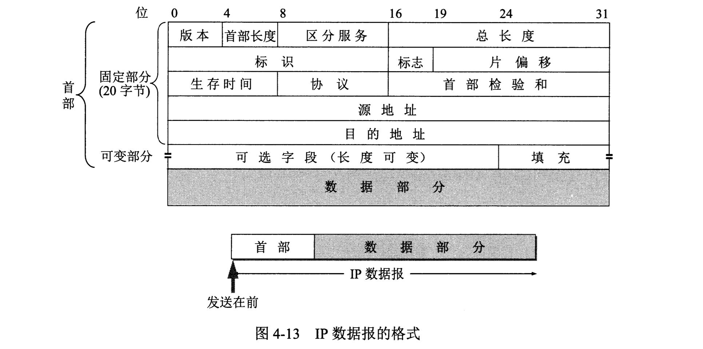

### IP数据报首部的固定部分的各字段
1. 版本 ：占4位，指IP协议的版本。通信双方的IP协议版本必须一致。
2. 首部长度 ：占4位，所表示数的单位为32位（4字节）。
3. 区分服务 ：占8位，只有在区分服务时才使用。
4. 总长度   ：首部和数据之和的长度，单位为字节。
> 数据链路层规定了最大创送单元MTU(Maximum Transfer Unit)，以太网中是1500字节，超出则需分片。  
> IP协议规定，互联网中的所有设备，必须接受长度不超过576个字节的数据报(最长的IP首部60个字节+4字节富余量+512字节上层数据),如果发送长度超过576个字节，就要考虑目的主机能否接受所发送数据报长度，否则进行切片)
5. 标识 ：占16位，IP软件中维持一个计数器，每产生一个数据报就++，将此值赋给该片段。相同的标识字段的值使分片后的各数据分片最后能正确的重装为原来的数据报。
6. 标识 ：占3位，目前只有前两位有意义。最低MF=1则表示后面还有分片，MF=0则表示是最后一个数据分片；中间DF=1意思是不能分片
7. 片偏移   ：占3位，较长的分组在分片后，某片在原分组中的相对位置。以8字节为偏移单位。
8. 生存时间 ：占8位，路由器每次转发数据报之前把该值减一。
9. 协议 ：占8位，指出此数据报携带的数据是使用何种协议，以便使目的主机的IP层知道将数据部分上交给哪个协议进行处理。
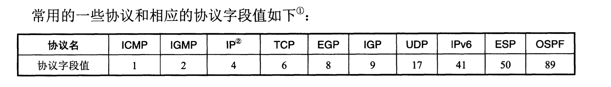
10. 首部检验和  ：这个字段只检验数据报的首部，不包括数据部分。
> IP首部的检验和不采用复杂的CRC检验码而是：在发送方，先把IP数据报首部划分为许多16位字的序列，并把检验和字段置零。用反码算术运算把所有的16位字相加后得到的结果放入检验和字段；接收方接受数据报后，把首部所有16位字再使用反码运算相加一次。将得到的结果取反码，得出的结果若不为0,则认为出错。
> 二进制反码求和运算：从低位到高位逐列进行相加，产生进位则加到下一列，如果最高位产生进位，则将最后的结果+1。
11. 源地址  ：占32位
12. 目的地址    ：占32位

### IP数据报首部的可变部分
该部分是一个选项字段，用来支持排错、测量和安全等措施，这些选项一个个拼接起来，中间不需要分隔符，最后用全0补齐成4个字节的整数倍。  

该部分是为了增加IP数据报的功能，实际上很少使用。

## IP层转发分组的流程
- 图中的每一个路由器都有两个不同的IP地址
- 在互联网上转发分组时，是从一个路由器转发到下一个路由器
- 每一条路由最主要的是以下两个信息：（目的网络地址，下一跳地址）
> 实际的路由表还会有其他信息，例如标志、参考计数、使用情况及接口等。

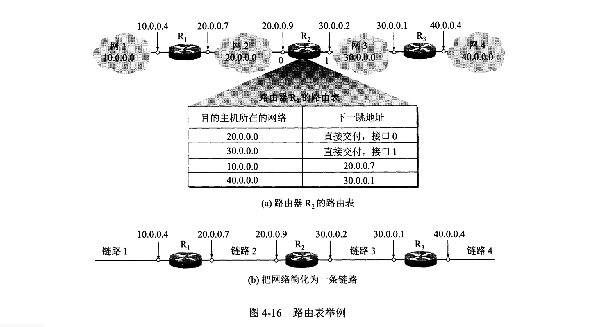

---
我们根据目的网络地址来确定下一跳路由器地址，可得：
1. IP数据报最终一定可以找到目的主机所在目的网络上的路由器（可能经过多次间接交付）。
2. 只有到达最后一个路由时，才试图向目的主机进行直接交付。

特定主机路由：对特定的目的主机指明一个路由。  

默认路由：将那些无法匹配任何其他路由表条目的数据包转发到一个预定义的路由器。(图中N1)

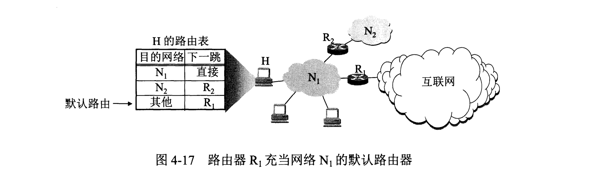

> 当路由器收到了待转发的数据报，自爱从路由表得到吓一跳路由器的IP地址后，送交给数据链路层的网络接口软件。该软件负责把下一跳的IP地址通过ARP转换为硬件地址，存入MAC帧的首部，然后根据这个硬件地址找到吓一跳路由器。

分组转发算法：  
1. 从数据报首部提取目的主机的IP地址D,得出目的网络地址为N。
2. 若N是与此路由器相连的某个网络，则直接交付；否则进行间接交付，执行3.
3. 若路由表中有目的地址为D的**特定主机路由**，则把数据报传输给路由表中指定的下一跳路由；否则执行4.
4. 若路由表中有直达网络N的路由，则把数据报传送给路由表中所指定的下一跳路由；否则执行5.
5. 若路由表中有一个默认路由，则把数据报传送给默认路由；否则执行6.
6. 报告转发分组出错。

# 4.3 划分子网和构造超网

## 划分子网

### 从二级IP地址到三级IP

划分子网    ：在IP地址中增加一个“子网号字段”，使两级IP地址变成三级IP地址。

方法    ：从网络的主机号借用若干位作为子网号(subnet-id)，记为：
$$IP地址 ::= {<网络号>,<子网号>,<主机号>}$$

> 一个拥有许多物理网络的单位，将所属的物理网络划分为若干个子网，本单位以外的网络看不见这个网络是由多少子网组成，该单位对我仍然表现为一个网络。本单位的路由器受到外部网络的IP数据报时，再按目的网络号和子网号找到目的子网，把IP数据报交付目的主机。

### 子网掩码
作用：查看源主机或者目的主机所连接的网络是否进行了子网划分。

子网掩码是一个网络或一个子网的重要属性，路由器在和相邻路由器交换路由信息时，必须把自己所在网络（或子网）的子网掩码告诉相邻的路由器。

### 使用子网时分组的转发
使用子网划分以后，路由表必须包含以下三项内容：**目的网络地址、子网掩码、下一跳地址**  

算法：  
1. 从收到的数据报首部提取目的IP地址D.
2. 先判断是否为直接交付，对路由器直接相连的网络进行逐个检查：用各网络的子网掩码和D逐位相“与”，看结果是否和相应的网络号地址匹配，若匹配则进行直接交付；否则间接交付，执行3.
3. 若路由表中存在目的地址为D的特定主机路由，则进行转发；否则执行4.
4. 对路由表中的每一行（目的网络地址，子网掩码，下一跳地址），用其中的子网掩码和D逐位相与，若结果与该行的目的网络地址匹配，则转发；否则执行5.
5. 若路由表中存在默认路由，则转发至默认路由；否则执行6.
6. 报告转发分组出错。

## 4.3.3 无分类编址CIDR（构造超网）

