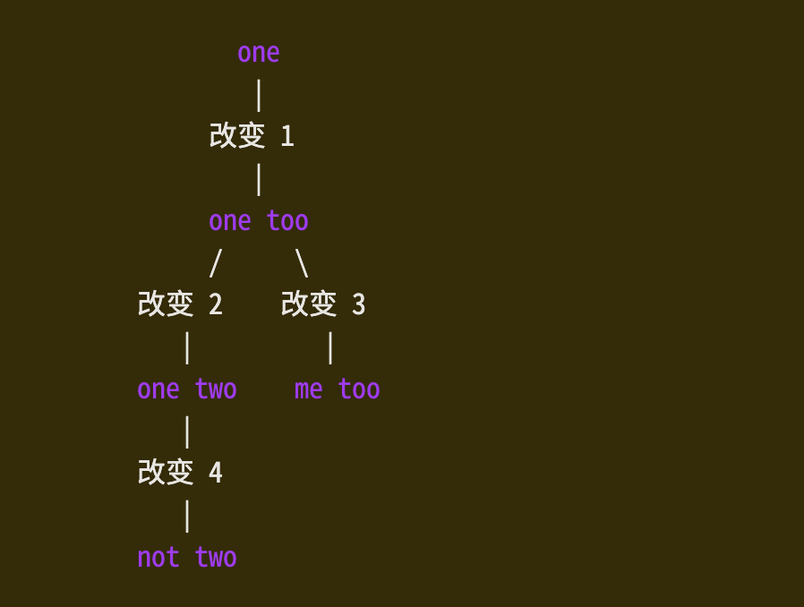

# Undo and redo command

1. Undo and redo commands

`<Undo>/u`: Undo [count] changes

`:u[ndo]`: Undo one change

`:u[ndo] {N}`: jump to after change number {N}

`u[ndo]!`: Undo one change and remove it from undo history

`u[ndo]! {N}`: like `u[ndo] {N}`,but forget all changes in the current undo branch up until {N}

`CTRL-R`: Redo [count] changes 

`:red[o]`: redo one change 

`U`: undo all latest changes on one line
> the `U` is considerd as(被看作)one change which can be revert(恢复) by`u` and `CTRL-R`

# two way of undo 

the options `cpoptions` set the way undo work
- vim way('u' excluded): "uu" undoes two changes
- Vi-compatible way('u' included): "uu" will undoes an undo(nothing happened)

# undo blocks

one undo command undo a type command,no matter how many changes that command makes,this sequence of change called undo-block

`undoj[oin]`: join further changes with the previous undo block
> use like `:undojoin | delete`

# Undo branches

`:undol[ist]`: list the **leafs** in the tree of change.  

- "number" column is the change number.this number continuously increase and can be used to identify a specific undo-able changes.
- "change" column is the number of changes to this leaf leaf from the root of the tree
- "wneh" column is the date and time when this change happened.
- "saved" column mean whether the file is saved to disk.if saved,will show the version of the file when save.we can use `:later` or `earlier` to browse.

`g-`: go to older text statr
`ea[rilier] {count}`: go to older text state {count} times
`/{N}s/{N}m/{N}h/{N}d`: go to older text state about {N} seconds/minutes/hours/days before
`ea[rilier] {N}f`: go to older text state {N} file writes before

`g+`: go to newer text statr
`ea[rilier] {count}`: go to newer text state {count} times
`/{N}s/{N}m/{N}h/{N}d`: go to newer text state about {N} seconds/minutes/hours/days before
`ea[rilier] {N}f`: go to older text state {N} file writes later

> note that the text states will become unreachabel when undo information is clear for option `undolevels`

example:

- `undo/redo`: move up/down in one branch
- `g+/g-`: move rely on the change num,not restricted(限制) by current branch

# Undo persistence

enable the option `undofile` ,vim will automatically save the undo histroy when you write a file and restore(恢复) the undo history when you edit the file again

location of the undo files is controlled by the option `undodir`,default they are saved to the directory in the application data folder(~/.local/share/...)

You can also save and restore undo histories by using ":wundo" and ":rundo" respectively:
`:wundo[!] {file}`: write undo history to {file}
- if {file} exits and it dose not look like a undo file,then fails,unless ! was add 
- if it exists and look like a undo file,then overwrite it.

`rundo {file}`: read undo history from {file}

# remarkds about undo

