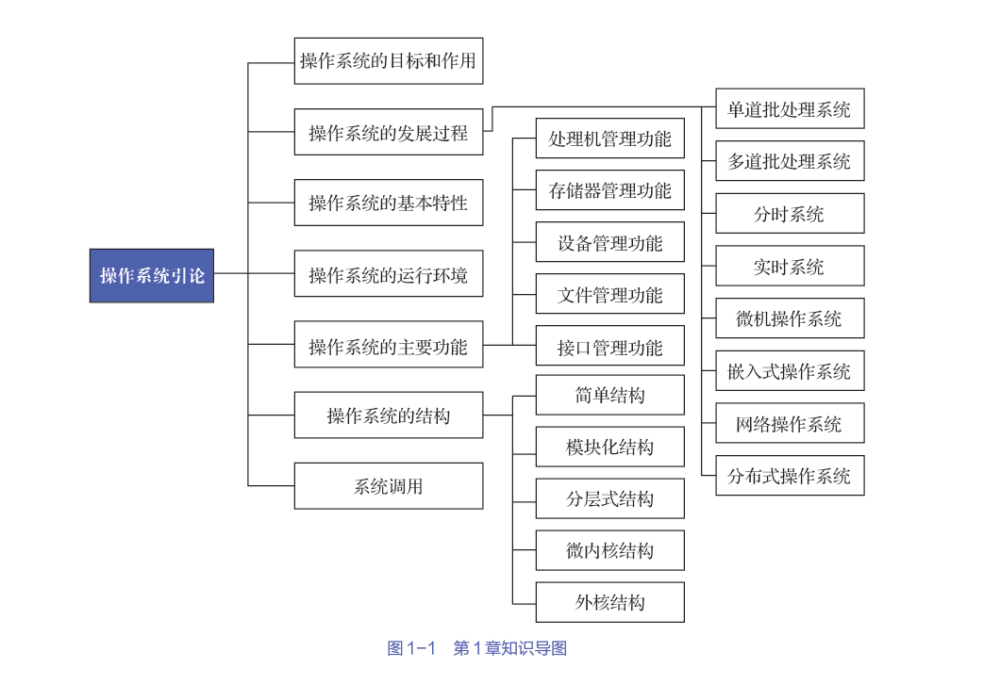
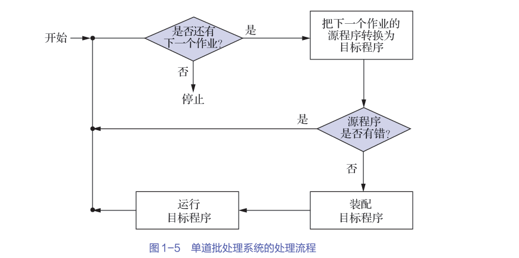
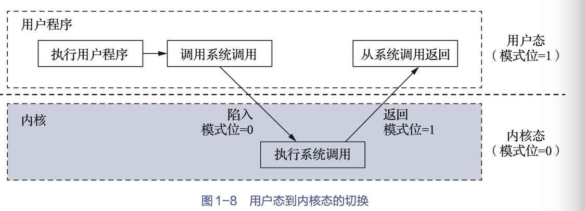
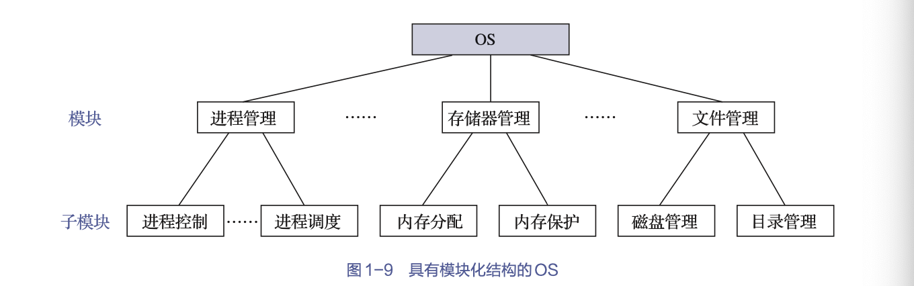

[toc]
操作系统(operating system,OS)：配置置在计算机硬件上的第一层软件，是对硬件系统的首次扩充，其主要作用是管理硬件设备，提高它们的利用率和系统吞吐量，并为用户和应用程序提供一个简单的接口，以便于用户和应用程序使用硬件设备。

# 1.操作系统的目标和作用

## 操作系统的目标
- 方便性：为用户使用提供便利
- 有效性：可提高系统资源的利用率，提高系统的吞吐量
- 可扩充性
- 开放性

## 操作系统的作用
- 人机交互：OS作为用户鱼计算机硬件系统之间的接口
  > ：OS处于用户与计算机硬件系统之间，用户通过OS来使用计算机硬件系统 
    > 
    > 用户可通过3种方式来使用计算机，即通过命令方式、系统调用方式和图形/窗口方式来实现自身与OS的通信，并取得OS的服务。

- 资源管理：OS作为计算机系统资源的管理者
    > 在一个计算机系统中，通常含有多种硬件和软件资源。归纳起来可将这些资源分为4类：处理机、存储器、I/O设备以及信息（数据和程序）。  
    相应地，OS的主要功能也正是对这4类资源进行有效的管理。
    > - 处理机管理：负责处理机的分配与控制；
    > - 存储器管理：负责内存的分配与回收；
    > - I/O 设备管理：负责I/O设备的分配（回收）与操纵；
    > - 文件管理：负责文件的存取、共享与保护等
- 资源抽象：OS实现了对计算机资源的抽象
    > 隐藏了I/O设备操作的细节，并可向上将I/O设备抽象为一组数据结构以及一组I/O操作命令

## 推动操作系统发展的主要动力
1. 不断提高计算机系统资源的利用率
2. 方便用户
3. 器件不断更新换代
4. 计算机体系不断发展
5. 不断提出新的应用需求

# 操作系统的发展过程

## 未配置操作系统的计算机系统
1. 人工操作方式  
是由用户将事先已穿孔的纸带（或卡片），装入纸带输入机（或卡片输入机），再启动它们以将纸带（或卡片）上的程序和数据输入计算机，然后启动计算机运行。仅当程序运行完毕并取走计算结果后，才允许下一个用户上机。
    - 用户独占全机
    - CPU等待人工操作
    > 当用户进行装带（卡）、卸带（卡）等人工操作时，CPU及内存等资源是空闲的。存在CPU与I/O设备之间速度不匹配的矛盾
2. 脱机I/O方式  
事先将装有用户程序和数据的纸带装入纸带输入机，在一台外围机的控制
下，把纸带上的程序和数据输入磁带。当CPU需要这些程序和数据时，再从磁带上将它们高速地调入内存。
    - 减少了CPU的空闲时间
    - 提高了I/O速度

## 单道批处理系统
要先把一批作业以脱机I/O方式输入到磁带上，并在系统中配上监督程序。在它的控制下，这批作业能一个接一个地被连续处理。

处理过程：首先由监督程序将磁带上的第一个作业装入内存，并把运行控制权交给该作业；当该作业处理完成时，又把运行控制权交还给监督程序，再由监督程序把磁带上的第二个作业调入内存。

> 切换作业时会出现CPU等待IO的空闲时间
## 多道批处理系统
用户所提交的作业会被先存放在外存上，并排成一个队列，称为“后备队列”。  
然后由作业调度程序按一定的算法从后备队列中选择若干个作业调入内存，使它们共享CPU和系统中的各种资源。  
由于在内存中同时装有若干道程序，这样便可在运行程序A时，利用其因I/O操作而暂停执行时的CPU空档时间，再调度另一道程序B运行。同样可以利用程序B在I/O操作时的CPU空档时间，再调度程序C运行，进而实现多道程序交替运行，这样便可以保持CPU处于忙碌状态。

 - 资源利用率高
 - 系统吞吐量大
 - 作业平均周转时间长
 - 无交互能力

--- 
综上，OS是一组能有效地组织和管理计算机硬件和软件资源，合理地对各类作业进行调度，以及方便用户使用的程序的集合

## 分时系统
## 实时系统
## 微机操作系统
## 嵌入式操作系统
## 网络操作系统

# 3.操作系统的基本特性

## 并发

正是系统中的程序能并发（concurrence）执行，才使得OS能有效地提高系统中资源的利用率，增加系统的吞吐量。

> 并行是指两个或多个事件在同一时刻发生，而并发是指两个或多个事件在同一时间间隔内发生。

**进程**

进程，是指在系统中能独立运行并能作为资源分配对象的基本单位，它是由一组机器指令、数据和堆栈等组成的，是一个能独立运行的活动实体。多个进程之间可以并发执行和交换信息。

> 进程是并发操作的前提，在一个未引入进程的系统中，同属于一个应用程序的计算程序和I/O程序只能顺序执行

## 共享

- 互斥共享方式：规定在一段时间内只允许一个进程访问该资源。

- 同时共享方式：允许在一段时间内由多个进程“同时”对它们进行访问

## 虚拟

在OS中，把通过某种技术将一个物理实体变为若干个逻辑上的对应物的功能，称为“虚拟”。

- 时分复用技术
    - 虚拟处理机技术
    - 虚拟设备技术
- 空分复用技术

## 异步

进程是以人们不可预知的速度向前推进的，此即进程的异步性。例如，有的程序侧重于计算而较少需要I/O，而有的程序则计算少而I/O多，这样，很可能是先进入内存的作业后完成，而后进入内存的作业先完成。

# 操作系统的运行环境

## 硬件支持

当打开计算机电源或重启计算机以便开始运行时，计算机需要运行一个初始程序或引导程序（bootstrap program）。该引导程序通常很简单，一般位于计算机的固件（firmware）中，如只读存储器（read-only memory，ROM）或电擦除可编程只读存储器（electrically-erasableprogrammable read-only memory，EEPROM）等。它会初始化系统的各个组件（如CPU寄存器、设备控制器等）以及内存内容。引导程序必须知道如何加载OS并开始执行系统。为了实现这一目标，引导程序必须定位OS内核并将其加载到内存中。

一旦内核被加载到内存中并执行，它就会开始为系统与用户提供服务。除了内核外，系统程序也提供了一些服务，它们在启动时会被加载到内存而成为系统进程或系统后台程序，其生命周期与内核一样。对于UNIX系统，首个系统进程为“init”，它启动了许多其他的系统后台程序。一旦这个阶段完成，系统就完全启动了，并且会等待事件发生。事件发生通常会通过硬件或软件中断来通知，OS会一直这样运行到系统关机。

CPU只能从内存中加载指令，因此要执行的程序必须位于内存。通用计算机运行的大多数程序通常位于可读写内存，也称为随机存取存储器（random access memory，RAM）。内存通常为动态随机存取存储器（dynamic random access memory，DRAM），它采用半导体技术来实现。当然计算机也会采用其他形式的内存，如ROM或EEPROM等。所有形式的内存都提供字节数据，每个字节都有地址。CPU会通过一系列load或store内存指令来对指定的内存地址进行操作。

## 操作系统内核

通常将一些与硬件紧密相关的模块（如中断处理程序等）、各种常用设备的驱动程序、运行频率较高的模块（如时钟管理模块、进程调度模块等）以及许多模块所公用的一些基本操作，都安排在紧靠硬件的软件层次中，并将它们常驻内存。它们通常被称为OS内核。

- 支撑功能
该类功能主要实现提供给OS其他众多模块所需要的一些基本功能，以支撑这些模块工作。
    - 中断处理
    - 时钟管理
    - 原语操作

- 资源管理功能
    - 进程管理
    - 储存器管理
    - 设备管理

## 处理机的双重工作模式

- 用户态(1)
- 内核态(0)

## 中断和异常

现代OS是中断驱动（interrupt driven）的。如果没有进程需要执行，没有I/O设备需要服务，没有用户需要响应，那么OS就会静静地等待某个事件发生。事件总是由中断（interrupt）或陷阱（trap）引起的。陷阱（或异常）是一种由软件引起的中断，或源于出错（如除数为零或无效存储访问等），或源于用户程序的特定请求（如执行OS的某个服务等）。

# 操作系统的主要功能

处理机的分配和运行都以进程为基本单位，因而对处理机的管理可归结为对进程的管理。

## 处理机管理功能

- 进程控制：为作业创建进程，撤销（终止）已结束的进程，以及控制进程在运行过程中的状态转换。

- 进程同步：对多个进程（含线程）的运行进行协调。

- 进程通信：在一组相互合作的进程中交换信息

- 调度：从作业或进程的就绪队列中选出几个，分配资源并使其允许
    - 作业调度
    - 进程调度

## 存储器管理功能

- 内存分配与会回收
    - 静态分配方式：每个作业的内
存空间是在作业装入时确定的，在作业装入后的整个运行期间，不允许该作业再申请新的内存空间，也不允许该作业在内存中“移动”。
    - 动态分配方式：每个作业所要求的基本内存空间
虽然也是在装入时确定的，但允许作业在运行过程中继续申请新的附加内存空间，以适应程序和数据的动态增长，也允许作业在内存中“移动”。

- 内存保护：确保每道程序都只在自己的内存空间中运行

- 地址映射：能够将地址空间中的逻辑地址变换为内存空间中与之对应的物理地
址。
> 每道程序经编译和链接后所形成的可装入程序，其地址都是从0开始的，而又不可能将它们从内存的“0”地址（物理）开始装入

- 内存扩充
    - 请求掉入功能：程序运行过程中，若发现继续运行所需的程序和数据尚未装入内存，则可向OS发出请求，由OS从磁盘中将所需部分调入内存
    - 置换功能：若发现在内存中已无足够的空间来装入需要调入的程序和数据时，则系统应能将内存中的一部分暂时不用的程序和数据调至盘上

## 设备管理功能

**任务**
1. 完成用户进程提出的I/O请求，为用户进程分配所需的I/O设备，
并完成指定的I/O操作；
2. 提高CPU和I/O设备的利用率，提高I/O速度，方便用户使用I/O

**措施**

- 缓冲处理：在I/O设备和CPU之间引入缓冲，则可有效地缓和CPU与I/O设备速度不匹配的矛盾
- 设备分配
- 设备处理：设备处理程序又称为设备驱动程序，其基本任务是实现CPU和设备控制器之间的通

## 文件管理功能

- 文件存储管理：为每个文件分配必要的外存空间、提高外存的利用率，这也有助于提高文件系统的存取速度。

- 目录管理：目录管理的主要任务是为每个文件建立一个目录项，目录项包括文件名、文件属性、文件在磁盘上的物理位置等，并对众多的目录项加以有效的组织，以实现方便的按名存取（用户只须提供文件名，即可对该文件进行存取）。  

- 文件的读/写管理和保护

## 接口管理功能

- 用户接口
用户可通过该接口向作业发出命令以控制作业的运行。
    - 联机用户接口：命令行方式(command-line interface,CLI)
    - 脱机用户接口：用户使用作业控制语言（job control language，JCL）把需要对作业进行的控制和干预的命令，事先写在作业说明书上，然后将它与作业连在一起提供给系统。    
    - 图形用户接口

- 程序接口：程序取得OS服务的唯一途径。它是由一组系统调用组成的，每个系统调用都是一个能完成特定功能的子程序

## 现代操作系统的新功能

- 保障系统安全
    - 认证技术
    - 密码技术
    - 访问控制技术
    - 反病毒技术
- 支持用户通过联网获取服务
    - 网络通信
    - 资源管理
    - 应用互操性
- 可处理多媒体信息

# 操作系统的结构

## 简单结构

早期开发OS时，设计者只把他的注意力放在了功能的实现和获得更高的效率上

## 模块化结构

为使OS具有较清晰的结构，不再将众多的过程直接构成OS，而是将OS按其功能精细地划分为若干个具有一定独立性和大小的模块。并仔细地规定好各模块间的接口，使各模块之间能通过该接口实现交互。然后进一步将各模块细分为若干个具有一定功能的子模块

衡量模块独立性的两个标准
- 内聚性：模块内部各部分间联系的紧密程度，内聚性越高，模块独立性越强；
- 耦合性：指模块间相互联系和相互影响的程度，显然，耦合度越低，模块独立性越强。

## 分层式结构

将一个OS分为若干个层次，每层又由若干个模块组成，各层之间只存在单向的依赖关系，即高层仅依赖于紧邻它的低层。

> 主要缺点是系统效率较低。由于分层式结构是分层单向依赖的，必须在各层之间都建立层间的通信机制，OS每执行一个功能，通常要自上而下地穿越多个层次，增加系统的通信开销

## 微内核结构

**特点**

- 足够小的内核

在微内核结构的OS中，内核是指精心设计的、能实现现代OS最基本核心功能的小型内核，微内核并不是一个完整的OS，而只是OS中最基本的部分，它通常包含：①用于处理与硬件紧密相关的部分；②一些最基本的功能；③客户和服务器之间的通信。它们只是为构建通用OS提供了一个重要基础。这样就可以确保把OS内核做得很小。

- 基于客户/服务器模式

将OS中最基本的部分放入内核中，而把OS的绝大部分功能都放在微内核外面的一组服务器（进程）中实现

- 采用策略与机制分离原则

机制是底层，策略是上层建筑，将真正执行操作的底层与调用它的策略分离

- 采用面向对象技术

基于面向对象技术中的“抽象”和“隐蔽”原则控制系统的复杂性，再进一步利用“对象”“封装”“继承”等概念来确保OS的“正确性”“可靠性”“易修改性”“易扩展性”等，并提高OS的设计速度。

**微内核的基本功能**

- 进程（线程）管理 
- 底层存储器管理
- 中断和陷入处理

> 微内核采用了很小的内核，客户/服务器模式和消息传递机制降低了运行效率

## 外核结构

在基于外核结构的OS中，一个非常小的内核负责保护系统资源，而硬件资源的管理职责则委托给应用程序。

# 系统调用

系统调用提供了用户程序和OS内核之间的接口。系统调用不仅可供所有的应用程序使用，还可供OS自身使用。

## 基本概念

- 系统调用的调用方和被调用方运行在不同的系统状态
- 状态的转换
- 返回问题
> 在被调用过程执行完成后，
要对系统中所有要求运行的进程做优先级分析。当调用进程仍具有最高优先级时，才返回到调用进程继续执行；否则，将重新调度，以便让优先级最高的进程优先执行。
- 嵌套调用

## 类型

- 进程控制类系统调用
- 文件操作类系统调用
- 进程通信类系统调用

> 除了上述的3大类系统调用外，常用的系统调用还包括设备管理类系统调用和信息维护类系统调用

# 小结

- 一个完整的计算机系统由硬件和软件组成。硬件是软件得以建立和开展活动的基础，而软件则是对硬件功能的扩充。OS是裸机之上的第一层系统软件，它向下管理系统中各类资源，向上为用户和程序提供服务。

- 本章主要介绍了OS的目标、作用、发展过程、基本特征、运行环境、主要功能、结构以及系统调用等内容。

- OS的发展过程很长，从OS开始替代操作人员到发展出现代多道程序系统，这一过程中依次发展出了多种类型的OS，具体而言，有早期的批处理系统、分时系统、实时系统，还有现代的微机OS、嵌入式OS、网络OS和分布式OS等。

- OS具有并发、共享、虚拟和异步等特征，其运行需要硬件支持。为了保护系统不被破坏，处理机的运行模式可分为两种，即用户态和内核态，可能引起系统危险的特权指令只能运行在内核态中。OS是中断驱动的，因此中断和异常是计算机系统中的一个重要机制，它保证了OS的正常运行。

- 传统OS具备的功能包括：进程管理、内存管理、设备管理、文件管理和接口管理。现代OS除了具备传统OS所具备的功能外，还具备保障系统安全、支持用户通过联网获取服务、可处理多媒体信息等功能。

- OS是一个大型的系统软件，采用结构化的设计很重要。早期的OS基本无结构，现代流行的OS则多采用模块化结构、分层式结构、微内核结构等设计而成，最新的OS有的还是采用外核结构设计而成的。

- 系统调用是OS内核与用户程序之间的接口，每个OS都提供了大量的系统调用给程序员使用。

