<!-- ../../computer_operating_system/1.introduction/process.md -->

第二章：进程的描述与控制
[toc]

---

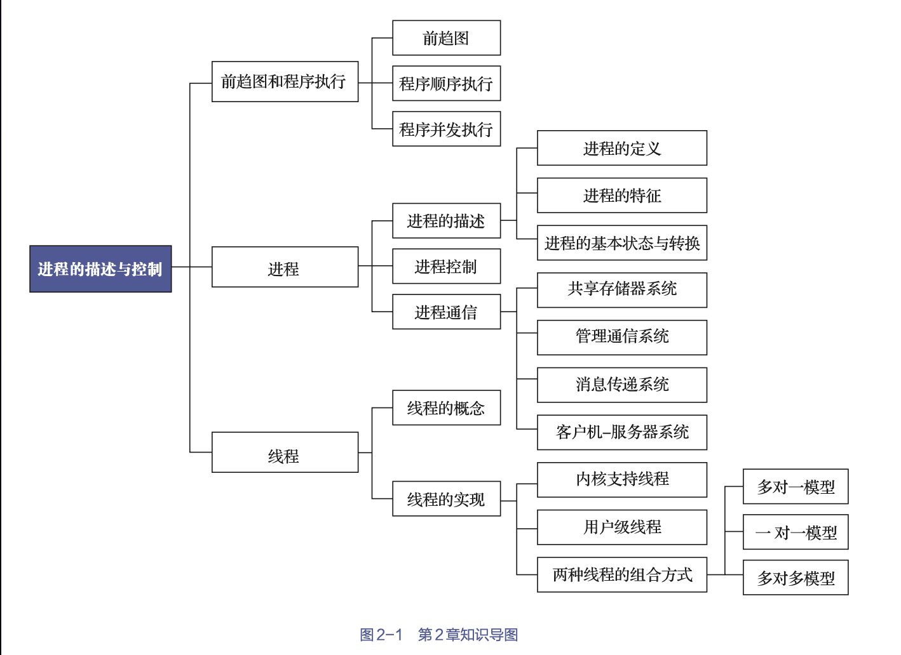


# 前趋图和程序执行

## 前趋图

所谓前趋图（precedence graph），是指一个有向无环图（directed acyclic graph，DAG），它用于描述进程之间执行的先后顺序。图中的每个节点均可用于表示一个进程或一段程序，甚至是一条语句，节点间的有向边则表示两个节点之间所存在的偏序（partial order）或前趋关系（precedence relation）。

> 趋图中是不允许有循环的，否则必然会产生无法实现的前趋关系

- 如果Pi和Pj间存在着前趋关系，则可将它们写成（Pi，Pj）∈→，也可写成Pi→Pj，表示在Pj开始执行之前Pi必须执行完成。此时称Pi是Pj的直接前趋，而称Pj是Pi的直接后继。
- 在前趋图中，把没有前趋的节点称为初始节点（initial node），把没有后继的节点称为终止节点（final node）。
- 每个节点还具有一个权重（weight），用于表示该节点所含有的程序量或程序的执行时间


## 程序顺序执行

通常，一个程序由若干个程序段组成，每个程序段负责完成特定的功能，且它们都需要按照某种先后次序被顺序运行


**特征**

- 顺序性: 处理机会严格按照程序所规定的顺序执行语句
- 封闭性: 程序在封闭的环境下运行，即程序运行时独占全机资源
- 可再现性: 要程序执行时的环境和初始条件相同，当程序重复执行时，总能获得相同的结果


## 程序并发执行

> 只有不存在前趋关系的程序才有可能并发执行

**特征**

- 间断性: 
- 失去封闭性: 系统中存在多个可以并发执行的程序时，系统中的各种资源将为它们所共享
- 不可再现性: 资源共享导致的某一资源被多次更改


# 进程
## 进程的描述

### 进程的定义与特征

**定义**

为了使程序可以并发执行，并且可以对并发执行的程序加以描述和控制，人们在OS中引入了“进程”这一概念。

进程的三种定义
- 进程是程序的一次执行。
- 进程是一个程序及其数据在处理机上顺序执行时所发生的活动。
- 进程是具有独立功能的程序在一个数据集上执行的过程，它是系统进行资源分配和调度的一个独立单位。


进程实体的构成
- 程序段
- 数据段
- PCB实体(进程控制块，process control block，PCB)
    > 统利用PCB来描述进程的基本情况和活动过程，进而控制和管理进程。

**特征**

进程和程序是两个截然不同的概念，进程除了具有程序所没有的PCB外，还具有以下特征。

- 动态性: 进程有一定的生命期，而程序则只是一组有序指令的集合
- 并发性: 多个进程可同时存在与内存中
- 独立性: 指进程是一个能够独立运行、独立获得资源、独立接受调度的基本单位。
- 异步性: 指进程是按异步方式运行的，即按各自独立的、不可预知的速度向前推进。


### 进程的基本状态和转换

**三种状态**

- 就绪(ready)状态: 进程已分配到除CPU以外的所有必要资源后，只要再获得CPU，便可立即执行。
- 执行(running)状态: 指进程获得CPU后其程序“正在执行”这一状态。
- 阻塞(block)状态: 正在执行的进程由于发生某事件（如I/O请求、申请缓冲区失败等）而暂时无法继续执行


**状态间的转换**


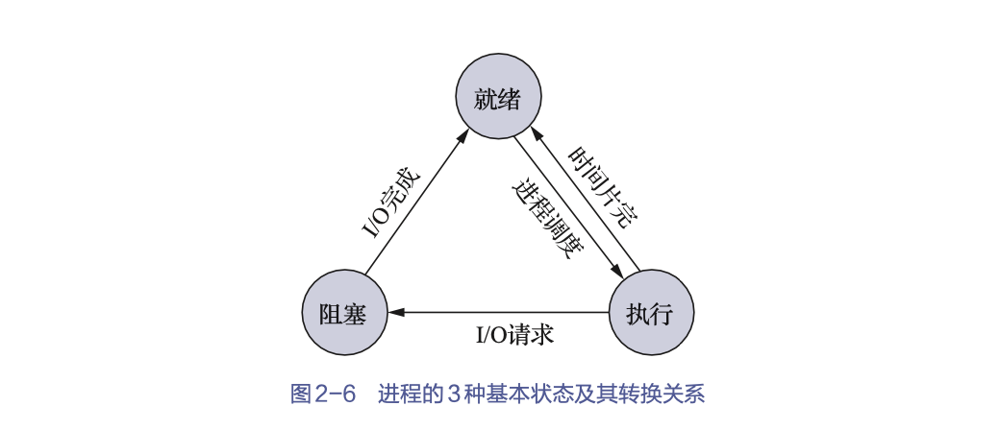
### 创建状态和终止状态

**创建状态**

创建进程的过程称为创建状态


> 创建进程的过程:
> - 由进程申请一个空白PCB，并向PCB中填写用于控制和管理进程的信息；
> - 为该进程分配运行时所必需的资源；
> - 把该进程的状态转换为就绪状态并将其插入就绪队列之中。


**终止状态**

当一个进程到达了自然结束点，或是出现了无法克服的错误，或是被OS
所终止，或是被其他有终止权的进程所终止时，它就会进入终止状态。

> 终止进程的过程：
> - 等待OS进行善后处理
> - 将进程的PCB清零，并将PCB空间返还OS

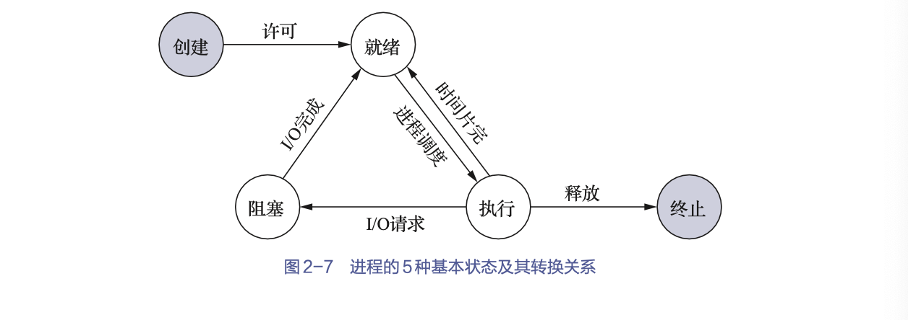


### 挂起操作和进程状态的转换

当该操作作用于某个进程时，该进程将被挂起，这意味着此时该进程处于静止状态。

> 如果进程正在执行，则其此时会暂停执行；如果进程原本处于就绪状态，则其此时暂不接受调度。与挂起操作对应的操作是激活操作。


**目的**

- 终端用户的需要
- 父进程的需要
- 负荷调节的需要向
- OS的需要


**引入挂起操作后的进程状态转换**

引入挂起原语Suspend和激活原语Active（二者须成对使用）后，在二者的共同作用下，进程可能会发生以下几种状态转换。

- 就绪=活动就绪+静止就绪
- 阻塞=活动阻塞+静止阻塞


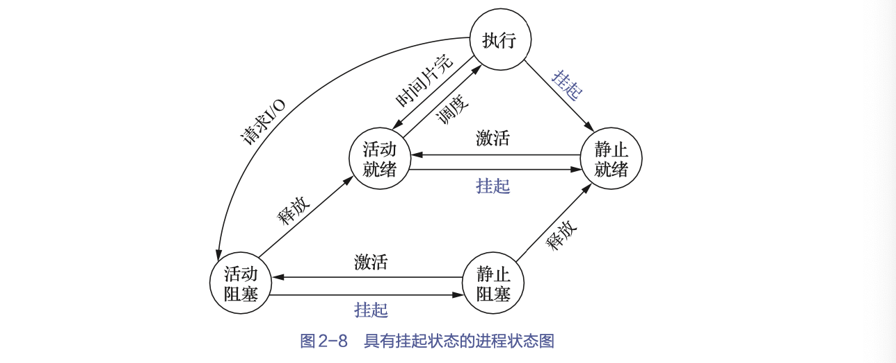

**引入挂起后5个状态之间的转换**

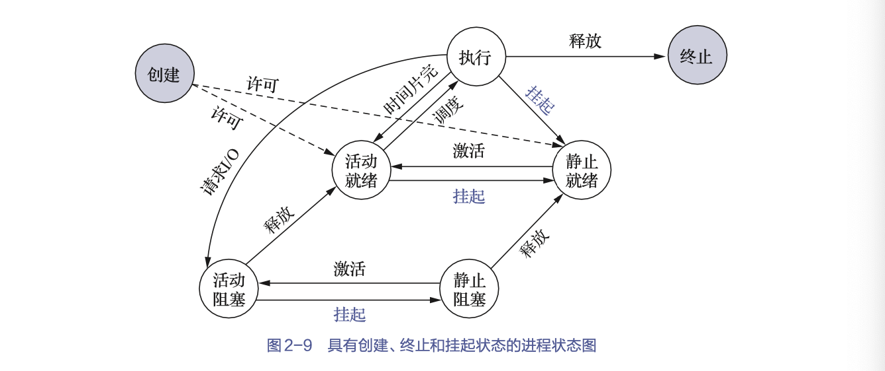


### 进程管理中的数据结构

一分面，为了便于使用和管理计算机中的各类资源（包括硬件和信息），OS将它们抽象为相应的各种数据结构，并提供了一组对资源进行操作的命令；用户可利用这些数据结构及操作命令来执行相关的操作

另一方面，OS还必须记录和查询各种资源的使用情况及各类进程的运行情况等信息；OS对于这些信息的组织和维护，也是通过建立和维护各种数据结构的方式来实现的。

#### OS中用于管理资源和控制进程的数据结构

对于每个资源和每个进程都设置了一个数据结构，用于表征其实体，我们称之为资源信息表和进程信息表，其中包含了资源和进程的标志、描述、状态等信息以及一批指针。

通过这些指针，可以将同类资源和进程的信息表，或者同一进程所占用的资源信息表分类链接成不同的队列，以便OS进行查找。


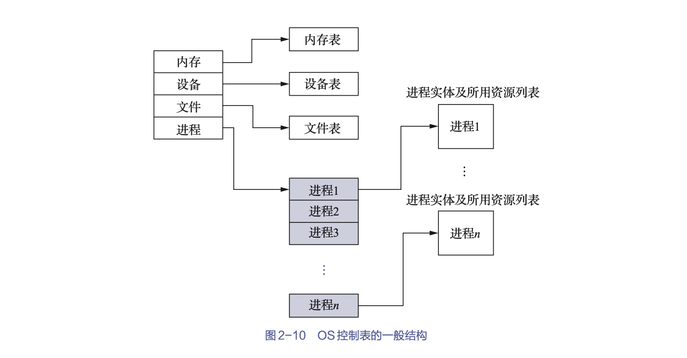
#### PCB

为了便于系统描述和管理进程，OS为每个进程专门定义了一个数据结构——PCB。

PCB作为进程的一部分，记录了OS所需的、用于描述进程当前情况以及管理进程运行状态的全部信息，是OS中最重要的记录型数据结构。


**PCB的作用**

- 作为独立运行基本单元的标志
- 实现间断性运行方式
    > 当进程因阻塞而暂停运行时，它必须保留自己运行时的CPU现场信息，因为其再次被调度运行时，还需要恢复CPU现场信息。在有了PCB后，系统就可以将CPU现场信息保存在被中断进程的PCB中，供该进程再次被调度运行而须恢复CPU现场信息时使用。
- 提供进程管理所需要的信息
- 提供进程调度所需要的信息
- 实现和其他进程的同步与通信


**PCB中的信息**

- 进程标识符: 唯一地标志一个进程
    - 外部标识符: 方便用户（进程）对进程的访问，由创建者提供
    - 内部标识符: 为了方便系统对进程的使用，赋予每个进程唯一的一个数字标识符，它通常是一个进程的序号id。

- 处理机信息: 主要是由处理机的各种寄存器中的内容组成的。
    - 通用寄存器: 可被用户程序访问，用于暂存信息
    - 指令寄存器: 存放了要访问的下一条指令的地址
    - 程序状态字寄存器: 含有状态信息，如条件码、执行方式、中断屏蔽标志等
    - 用户栈指针寄存器: 指每个用户进程都有一个或若干个与之相关的系统栈，用于存放进程和系统的调用参数及调用地址。
> 处理机处于执行状态时，正在处理的许多信息都是放在寄存器中的。当进程被切换时，处理机状态信息都必须保存在相应的PCB中，以便在该进程被重新调度时，能再从断点处继续执行。

- 进程调度信息
    - 进程状态: 指明进程的当前状态，作为进程调度和对换时的依据；
    - 进程优先级: 描述进程使用处理机的优先级别（用一个整数表示），优先级高的进程应优先获得处理机；
    - 其他信息: 如进程已等待CPU的时间总和、进程已执行时间总和等，它们与所采用的进程调度算法有关；
    - 事件: 指进程由执行状态转换为阻塞状态所等待发生的事件，即阻塞原因。

- 进程控制信息
    - 程序和数据的地址: 内存或外存起始地址
    - 进程同步与通信机制: 如消息队列指针、信号量等，它们可能会全部或部分放在PCB中；
    - 资源清单: 列出了进程在运行期间所需的全部资源（除CPU外）；
    - 链接指针: 给出了本进程所在队列中的下一个进程的PCB的始址。


**PCB组织方式**

- 线性方式

将系统中所有的PCB都组织在一张线性表中，将该表的起始地址存放在内存的一个专用区域中。

缺点：每次查找时都需要扫描整张表，因此适合进程数目不多的系统。

- 链接方式

通过PCB中的链接字，将具有相同状态的进程的PCB分别链接成一个队列。

- 索引方式

系统根据所有进程状态的不同，建立几张索引表，如就绪索引表、阻塞索引表等，并把各索引表在内存中的起始地址记录在内存的一些专用单元中。


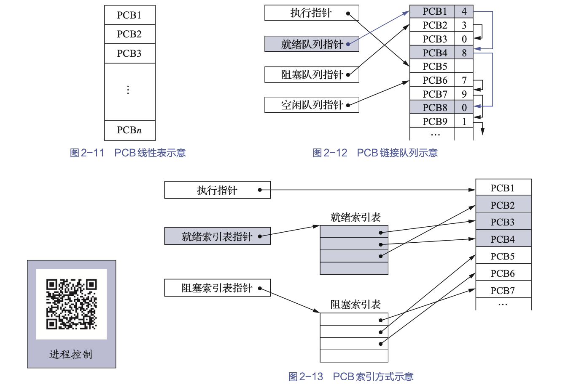
## 进程控制

进程控制一般是由OS内核中的原语来实现的。

### 进程的创建

**进程的层次结构**


在OS中，允许一个进程创建另一个进程，子进程可以继承父进程所拥有的资源
- 父进程：创建进程的进程
- 子进程：被创建的进程
- 父进程的孙进程：子进程可以继续创建其自己的子进程


> 在Windows系统中不存在任何进程层次结构的概念，所有的进程都具有相同的地位。在一个进程创建了另外一个进程后，创建进程获得一个句柄，其作用相当于一个令牌，可以用来控制被创建的进程。但是这个句柄是可以进行传递的，也就是说，获得了句柄的进程拥有控制被创建进程的权力，因此，进程之间的关系不再是层次关系了，而是获得句柄与否、控制与被控制的简单关系。


**进程图**

所谓进程图，就是用于描述父子进程间关系的一棵有向树


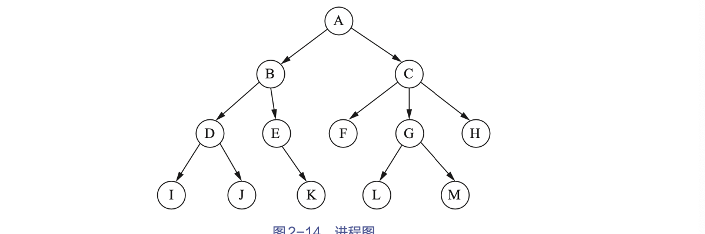

**引起进程创建的事件**

- 用户登录
    > 登录成功，则系统将会为该用户创建一个进程，并把它插入就绪队列中。
- 作业调度
- 提供服务
- 应用请求


**进程的创建**

创建新进程的请求时，OS便会调用进程创建原语，并按下述步骤创建一个新进程。
- 申请空白PCB：为新进程申请一个唯一的数字标识符，并从PCB集合中索取一个空白PCB。
- 为新进程分配其运行所需的资源: 包括各种物理和逻辑资源，如内存、文件、I/O设备和CPU时间等。
> 这些资源从OS或其父进程获得

- 初始化PCB 
    - 初始化标志信息: 将系统分配的标识符和父进程标识符填入新PCB中；
    - 初始化处理机状态信息: 使程序计数器指向程序的入口地址，使栈指针指向栈顶；
    - 初始化诗丽吉控制信息: 将进程的状态设置为就绪状态或静止就绪状态，此外，通常还须将其设置为最低优先级，除非用户以显式方式提出高优先级要求。

- 如果进程就绪队列能够接纳新进程，就将新进程插入就绪队列。


当进程创建新进程时，有两种执行的可能：
- 父进程与子进程并发执行；
- 父进程等待，直到其某个或全部子进程执行完毕。

新进程的地址空间也有两种可能：
- 子进程是父进程的复制品（即子进程具有与父进程相同的程序和数据）；
- 子进程加载另一个新程序。


#### 进程的终止

引起终止的事件
- 正常结束
- 异常结束
    - 越界错: 程序所访问的存储区已越出该进程所占存储区域的范围
    - 保护错: 进程试图去访问一个不允许访问的资源或文件，或者以不适当的方式进行访问
    - 指令错: 程序试图去执行一条不存在的指令（非法指令）
    - 特权错: 程试图去执行一条只允许OS执行的指令；
    - 运行超时: 进程的运行时间超过了设定的最大值；
    - 等待超时: 进程等待某事件的时间超过了指定的最大值；
    - 算数运算错: 进程试图去执行一个被禁止的运算
    - I/O错 
- 外界干预
    - 操作员或OS干预
    - 父进程请求
    - 父进程终止

进程的终止过程

- 根据被终止进程的标识符，从PCB集合中检索出该进程的PCB，并从该进程的PCB中读出该进程的状态；
- 若被终止进程正处于执行状态，则立即终止该进程的执行，并置调度标志为真，以指示该进程被终止后应重新进行调度；
- 若该进程还有子孙进程，则还应终止其所有子孙进程，以防止它们成为不可控的进程；
- 将被终止的进程所拥有的全部资源，或归还给其父进程，或归还给系统；
- 将被终止进程的PCB从所在队列（或链表）中移出，等待其他程序来搜集信息。

**进程的阻塞与唤醒**

引起进程阻塞与唤醒的事件
- 向系统请求共享资源失败
- 等待某种操作的完成
- 新数据尚未到达
- 等待新任务的到达


进程阻塞过程

正在执行的进程，如果发生了上述某事件，进程便会通过调用阻塞原语block将自己阻塞。由此可见，阻塞是进程自身的一种主动行为。进入block阶段后，由于该进程还处于执行状态，因此系统应首先立即停止执行该进程，把PCB中的现行状态由执行改为阻塞，并将PCB插入阻塞队列。如果系统中设置了因不同事件而阻塞的多个阻塞队列，则应将该进程插入具有相同事件的阻塞队列。最后，转至调度程序进行重新调度操作，将处理机分配给另一就绪进程并进行切换，即保留被阻塞进程的处理机状态，并按新进程的PCB中的处理机状态设置CPU的环境。


进程唤醒过程

当被阻塞进程所期待的事件发生时，有关进程（如提供数据的进程）就会调用唤醒原语wakeup以将等待该事件的进程唤醒。

> wakeup的执行过程是：首先把被阻塞的进程从等待该事件的阻塞队列中移出，将其PCB中的现行状态由阻塞改为就绪；然后再将该PCB插入就绪队列中。


### 进程的挂起与激活

进程的挂起

当系统中出现引发进程挂起的事件时，OS就会利用挂起原语suspend将指定进程或处于阻塞状态的进程挂起。

> suspend的执行过程是：首先，检查被挂起进程的状态，若为活动就绪状态，则将其改为静止就绪状态；其次，针对处于活动阻塞状态的进程，将其状态改为静止阻塞状态；再次，为了方便用户或父进程考查该进程的运行情况，把该进程的PCB复制到某指定的内存区域；最后，若被挂起的进程正在执行，则转向调度程序重新调度。


进程的激活

当系统中出现激活进程的事件时，OS就会利用激活原语active将指定进程激活。

> active的执行过程是：首先将进程从外存调入内存，然后检查该进程的现行状态，若是静止就绪，则将其改为活动就绪；若是静止阻塞，则将其改为活动阻塞。假如采用的是抢占调度策略，则每当有静止就绪进程被激活而插入就绪队列时，便应检查是否要进行重新调度，即由调度程序将被激活进程与当前进程两者的优先级进行比较，如果被激活进程的优先级较低，就不必重新调度；否则，立即终止当前进程的运行，并把处理机分配给刚被激活的进程。


## 进程通信

进程通信的类型

1. 共享存储系统

相互通信的进程共享某些数据结构或存储区，进程之间能够通过这些空间进行通信。

- 基于共享数据结构的通信方式

OS仅提供共享存储器(如在生产者-消费者问题中的有界缓冲区)，由程序员负责对共享数据结构进行设置和对进程间同步进行处理。属于低级进程通信。

- 基于共享存储的通信方式

在内存中划出了一块共享存储区，各进程可通过对该共享存储区的读/写来交换信息、实现通信，数据的形式和位置（甚至访问）均由进程负责控制，而非OS。属于高级进程通信。


2. 管道通信系统

所谓“管道”（pipe），是指用于连接一个读进程和一个写进程以实现它们之间通信的一个共享文件，又名pipe文件。

- 向管道（共享文件）提供输入的发送进程（即写进程），会以字节流形式将大量的数据送入管道；
- 而接收管道输出的接收进程（即读进程），则会从管道中接收（读）数据。


需解决的问题
- 互斥：当一个进程正在对管道执行读/写操作时，其他读写进程必须等待。
- 同步
    - 当写（输入）进程把一定数量（如4KB）的数据写入管道后，便去睡眠（等待），直到读（输出）进程取走数据后， 把它唤醒。
    - 当读进程读一空管道时，也应睡眠（等待），直至写进程将数据写入管道后，再把
它唤醒。
- 确定对方是否存在：只有确定了对方已存在时，才能进行通信。

3. 消息传递系统

进程不必借助任何共享数据结构或存储区，而是会以格式化的消息（message）为单位，将通信的数据封装在消息中，并利用OS提供的一组通信命令（原语），在进程间进行消息传递，完成进程间的数据交换。

- 直接通信方法：指发送进程利用OS所提供的发送原语，直接把消息发送给目标进程；
     - 原语
        - 对称寻址方式：该方式要求发送进程和接收进程都必须以显式方式提供对方的标识符
        ```c
        send(receiver, message)     //发送一个消息给接收进程。
        receive(sender, message)    //接收发送进程发来的消息。
        ```
        > 一旦修改进程的名称，怎需要修改所有的引用
    - 进程的同步方式
        - 发送进程阻塞，接收进程阻塞
        - 发送进程不阻塞，接收进程阻塞
        - 发送进程和接收进程均不阻塞

- 间接通信方式：指发送进程和接收进程都通过共享中间实体（称为信箱）的方式进行消息的发送和接收，进而完成进程间的通信。
    - 信箱结构
        - 信箱头：存放信箱的描述信息
        - 信箱体：由若干个可以存放消息（或消息头）的信箱格组成，信箱格的数目以及每格的大小是在创建信箱时确定的。
        > 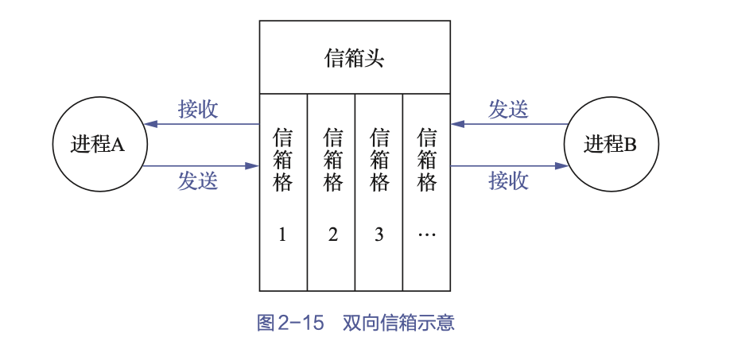

    - 信箱通信原语
        - 信箱的创建和撤销
        - 消息的发送和接收
        ```c
        send(mailbox, message)      //将一个消息发送到指定信箱。
        receive(mailbox, message)   //从指定信箱中接收一个消息。
        ```
    - 信箱的类型
        - 私用信箱：信箱的拥有者可读取，其他用户只能写入。当拥有该信箱的进程结束时，信箱也会消失
        - 共享信箱：信箱的拥有者和共享者，都有权获得信箱发送给自己的消息。
        - 公用信箱：由OS创建，并提供给系统中的所有核准进程使用。


4. 客户端-服务器系统

- 套接字socket
    - 基于文件型：本机上，一个套接字会关联一个特殊的文件，通信双方通过对这个特殊文件进行读/写而实现通信
    > 类似于pipe管道通信
    - 基于网络型：网络上，通信被分配了一对套接字，其中一个属于接收进程（或服务器端），另一个属于发送进程（或客户端）。通过他们来进行通信


- 远程调用RPC(Remote Precedure Call)：允许运行于一台主机（本地）系统上的进程调用另一台主机（远程）系统上的进程


# 线程

## 线程的引入

OS中引入进程的目的是使多个程序能并发执行，以提高资源利用率和系统吞吐量；在OS中再引入线程，则是为了减少程序在并发执行时所付出的时空（时间和空间）开销，以使OS具有更好的并发性。

> 为使程序能并发执行，系统必须进行以下这一系列的操作：
> - 创建进程，系统在创建一个进程时，必须为它分配其所必需的、除处理机以外的所有资源（如内存空间、I/O设备等），并建立相应的PCB；
> - 撤销进程，系统在撤销进程时，又必须先对其所占有的资源执行回收操作，然后再撤销PCB；
> - 进程切换，对进程进行上下文切换时，需要保留当前进程的CPU环境，并设置新选中进程的CPU环境，这一过程须花费不少的处理机时间。
> > 在创建、撤销和切换中，系统必须为之付出较大的时空开销。这就限制了系统中所设置进程的数目，而且进程切换也不宜过于频繁，从而限制了程序并发执行程度的进一步提高。

将进程的两个基本属性分开，由OS分开处理，即并不把“作为调度和分派的基本单位”同时作为拥有资源的基本单位，以实现“轻装上阵”；而对于拥有资源的基本单位，又不对之施以频繁的切换。这就是线程的思想。


线程与进程的比较


- 轻型进程（light-weight process，LWP）：即线程，其具有传统进程所具有的很多特征
- 重型进程（heavy-weight process，HWP）：即传统的进程,它相当于只有一个线程的任务。


1. 更颗粒度的调度单位

把线程作为调度和分派的基本单位，因而线程是能独立运行的基本单位。当进行线程切换时，仅须保存和设置少量寄存器的内容，切换代价远低于进程。
- 在同一进程中，线程的切换不会引起进程的切换
- 但从一个进程中的线程切换到另一个进程中的线程时，必然会引起进程的切换。

2. 更好的并发性

引入线程的OS中，不仅进程之间可以并发执行，而且在一个进程中的多个线程之间亦可并发执行，甚至还允许一个进程中的所有线程都能并发执行。同样，不同进程中的线程也能并发执行。


3. 仅拥有必不可少的资源

进程可以拥有资源，并可作为系统中拥有资源的一个基本单位。然而，线程可以说是几乎不拥有资源，其仅有的一点儿必不可少的资源也是为了确保自身能够独立运行。

线程除了拥有自己的少量资源外，还允许多个线程共享它们共属的进程所拥有的资源
- 属于同一进程的所有线程都具有相同的地址空间
- 线程还可以访问其所属进程所拥有的资源

4. 更低的独立性

同一进程中的不同线程，往往是为了提高并发性以及满足进程间的合作需求而创建的，它们可以共享进程的内存地址空间和资源


5. 更小的系统开销

创建、撤销和切换线程的开销远远小于进程

6. 支持多处理机系统

- 对于传统的进程，即单线程进程，不管有多少处理机，该进程只能运行在一个处理机上。
- 但对于多线程进程，其可以将一个进程中的多个线程分配到多个处理机上，并行运行，这无疑能够加速进程的完成。


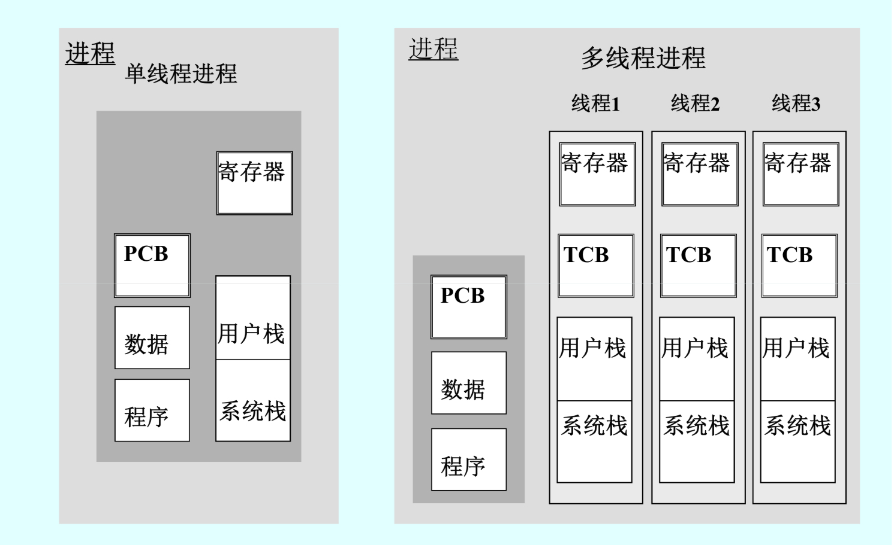


## 线程状态和线程控制块

1. 线程执行的3中状态

与传统的进程一样，各线程之间也存在着共享资源和相互合作的制约关系，这致使线程在执行时也具有间断性。

- 执行状态，指线程已获得处理机而正在执行；
- 就绪状态，指线程已具备各种执行条件，只须再获得CPU便可立即执行；
- 阻塞状态，指线程在执行中因某事件而受阻，进而处于暂停状态


2. 线程控制块

如同每个进程有一个PCB一样，系统也为每个线程配置了一个TCB，将所有用于控制和管理线程的信息均记录在TCB中。

- 状态参数
    - 线程标识符，为每个线程赋予一个唯一的线程标识符；
    - 一组寄存器（包括程序计数器、状态寄存器和通用寄存器等）的内容；
    - 线程执行状态，描述线程正处于何种执行状态；
    - 优先级，描述线程执行的优先程度；
    - 线程专有存储区，用于在线程切换时存放现场保护信息和与该线程相关的统计信息等；
    - 信号屏蔽，即对某些信号加以屏蔽；
    - 堆栈指针，线程在执行时，经常会进行过程调用，而过程调用时通常会出现多重嵌套的情况，这样，就必须把每次过程调用中所使用的局部变量以及返回地址保存起来。为此，应为每个线程设置一个堆栈，用它来保存局部变量和返回地址
        - 指向用户自己堆栈的指针：指当线程运行在用户态时，使用用户自己的用户栈来保存局部变量和返回地址；
        - 指向核心栈的指针：指当线程运行在内核态时，使用系统的核心栈来保存局部变量和返回地址。
- 线程运行状态
- 线程的创建和终止


3. 多线程OS的进程属性

- 进程是一个可拥有资源的基本单位
- 进程已不是可执行的实体
    > 进程仍有与执行相关的状态，但其实际上是指该进程中的某线程的状态
- 多个线程可并发执行
    > 只是含有一个线程；进程为线程提供资源及运行环境，使线程可以并发


## 线程的实现

###  内核支持线程KST(Kernel Supported thread)

为了对内核支持线程进行控制和管理，在内核空间也为每个内核支持线程设置了一个TCB，内核根据该TCB来感知某线程的存在，并对其加以控制。内核支持线程与内核紧密相关的

特点：
依赖OS核心，由内核的内部需求进程创建和撤销，用来执行一个指定的函数
- 内核维护进程和线程的状态信息
- 线程切换由内核完成
- 一个线程阻塞，不会影响其他线程的运行
- 时间片分给线程
> 单进程线程越多，速度越快

优点：
- 多处理机系统中，内核可以同时调度同一进程中的多个线程并发执行
- 如果进程中的一个线程被阻塞，则内核可以调度该进程中的其他线程来占有处理机并运行，也可运行其他进程中的线程；
- 内核支持线程具有很小的数据结构和堆栈，线程的切换比较快，切换开销小；
- 内核本身也可以采用多线程技术，可以提高系统的执行速度和效率。

缺点：  
- 对于用户的线程切换而言，其模式切换的开销较大；
> 在同一个进程中，从一个线程切换到另一个线程时需要从用户态转到内核态进行，这是因为用户进程的线程在用户态运行，而线程调度和管理是在内核中实现的，系统开销较大。


具体实现：
系统在创建一个新进程时，便为它分配一个任务数据区（per task data area，PTDA），其中包括若干个TCB空间。
> 在每个TCB中可保存线程标识符、优先级、线程运行的CPU状态等信息。虽然这些信息与ULT的TCB中的信息相同，但它们被保存在了内核空间中。


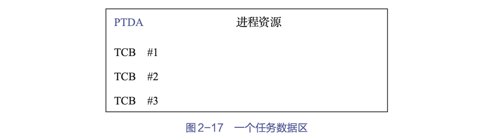


### 用户级线程ULT(User Level Thread)

> 用户级线程不能利用系统调用，但线程需要系统资源时，需将要求传送给运行时系统，由后者通过相应的系统调用获得系统资源

在用户空间中实现的，其对线程的创建、撤销、同步与通信等功能都无须内核支持，即ULT与内核无关。一个系统中的ULT数目可以达到数百个甚至数千个。由于这些线程的TCB都设置在用户空间，而线程所执行的操作又无须内核支持，因而内核完全不知道ULT的存在。

> 对于设置了ULT的系统，其调度仍是以进程为单位进行的。

优点：
- 线程切换不需要转换到内核空间。
- 调度算法可以是进程专用的。
> 在不干扰OS调度的情况下，不同的进程可以根据自身需要选择不同的调度算法，以对自己的线程进行管理和调度，而与OS的低级调度算法无关。
- 用户级线程的实现与OS平台无关。
> 因为面向线程管理的代码属于用户程序的一部分，所有的应用程序都可以共享这段代码。

缺点：
- 一个线程阻塞，则整个进程等待
- 多线程应用不能利用多处理机进行
> 内核每次分配给一个进程的仅有一个CPU。
- 时间片分配给进程
> 单进程线程越多，则每个线程就慢


具体实现：
- 运行时系统

所谓运行时系统（runtime system），实质上是用于管理和控制线程的函数（过程）的集合
> 其中包括用于创建和撤销线程的函数、用于控制线程同步和通信的函数以及用于实现线程调度的函数等。

执行过程：
保存现场：将线程的CPU状态保存在该线程的堆栈中
选新：然后按照一定的算法选择一个处于就绪状态的新线程运行
装载：并将新线程堆栈中的CPU状态装入CPU相应的寄存器中

- 核心线程（组合方式）

核心线程又称轻型进程LWP(Light Weight Process)。每一个进程都可拥有多个LWP。
> - 同ULT一样，每个LWP都有自己的数据结构（如TCB），其中包括线程标识符、优先级、CPU状态等信息，另外还有栈和局部存储区等。
> - LWP也可以共享进程所拥有的资源。

LWP可通过系统调用来获得内核提供的服务，这样，当一个ULT运行时，只须将它连接到一个LWP上，它便能具有KST的所有属性。这种线程实现方式就是组合方式。

一个系统中的ULT数量可能很大，为了节省系统开销，不可能设置太多的LWP，而是会把这些LWP做成一个缓冲区，称之为***“线程池”***。用户进程中的任一ULT都可以连接到线程池中的任一LWP上。
为使每一个ULT都能利用LWP与内核通信，可以使多个ULT多路复用一个LWP，但只有当前连接到LWP上的ULT才能与内核通信，其余线程或阻塞、或等待LWP。
每个LWP都要连接到一个KST上，这样，通过LWP即可把ULT与KST连接起来，ULT可通过LWP来访问内核，但内核所看到的总是多个LWP而非ULT。亦即，由LWP实现了内核与ULT之间的隔离，从而使ULT与内核无关。


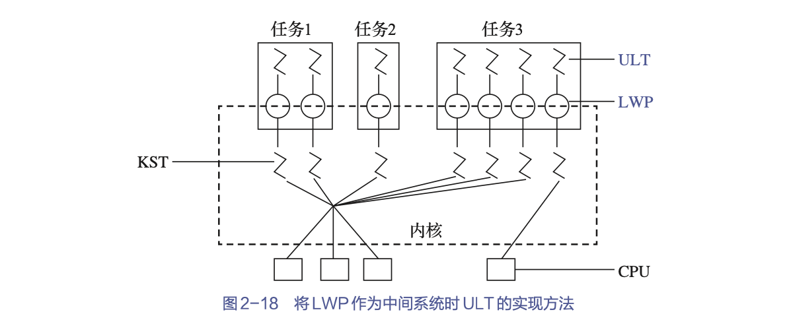

### 两种线程的组合方式

有些OS把ULT和KST这两种线程进行组合，提供了组合方式的ULT/KST线程。在组合方式线程系统中
- 内核支持多个KST的建立、调度和管理，同时也允许用户应用程序建立、调度和管理ULT。
- 一些KST对应多个ULT，这是ULT通过时分多路复用KST来实现的，即将ULT对部分或全部KST进行多路复用，并且程序员可按应用需要和机器配置对KST的数目进行调整，以达到较好的效果。


当ULT不需要与内核通信时，并不需要LWP；而当其要通信时，便须借助LWP，而且每个要通信的ULT都需要一个LWP。

在KST执行操作时，如果其发生阻塞，则与之相连接的多个LWP也将随之阻塞，进而使连接到LWP上的ULT也被阻塞。


组合方式模型

- 多对一模型：将多个ULT映射到一个KST上。仅当ULT需要访问内核时，才会将其映射到一个KST上，但每次只允许一个线程进行映射。
    - 优点：线程管理的开销小，效率高。
    - 缺点
        - 如果一个线程在访问内核时发生阻塞，则整个进程都会被阻塞；
        - 此外，在任一时刻，只有一个线程能够访问内核，多个线程不能同时在多个处理机上运行。
- 一对一模型：将每个ULT映射到一个KST上
    - 优点
        - 当一个线程阻塞时，允许调度另一个线程运行，所以它提供了比多对一模型更好的并发性能。
        - 在多处理机系统中，它允许多个线程并行地运行在多处理机系统上。
    - 缺点：每创建一个ULT，相应地就需要创建一个KST，开销较大，因此需要限制整个系统的线程数。
- 多对多模型：将许多ULT映射到同样数量或较少数量的KST上。
    - 优点
        - 可以像一对一模型那样使一个进程的多个线程并行地运行在多处理机系统上
        - 也可以像多对一模型那样减少线程管理开销并提高效率。

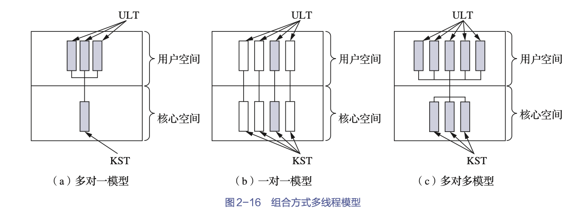


# 本章小结

本章从程序的执行方式入手，先后引入了OS中的两个重要概念：进程和线程。程序的执行方式有顺序执行和并发执行两种。
- 顺序执行方式下，单个程序独占内存运行，系统的运行效率低；
- 并发执行方式下，多个程序占用内存并轮流在CPU上运行，系统的运行效率得到了提升。

进程就是指正在运行的程序，它在运行过程中会改变状态，这些状态是根据进程当前的活动来定义的，包括创建、就绪、运行、阻塞和终止等。

OS中的每个进程都是通过与之一一对应的PCB来实现控制和管理的。进程控制包括：进程创建、进程终止、进程阻塞与唤醒、进程挂起与激活等，这些控制操作需要用原语的方式来完成。

进程间可以相互通信，通信方法多样，常用的有管道、信号、消息队列、共享内存、信号量、套接字等。

为了提高程序并发执行的程度，引入了比进程更小的单位——线程。引入线程后，在资源共享、用户响应、经济性和多处理机架构等方面有诸多好处，能够进一步改善系统的性能。

引入线程后，进程是资源分配的单位，线程是CPU调度的单位。

线程可分为KST和ULT两种，不同的系统会支持某一种线程，或者两种都支持。由于ULT和KST的连接方式不同，形成了3种不同的多线程模型：多对一模型、一对一模型和多对多模型。
