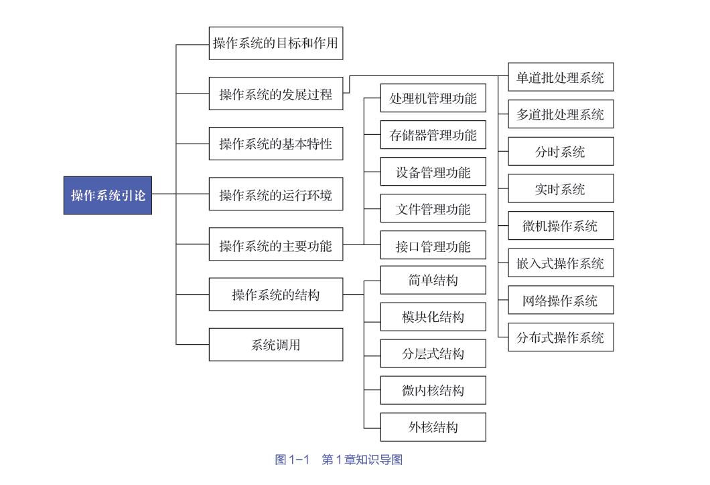

**第一章、操作系统的介绍(operating system,OS)**

[toc]

# 1.操作系统的目标和作用

## 地位

1. 计算机系统的两个组成部分
- 硬件
- 软件

2. 地位
- 配置置在计算机硬件上的第一层软件（对硬件系统的首次扩充）
- 其他软件的运行都依赖于OS的支持
- 其主要作用是
    - 管理硬件设备，提高它们的利用率和系统吞吐量
    - 为用户和应用程序提供一个简单的接口，以便于用户和应用程序使用硬件设备

## 目标

1. 方便性

通过OS命令操纵计算机，方便用户

2. 有效性

管理和分配硬件资源，合理的组织计算机的工作流程

提高系统资源的利用率，提高系统的吞吐量

3. 可扩充性

为了适应发展的需求，需要便于添加新的功能层次和模块，并能修改老的功能层次和模块

4. 开放性

遵循世界标准规范，特别是遵循开放系统互连OSI伙计标准

## 作用

1. 人机交互

用户与计算机硬件系统之间的接口
- 命令方式
- 系统调用方式
- 图形窗口方式

2. 资源管理

OS作为计算机系统资源的管理者，负责
- 处理机管理：负责处理机的分配与控制；
- 存储器管理：负责内存的分配与回收；
- I/O 设备管理：负责I/O设备的分配（回收）与操纵；
- 文件管理：负责文件的存取、共享与保护等

3. 资源抽象

OS实现了对计算机资源的抽象
- 隐藏了I/O设备操作的细节
- 并可向上将I/O设备抽象为一组数据结构以及一组I/O操作命令

## 推动操作系统发展的主要动力

1. 不断提高计算机系统资源的利用率
2. 方便用户
3. 器件的发展
4. 计算机体系不断发展
5. 新的应用需求

# 2. 操作系统的发展过程

## 无作系统的计算机系统

1. 人工操作方式  

- 用户直接使用计算机硬件系统
- 编程语言：机器语言
- 输入输出：纸带或卡片
- 过程
    - 用户将事先已穿孔的纸带（卡片），装入纸带输入机（卡片输入机）
    - 再启动它们以将纸带（或卡片）上的程序和数据输入计算机，然后启动计算机运行
    - 计算机运行结束，通过输出设备将结果以穿孔纸带（卡片）的形式传出
    - 仅当程序运行完毕并取走计算结果后，才允许下一个用户上机。
- 缺点
    - 用户独占全机
    - CPU等待人工操作

2. 脱机I/O方式  

- 过程
    - 事先将装有用户程序和数据的纸带装入纸带输入机
    - 在一台外围机的控制下，把纸带上的程序和数据输入磁带
    - 当CPU需要这些程序和数据时，再从磁带上将它们高速地调入内存
- 优点
    - 减少了CPU的空闲时间
    - 提高了I/O速度

## 单道批处理系统

1. 特点

- 对作业的处理是成批进行的
- 且内存中始终只保持一道作业，称为单道批处理

2. 过程

- 先把一批作业以脱机I/O方式输入到磁带上
- 并在系统中配上监督程序
- 在监督程序的控制下，这批作业能一个接一个地被连续处理

处理过程：首先由监督程序将磁带上的第一个作业装入内存，并把运行控制权交给该作业；当该作业处理完成时，又把运行控制权交还给监督程序，再由监督程序把磁带上的第二个作业调入内存。

3. 缺点

- 切换作业时会出现CPU等待IO的空闲时间

## 多道批处理系统

1. 过程

- 作业在外存中排队（后备队列）
- 由作业调度程序按一定的算法从后备队列中选择若干个作业调入内存，使它们共享CPU和系统中的各种资源。  

2. 特点
- 内存中有若干道程序，可实现多道程序交替运行，可保持CPU处于忙碌状态
- 资源利用率高
- 系统吞吐量大
- 作业平均周转时间长：一次处理多个作业，可能需要等待
- 无交互能力

## 其他系统

1. 分时系统

一台主机上连接多个终端
- 同时允许用户通过终端以交互方式使用计算机中的资源
- 将系统资源进行时间上分割（时间片），分给用户使用

2. 实时系统

对作业的完成存在时间上的要求

3. 嵌入式操作系统

- 嵌入道设备内部
- 为完成某特定功能而设计
- 结合了计算机硬件和软件

4. 网络操作系统

在计算机网络环境下
- 对网络资源进行管理和控制
- 实现数据通信及对网络资源的共享

5. 分布式操作系统

基于软件实现的多处理机系统，是多个处理机通过通信线路互连而构成的松耦合系统

# 3. 基本特性

## 并发（concurrence）

1. 并发的概念

并发：多个事件在**同一时间段内**发生
> 并行: 多个事件在同一时刻发生

正是系统中的程序能并发执行，才使得OS能有效地提高系统中资源的利用率，增加系统的吞吐量。

2. 进程

指在系统中能独立运行并能作为资源分配对象的基本单位
- 运行中的程序
- 由一组机器指令、数据和堆栈等组成的，是一个能独立运行的活动实体
- 多个进程之间可以并发执行和交换信息
- 进程是并发操作的前提，这也是进程的目的

3. 线程

- 进程拥有资源并作为独立运行的基本单位，进程切换的开销较大
- 一个进程可以包含若干个线程，它们可以利用进程所拥有的资源，而把线程作为独立运行和独立调度的基本单位
- 线程比进程更小，基本上不拥有系统资源，对它的调度所付出的开销就会小得多

## 共享

共享：指系统中的所有资源可供内存中多个并发执行的进程（线程）共同使用
- 互斥共享方式：规定在一段时间内只允许一个进程访问该资源。
- 同时共享方式：允许在一段时间内由多个进程“同时”对它们进行访问

## 虚拟

虚拟：把通过某种技术将一个物理实体变为若干个对应的逻辑实体

1. 时分复用技术
- 虚拟处理机技术
- 虚拟设备技术

2. 空分复用技术
- 虚拟磁盘技术

## 异步

异步：指进程的**执行顺序**和**执行时间**的不确定性
- 进程的运行速度不可预知
- 无论快慢，结果应当相同
- 难以重现系统某时刻的状态

# 3. 操作系统的运行环境

## 硬件支持

1. 计算机启动时
- 运行引导程序（boot loader），其位于计算机固件中（firmware），它会
    - 初始化系统的各个部件以及内存内容
    - 加载OS并开始执行系统
- 内核被加载到内存中并执行，它就会开始为系统与用户提供服务
- 系统程序在启动时会被加载到内存而成为系统进程或系统后台程序
> 对于UNIX系统，首个系统进程为“init”，它启动了许多其他的系统后台程序，之后系统就完全启动了，并且会等待事件发生

2. 计算机启动后
- CPU只能从内存中加载指令，因此要执行的程序必须位于内存

## 操作系统内核

一直运行在计算机上的程序，常驻内存，可访问硬件，通常将
- 与硬件紧密相关的模块（如中断处理程序等）
- 各种常用设备的驱动程序
- 运行频率较高的模块（如时钟管理模块、进程调度模块等）
- 以及许多模块所公用的一些基本操作  
都安排在紧靠硬件的软件层次中，并将它们常驻内存。它们通常被称为OS内核

1. 支撑功能

提供给OS其他众多模块所需要的一些基本功能，以支撑这些模块工作。
- 中断处理
- 时钟管理
- 原语操作

2. 资源管理功能

- 进程管理
- 储存器管理
- 设备管理

## 处理机的双重工作模式

1. 特权指令

有特殊权限的指令，用于系统资源的分配和管理

2. 两种状态
- 用户态(1): 不能执行特权指令
- 内核态(0): 执行包括特权命令在内的一切命令
> 硬件提供模式位，记录当前状态

3. 用户态向内核态的切换
- 进程发生系统调用
- 进程产生异常
- 外设产生中断

# 4. 操作系统的主要功能

## 处理机管理功能

处理机的分配和运行都以进程为基本单位，因而对处理机的管理可归结为对进程的管理

1. 进程调度

从作业或进程的就绪队列中选出几个，分配资源并使其允许
- 作业调度
- 进程调度

2. 进程控制

为作业创建进程，撤销已结束的进程，以及控制进程在运行过程中的状态转换

3. 进程同步

对多个进程（含线程）的运行进行协调。

4. 进程通信

在一组相互合作的进程中交换信息

## 存储器管理功能

1. 内存分配与会回收

- 静态分配方式

每个作业的内存空间是在作业装入时确定的，之后不可变

- 动态分配方式

每个作业所要求的基本内存空间虽然也是在装入时确定的，但之后可变

2. 内存保护

确保每道程序都只在自己的内存空间中运行

3. 地址映射

将地址空间中的逻辑地址变换为内存空间中与之对应的物理地址
- 每道程序经编译和链接后所形成的可装入程序，其地址都是从0开始的
- 但不可能将它们从内存的“0”地址（物理）开始装入

4. 内存扩充

- 请求调入功能
- 置换功能

## 设备管理功能

1. 任务
- 完成用户进程提出的I/O请求
- 提高CPU和I/O设备的利用率

2. 措施
- 设备分配
- 设备管理驱动
- 缓冲处理

## 文件管理功能

- 文件存储管理
- 目录管理
- 文件的读/写管理和保护

## 接口管理功能

1. 用户接口

用户可通过该接口向作业发出命令以控制作业的运行
- 联机用户接口：命令行方式(command-line interface,CLI)
- 脱机用户接口：用户使用作业控制语言（job control language，JCL）把需要对作业进行的控制和干预的命令，事先写在作业说明书上，然后将它与作业连在一起提供给系统。    

2. 程序接口

程序取得OS服务的唯一途径
- 由一组系统调用组成的
- 每个系统调用都是一个能完成特定功能的子程序

3. 图形用户接口

# 5. 操作系统的结构

## 简单结构

早期开发OS时
- OS是一组函数的集合，各函数互相调用
- 设计者只把他的注意力放在了功能的实现和获得更高的效率上

## 模块化结构

1. 概念

- 将OS按其功能精细地划分为若干个具有一定独立性和大小的模块
- 并规定各模块间的接口，使各模块之间能通过该接口实现交互
- 然后进一步将各模块细分为若干个具有一定功能的子模块

2. 评价标准

衡量模块独立性的两个标准
- 内聚性：模块内部各部分间联系的紧密程度
- 耦合性：指模块间相互联系和相互影响的程度

## 分层式结构

1. 概念

- 将一个OS分为若干个层次
- 每层又由若干个模块组成
- 各层之间只存在单向的依赖关系，即高层仅依赖于紧邻它的低层

2. 缺点

- 主要缺点是系统效率较低
- 由于分层式结构是分层单向依赖的，必须在各层之间都建立层间的通信机制
- OS每执行一个功能，通常要自上而下地穿越多个层次，增加系统的通信开销

## 微内核结构

将操作系统划分为两大部分
- 微内核
- 多个服务器

1. 特点

- 足够小的内核
    微内核不是一个完整的OS，能实现OS最基本核心功能
    - 用于处理与硬件紧密相关的部分；
    - 实现一些最基本的功能；
    - 负责客户和服务器之间的通信

- 基于客户/服务器模式

    将OS中最基本的部分放入内核中，而把OS的绝大部分功能都放在微内核外面的一组服务器（进程）中实现

- 采用策略与机制分离原则

    机制是底层，策略是上层建筑，将真正执行操作的底层与调用它的策略分离

- 采用面向对象技术

2. 微内核的基本功能

- 进程（线程）管理 
- 底层存储器管理
- 中断和陷入处理

3. 缺点 

微内核OS的运行效率有所降低
- 客户/服务器模式和消息传递机制
- 用户/内核模型和上下文切换

## 外核结构

- 一个非常小的内核负责保护系统资源
- 应用程序负责管理硬件资源

# 6. 系统调用

1. 概念

系统调用提供了用户程序和OS内核之间的接口
- 不仅可供所有的应用程序使用
- 还可供OS自身使用

2. 类型

- 进程控制类系统调用
- 文件操作类系统调用
- 进程通信类系统调用
> 除了上述的3大类系统调用外，常用的系统调用还包括设备管理类系统调用和信息维护类系统调用

# 7. 小结

1. 一个完整的计算机系统由硬件和软件组成
- 硬件是软件得以建立和开展活动的基础
- 而软件则是对硬件功能的扩充
- OS是裸机之上的第一层系统软件
    - 向下管理系统中各类资源
    - 向上为用户和程序提供服务

2. OS具有并发、共享、虚拟和异步等特征，其运行需要硬件支持

3. 为了保护系统不被破坏，处理机的运行模式可分为两种，即用户态和内核态，可能引起系统危险的特权指令只能运行在内核态中

4. OS是中断驱动的，因此中断和异常是计算机系统中的一个重要机制，它保证了OS的正常运行。

5. OS是一个大型的系统软件，采用结构化的设计很重要

6. 系统调用是OS内核与用户程序之间的接口，每个OS都提供了大量的系统调用给程序员使用。

