<!-- ../../computer_operating_system/1.introduction/process.md -->

第二章：进程的描述与控制


[toc]

---

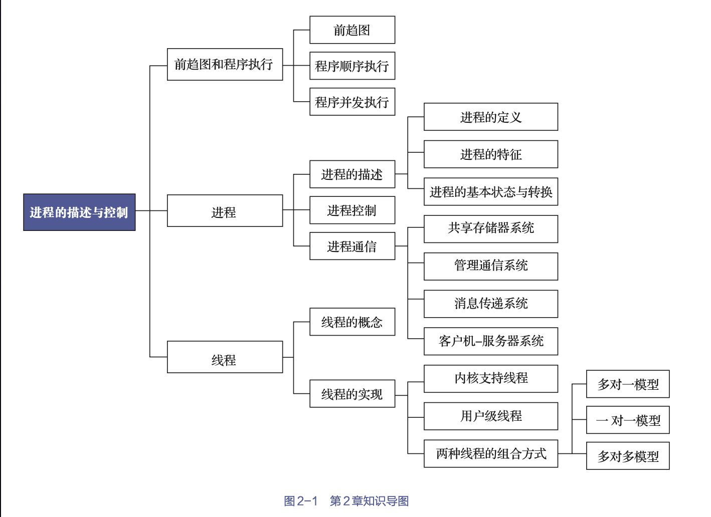


# 前趋图和程序执行

## 前趋图

指一个有向无环图，它用于描述进程之间执行的先后顺序
- 每个节点均可用于表示一个进程或一段程序，甚至是一条语句
    - 把没有前趋的节点称为初始节点，把没有后继的节点称为终止节点
    - 每个节点还具有一个权重，用于表示该节点所含有的程序量或程序的执行时间
- 如果$P_i$和$P_j$间存在着前趋关系，可写成$P_i\rightarrow P_j$，表示在$P_j$开始执行之前$P_i$必须执行完成
    - 称$P_i$是$P_j$的直接前趋，而称$P_j$是$P_i$的直接后继。

> 趋图中是不允许有循环的，否则必然会产生无法实现的前趋关系


## 程序顺序执行

1. 定义

- 一个程序由若干个程序段组成，每个程序段负责完成特定的功能
- 它们都需要按照某种先后次序被顺序运行


2. 特征

- 顺序性: 处理机会严格按照程序所规定的顺序执行语句
- 封闭性: 程序在封闭的环境下运行，即程序运行时独占全机资源
- 可再现性: 程序执行初始条件相同，则结果相同


## 程序并发执行

1. 前提

只有不存在执行顺序关系的程序才有可能并发执行

2. 特征

- 间断性（异步性）: 多个程序并发执行时，存在相互制约关系，导致“执行、暂停、执行”这种间断性活动
- 失去封闭性: 多个程序共享系统资源
- 不可再现性: 资源共享导致的某一资源被多次更改


# 进程的描述

进程的作用：
- 为了使程序可以并发执行
- 并且可以对并发执行的程序加以描述和控制


## 进程的定义与特征

1. 定义


进程是进程实体的运行过程，是系统进行资源分配和调度的一个独立单位

$$进程实体 = 程序段 + 相关数据段 + PCB$$

2. 特征

- 动态性: 进程有一定的生命期，而程序则只是一组有序指令的集合
- 并发性: 多个进程可同时存在与内存中，且能在同一段时间内同时进行
- 独立性: 指进程是一个能够独立运行、独立获得资源、独立接受调度的基本单位（通过PCB）
- 异步性: 指进程是按异步方式运行的，即按各自独立的、不可预知的速度向前推进


## 进程的基本状态和转换

1. 三种状态

- 就绪(ready)状态: 进程已分配到除CPU以外的所有必要资源后，只要再获得CPU，便可立即执行
- 执行(running)状态: 指进程获得CPU后其程序“正在执行”这一状态
- 阻塞(block)状态: 正在执行的进程由于发生某事件（如I/O请求、申请缓冲区失败等）而暂时无法继续执行


2. 状态间的转换

- 就绪队列：处于就绪状态的进程可能有多个，常排成一个队列
- 阻塞队列：处于阻塞状态的进程排成队列。有的系统则根据阻塞原因的不同，把处于阻塞状态的进程排成多个队列。

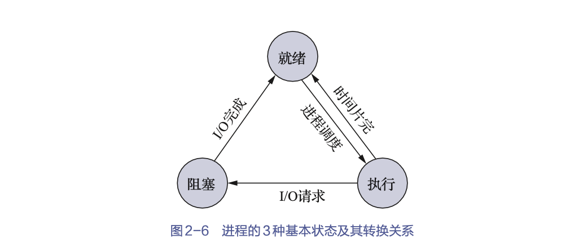

### 创建状态和终止状态

1. 创建状态

创建进程的过程称为创建状态

创建进程的过程:
- 由进程申请一个空白PCB，并向PCB中填写用于控制和管理进程的信息；
- 为该进程分配运行时所必需的资源；
- 把该进程的状态转换为就绪状态并将其插入就绪队列之中。


2. 终止状态

终止进程的过程称为终止状态

终止进程的过程：
- 等待OS进行善后处理
- 将进程的PCB清零，并将PCB空间返还OS

原因：
- 自然原因：到达了自然结束点
- 病死：出现了无法克服的错误
- 他杀：被OS所终止，或是被其他有终止权的进程所终止


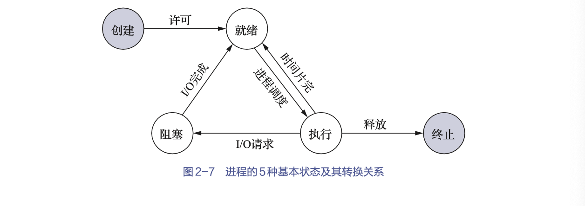


### 挂起操作

1. 定义

- 挂起操作作用于某个进程时，意味着此时该进程处于静止状态
    - 如果进程正在执行，则其此时会暂停执行
    - 如果进程原本处于就绪状态，则其此时暂不接受调度
- 与挂起操作对应的操作是激活操作
> 挂起和激活操作须成对使用


2. 目的

- 终端用户的需要
- 父进程的需要
- 负荷调节的需要向
- OS的需要


3. 引入挂起后5个状态之间的转换

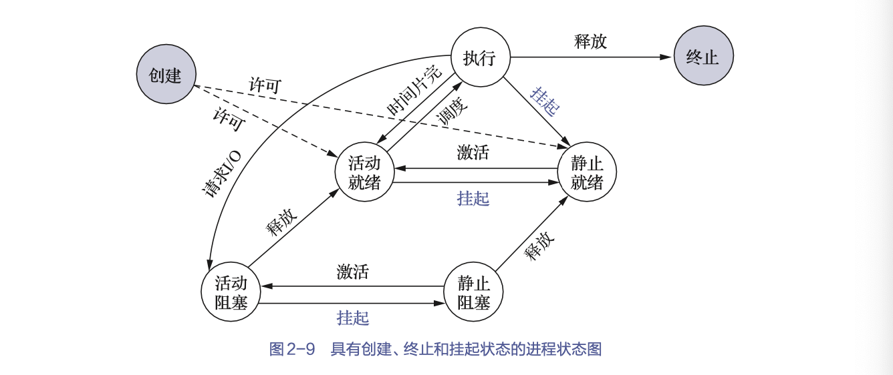


## 进程管理中的数据结构

为了便于使用和管理计算机中的各类资源（包括硬件和信息）
- OS将各类资源抽象为相应的各种数据结构
- 并提供了一组对资源进行操作的命令
- OS对各种资源相关信息的记录、查询、维护也是通过建立和维护各种数据结构的方式来实现的

### OS控制表

对于每个资源和每个进程都设置了一个数据结构，用于表征其实体，我们称之为OS控制表，其中包含了资源和进程的标志、描述、状态等信息以及一批指针

通过这些指针，可以将同类资源和进程的信息表，或者同一进程所占用的资源信息表分类链接成不同的队列，以便OS进行查找。

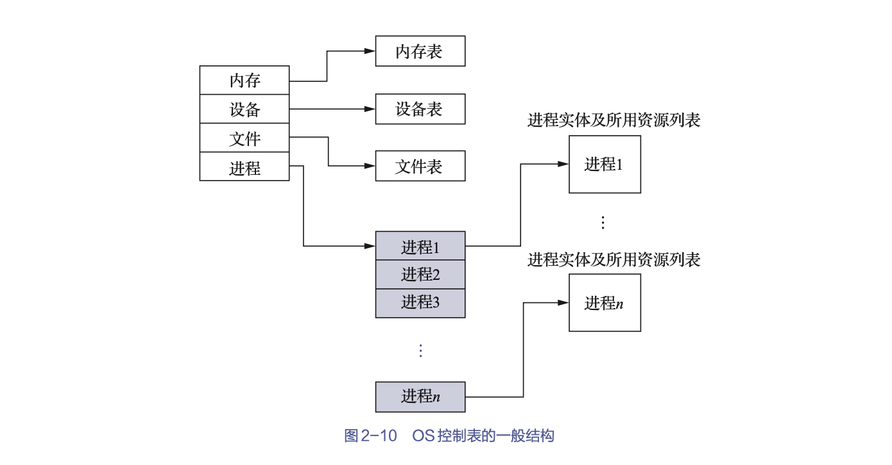

### 进程控制块PCB

1. 引入

为描述和控制进程的运行，OS为每个进程专门定义了一个进程控制块PCB(Process Control Block)

PCB作为进程的一部分，记录了OS所需的、用于描述进程当前情况以及管理进程运行状态的全部信息，是OS中最重要的记录型数据结构。


2. 作用

使程序(含数据)，成为一个能独立运行与其他进程并发执行的基本单位
- 提供进程管理所需要的信息
- 提供进程调度所需要的信息，例如CPU现场信息
- 实现和其他进程的同步与通信
- 唯一标记一个进程


3. PCB中的数据

- 进程标识符: 唯一地标志一个进程
    - 外部标识符: 方便用户（进程）对进程的访问，由创建者提供
    - 内部标识符: 方便系统对进程的使用，赋予每个进程唯一的一个数字标识符（进程id）

- 处理机信息: 处理机的各种寄存器中的内容组成（通用寄存器，指令计数器，程序状态子PSW，用户栈指针）

- 进程调度信息
    - 进程状态: 指明进程的当前状态，作为进程调度和对换时的依据；
    - 进程优先级: 描述进程使用处理机的优先级别
    - 其他信息: 如进程已等待CPU的时间总和、进程已执行时间总和等，它们与所采用的进程调度算法有关；
    - 事件: 阻塞原因

- 进程控制信息
    - 程序和数据的地址: 内存或外存起始地址
    - 进程同步与通信机制: 如消息队列指针、信号量等
    - 资源清单: 列出了进程在运行期间所需的全部资源（除CPU外）；
    - 链接指针: 给出了本进程所在队列中的下一个进程的PCB的始址。


4. PCB组织方式

- 线性方式

将所有的PCB都组织在一张线性表中，将该表存放在内存的一个专用区域中

缺点：每次查找时都需要扫描整张表，因此适合进程数目不多的系统。

- 链接方式

通过PCB中的链接字，将具有相同状态的进程的PCB分别链接成一个队列

- 索引方式

系统根据所有进程状态的不同，建立几张索引表，如就绪索引表、阻塞索引表等，并把各索引表在内存中的起始地址记录在内存的一些专用单元中。
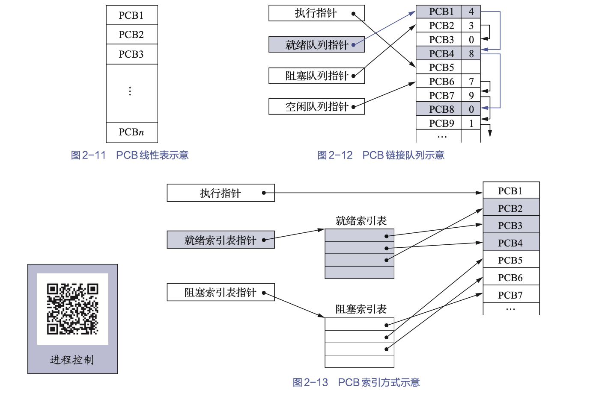


# 进程控制


进程控制是进程管理中最基本的功能
- 创建新进程
- 终止进程（终止因出现某事件而无法运行的进程）
- 进程运行中的状态转换

进程控制一般是由OS内核中的原语来实现的

## 进程的创建

1. 进程图

进程图: 用于描述父子进程间关系的一棵**有向树**

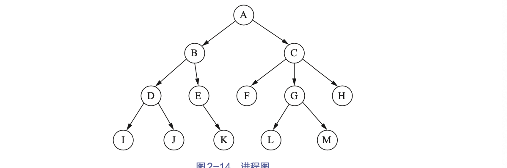

OS中，允许一个进程创建另一个进程，子进程可以继承父进程所拥有的资源
- 父进程：创建进程的进程
- 子进程：被创建的进程
- 父进程的孙进程：子进程可以继续创建其自己的子进程

> Windows系统中所有的进程都具有相同的地位，在一个进程创建了另外一个进程后，创建进程获得一个句柄，相当于一个令牌，可以用来控制被创建的进程。但是这个句柄是可以进行传递的


2. 引起进程创建的事件

- 用户登录
- 作业调度
- 提供服务: 满足用户提出的要求
- 应用请求: 应用进程为自己创建一个新进程


3. 创建过程

创建新进程的请求时，OS便会调用进程创建原语
- 申请空白PCB：为新进程申请一个唯一的数字标识符，并从PCB集合中索取一个空白PCB。
- 为新进程分配其运行所需的资源: 包括各种物理和逻辑资源，如内存、文件、I/O设备和CPU时间等。
    > 这些资源从OS或其父进程获得
- 初始化PCB 
    - 初始化标志信息: 将系统分配的标识符和父进程标识符填入新PCB中；
    - 初始化处理机状态信息: 使程序计数器指向程序的入口地址，使栈指针指向栈顶；
    - 初始化处理机控制信息: 将进程的状态设置为就绪状态或静止就绪状态，此外，通常还须将其设置为最低优先级，除非用户以显式方式提出高优先级要求。

- 如果进程就绪队列能够接纳新进程，就将新进程插入就绪队列。


4. 创建结构

当进程创建新进程时，有两种执行的可能：
- 父进程与子进程并发执行；
- 父进程等待，直到其某个或全部子进程执行完毕。

新进程的地址空间也有两种可能：
- 子进程是父进程的复制品（即子进程具有与父进程相同的程序和数据）；
- 子进程加载另一个新程序。


## 进程的终止

1. 引起终止的事件
- 正常结束（寿终正寝）
- 异常结束（病死）
    - 越界错: 程序所访问的存储区已越出该进程所占存储区域的范围
    - 保护错: 进程试图去访问一个不允许访问的资源或文件，或者以不适当的方式进行访问
    - 指令错: 程序试图去执行一条不存在的指令（非法指令）
    - 特权错: 程试图去执行一条只允许OS执行的指令；
    - 运行超时: 进程的运行时间超过了设定的最大值；
    - 等待超时: 进程等待某事件的时间超过了指定的最大值；
    - 算数运算错: 进程试图去执行一个被禁止的运算
    - I/O错 
- 外界干预（被杀）
    - 操作员或OS干预
    - 父进程请求
    - 父进程终止

2. 进程的终止过程

- 根据被终止进程的标识符，从PCB集合中检索出该进程的PCB，读出该进程的状态；
- 若被终止进程正处于执行状态，则立即终止该进程的执行，并置调度标志为真，以指示该进程被终止后应重新进行调度；
- 若该进程还有子孙进程，则还应终止其所有子孙进程
- 将被终止的进程所拥有的全部资源，或归还给其父进程，或归还给系统；
- 将被终止进程的PCB从所在队列中移出，等待其他程序来搜集信息

##  进程的阻塞与唤醒

1. 引起进程阻塞与唤醒的事件
- 向系统请求共享资源失败
- 等待某种操作的完成
- 新数据尚未到达
- 等待新任务的到达


2. 进程阻塞过程

- 调用原语：进程便会通过调用阻塞原语block()将自己阻塞（自身的一种主动行为）
- 更改状态：进入block阶段后，立即停止执行该进程，把PCB中的现行状态由执行改为阻塞，并将PCB插入阻塞队列
- 重新调度：转至调度程序进行重新调度操作，将处理机分配给另一就绪进程并进行切换

3. 进程唤醒过程

当被阻塞进程所期待的事件发生时
- 有关进程就会调用唤醒原语wakeup()以将等待该事件的进程唤醒
- 首先把被阻塞的进程从等待该事件的阻塞队列中移出
- 将其PCB中的现行状态由阻塞改为就绪
- 然后再将该PCB插入就绪队列中。

> block原语和wakeup原语是一对作用相反的原语，必须对应使用


## 进程的挂起与激活

1. 进程的挂起

当系统中出现引发进程挂起的事件时
- OS就会利用挂起原语suspend将指定进程或处于阻塞状态的进程挂起
- 检查被挂起进程的状态
    - 若为活动就绪状态，将其改为静止就绪状态
    - 若为活动阻塞状态，将其改为静止阻塞状态
- 为了方便用户或父进程考查该进程的运行情况，把该进程的PCB复制到某指定的内存区域
- 若被挂起的进程正在执行，则转向调度程序重新调度。


2. 进程的激活

当系统中出现激活进程的事件时
- OS就会利用激活原语active将指定进程激活
- 将进程从外存调入内存，然后检查该进程的现行状态
    - 若是静止就绪，则将其改为活动就绪
    - 若是静止阻塞，则将其改为活动阻塞
- 根据优先级进行调度


## 进程通信

进程通信的类型

1. 共享存储系统

相互通信的进程共享某些数据结构或存储区，进程之间能够通过这些空间进行通信。

- 基于共享数据结构的通信方式

OS仅提供共享存储器(如在生产者-消费者问题中的有界缓冲区)，由程序员负责对共享数据结构进行设置和对进程间同步进行处理。属于低级进程通信。

- 基于共享存储的通信方式

在内存中划出了一块共享存储区，各进程可通过对该共享存储区的读/写来交换信息、实现通信，数据的形式和位置（甚至访问）均由进程负责控制，而非OS。属于高级进程通信。


2. 管道通信系统

所谓“管道”（pipe），是指用于连接一个读进程和一个写进程以实现它们之间通信的一个共享文件，又名pipe文件。

- 向管道（共享文件）提供输入的发送进程（即写进程），会以字节流形式将大量的数据送入管道；
- 而接收管道输出的接收进程（即读进程），则会从管道中接收（读）数据。


需解决的问题
- 互斥：当一个进程正在对管道执行读/写操作时，其他读写进程必须等待。
- 同步
    - 当写（输入）进程把一定数量（如4KB）的数据写入管道后，便去睡眠（等待），直到读（输出）进程取走数据后， 把它唤醒。
    - 当读进程读一空管道时，也应睡眠（等待），直至写进程将数据写入管道后，再把
它唤醒。
- 确定对方是否存在：只有确定了对方已存在时，才能进行通信。

3. 消息传递系统

进程不必借助任何共享数据结构或存储区，而是会以格式化的消息（message）为单位，将通信的数据封装在消息中，并利用OS提供的一组通信命令（原语），在进程间进行消息传递，完成进程间的数据交换。

- 直接通信方法：指发送进程利用OS所提供的发送原语，直接把消息发送给目标进程；
     - 原语
        - 对称寻址方式：该方式要求发送进程和接收进程都必须以显式方式提供对方的标识符
        ```c
        send(receiver, message)     //发送一个消息给接收进程。
        receive(sender, message)    //接收发送进程发来的消息。
        ```
        > 一旦修改进程的名称，怎需要修改所有的引用
    - 进程的同步方式
        - 发送进程阻塞，接收进程阻塞
        - 发送进程不阻塞，接收进程阻塞
        - 发送进程和接收进程均不阻塞

- 间接通信方式：指发送进程和接收进程都通过共享中间实体（称为信箱）的方式进行消息的发送和接收，进而完成进程间的通信。
    - 信箱结构
        - 信箱头：存放信箱的描述信息
        - 信箱体：由若干个可以存放消息（或消息头）的信箱格组成，信箱格的数目以及每格的大小是在创建信箱时确定的。
        > 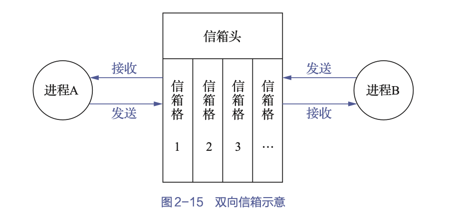

    - 信箱通信原语
        - 信箱的创建和撤销
        - 消息的发送和接收
        ```c
        send(mailbox, message)      //将一个消息发送到指定信箱。
        receive(mailbox, message)   //从指定信箱中接收一个消息。
        ```
    - 信箱的类型
        - 私用信箱：信箱的拥有者可读取，其他用户只能写入。当拥有该信箱的进程结束时，信箱也会消失
        - 共享信箱：信箱的拥有者和共享者，都有权获得信箱发送给自己的消息。
        - 公用信箱：由OS创建，并提供给系统中的所有核准进程使用。


4. 客户端-服务器系统

- 套接字socket
    - 基于文件型：本机上，一个套接字会关联一个特殊的文件，通信双方通过对这个特殊文件进行读/写而实现通信
    > 类似于pipe管道通信
    - 基于网络型：网络上，通信被分配了一对套接字，其中一个属于接收进程（或服务器端），另一个属于发送进程（或客户端）。通过他们来进行通信


- 远程调用RPC(Remote Precedure Call)：允许运行于一台主机（本地）系统上的进程调用另一台主机（远程）系统上的进程


# 进程同步


 <!-- TODO: late -->


# 线程

## 线程的引入


在进程的创建、撤销和切换中，系统必须为之付出较大的时空开销。这就限制了系统中所设置进程的数目，而且进程切换也不宜过于频繁，从而限制了程序并发执行程度的进一步提高。

将进程的两个基本属性分开，由OS分开处理
- 进程是一个可拥有资源的独立单位
- 进程同时是一个可独立调度的基本单位

现代操作系统中
- 进程只作为资源拥有者，不对之施以频繁的切换
- 线程作为调度和分派的基本单位，不拥有资源，用于调度


## 线程的特点


1. 线程与进程的比较

|  | 进程 | 线程 |
| --- | --- | --- |
| 调度 | 独立调度、分派的基本单位 | 线程位调度分派的基本单位，进程位拥有资源的基本单位 |
| 并发性 | 仅进程间可并发 | 进程和线程都可以并发 |
| 拥有资源 | 拥有资源的基本单位 | 不拥有资源，但可访问其隶属进程的资源 |
| 系统开销 | 进程创建、撤销和切换开销大 | 线程创建、撤销和切换开销小 |
| 多处理机 | 一个进程只有一个线程，只能在一个处理机上运行 | 多线程和分散到多处理机运行 |


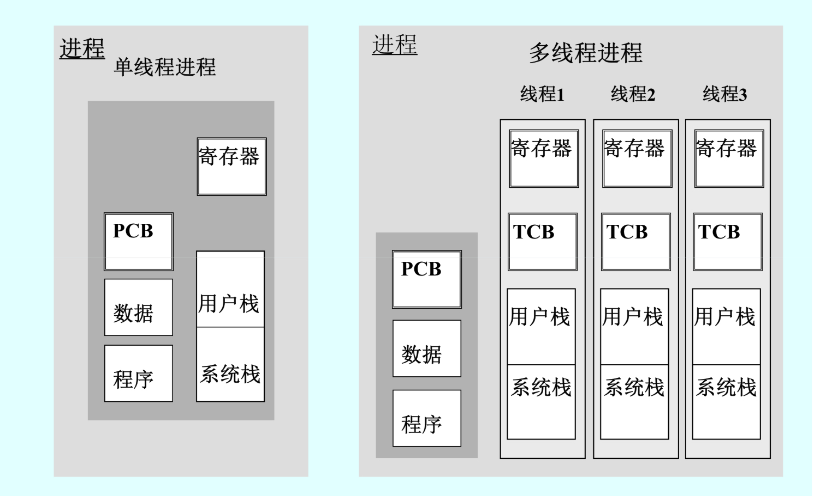


2. 线程的特点


- 仅拥有必不可少的资源

线程几乎不拥有资源，其仅有的资源也是为了确保自身能够独立运行

- 独立调度和分派的基本单位

线程是能独立运行、调度和分派的基本单位，线程的切换非常迅速/开销小。当进行线程切换时，仅须保存和设置少量寄存器的内容，切换代价远低于进程，在同一进程中，线程的切换不会引起进程的切换

- 可并发执行

一个进程中的多个线程间可并发执行；不同进程中的线程也能并发执行。

- 共享进程资源

同一进程中的各个线程，可以共享该进程所拥有的资源（有相同的地址空间；访问进程所拥有文件、定时器、信号量等）。

- 支持多处理机系统

对于多线程进程，可将一个进程中的多个线程分配到多个处理机上，并行运行


## 线程状态和线程控制块

1. 线程执行的3中状态

- 执行状态，指线程已获得处理机而正在执行；
- 就绪状态，指线程已具备各种执行条件，只须再获得CPU便可立即执行；
- 阻塞状态，指线程在执行中因某事件而受阻，进而处于暂停状态


2. 线程控制块

如同每个进程有一个PCB一样，系统也为每个线程配置了一个TCB，将所有用于控制和管理线程的信息均记录在TCB中。

- 状态参数
    - 线程标识符，为每个线程赋予一个唯一的线程标识符；
    - 一组寄存器（包括程序计数器、状态寄存器和通用寄存器等）的内容；
    - 线程执行状态，描述线程正处于何种执行状态；
    - 优先级，描述线程执行的优先程度；
    - 线程专有存储区，用于在线程切换时存放现场保护信息和与该线程相关的统计信息等；
    - 信号屏蔽，即对某些信号加以屏蔽；
    - 堆栈指针，线程在执行时，经常会进行过程调用，而过程调用时通常会出现多重嵌套的情况，这样，就必须把每次过程调用中所使用的局部变量以及返回地址保存起来。为此，应为每个线程设置一个堆栈，用它来保存局部变量和返回地址
        - 指向用户自己堆栈的指针：指当线程运行在用户态时，使用用户自己的用户栈来保存局部变量和返回地址；
        - 指向核心栈的指针：指当线程运行在内核态时，使用系统的核心栈来保存局部变量和返回地址。
- 线程运行状态
- 线程的创建和终止


3. 多线程OS的进程属性

- 进程是一个可拥有资源的基本单位
- 进程已不是可执行的实体
    > 进程仍有与执行相关的状态，但其实际上是指该进程中的某线程的状态
- 多个线程可并发执行
    > 只是含有一个线程；进程为线程提供资源及运行环境，使线程可以并发


## 线程的实现

 <!-- TODO: read -->

###  内核支持线程KST(Kernel Supported thread)

为了对内核支持线程进行控制和管理
- 在内核空间也为每个内核支持线程设置了一个TCB
- 内核根据该TCB来感知某线程的存在，并对其加以控制

特点：
依赖OS核心，由内核的内部需求进程创建和撤销，用来执行一个指定的函数
- 内核维护进程和线程的状态信息
- 线程切换由内核完成
- 一个线程阻塞，不会影响其他线程的运行
- 时间片分给线程，单进程线程越多，速度越快

优点：
- 多处理机系统中，内核可以同时调度同一进程中的多个线程并发执行
- 如果进程中的一个线程被阻塞，则内核可以调度该进程中的其他线程来占有处理机并运行，也可运行其他进程中的线程；
- 内核支持线程具有很小的数据结构和堆栈，线程的切换比较快，切换开销小；
- 内核本身也可以采用多线程技术，可以提高系统的执行速度和效率。

缺点：  
- 对于用户的线程切换而言，其模式切换的开销较大；
> 因为用户进程的线程在用户态运行，而线程调度和管理是在内核中实现的


具体实现：
系统在创建一个新进程时，便为它分配一个任务数据区（per task data area，PTDA），其中包括若干个TCB空间。
> 在每个TCB中可保存线程标识符、优先级、线程运行的CPU状态等信息。虽然这些信息与ULT的TCB中的信息相同，但它们被保存在了内核空间中。

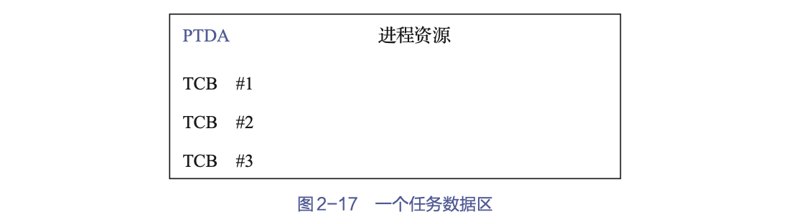


### 用户级线程ULT(User Level Thread)

> 用户级线程不能利用系统调用，但线程需要系统资源时，需将要求传送给运行时系统，由后者通过相应的系统调用获得系统资源

在用户空间中实现的，其对线程的创建、撤销、同步与通信等功能都无须内核支持，即ULT与内核无关。一个系统中的ULT数目可以达到数百个甚至数千个。由于这些线程的TCB都设置在用户空间，而线程所执行的操作又无须内核支持，因而内核完全不知道ULT的存在。

> 对于设置了ULT的系统，其调度仍是以进程为单位进行的。

优点：
- 线程切换不需要转换到内核空间。
- 调度算法可以是进程专用的。
> 在不干扰OS调度的情况下，不同的进程可以根据自身需要选择不同的调度算法，以对自己的线程进行管理和调度，而与OS的低级调度算法无关。
- 用户级线程的实现与OS平台无关。
> 因为面向线程管理的代码属于用户程序的一部分，所有的应用程序都可以共享这段代码。

缺点：
- 一个线程阻塞，则整个进程等待
- 多线程应用不能利用多处理机进行
> 内核每次分配给一个进程的仅有一个CPU。
- 时间片分配给进程
> 单进程线程越多，则每个线程就慢


具体实现：
- 运行时系统

所谓运行时系统（runtime system），实质上是用于管理和控制线程的函数（过程）的集合
> 其中包括用于创建和撤销线程的函数、用于控制线程同步和通信的函数以及用于实现线程调度的函数等。

执行过程：
保存现场：将线程的CPU状态保存在该线程的堆栈中
选新：然后按照一定的算法选择一个处于就绪状态的新线程运行
装载：并将新线程堆栈中的CPU状态装入CPU相应的寄存器中

- 核心线程（组合方式）

核心线程又称轻型进程LWP(Light Weight Process)。每一个进程都可拥有多个LWP。
> - 同ULT一样，每个LWP都有自己的数据结构（如TCB），其中包括线程标识符、优先级、CPU状态等信息，另外还有栈和局部存储区等。
> - LWP也可以共享进程所拥有的资源。

LWP可通过系统调用来获得内核提供的服务，这样，当一个ULT运行时，只须将它连接到一个LWP上，它便能具有KST的所有属性。这种线程实现方式就是组合方式。

一个系统中的ULT数量可能很大，为了节省系统开销，不可能设置太多的LWP，而是会把这些LWP做成一个缓冲区，称之为***“线程池”***。用户进程中的任一ULT都可以连接到线程池中的任一LWP上。
为使每一个ULT都能利用LWP与内核通信，可以使多个ULT多路复用一个LWP，但只有当前连接到LWP上的ULT才能与内核通信，其余线程或阻塞、或等待LWP。
每个LWP都要连接到一个KST上，这样，通过LWP即可把ULT与KST连接起来，ULT可通过LWP来访问内核，但内核所看到的总是多个LWP而非ULT。亦即，由LWP实现了内核与ULT之间的隔离，从而使ULT与内核无关。


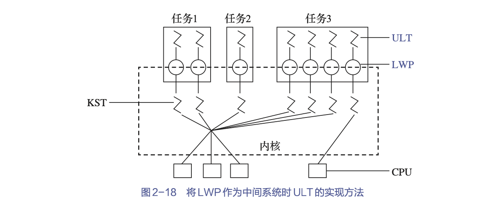

### 两种线程的组合方式

有些OS把ULT和KST这两种线程进行组合，提供了组合方式的ULT/KST线程。在组合方式线程系统中
- 内核支持多个KST的建立、调度和管理，同时也允许用户应用程序建立、调度和管理ULT。
- 一些KST对应多个ULT，这是ULT通过时分多路复用KST来实现的，即将ULT对部分或全部KST进行多路复用，并且程序员可按应用需要和机器配置对KST的数目进行调整，以达到较好的效果。


当ULT不需要与内核通信时，并不需要LWP；而当其要通信时，便须借助LWP，而且每个要通信的ULT都需要一个LWP。

在KST执行操作时，如果其发生阻塞，则与之相连接的多个LWP也将随之阻塞，进而使连接到LWP上的ULT也被阻塞。


组合方式模型

- 多对一模型：将多个ULT映射到一个KST上。仅当ULT需要访问内核时，才会将其映射到一个KST上，但每次只允许一个线程进行映射。
    - 优点：线程管理的开销小，效率高。
    - 缺点
        - 如果一个线程在访问内核时发生阻塞，则整个进程都会被阻塞；
        - 此外，在任一时刻，只有一个线程能够访问内核，多个线程不能同时在多个处理机上运行。
- 一对一模型：将每个ULT映射到一个KST上
    - 优点
        - 当一个线程阻塞时，允许调度另一个线程运行，所以它提供了比多对一模型更好的并发性能。
        - 在多处理机系统中，它允许多个线程并行地运行在多处理机系统上。
    - 缺点：每创建一个ULT，相应地就需要创建一个KST，开销较大，因此需要限制整个系统的线程数。
- 多对多模型：将许多ULT映射到同样数量或较少数量的KST上。
    - 优点
        - 可以像一对一模型那样使一个进程的多个线程并行地运行在多处理机系统上
        - 也可以像多对一模型那样减少线程管理开销并提高效率。

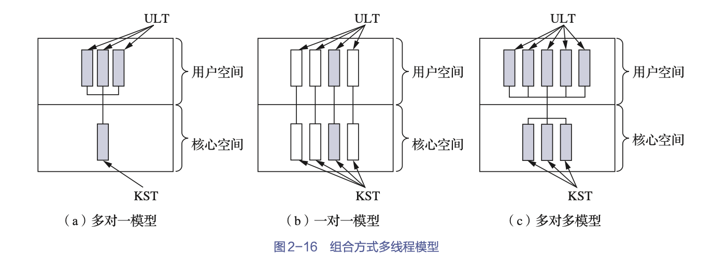


# 本章小结


本章从程序的执行方式入手，程序的执行方式有顺序执行和并发执行两种。
- 顺序执行方式下: 单个程序独占内存运行，系统的运行效率低；
- 并发执行方式下: 多个程序占用内存并轮流在CPU上运行，系统的运行效率得到了提升

引入了OS中的两个重要概念：
- 进程: 指正在运行的程序，它在运行过程中会改变状态，这些状态是根据进程当前的活动来定义的
- 线程


OS中的每个进程都是通过与之对应的PCB来实现控制和管理的。进程控制包括：
- 进程创建
- 进程终止
- 进程阻塞与唤醒
- 进程挂起与激活等
> 这些控制操作需要用原语的方式来完成。

进程间可以相互通信，通信方法多样，常用的有管道、信号、消息队列、共享内存、信号量、套接字等。

为了提高程序并发执行的程度，引入了比进程更小的单位——线程。引入线程后，在资源共享、用户响应、经济性和多处理机架构等方面有诸多好处，能够进一步改善系统的性能。

引入线程后，进程是资源分配的单位，线程是CPU调度的单位。

线程可分为KST和ULT两种
- 不同的系统会支持某一种线程，或者两种都支持
- 由于ULT和KST的连接方式不同，形成了3种不同的多线程模型：多对一模型、一对一模型和多对多模型。
