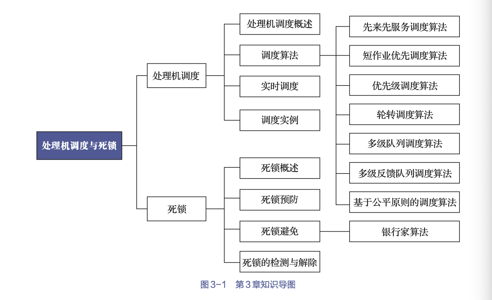
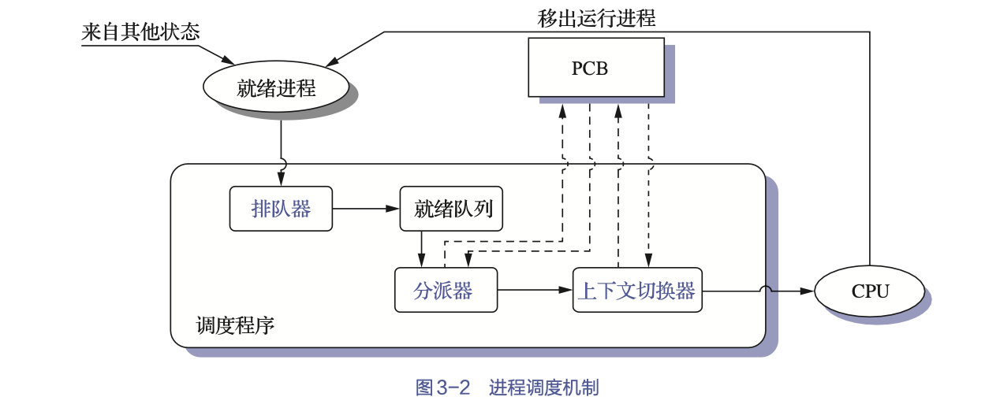
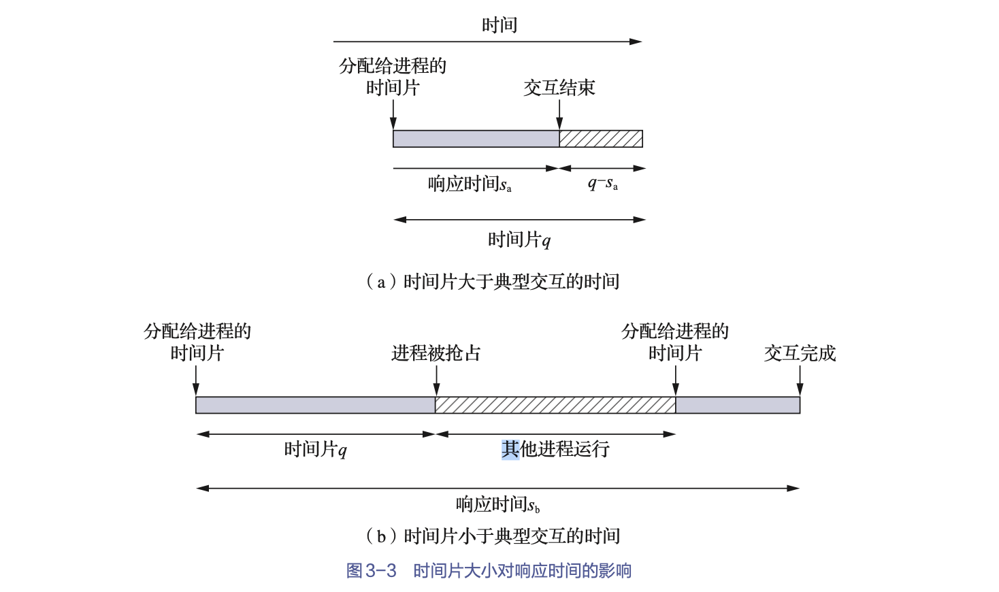
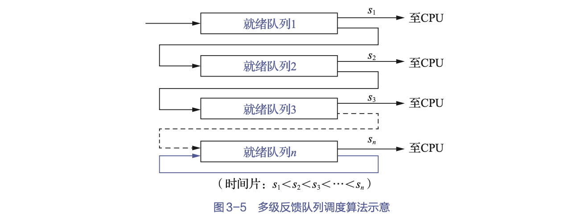
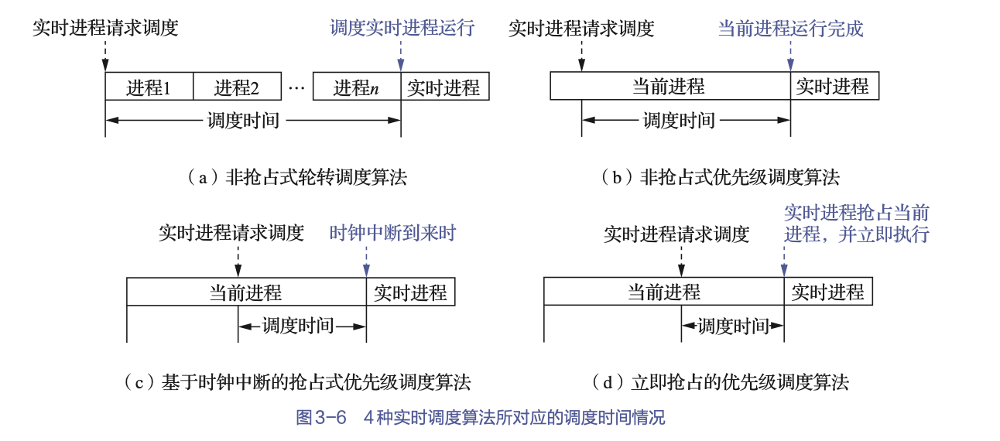
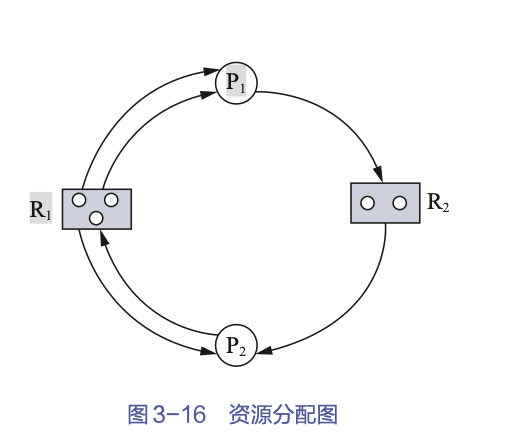

<!-- ~/study_md/computer_operating_system/3.scheduling/processor_scheduling_and_deadlock.md -->

第三章、处理机调度和死锁


多道程序环境中，可能会有多个进程同时竞争有限数量的资源。
- 当一个进程申请某个资源时，如果没有可用资源，那么该进程就会变为等待状态；
- 若所申请的资源被其他等待进程占有，那么该等待进程有可能再也无法改变状态。这种情况称为死锁（deadlock）。
> 如果系统处于死锁状态，进程将无法向前推进。


[toc]




# 处理机调度


多道程序环境下
- 内存中存在着多个进程，其数目往往多于处理机数目
- 要求系统能按某种算法动态地将处理机分配给处于就绪状态的进程

分配处理机的任务是由处理机调度程序完成的
> 调度的实质是一种资源分配，处理机调度是对处理机进行分配

## 处理机调度概述


### 处理机调度的层次

多道程序系统中一个作业从提交到获得处理机执行，直至作业运行完毕，可能需要经历多级处理机调度。

1. 高级调度（作业调度）

- 根据某种算法，决定将外存上处于后备队列中的哪几个**作业**调入内存
- 为它们创建进程、分配必要的资源
- 并将它们放入就绪队列。


2. 低级调度（进程调度）

- 根据某种算法，决定就绪队列中的哪个**进程**应获得处理机
- 并由分派程序将处理机分配给被选中的进程


3. 中级调度（内存调度）

在内、外存对换区对进程进行对换，提高内存利用率和系统吞吐量。
- 把暂时不能运行的进程调至外存等待（挂起）
- 当它们已具备运行条件且内存稍有空闲时，再重新调入内存，并修改它们的状态为就绪状态，挂在就绪队列上等待
 
---

三种调度频率的比较

- 低级调度的运行频率最高，在分时系统中通常仅10ms～100ms便进行一次低级调度，因此把它称为短程调度。为避免低级调度占用太多的CPU时间，不宜使低级调度算法太复杂。
- 高级调度（作业调度）往往发生在一批作业已运行完毕退出系统，又需要重新调入一批作业进入内存的时候。高级调度的周期较长，几分钟一次，因此把它称为长程调度。由于其运行频率较低，故允许作业调度算法花费较长的时间。
- 中级调度的运行频率基本上介于上述两种调度之间


### 作业和作业调度

在多道批处理系统中，作业是用户提交给系统的一项相对独立的工作。  
- 操作员把用户提交的作业通过相应的输入设备输入磁盘存储器
- 并保存在一个后备作业队列中
- 再由作业调度程序将其从外存调入内存

1. 作业

作业是一个比程序更为广泛的概念，它
- 不仅包含了通常的程序和数据
- 而且配有一份作业说明书
- 系统根据该说明书对程序的运行进行控制

2. 作业控制块

为每个作业设置了一个作业控制块（job controlblock，JCB），保存了系统对作业进行管理和调度所需的全部信息。

> JCB的内容
> - 作业标志
> - 用户名称
> - 用户账号
> - 作业类型（CPU繁忙型、I/O繁忙型、批量型、终端型）
> - 作业状态
> - 调度信息（优先级、作业运行时间）
> - 资源需求情况（预计运行时间、要求内存大小）
> - 资源使用情况等。

作业调度的过程：
- 每当一个作业进入系统时，“作业注册”程序便会为该作业建立一个JCB，然后根据作业类型将其放到相应的作业后备队列中等待调度
- 调度程序依据一定的调度算法来调度它们，被调度到的作业将被装入内存。
- 在作业运行期间，系统会按照JCB中的信息和作业说明书对作业进行控制
- 当一个作业执行结束并进入完成状态时，系统便会回收已分配给它的资源，并撤销其JCB。

3. 作业调度的主要任务

根据JCB中的信息，检查系统中的资源能否满足作业的需求，以及按照一定的调度算法从外存的作业后备队列中选取某些作业调入内存，并为它们创建进程和分配必要的资源。然后，将新创建的进程排在就绪队列上等待调度。


因此，也把作业调度称为接纳调度（admission scheduling）。在每次执行作业调度时，都须做出以下两个决定。
- 接纳多少个作业: 取决于多道程序度（degree of multiprogramming），其表示允许多少个作业同时在内存中运行。
> 多道程序度的确定方法是：综合考虑计算机系统规模、计算机运行速度、作业大小以及所能获得的系统性能好坏等情况后，做出适当的抉择。

- 接纳哪些作业: 取决于所采用的调度算法。


### 进程调度

1. 任务

- 保存CPU现场信息
- 按某种算法选取进程
- 把CPU分配给进程

2. 机制



- 排队器
    - 将系统中的所有就绪进程，按照一定的策略排成一个或多个队列
    - 每当有一个进程转变为就绪状态时，排队器将它插入相应的就绪队列
- 分派器：将进程调度程序所选定的进程从就绪队列中取出，然后进行从分派器到新选进程间的上下文切换，以将CPU分配给新选进程。
- 上下文切换器：对处理机进行切换时，会发生两对上下文的切换操作
    - OS将保存当前进程的上下文到该进程的PCB内 
    - 装入分派程序的上下文，则可以方便分派程序运行
    - 移出分派程序的上下文
    - 把新选进程的CPU现场信息装入CPU的各个相应寄存器中，以便新选进程运行。


3. 进程调度方式

非抢占式调度
- 一旦把处理机分配给某进程，就会一直让它运行下去
- 而决不会因为时钟中断或其他原因去抢占该进程的处理机
- 直至该进程完成或发生某事件而被阻塞时
    - 正在执行的进程运行完毕，或因发生某事件而使其无法继续运行；
    - 正在执行的进程因提出I/O请求而暂停执行；
    - 在进程通信或同步过程中执行了某种原语操作，如Block原语。
- 才会把分配给该进程的处理机分配给其他进程。


抢占式调度
- 根据某种原则去暂停某个正在执行的进程
    - 优先级原则: 允许优先级高的新到进程抢占当前进程的处理机
    - 短进程优先原则: 允许新到的短进程抢占当前长进程的处理机
    - 时间片原则: 各进程按时间片轮转运行时，当正在执行的进程的一个时间片用完后，便停止该进程的执行而重新进行调度。
- 并将已分配给该进程的处理机重新分配给另一进程


## 处理机调度算法的目的

1. 处理机调度算法的共同目标

- 资源利用率: 单位时间内完成的作业数高
- 进程公平性: 应使各进程都获得合理的CPU时间
- 资源平衡性: 调度算法应尽可能保证系统资源使用的平衡性。
- 策略强制执行: 制定的策略（其中包括安全策略），只要有需要，就必须予以准确的执行


2. 批处理系统中调度算法的目标

- 系统吞吐量高: 系统吞吐量是指单位时间内系统所完成的作业数
- 处理机利用率高
- 周转时间短: 从作业被提交给系统开始到作业完成为止的所需时间
    - 作业在外存后备队列上等待作业调度的时间
    - 进程在就绪队列上等待进程调度的时间
    - 进程在CPU上执行所耗费的时间
    - 以及进程等待I/O操作完成的时间。


3. 分时系统中调度算法的目标

- 响应时间快: 值输入一个请求到首次响应这段时间
- 保证均衡性: 系统相应时间的快慢应与用户所请求服务的复杂性相适应


4. 实时系统中调度算法的目标

- 截止时间的保证
- 保证接下来任务可预测性


## 调度算法

处理机调度算法是指根据处理机分配策略所规定的处理机分配算法

### 先来先服务算法

先来先服务（first come first server，FCFS）调度算法是最简单的调度算法

- 每次调度都是从就绪的进程队列中选择一个最先进入该队列的进程，并为之分配处理机，使之投入运行
- 在该进程一直运行到完成或发生某事件而阻塞后，进程调度程序才会将处理机分配给其他进程。


### 短作业优先算法

实际情况中，短作业（进程）占有很大比例，为了使它们能比长作业优先执行，产生了短作业优先（short job first，SJF）调度算法。

1. 算法简介

SJF调度算法是以作业的长短来计算优先级的，作业越短，其优先级越高。
> 作业的长短是以作业所要求的运行时间来衡量的。

- 作业调度: 将从外存的作业后备队列中选择估计运行时间最短的作业，并优先将它调入内存运行。
- 进程调度: 将从就绪队列中选择估计运行时间最短的进程，并为之分配CPU运行。


2. 缺点

- 运行时间难以估计

- 对长作业非常不利

- 完全忽视作业的等待时间

- 无法实现人机交互

- 完全没有考虑作业的紧迫程度


### 优先级调度


而优先级调度算法（priority-scheduling algorithm）是基于进程的紧迫程度，由外部赋予进程相应的优先级的，其会根据该优先级进行调度。


1. 优先级调度算法的类型

- 非抢占式优先级调度算法: 一旦把处理机分配给就绪队列中优先级最高的进程，该进程便会一直执行下去直至完成，或者当该进程因发生某事件而放弃处理机时，系统方可将处理机重新分配给优先级次高的进程。
- 抢占式优先级调度算法: 在把处理机分配给优先级最高的进程并使之执行时，只要出现了另一个优先级更高的进程，调度程序就会将处理机分配给新到的优先级更高的进程。

2. 优先级的类型


- 静态优先级

静态优先级是在创建进程时确定的，其在进程的整个运行期间保持不变。

确定进程优先级大小的依据有3个
- 进程类型: 通常系统进程（如接收进程、对换进程等）的优先级要高于一般用户进程的优先级；
- 进程对资源的需求: 对资源要求少的进程应被赋予较高的优先级；
- 用户要求: 根据进程的紧迫程度以及用户所付费用的多少，确定优先级。

静态优先级这一方法简单易行，系统开销小，但不够精确，可能会出现优先级低的进程长期未被调度的情况。

- 动态优先级

动态优先级是指在创建进程之初，先赋予进程一个优先级，然后优先级会随进程的推进或等待时间的增加而改变，以便获得更好的调度性能。

> 例如，可以规定在就绪队列中的进程，其优先级能随等待时间的增长而提高；若再规定当前进程的优先级随运行时间的推移而下降，则可防止一个长作业长期垄断处理机。


#### 高响应比优先调度算法


高响应比优先（highest response ratio next，HRRN）调度算法是优先级调度算法的一个特例，通常用于作业调度。

$$优先级 = \frac{等待时间+要求服务时间}{要求服务时间}$$


### 时间片轮转调度算法

基于时间片的轮转（round robin，RR）调度算法，让就绪队列上的每个进程每次仅运行一个时间片。

1. 基本原理

- 系统会将所有的就绪进程按FCFS策略排成一个就绪队列。
- 系统可设置每隔一定时间便产生一次中断，去激活进程调度程序进行调度，把处理机分配给队首进程，并令其执行一个时间片。
- 当它运行完后，再把处理机分配给就绪队列中新的队首进程，同样地让它也执行一个时间片。

2. 进程切换时机

- 若一个时间片尚未用完而正在运行的进程便已经完成
- 当一个时间片用完时

3. 时间片大小的设置

选择很小的时间片，则将有利于短作业，因为它能在该时间片内完成。但是，若时间片选择得太小，则意味着系统会频繁地执行进程调度和进程上下文的切换，这无疑会增加系统的开销；  
若时间片选择得太大，且为使每个进程都能在一个时间片内完成，RR调度算法便会退化为FCFS调度算法，无法满足短作业和交互式用户的需求。


一个较为可取的时间片大小是略大于一次典型的交互所需要的时间，使大多数交互式进程能在一个时间片内完成，从而可以获得很小的响应时间。




### 多级队列调度算法

多级队列调度算法将系统中的进程就绪队列从一个拆分为若干个
将不同类型或性质的进程固定分配在不同的就绪队列
不同的就绪队列采用不同的调度算法
一个就绪队列中的进程可以设置不同的优先级
不同的就绪队列本身也可以设置不同的优先级


> 应用举例：
> 系统可以有两个队列分别用于前台进程和后台进程。前台队列可以采用RR调度算法进行调度，而后台队列可以采用FCFS调度算法进行调度，前台队列可以绝对地优先于后台队列。
> 在多处理机系统中，多级队列调度算法由于安排了多个就绪队列，因此可以很方便地为每个处理机设置一个单独的就绪队列。
> 对于一个含有多个线程的进程而言，可以根据其要求将其所有线程分配在一个就绪队列上，并全部在一个处理机上运行；再者，对于一组需要相互合作的进程或线程而言，也可以将它们分配到一组处理机所对应的多个就绪队列上，使它们能同时获得处理机并行执行。


### 多级反馈队列调度算法

多级反馈队列（multilevedfeedback queue）调度算法，则不必事先知道各种进程所需的执行时间，还可以较好地满足各种进程的需要，因而它是目前公认的一种较好的进程调度算法。


1. 调度机制

- 设置多个就绪队列
    - 在系统中设置多个就绪队列，并为每个队列赋予不同的优先级。
    - 为不同队列中的进程所赋予的执行时间片的大小也各不相同，在优先级越高的队列中，其时间片越小。
    

- 每个队列采用FCFS调度算法
    - 新进程进入内存后，首先将它放入第一个队列的末尾，按FCFS策略等待调度
    - 当轮到该进程执行时，如果它能在该时间片内完成，则可撤离系统
    - 否则（即它在该时间片结束时尚未完成），调度程序将其转入第二个队列的末尾等待调度
    - 如果它在第二个队列中运行一个时间片后仍未完成，则再将它放入第三个队列
    - 依此类推。当进程最后被降到第n队列后，在第n队列中便采取RR方式运行。

- 按队列优先级调度
    - 调度程序首先调度最高优先级队列中的各进程运行，仅当第一队列空闲时，才调度第二队列中的进程运行
    - 换言之，仅当第1～（i-1）队列均空时，才会调度第i队列中的进程运行
    - 如果处理机在第i队列中为某进程服务时，又有新进程进入任一优先级较高的队列，则须立即把正在运行的进程放回到第i队列的末尾，并把处理机分配给新到的高优先级进程。


2. 性能

在多级反馈队列调度算法中，如果规定第一个队列的时间片略大于多数人机交互所需的处理时间，则能较好地满足各类用户的需要。

- 终端型用户。由于终端型用户提交的作业多属于交互型作业，通常较小，系统只要能使这些作业在第一队列规定的时间片内完成，便可使终端型用户感到满意。
- 短批处理作业用户。对于这类作业，如果可在第一队列中执行完成，则能获得与终端型作业一样的响应时间。对于稍长的短作业，也只须在第二和第三队列各执行一个时间片即可完成，其周转时间仍然较短。
- 长批处理作业用户。对于这类作业，其将依次在第1, 2, …, n个队列中运行，然后再按RR方式运行，用户不必担心其作业长期得不到处理。


### 基于公平原则的调度算法

#### 保证调度算法

保证每个进程都能获得相同的处理机时间，如1/n。
- 跟踪计算每个进程自创建以来已经执行的处理时间；
- 计算每个进程应获得的处理机时间，即自创建以来的时间除以进程数n；
- 计算进程获得处理机时间的比率，即进程实际执行的处理时间和应获得的处理机时间之比；
- 调度程序应选择比率最小的进程，将处理机分配给它，并让它一直运行，直到它的比率超过最接近它的进程的比率为止。


#### 公平分享调度算法

在公平分享调度算法中，调度的公平性主要是针对用户的，即所有用户能获得相同的处理机时间或所要求的时间比例  

然而调度又以进程为基本单位。为此，必须考虑每个用户所拥有的进程数目。再为该用户每个进程分散该用户所得到的时间比例


## 实时调度


在实时系统中，可能存在着两类不同性质的实时任务，即HRT任务和SRT任务，它们都联系着一个截止时间。为保证系统能正常工作，实时调度必须要满足实时任务对截止时间的要求。

### 实时调度算法的要求

1. 提供必要的信息

- 就绪时间
- 开始截止时间和完成截止时间
- 处理时间
- 资源要求
- 优先级

2. 系统处理能力强

假定系统中有$m$个周期性的HRT任务，它们的处理时间表示为$C_i$，周期时间表示为$P_i$，$N$为处理机数量，必须满足下式所示的限制条件，系统才可调度:
$$\sum_{i=1}^m \frac{C_i}{P_i} \leq N$$

> 该限制条件并未考虑任务切换所花费的时间


3. 采用抢占式调度机制
4. 采用快速切换机制


### 实时调度算法分类

#### 非抢占式调度算法

1. 非抢占式转轮调度算法

- 将所有的实时任务排成一个轮转队列
- 调度程序每次选择队列中的**第一个**任务投入运行。
- 当该任务完成后，便把它挂在轮转队列的末尾进行等待
- 调度程序再选择下一个队首任务运行


2. 非抢占式优先级调度算法

- 当高优先级实时任务到达时，系统会把它们安排在就绪队列的队首
- 等待当前任务自我终止或运行完成后，再执行队首的高优先级进程


#### 抢占式调度算法

1. 基于时钟中断的抢占式优先级调度算法

- 在某实时任务到达后
- 如果它的优先级高于当前任务的优先级，则此时并不立即抢占当前任务的处理机
- 而是等到时钟中断发生后
- 调度程序才会剥夺当前任务的执行，将处理机分配给新到的高优先级任务。


2. 立即抢占的优先级调度算法

- 一旦出现外部中断
- 只要当前任务未处于临界区，便能立即剥夺当前任务的执行
- 把处理机分配给请求中断的紧迫任务。




### 最早截止时间优先算法

1. 概念

最早截止时间优先（earliest deadline first，EDF）算法
- 根据任务的截止时间确定任务的优先级
- 具有最早截止时间的任务排在队列的前面
- 调度时，总是选择就绪队列中的第一个任务，并为之分配处理机

2. 非抢占式调度方式用于非周期实时任务

- 将最早截止的任务安排在前面执行
- 但一旦某任务被选中开始执行
- 其他任务必须等待直到该任务完成。

3. 抢占式调度方式用于周期实时任务

- 如果某个新的周期性任务的截止时间早于当前正在执行的任务
- EDF会立即将其抢占，并调度该新的高优先级任务执行


### 最低松弛度优先算法

$$松弛度 = 必须完成时间 - 运行时间 - 当前时间$$

最低松弛度优先（least laxity first，LLF）算法
- 根据的是任务的紧急程度（或松弛度）确定任务的优先级时
- 建立一个按松弛度排序的实时任务就绪队列，松弛度最低的任务排在最前面
- 调度程序会选择队列中的队首任务执行。
> 该算法主要用于抢占式调度方式中


### 优先级倒置

1. 概念

“优先级倒置”（priority inversion problem）: 高优先级进程（线程）被低优先级进程（线程）延迟或阻塞。
- 低优先级进程被高优先级进程抢占时占领着系统资源一起被阻塞
- 高优先级进程由于缺少目标资源导致阻塞
- 此时低优先级进程先运行


2. 解决方法

- 第一种: 
    - 在进程进入临界区后
    - 其所占用的处理机就不允许被抢占

- 第二种比较实用的解决方法是建立在动态优先级继承的基础上: 
    - 当高优先级进程P1要进入临界区去使用临界资源R时
    - 如果已有一个低优先级进程P3正在使用该资源，则此时
    - 一方面P1会被阻塞
    - 另一方面会由P3继承P1的优先级，并一直保持到P3退出临界区。


# 死锁

## 死锁概述

### 资源问题

在系统中有许多不同类型的资源，其中可以引起死锁的主要是需要采用互斥访问方法的、不可被抢占的资源。

1. 可重用自然和可消耗资源

- 可重用资源
    可供用户重复使用多次的资源
    - 只能分配给一个进程使用，而不允许多个进程共享。
    - 进程若要使用可重用资源，则要按照下列步骤
        - 首先，请求资源，请求资源失败，则进程将会被阻塞或循环等待；
        - 然后，使用资源，进程对资源进行操作，如用打印机进行打印；
        - 最后，释放资源，当进程使用完资源后自己将其释放。
    - 系统中每类可重用资源中的单元数目是相对固定的，进程在运行期间既不能创建资源，也不能删除资源。

- 可消耗资源
    在进程运行期间由进程动态创建和消耗的
    - 每类可消耗性资源的单元数目在进程运行期间是可以不断变化的
    - 进程在运行过程中可以请求若干个可消耗资源单元，用于进程自己消耗，并不再将它们返回给该资源类。

2. 可抢占资源和不可抢占资源

- 可抢占资源
    进程在获得可枪占资源后，这类资源可以再被其他进程或系统抢占

- 不可抢占资源
    一旦系统把这类资源分配给某进程后，就不能将它强行收回，而只能在进程用完后等待其自行释放


### 计算机系统中的死锁

1. 竞争资源
    - 竞争不可抢占资源导致死锁
    - 竞争可消耗资源引起死锁
3. 进程推进顺序不当引起死锁：进程在运行过程中，请求和释放资源的顺序不当。


### 死锁的定义、必要条件与处理方法

1. 死锁的定义

如果一组进程中的每个进程都在等待仅由该组进程中的其他进程才能引发的事件发生，那么该组进程是死锁的。

2. 产生死锁的必要条件

- 互斥条件
    进程对所分配到的资源进行排他性使用，即在一段时间内，某资源只能被一个进程占用。

- 请求和保持条件
    进程已经占有了至少一个资源，但又提出了新的资源请求，而该被请求的资源已被其他进程占有，此时请求进程被阻塞，同时其对自己已占有的资源保持不放。

- 不可抢占条件
    进程已获得的资源在未使用完之前不能被抢占，只能在进程使用完时由其自己释放。

- 环路等待条件
    该条件指在发生死锁时，必然存在一个“进程—资源”循环链，即进程集合{P0, P1, P2,…, Pn}中的P0正在等待已被P1占用的资源，P1正在等待已被P2占用的资源，……，Pn正在等待已被P0占用的资源。


3. 死锁的处理方法

- 预防死锁

    通过设置某些限制条件，去破坏产生死锁的4个必要条件中的一个或几个来预防死锁的

- 避免死锁

    在资源的动态分配过程中，用某种方法防止系统进入不安全状态，从而避免发生死锁。

- 检测死锁

    通过检测机构及时地检测出死锁的发生，然后采取适当措施把进程从死锁中解脱出来。

- 解除死锁

    当检测到系统中已发生死锁时就采取相应措施，将进程从死锁状态中解脱出来。通常采用的措施是撤销一些进程，回收它们的资源，将回收的资源分配给已处于阻塞状态的进程，使这些进程能够继续运行。


### 资源分配图

可利用资源分配图（resource allocation graph）来描述系统死锁。资源分配图是一个有向图，它是由一组节点N和一组边E所组成的一个对偶G =（N, E），它具有下述形式的定义和限制。

1. 把N分为两个互斥的子集，即
- 一组进程节点P ={P1, P2,…, Pn}
- 一组资源节点R ={R1, R2,…, Rn}，N =P∪R。

在图3-16所示的例子中，P={P1, P2}，R={R1, R2}，N={R1,R2}∪{P1, P2}。

2. 凡属于E中的一个边e∈E，其都连接着P中的一个节点和R中的一个节点。
- e ={Pi, Rj}是资源请求边Pi→Rj，由进程Pi指向资源Rj，它表示进程Pi请求一个单位的Rj资源。
- e ={Rj, Pi}是资源分配边Rj→Pi，由资源Rj指向进程Pi，它表示R1把一个单位的资源Rj分配给进程Pi。

图3-16中给出了2个请求边和4个分配边，即E ={（P1, R2）,（R2, P2）,（P2, R1）,（R1,P1）}。




用圆圈代表一个进程，用方框代表一类资源。

由于一类图 3-16 资源分配图资源可以包含多个资源实例，我们用方框中的一个圆点来代表一类资源中的一个资源实例。此时，请求边由进程指向方框中的Rj，而分配边则始于方框中的一个圆点。在图3-16所示的资源分配图中，P1进程已经分得了两个R1资源，并又请求了一个R2资源；P2进程已经分得了一个R1资源和一个R2资源，并又请求了一个R1资源。


## 死锁预防

预防死锁是通过破坏产生死锁的4个必要条件中的一个或几个来实现的。由于互斥条件是非共享设备所必须具备的条件，不仅不能改变，还应加以保证。因此，预防死锁时主要是破坏产生死锁的后3个条件。

### 破坏“请求和保持”条件

当一个进程在请求资源时，它不能持有不可抢占资源。

1. 第一种协议

该协议规定，所有进程在开始运行之前，必须一次性地申请其在整个运行过程中所需的全部资源。
- 此时，若系统有足够的可分配资源，则可把其需要的所有资源分配给它。这样，该进程在整个运行期间便不会再提出资源要求，从而破坏了“请求”条件。
- 系统在分配资源时，只要有一种资源不能满足进程的要求，则即使所需的其他资源都空闲也不分配给该进程，而是让其等待。由于该进程在等待期间未占有任何资源，从而破坏了“保持”条件，可以预防发生死锁。

优点：简单、易行、安全  
缺点：资源被严重浪费，严重地降低了资源利用率；进程经常会发生饥饿现象

2. 第二种协议

该协议是对第一种协议的改进，它允许
- 一个进程只获得运行初期所需的资源后，便开始运行。
- 进程运行过程中再逐步释放已分配给自己的、且已用毕的全部资源，然后再请求新的所需资源。


### 破坏“不可抢占”条件

当一个已经保持了某些不可抢占资源的进程提出新的资源请求而不能得到满足时，它必须释放已经保持的所有资源，待以后需要时再重新申请。

该方法实现起来比较复杂，且需要付出很大的代价。

### 破坏“循环等待”条件

个能保证“循环等待”条件不成立的方法是，对系统的所有资源类型进行线性排序，并赋予它们不同的序号。设R=（R1, R2, R3,…, Rm）为资源类型的集合，为系统中的每个资源类型赋予唯一的序号。

在对系统所有资源类型进行线性排序后，便可采用以下预防协议：
- 规定每个进程必须按序号递增的顺序请求资源。
- 一个进程在开始时可以请求某类资源Ri的单元，以后，当且仅当F（Rj）＞F（Ri）时，进程才可以请求资源Rj的单元。
- 如果需要多个同类资源单元，则必须一起请求。
> 假如某进程已请求到一些序号较高的资源，后来又想请求一个序号较低的资源，此时，它必须先释放所有具有相同和更高序号的资源，然后才能申请序号低的资源。

在采用这种策略后所形成的资源分配图中，不可能再出现环路，因而破坏了“循环等待”条件。事实上，总有一个进程会占据较高序号的资源，此后它继续申请的资源必然是空闲的，因而进程可以一直向前推进。

在采用这种策略时，应如何来规定每种资源的序号是十分重要的。

这种预防死锁策略和前两种策略相比，其资源利用率和系统吞吐量都有比较明显的改善。但也存在以下问题:
- 为系统中各类资源规定的序号必须相对稳定，这限制了新类型设备的增加。
- 限制用户进行简单、自主的编程。
- 部分作业违反资源的使用顺序，造成资源的浪费


## 死锁避免

避免死锁同样属于事先预防策略，但并不需要通过事先采取某种限制措施来破坏产生死锁的必要条件，而是在资源动态分配过程中，防止系统进入不安全状态，以避免发生死锁的。

### 系统安全状态

在避免死锁方法中，把系统的状态分为安全状态和不安全状态两种。
- 当系统处于安全状态时可避免发生死锁
- 而当系统处于不安全状态时，则可能会进入死锁状态。

1. 安全状态

在避免死锁方法中，允许进程动态地申请资源，但系统在进行资源分配之前，应先计算此次资源分配的安全性
- 若此次分配不会导致系统进入不安全状态，则可将资源分配给进程
- 否则，令进程等待。

所谓安全状态，是系统能按某种进程推进顺序（P1, P2,…, Pn），为每个进程Pi分配其所需的资源，直至满足每个进程对资源的最大需求，进而使每个进程都可顺利完成的一种系统状态。

此时，称进程推进顺序（P1, P2,…, Pn）为安全序列。

如果系统无法找到这样一个安全序列，则称系统处于不安全状态。
> 虽然并非所有不安全状态都必然会转为死锁状态，但当系统进入不安全状态后，就有可能进入死锁状态。而只要系统处于安全状态，其就不会进入死锁状态。

因此，避免死锁的实质在于，使系统在进行资源分配时不进入不安全状态。

2. 由安全状态进入不安全状态

如果不按照安全序列分配资源，则系统可能会由安全状态进入不安全状态。


在建立了系统安全状态的概念后，便可知道避免死锁的基本思想，即确保系统始终处于安全状态。一个系统开始时是处于安全状态的，当有进程请求一个可用资源时，系统须对该进程的请求进行计算，若将资源分配给进程后系统仍处于安全状态，则将资源分配给该进程。


### 利用银行家算法避免死锁

为实现银行家算法
- 每个新进程在进入系统时，其都必须申明在运行过程中可能需要每种资源类型的最大单元数目，该数目不应超过系统所拥有的资源总量
- 当进程请求一组资源时，系统必须首先确定是否有足够的资源可分配给该进程
    - 若有，则进一步计算在将这些资源分配给该进程后，系统是否会处于不安全状态
        - 如果不会，则将资源分配给该进程
        - 否则让该进程等待。


1. 银行家算法中的数据结构

- 可利用资源向量$Available$

    一个含有$m$个元素的数组，其中的每个元素代表一类可利用的资源数目，其初值是系统中所配置的该类全部可用资源的数目，该数目会随对应资源的分配和回收而动态改变。如果$Available[j]=K$，则表示系统中现有$Rj$类资源$K$个。

- 最大需求矩阵$Max$。

    这是一个$n×m$的矩阵，它定义了系统中n个进程中的每个进程对$m$类资源的最大需求。如果$Max[i,j]=K$，则表示进程$i$需要$Rj$类资源的最大数目为$K$。

- 分配矩阵$Allocation$。

    这是一个$n×m$的矩阵，它定义了系统中每类资源当前已分配给每一进程的资源数。如果$Allocation[i, j]=K$，则表示进程$i$当前已分得$Rj$类资源的数目为$K$。

- 需求矩阵$Need$。

    这是一个$n×m$的矩阵，用于表示每个进程尚需的各类资源数。如果$Need[i, j]=K$，则表示进程i还需要$Rj$类资源$K$个方能完成其任务。

上述3个矩阵间存在下列关系：
$$Need[i, j]=Max[i, j]-Allocation[i, j]$$


2. 银行家算法

设$Request_i$是进程Pi的请求向量，如果$Requesti[ j]=K$，则表示进程$P_i$需要$K$个$R_j$类型的资源。当Pi发出资源请求后，系统会按下列步骤进行检查。
- 如果$Requesti[ j]≤Need[i, j]$，则进行下一步；否则认为出错，因为它所需要的资源数已超过它所宣布的最大值。
- 如果$Requesti[ j]≤Available[ j]$，则转向下一步；否则表示尚无足够资源，$P_i$须等待。
- 系统试探着把资源分配给进程$P_i$，并修改下列数据结构中的数值：
$$Available[ j] = Available[ j]-Requesti[ j] ；$$
$$Allocation[i, j] = Allocation[i, j]+Requesti[ j] ；$$
$$Need[i, j] = Need[i, j]-Requesti[ j]。$$
- 系统执行安全性算法，检查此次资源分配后系统是否处于安全状态。若是，则正式将资源分配给进程Pi，以完成本次分配；否则，将本次的试探分配作废，恢复原来的资源分配状态，让进程Pi等待。


3. 安全性算法

系统所执行的安全性算法可描述如下:

- 设置两个向量。
    - 工作向量Work：它表示系统可提供给进程继续运行所需的各类资源数目，它含有m个元素，在开始执行安全算法时，Work=Available。
    - 完成向量Finish：它表示系统是否有足够的资源分配给进程，使之运行完成。开始时先令Finish[i]=FALSE；当有足够的资源可分配给进程时，再令Finish[i]=TRUE。
- 从进程集合中寻找一个能满足下述条件的进程：
    - $Finish[i]=FALSE；$
    - $Need[i, j]≤Work[ j]$
- 若能找到，则执行步骤（3）；否则，执行步骤（4）。
- 当进程Pi获得资源后，可顺利执行直至完成，并释放分配给它的资源，故应执行：
    $$Work[ j] = Work[ j]+Allocation[i, j] ；$$
    $$Finish[i]= TRUE ；$$
    $$go to step 2 ；$$
- 如果所有进程都满足$Finish[i]=TRUE$，则表示系统处于安全状态；否则，系统处于不安全状态。

## 死锁的检测与解除

### 死锁的检测

1. 死锁定理

我们可以通过简化资源分配图（如图3-21所示）来检测系统所处的某状态（命名为S状态）是否为死锁状态。简化方法如下:

- 在资源分配图中找出一个既不阻塞又非独立的进程节点P。

    在顺利的情况下，P可获得所需资源而继续运行，直至运行完毕再释放其所占有的全部资源，这相当于消去P的请求边和分配边，使之成为孤立的节点。


- 在进行一系列的简化后，若能消去图中所有的边，使所有的进程节点都成为孤立的节点，则称该图是可完全简化的；若不能通过任何过程使该图完全简化，则称该图是不可完全简化的。

S状态为死锁状态的充分条件是：当且仅当S状态的资源分配图是不可完全简化的。该充分条件被称为死锁定理。

2. 死锁检测中的数据结构

死锁检测中的数据结构，类似于银行家算法中的数据结构，介绍如下。
- 可利用资源向量Available，它表示了m类资源中每类资源的可用数目。
- 把不占用资源的进程（向量Allocation=0）记入L表。
- 从进程集合中找到一个Requesti≤Work的进程，做如下处理：
    - 将其资源分配图简化，释放出资源，增加工作向量，即令Work=Work+Allocationi；
    - 将它记入L表。
- 若不能把所有进程都记入L表，则表明系统状态S的资源分配图是不可完全简化的。因此，该系统将发生死锁。

```c
1 Work=Available ；
2 L={Li|Allocationi=0 ∩ Requesti=0} ；
3 for（all Li L）{
4 for（all Requesti ≤ Work）{
5 Work=Work+Allocationi ；
6 Li ∪ L ；
7 }
8 }
9 deadlock=（L={P1，P2，…，Pn}）；
```

### 死锁的解除

通常采用的解除死锁的两种方法是：
- 抢占资源

    从一个或多个进程中抢占足够数量的资源，然后将它们分配给死锁进程，以解除死锁状态；

- 终止死锁进程

    即终止系统中的一个或多个死锁进程，直至打破循环等待，使系统从死锁状态中解脱出来。

1. 终止死锁进程的方法

- 终止所有死锁进程

    终止所有死锁进程是一种最简单的方法，如此一来死锁自然就会解除，但由此付出的代价可能会很大

- 逐个终止死锁进程

    按照某种顺序逐个地终止死锁进程，直至有足够的资源来打破循环等待，把系统从死锁状态中解脱出来。

2. 付出代价最小的死锁算法


付出代价：每次终止一个进程都会付出一定代价，比如中断该进程的任务、浪费资源等。目标是找到一种方法，终止最少的进程、付出最小的代价来解除死锁。

重复过程：这个过程是逐步的，每次都只终止一个代价最小的进程，然后检查死锁状态是否解除。这样可以确保每一步的代价都是最小的，从而最终用最少的代价解除死锁

$$R(S)_{\text{min}} = \min\{CU_i\} + \min\{CU{\prime}_j\} + \ldots$$

这表示每一步的最小代价之和，就是最终解除死锁所需的最小代价。


# 本章小结

本章主要介绍了OS处理机管理功能中的两个重要内容：
- 处理机调度
- 死锁

---

处理机调度分为3个不同层次
- 进程调度: 最基本、最频繁的调度
    - 任务: 根据调度算法从就绪队列中选择一个进程，并为其分配处理机。

本章介绍了常用的进程/作业调度算法，主要包括
- FCFS调度算法
- SJF调度算法
- 优先级调度算法
- RR调度算法
- 多级队列调度算法
- 多级反馈队列调度算法等

实时系统对任务运行时间有严格的要求，因此实时调度算法不同于普通进程调度算法。在实时调度算法部分主要介绍了
- 最早截止时间优先算法
- 最低松弛度优先算法
并讨论了优先级倒置问题及其解决方法。

---

如果有两个或更多进程永久等待某个事件发生，而且该事件又只能由这些等待进程中的某一个引起，那么系统就处于死锁状态。

本章介绍了引起死锁的原因、必要条件和处理方法等。

目前常用的死锁处理方法有４种：
- 死锁预防: 死锁预防是通过破坏４个必要条件来实现的
- 死锁避免: 死锁避免是通过在进程申请资源时运行相应的算法（如银行家算法）以避免系统进入不安全状态来实现的
- 死锁检测: 而在允许死锁发生的系统中，则可以通过定期调用检测死锁的算法来判断系统是否出现了死锁。
- 死锁解除: 如果检测到死锁，那么系统应通过终止某些死锁进程或抢占某些死锁进程的资源来恢复其状态。

