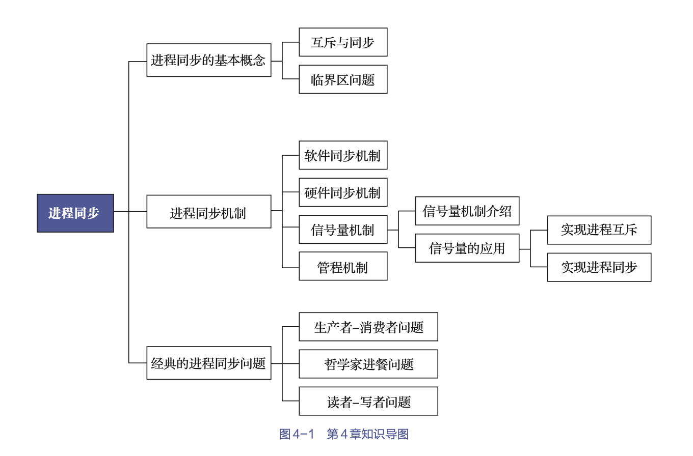
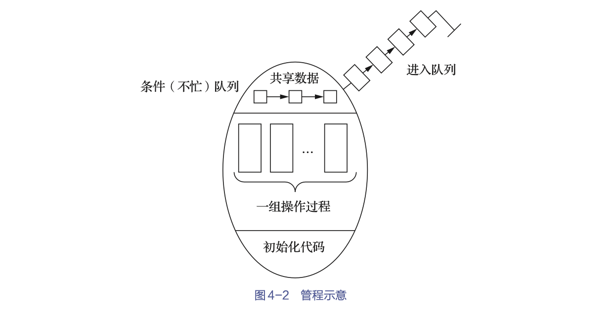

<!-- ~/study_md/computer_operating_system/proc_sync.md -->

为保证多个进程能有条不紊地运行，必须引入进程同步机制。

[toc]





# 1. 进程同步的基本概念

##  1.1 引入

进程同步: 把异步环境下的一组并发进程因直接制约而互相发送消息、互相合作、互相等待，使得各进程按一定的速度执行的过程。

1. 同步的对象

    具有同步关系的一组并发进程称为协作进程。互相协作的进程
- 或能直接共享逻辑地址空间（代码和数据）
    > 即共享逻辑地址空间,可以通过轻量级进程或线程来实现
- 或能通过文件或消息来共享数据。

2. 任务

- 在**执行次序**上对多个协作进程进行协调
- 使并发执行的诸多协作进程之间能按照一定的顺序共享系统资源


## 1.2 两种形式的制约关系

1. 间接相互制约（互斥关系）

对同一个互斥资源进行访问的多个进程之间存在互斥关系。

> 为了保证这些进程能有序地运行，对于系统中的这类资源，必须由系统实施统一分配，即用户在要使用这类资源之前应先提出申请，而不能直接使用。

2. 直接互相制约（同步关系）

同步关系: 进程间的直接制约关系就是源于它们之间的相互合作同步关系。
> 某些应用程序为了完成某项任务，会建立两个或多个进程。这些进程会为了完成同一任务而相互合作。


## 1.3 临界资源

临界资源（critical resource）: 进程在使用它们时都需要采用互斥方式

###  生成消费者问题

生产者-消费者（producer-consumer）问题是一个著名的进程同步问题

1. 问题描述

- 有一组生产者进程在生产产品，并将这些产品提供给一组消费者进程去消费
- 为使生产者进程与消费者进程能够并发执行，在两者之间设置了一个具有n个缓冲区的缓冲池
    - 生产者进程将它所生产的产品放入一个缓冲区中
    - 消费者进程可从一个缓冲区中取走产品并进行消费。
- 尽管所有的生产者进程和消费者进程都是以异步方式运行的，但它们之间必须保持同步
    - 即不允许消费者进程到一个空缓冲区中去取产品
    - 也不允许生产者进程向一个已装满产品且产品尚未被取走的缓冲区投放产品。


2. 代码实现

- 生产者进程和消费者进程共享下列变量：
```c
int in=0;           // 下一个放入产品的下标
int out=0;          // 下一个被取出产品的下标
int counter=0;      // 缓冲池中产品的数量
item buffer[n];     //具有n个缓冲区的缓冲池
```
- 生产者程序
```c
void producer( ){
    while(1) {
        produce an item in nextp ；
        …
        while (counter==n) ；   //判断是否还有位置可以存放目标物品
        buffer［in］= nextp ；
        in = (in+1) % n ；
        counter++ ；
    }
}；
```
- 消费者程序
```c
void consumer( ){
    while(1) {
        while (counter==0) ；   //判断是否还有物品可以取
        nextc=buffer［out］；
        out = (out+1) % n ；
        counter-- ；
        consumer the item in nextc ；
        …
    }
```

##  1.4 临界区

临界区（critical section）: 在每个进程中访问临界资源的那段代码

1. 步骤

- 每个进程在进入临界区之前，应先对欲访问的临界资源进行检查，看它是否正在被访问
- 如果该临界资源未被访问，进程便可进入临界区对该资源进行访问，并将访问标志设置为“正被访问”；
- 如果此刻该临界资源正在被某进程访问，则本进程不能进入临界区。

2. 实现

需要在临界区前后添加**进入区**和**退出区**

```c
//可将一个访问临界资源的循环进程描述如下：
while(TURE){
    进入区  // 进入临界区之前，对欲访问的临界资源进行检查，查看是否被访问
    临界区 
    退出区  // 将临界区正被访问的标志恢复为未被访问的标志
    剩余区  // 除上述进入区、临界区及退出区之外的其他部分的代码，在这里都被称为剩余区
}
```

3. 解决临界区问题的同步机制都应遵循下述4条准则
- 空闲让进: 当无进程处于临界区时，表明临界资源处于空闲状态，应允许1个请求进入临界区的进程立即进入自己的临界区，以有效地利用临界资源。
- 忙则等待: 当已有进程进入临界区时，表明临界资源正在被访问，因而其他试图进入临界区的进程必须等待，以保证对临界资源的互斥访问。
- 有限等待: 对于要求访问临界资源的进程，应保证其在有限时间内能进入自己的临界区，以免陷入“死等”状态。
- 让权等待（原则上应遵循，但非必须）: 当进程不能进入自己的临界区时，应立即释放处理机，以免进程陷入“忙等”状态。


# 2. 进程同步机制

## 2.1 软件同步机制

一个经典的基于软件的临界区问题的解决方案是Peterson解决方案：适用于两个进程交替执行临界区的情况。

设两个进程分别为$P_i$和$P_j$

- Peterson解决方案要求两个进程共享两个变量
```c
int turn;           // 表示哪个进程可以进入临界区，取值i/j
boolean flag[2];    // 表示哪个进程准备进入临界区
```
- Peterson解决方案中进程$P_i$的结构
```c
do {
    flag[i] = TRUE;
    turn = j;       // 可以的话，先让另一个进程进入临界区
    while (flag[j] && turn == j);
        临界区 ;
    flag[i] = FALSE;
    剩余区 ;
}while (TRUE);
```


> 虽然利用软件方法可以解决各进程互斥进入临界区的问题，但有一定难度，并且存在很大的局限性，很少采用

## 2.2 硬件同步机制


目前许多计算机已提供了一些特殊的硬件指令
- 允许对一个字中的内容进行检测和修正或是对两个字的内容进行交换等
- 可利用这些特殊的指令来解决临界区问题

实际上，在对临界区进行管理时
- 可以将标志看作一个锁，“锁开”进入，“锁关”等待，初始时锁是打开的
- 每个要进入临界区的进程，必须先对锁进行测试
    - 当锁未开时，则必须等待，直至锁被打开
    - 当锁打开时，则应立即把其锁上，以阻止其他进程进入临界区
- 显然，为防止多个进程同时测试到“锁开”，测试和关锁操作必须连续

### 关中断

进入锁测试之前，关闭中断，直到完成锁测试并上锁之后，才能打开中断

缺点：
- 滥用关中断权力可能导致严重后果；
- 关中断时间过长会影响系统效率，进而会限制CPU交叉执行程序的能力；
- 关中断方法不适用于多CPU系统，因为在一个CPU上进行关中断并不能防止进程在其他CPU上执行相同的临界区代码。


### 利用Test-and-Set指令

借助硬件指令TS（Test-and-Set，测试并建立）来实现互斥

```c
boolean TS（boolean *lock） {
    boolean old ；
    old = *lock ；
    *lock = TRUE ；
    return old;
}
```

- TS指令可以被看作上述函数，其执行过程是不可分割的，即一条原语。
- lock有两种状态
    - 当lock=FALSE时，表示该资源空闲
    - 当lock=TRUE时，表示该资源正在被使用。
- 用TS指令管理临界区时，须为每个临界资源设置一个布尔变量lock
    - lock的初值为FALSE，表示该临界资源空闲。
    - 进程在进入临界区之前，首先用TS指令测试lock
        - 如果其值为FALSE，则表示没有进程在临界区内，可以进入，并将TRUE值赋予lock，这等效于关闭了临界区，使任何进程都不能进入临界区
        - 否则必须循环测试直到TS（&lock）为TRUE。
    ```c
    do {
        …
        while TS（&lock）； 
        critical section ；
        lock = FALSE ；
        remainder section;
    } while（TRUE）；
    ```

### 利用swap指令

- 为每个临界资源设置一个全局的布尔变量lock，其初值为FALSE
- 在每个进程中再设置一个局部的布尔变量key，使用swap指令与lock进行数值交换，以此来循环判断lock的取值
- 只有当key为FALSE时，进程才可以进行临界区操作。

```c
//swap指令被称为对换指令，用于交换两个字的内容
void swap（boolean *a, boolean *b）{ 
    boolean temp;
    temp = *a;
    *a = *b;
    *b = temp;
}

do {
    key=TRUE ；
    do {
        swap（&lock，&key）；
    } while (key!=FALSE);
    临界区操作 ；
    lock =FALSE ；
    …
} while (TRUE) ；
```
当临界资源被访问时，其他访问进程必须不断地进行测试，即处于一种忙等状态，这不符合“让权等待”的原则


## 2.3 信号量机制


### 介绍

1. 整形信号量

把整型信号量定义为一个用于表示资源数目的整型量S，不同与一般整型量，除初始化外，仅能通过两个标准的**原子操作**访问，即
- wait(S)
- signal(S)

```c
wait(S){
    while (S<=0) ; /* do no-op */
    S-- ；
}
signal(S){
    S++ ；
}
```
整型信号量机制中的wait(S)操作，只要信号量S＜=0，就会不断地进行测试。因此，该机制并未遵循“让权等待”准则

2. 记录型信号量

- 除了需要一个用于代表资源数目的整型变量value外
- 还应增加一个进程链表指针list，用于链接上述所有等待进程。

```c
typedef struct {
  int value;    // 表示系统中某类资源的数目
  struct process_control_block *list;
} semaphore;
```
相应地，wait(S)和signal(S)操作可描述为：
```c
wait(semaphore *S) {
  S->value--;
  if (S->value<0){
        // 表示该类资源已分配完毕，因此进程应调用block原语，进行自我阻塞
        // 放弃处理机，并将该进程插入信号量链表S->list中
        // 遵循让权等待
        // 此时S->value的绝对值表示在该信号量链表中已阻塞进程的数目
        block(S->list);


   } 
}
signal(semaphore *S){
  S->value++ ；
  if (S->value<=0){
        // 表示在该信号量链表中仍有等待该资源的进程被阻塞
        // 故还应调用wakeup原语以将S->list链表中的第一个等待进程唤醒
        wakeup(S->list);
   }
}
```


3. AND型信号量

针对一个进程往往需要获得两个或更多的共享资源后方能执行其任务的情况

背景：

```c
// Dmutex和Emutex是两个共享资源的信号 
// A,B是两个进程
process A: wait(Dmutex) ； wait(Emutex) ； 
process B: wait(Emutex) ； wait(Dmutex) ；
```

令进程A和进程B按下述次序交替执行wait(S)操作。

```c
process A: wait(Dmutex) ； // Dmutex=0。
process B: wait(Emutex) ； // Emutex=0。
process A: wait(Emutex) ； // Emutex=-1，A 阻塞。
process B: wait(Dmutex) ； // Dmutex=-1，B 阻塞。
// 此时的进程A和进程B已进入死锁状态。
```


AND型信号量机制的基本思想是：
- 将进程在整个运行过程中需要的所有资源，一次性全部分配给进程，待进程使用完后再一起释放。
- 只要尚有一个资源未能分配给进程，其他所有可能为之分配的资源，也不分配给它。

为此，在wait(S)操作中增加了一个“AND”条件，故称之为AND同步，或同时wait(S)操作，即Swait(simultaneous wait)，其定义如下：

```c
Swait(S1，S2，…，Sn){
  while (TRUE) {
      if (S1>=1 && … && Sn>=1) {
          for (i =1; i<=n; i++) Si--; ；
          break;
      }
      else {
          // 将当前进程放置在第一个Si<=0的阻塞队列中
      }
  }
 }
Signal(S1，S2，…，Sn){
  while (TRUE) {
      for (i=1; i<=n; i++) {
          Si++ ；
          Singnal(Si)
      }
  }
 }
```

4. 信号量集

背景：
wait(S)或signal(S)操作仅能对信号量施以加1或减1操作，这意味着每次只能对某类临界资源进行一个单位的申请或释放。当一次需要N个单位时，便要进行N次wait(S)操作，这显然是低效的，甚至会增加死锁的概率。

对AND信号量机制加以扩充，即
- 针对进程所申请的所有资源以及每类资源不同的需求量，在一次wait(S)或signal(S)操作中完成它们的申请或释放。
- 进程对信号量Si的测试值不再是1，而是该资源的分配下限值ti，即要求Si＞=ti，否则不予分配。
    - 一旦允许分配，则基于进程对该资源的需求值di（表示资源占用量）进行Si:=Si-di操作，而不是简单的Si=Si-1。由此可以形成一般化的“信号量集”机制。

对应的Swait()和Ssignal()格式为：
```c
Swait(S1， t1， d1 ；… ； Sn， tn， dn) ；
Ssignal(S1， d1 ；… ； Sn， dn) ；
```

一般化的“信号量集”还有下列3种特殊情况:
- Swait(S, d, d)。此时在信号量集中只有一个信号量S，但允许它每次申请d个资源，当现有资源数少于d时，不予分配。
- Swait(S, 1, 1)。此时的信号量集已蜕化为一般的记录型信号量（S＞1时）或互斥信号量(S=1时)。
- Swait(S, 1, 0)。这是一种特殊且很有用的信号量操作。当S＞=1时，允许多个进程进入某个特定的临界区；当S=0时，将阻止任何进程进入特定区。换言之，它相当于一个可控开关。


### 应用

1. 利用信号量实现互斥

为使多个进程能互斥地访问某临界资源，原理：
- 为该资源设置一个互斥型信号量mutex，并设其初值为1
- 然后将各进程访问该资源的临界区置于wait(mutex)和signal(mutex)操作之间即可。

利用信号量实现两个进程互斥的描述如下：
- 设mutex为互斥型信号量，其初值为1，取值范围为（-1,0,1）。
    - 当mutex=1时，表示两个进程皆未进入需要互斥访问的临界区；
    - 当mutex=0时，表示有一个进程进入临界区运行，另一个必须等待，挂入阻塞队列；
    - 当mutex=-1时，表示有一个进程正在临界区运行，而另一个进程因等待而阻塞在信号量队列中，需要被当前已在临界区运行的进程在退出时唤醒。
- 代码描述
```c
1 semaphore mutex=1;
2 PA( ){                PB ( ) {
3   while（1）{             while（1） {
4       wait(mutex) ；          wait(mutex) ；
5       临界区 ；               临界区 ；
6       signal(mutex) ；        signal(mutex) ；
7       剩余区 ；               剩余区 ；
8   }                       }
9 }                     }
```

> wait(mutex)和signal(mutex)必须成对出现


2. 利用信号量实现进程同步

假设：
- 进程P1和P2中有两段代码C1和C2，若要强制C1先于C2执行，则须在C2前添加wait(S)，在C1后添加signal(S)。

- 信号量S的初值应该被设置为0。这样，只有P1在执行完C1后，才能执行signal(S)以把S的值设置为1。

- 这时，P2执行wait(S)才能申请到信号量S，并执行C2。如果P1的C1没有提前执行，则信号量S的值为0，P2执行wait(S)时会因申请不到信号量S而阻塞。

> 注意：信号量不需要wait(S)即可signal(S)，但在此也是成对出现的


## 2.4 管程机制

背景：信号量机制中每个要访问临界资源的进程都必须**自备同步操作wait(S)和signal(S)。**这就使大量的同步操作分散在各个进程中。这不仅给系统的管理带来了麻烦，而且还会因同步操作的使用不当而导致系统死锁。

为此，在解决上述问题的过程中，便产生了一种新的进程同步工具——管程（monitor）。

### 管程的定义

一个管程定义了一个数据结构和能被并发进程（在该数据结构上）所执行的一组操作，这组操作能同步进程和改变管程中的数据。



- 管程名称
- 局限于管程内的共享数据结构说明（尽管数据结构是共享的，但该共享变量局限于管程内）；
- 对该数据结构进行操作的一组过程；
- 设置局限于管程内的共享数据初值的语句。


管道的语法描述
```c
1 monitor monitor_name { /* 管程名 */
2   share variable declarations ； /* 共享变量说明 */
3   cond declarations ； /* 条件变量说明 */
4   public: /* 能被进程调用的过程 */
5       void P1(……) /* 对数据结构操作的过程 */
6           {……}
7       void P2(……)
8           {……}
9       ……
10      void (……)
11          {……}
12      ……
13      { /* 管程主体 */
14      initialization code; /* 初始化代码 */
15      ……
16      }
17 }
```

所有进程当要访问临界资源时，都只能通过管程间接访问，而管程每次只准许一个进程进入管程，执行管程内的过程，从而实现了进程互斥。


### 条件变量

利用管程实现进程同步时，必须设置同步工具，如两个同步操作原语wait和signal。
- 当某进程通过管程请求获得临界资源而未能被满足时，管程便会调用wait原语以使该进程处于等待状态，并将其排在等待队列上，如图4-2所示。
- 仅当另一进程访问完成并释放该资源后，管程才会调用signal原语，唤醒等待队列中的队首进程。


每个条件变量均保存了一个链表，用于记录因该条件变量而阻塞的所有进程，同时提供的两个操作可表示为x.wait和x.signal，含义如下。

- x.wait：如果正在调用管程的进程因x条件需要而被阻塞或挂起，则调用x.wait将自己插入到x条件的等待队列上，并释放管程，直到x条件变化。此时其他进程可以使用该管程。
- x.signal：如果正在调用管程的进程发现x条件发生了变化，则调用x.signal，重新启动一个因x条件而阻塞或挂起的进程，如果存在多个这样的进程，则选择其中的一个；如果没有，则继续执行原进程，而不产生任何结果。
> 这与信号量机制中的signal操作不同，因为后者总是要执行s=s+1操作，所以总会改变信号量的状态。


# 经典的进程同步问题


## 生产者-消费者问题


## 哲学家进餐问题

## 读者-写者问题


# Linux进程同步机制

Linux系统下并发的主要来源介绍如下。
- 中断处理：例如，当进程在访问某个临界资源的时候发生了中断，随后进入中断处理程序，如果在中断处理程序中也访问了该临界资源，则虽然不是严格意义上的进程并发，但是也会造成对该资源的竞争使用。
- 内核态抢占：例如，当进程在访问某个临界资源的时候发生内核态抢占，随后进入了高优先级的进程，如果该进程也访问了同一临界资源，那么就会造成进程与进程之间的并发。
- 多处理机并发：多处理机系统上的进程与进程之间是严格意义上的并发（并行），每个处理机都可以独自调度运行一个进程，在同一时刻有多个进程在同时运行

采用同步机制的目的就是避免多个进程并发访问同一临界资源。inux内核提供了一组相当完备的同步方法:

1. 原子操作

它是其他同步方法的基石。原子操作可以保证指令以原子的方式执行——执行过程不被打断。

实现操作原子性的方法：
- 操作码前缀为lock的汇编指令，即使在多CPU下也能保证其后的汇编指令的原子性
> lock会锁定内存总线，保证在执行汇编指令时没有其他CPU同时读/写内存。
- 在多处理机中，Linux内核通过提供atomic_t类型封装了一系列的原子操作
> 如atomic_inc(v)表示把数值从1加到v。


2. 自旋锁

自旋锁的设计思想是：在多处理机之间设置一个全局变量V，表示锁，并定义当V=1时为锁定状态，V=0时为解锁状态。自旋锁同步机制是针对多处理机而设计的，属于“**忙等**”机制。自旋锁机制只允许唯一的一个执行路径持有自旋锁。
> 必须确保处理机A“读取V、判断V的值、更新V”这一操作是一个原子操作。

```c
0 #include <linux/spinlock.h>
1 DEFINE_SPINLOCK(mr_lock);
2 spin_lock(&mr_lock);
3 /* 临界区 */
4 spin_unlock(&mr_lock);
```

3. 信号量

此类型的同步机制在进程无法获取临界资源的情况下，会立即释放处理机的使用权，并使进程阻塞在所访问的临界资源对应的等待队列上；在临界资源被释放时，再唤醒阻塞在该临界资源上的进程。

```c
1 /* 定义并声明一个信号量，名字为 mr_sem，用于信号量计数 */
2 static DECLARE_MUTEX(mr_sem);
3 /* 试图获取信号量 */
4 if (down_interruptible(&mr_sem)){
5   /* 信号被接收，信号量还未被获取 */
6 }
7 /* 临界区 */
8 /* 释放给定的信号量 */
9 up(&mr_sem);
```

4. 互斥锁

互斥锁的行为与使用计数为1的信号量类似，但操作接口更简单，实现更高效，而且使用限制更强。

```c
1 mutex_lock(&name);
2 /* 临界区 */
3 mutex_unlock(&name);
```


5. 禁用中断（单处理机不可抢占系统）


# 小结

进程同步是现代OS并发运行的重要基础。本章介绍了
- 进程同步的基本概念
- 临界区问题
- 常用的进程同步机制和经典的进程同步问题。在进程同步机制中，分别介绍了
    - 软件同步
    - 硬件同步
    - 信号量
    - 管程

通过本章的学习，读者应该
- 了解进程同步的概念
- 解决临界区问题的4个原则
- 管程
- 掌握记录型信号量的定义和使用方法，并且能够使用信号量来实现进程间的互斥与同步。

由于进程同步是个抽象的概念，读者通常难以理解它，因此通过对经典进程同步问题的解答，可帮助读者理解实际编程中的同步问题，提高读者的逻辑思维能力和实践编程能力。
