第五章、存储器管理

对存储器的管理方式，不仅直接影响存储器的利用率，而且对系统性能也有重大影响

存储器管理的主要对象是内存。由于对外存的管理与对内存的管理相类似，只是它们的用途不同，即外存主要用于存放文件，因此本书把对外存的管理放在第8章（文件管理）中进行介绍。本章知识导图如图5-1所示。

[toc]

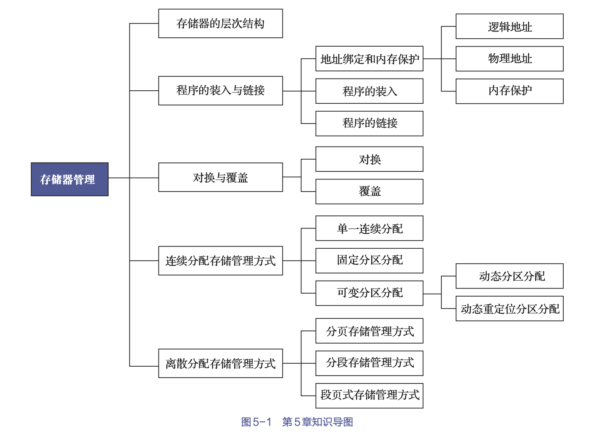

# 1. 存储器的层次结构

存储器采用层次结构的原因是因为无法满足以下几点要求

- 要求计算机对存储器的访问速度能跟得上处理机的运行速度
- 此外还要求存储器具有非常大的容量
- 而且存储器的价格还应很便宜。  

## 1.1 多层结构的存储器

### 1.1.1 存储器的多层结构

对于通用计算机而言，存储层次至少应具有3层：
- 最高层: CPU寄存器
- 中间层: 主存储器
- 最低层: 辅助存储器（简称辅存）

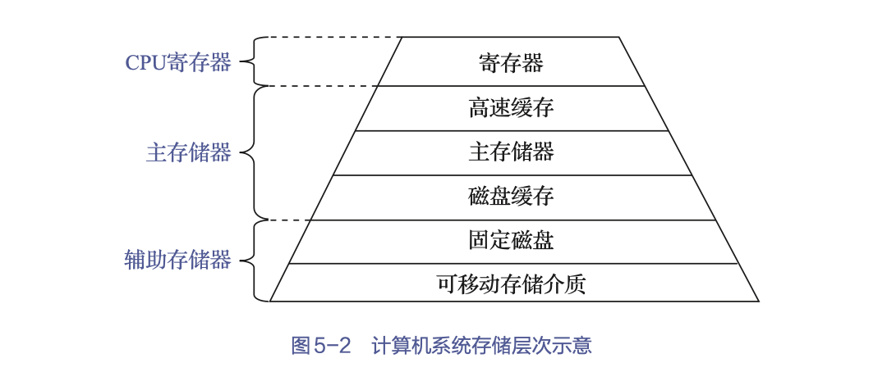
- 层次越高（越靠近CPU）
    - 存储介质的访问速度越快
    - 价格也越高，所配置的存储容量也越小
- CPU寄存器和主存储器均属于OS存储管理的管辖范畴，断电后它们所存储的信息将不再存在
- 辅助存储器属于设备管理的管辖范畴，它们所存储的信息会被长期保存

### 1.1.2 可执行存储器

寄存器和主存储器又被称为可执行存储器，对于存放在其中的信息不同于存放在辅存中的信息
- 进程可以在很少的时钟周期内使用一条load或store指令对可执行存储器进行访问
- 但对辅存的访问则需要通过I/O设备实现。

> 本章主要讨论有关主存储器管理部分的问题，针对辅存管理问题，本书将会在第9章中进行介绍。

## 1.2 主存储器和寄存器

### 1.2.1 寄存器

寄存器是CPU内部的一些小型存储区域，用于暂时存放参与运算的指令、数据和运算结果等内容。
- 寄存器具有与处理机相同的速度，因此寄存器的访问速度也是最快的
- 其完全能与CPU协调工作，但价格却十分昂贵，故其容量不可能做得很大

### 1.2.2 主存储器

主存储器（主存或内存）是计算机系统中的主要部件，用于保存进程运行时的程序和数据

- 处理机都会从内存中取得指令和数据
    - 并将其所取得的指令放入指令寄存器中
    - 而将其所读取的数据装入数据寄存器中
- 或者进行相反操作，即将寄存器中的数据存入内存。

CPU与外围设备交换的信息，一般也会依托于内存的地址空间。由于内存的访问速度远低于CPU执行指令的速度，为缓和这一矛盾，在计算机系统中引入了寄存器和高速缓存。

## 1.3 高速缓存和磁盘缓存

### 1.3.1 高速缓存

高速缓存介于寄存器和内存之间的存储器
- 主要用于备份内存中较常用的数据，以减少处理机对内存的访问次数
- 可大幅度地提高程序执行速度

通常，进程的程序和数据存放在内存中
- 每当要访问它们时，它们才会被临时复制到一个速度较快的高速缓存中
- 当CPU访问一组特定信息时，须首先检查它是否在高速缓存中
    - 如果在，便可直接从中取出并使用，以避免访问内存。
    - 否则，就须从内存中读出信息。

### 1.3.2 磁盘缓存

磁盘缓存
- 利用内存中的部分存储空间
- 暂时存放频繁使用的一部分磁盘数据，以减少访问磁盘的次数
- 缓和磁盘I/O速度和对内存访问速度的不匹配

内存也可被看作辅存的高速缓存
- 因为辅存中的数据必须复制到内存方能使用
- 此外，数据也必须先存在于内存中才能输出到辅存

# 2. 程序的装入与链接

要在系统中运行用户程序，就必须先将其装入内存中，然后将其转变为一个可以执行的程序：
- 编译，由编译程序（compiler）对用户源程序进行编译，形成若干个目标模块（object module）；
- 链接，由链接程序（linker）将编译后形成的一组目标模块以及它们所需要的库函数链接在一起，形成一个 完整的装入模块（load module）；
- 装入，也称为加载，由装入程序（loader）将装入模块装入内存。

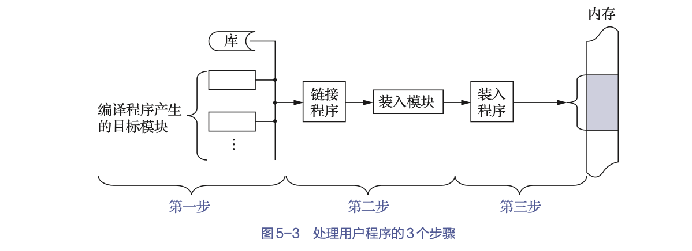

本节将在介绍这些过程中涉及的地址绑定和内存 保护的基础上，扼要阐述程序（含数据）的链接与装入过程。

## 2.1 地址绑定和内存保护

### 2.1.1 逻辑地址和物理地址

1. 地址的不同表示形式

上述步骤中，地址可能有不同的表示形式
- 源程序中的地址通常用符号表示，如变量名count。
- 编译器通常将这些符号地址绑定（bind）到可重定位的地址或相对地址（如从本模块开始的第10个字节）上。
- 链接程序或装入程序再将这些相对地址绑定到绝对地址（如内存的第74 010个字节）。

每次绑定都是从一个地址空间到另一个地址空间的映射。地址绑定通常发生在程序编译时、装入时或运行时，具体的绑定方式详见5.2.2小节。

2. 逻辑地址和相对地址

- CPU生成的地址通常称为逻辑地址（logic address）或相对地址
- 而内存单元看到的地址（即装入内存地址寄存器的地址），通常称为物理地址（physical address）或绝对地址。

3. 不同的逻辑地址和物理地址

- 在编译时和装入时的地址绑定会生成相同的逻辑地址和物理地址
- 而执行时的地址绑定则会生成不同的逻辑地址和物理地址

在这种情况下，我们也称逻辑地址为虚拟地址（virtualaddress）
- 由程序所生成的所有逻辑地址的集合称为逻辑地址空间（logic address space）
- 这些逻辑地址对应的所有物理地址的集合称为物理地址空间（physical address space）

因此，对于执行时的地址绑定方案，逻辑地址空间与物理地址空间是不同的。

### 2.1.2 内存保护

1. 概念

系统不仅需要完成地址变换，还需要保证操作的正确: 
- 应保证OS不被用户访问
- 在多用户系统上，还应保证用户进程不会相互影响。  

> 这种保证是用硬件来实现的，因为OS通常不干预CPU对内存的访问（倘若干预，则会导致性能损失）

2. 实现

确保每个进程都有一个单独的内存空间。系统通过两个寄存器来实现这种保护，这两个寄存器即
- 基地址寄存器（base register）: 基地址寄存器保存最小的合法物理内存地址（基地址）
- 界限寄存器（limitregister）: 界限寄存器指定了合法范围的大小（界限地址）。

内存空间保护的实现是通过判断下式是否成立

$$基地址 \le 物理地址＜（基地址+界限地址）$$

- 当在用户态下执行的程序试图访问OS内存或其他用户内存时，OS内核则会将其作为致命错误来处理

- 加载基地址寄存器和界限寄存器时必须使用特权指令，只有OS内核才能修改它们

## 2.2 程序的装入

先介绍一个无须进行链接的单个目标模块的装入过程，可以有如下3种装入方式

### 2.2.1 绝对装入方式

- 用户程序经编译后，将产生绝对地址的目标代码
- 装入模块被装入内存后，由于程序中的逻辑地址与实际内存地址完全相同，故无须对程序和数据的地址进行修改。

绝对装入方式只能将目标模块装入内存中事先指定的位置，这只适用于单道程序环境

### 2.2.2 可重定位装入方式

把在装入时对目标程序中指令和数据的逻辑地址变换为物理地址的过程，称为重定位。

如果地址变换是在进程装入时一次性完成的，以后不再改变，则称这种重定位方式为静态重定位。

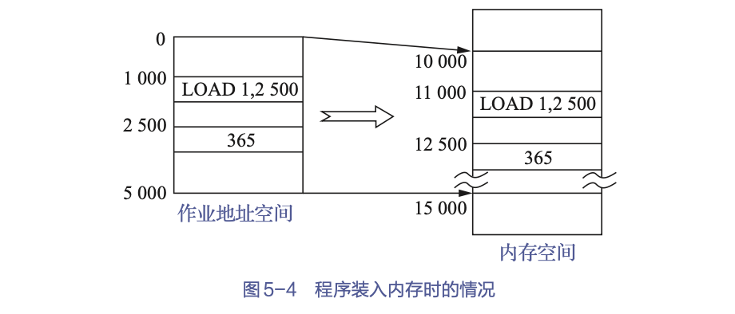

- 可重定位装入方式可将装入模块装入内存中任何允许的位置，故可用于多道程序环境
- 但该方式并不允许程序运行时在内存中移动位置。因为程序在内存中的移动，意味着它的物理位置发生了变化，这时必须对程序和数据的地址（绝对地址）进行修改

### 2.2.3 动态运行时装入方式

动态运行时装入方式在把装入模块装入内存后
- 并不会立即把装入模块中的相对地址变换为绝对地址
- 而是会把这种地址变换推迟到程序真正要执行时才进行

因此，装入内存后的所有地址都仍是相对地址。这种在运行时进行地址变换的重定位方式称为动态重定位。

> 逻辑地址+重定位寄存器（相对偏移量）=物理地址

## 2.3 程序的链接

源程序经过编译后，可得到一组目标模块。链接程序的功能是将这组目标模块以及它们所需要的库函数，装配成一个完整的装入模块。

### 2.3.1 静态链接

在程序运行之前，先将各目标模块及它们所需的库函数链接成一个完整的装配模块，以后不再拆开。

链接过程需要
- 修改不同模块连接后的相对地址
- 变换外部调用符号

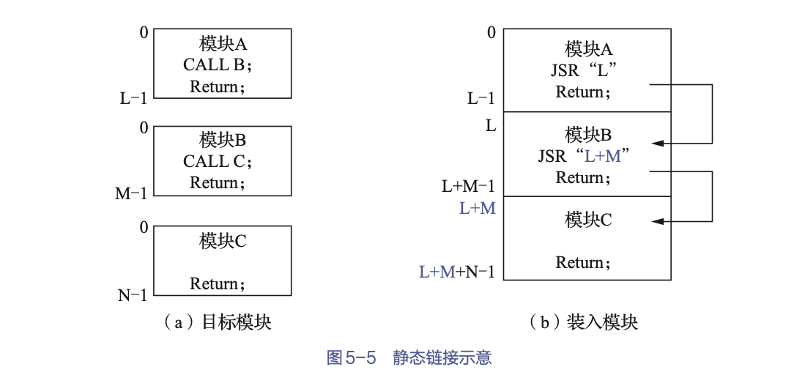

### 2.3.2 装入时动态链接

将用户源程序编译后所得的一组目标模块，在装入内存时，采用边装入边链接的链接方式，即
- 在装入一个目标模块时
- 若发生一个外部模块调用事件
- 则将引起装入程序找出相应的外部目标模块，并将它装入内存
- 还要按照图5-5所示的方式修改目标模块中的相对地址。

优点：
- 便于修改和更新

    - 对于经静态链接装配在一起的装入模块，如果要修改或更新其中的某个目标模块，则要求重新打开装入模块
    - 若采用动态链接方式，则由于各目标模块是分开存放的，因此要修改或更新各目标模块是一件非常容易的事。

- 便于实现对目标模块的共享

    - 在采用静态链接方式时，每个应用模块都必须含有其目标模块的复制版本
    - 采用装入时动态链接方式时，OS很容易将一个目标模块链接到几个应用模块上，实现多个应用程序对该目标模块的共享

### 2.3.3 运行时动态链接

将对某些模块的链接推迟到程序执行时才进行。即
- 在执行过程中，当发现一个“被调用模块”尚未被装入内存时
- 立即由OS去找到该模块，将其装入内存，并链接到装入模块上

但是会增加程序运行时的链接时间

# 3. 对换与覆盖

内存“扩充”: 
- 并不是指增加系统的物理内存
- 而是指在现有的物理内存的基础上扩大内存的使用效率

## 3.1 多道程序环境下的对换技术

### 3.1.1 对换的引入

“对换”，是指
- 把内存中暂时不能运行的进程或者暂时不用的程序和数据，转移到外存上，以便腾出足够的内存空间
- 再把已具备运行条件的进程或进程所需要的程序和数据存入内存，实现“对换”。

### 3.1.2 对换的类型

1. 整体对换

    对换是以整个进程为单位的

2. 页面（分段）对换

    对换是以进程的一个“页面”或“分段”为单位而进行的

## 3.2 对换区的管理

### 3.2.1 目标

在具有对换功能的OS中，通常把磁盘空间分为文件区和对换区这两部分。

1. 文件区管理的主要目标

    提高文件存储空间的利用率，然后才是提高对文件的访问速度

2. 对换区管理的主要目标
    
    提高进程换入和换出的速度，然后才是提高文件存储空间的利用率
    > 因此，对对换区的管理应采取连续分配存储管理方式

### 3.2.2 数据结构

为了对对换区中的空闲盘块的管理，使用空闲分区表或空闲分区链。空闲分区表的每个表目中均应包含两项，即
- 对换区的起始地址(盘块号)
- 对换区的大小(盘块数)

用于记录外存对换区中的空闲盘块的使用情况

### 3.2.3 对换区的分配与回收

由于对换区的分配采用的是连续分配存储管理方式，因而对换区的分配与回收，与采用动态分区方式时的内存分配与回收方法类似。其分配算法可以是首次适应算法、循环首次适应算法或最佳适应算法等。具体的分配与回收操作也与动态分区方式相同，故不再赘述。

<!-- TODO: 数据结构和分配与回收里讲到的东西好像有点陌生 -->

## 3.3 进程的换出与换入

当内核因执行某操作而发现空间不足时，便会调用对换进程，实现进程的换出与换入

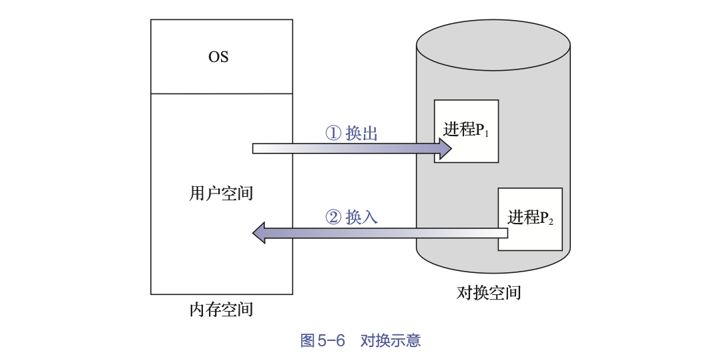

### 3.3.1 进程的换出

1. 选择被换出的进程

- 检查所有驻留在内存中的进程
- 首先选择处于**阻塞状态**或**睡眠状态**的进程
- 当有多个这样的进程时，应当选择优先级最低的进程作为换出进程。
    > 有的系统中，为了防止低优先级进程在被调入内存后很快又被换出，还须考虑进程在内存中的驻留时长。
- 如果系统中已无阻塞进程，而现在的内存空间仍不足以满足需要，则选择**优先级最低**的就绪进程换出。

2. 换出进程

- 应先申请对换区
- 若申请成功，就启动磁盘，将该进程的程序和数据传送到磁盘的对换区
    > 只能换出非共享的程序和数据段
- 传送成功，可回收该进程所占用的内存空间，并对该进程的PCB和内存分配表等数据结构做相应的修改。
- 若此时内存中还有可换出的进程，则继续执行换出操作

### 3.3.2 进程的换入

1. 过程

对换进程将定时执行换入操作
- 首先会查看PCB集合中所有进程的状态，找出处于“就绪”状态但被换出的进程
- 当有许多这样的进程时，它将选择其中已换出到磁盘上且时间最久（必须大于规定时间）的进程作为换入进程，并为它申请内存空间。
- 如果申请成功，则可直接将进程从外存换入内存；
- 如果申请失败，则须先将内存中的某些进程换出，腾出足够的内存空间后，再将进程换入。

在对换进程成功地换入一个进程后，若还有可换入的进程，则继续执行换入操作，直到
- 内存中再无处于“就绪且换出”状态的进程为止
- 或者已无足够的内存来支持换入进程

2. 对换方案

由于要交换一个进程需要很多时间，因此，对于提高处理机的利用率而言，它并不是一个非常有效的解决方法。目前用得较多的对换方案是
- 在处理机正常运行时并不启动对换程序
- 但如果发现有许多进程在运行时经常发生缺页，且显现出内存紧张的情况，则启动对换程序，将一部分进程调至外存
- 如果发现所有进程的缺页率都已明显减少，而系统吞吐量已下降时，则可暂停运行对换程序。

## 3.4 覆盖

1. 覆盖的思想是： 
- 在任何时候只在内存中保留所需的指令和数据
- 当需要其他指令和数据时，它们就会被装入刚刚不需要的指令和数据所占用的内存空间

2. 覆盖在具体实现时是：
- 在程序执行过程中，程序的不同部分相互替换
- 只在内存中保留那些在任何时候都需要的指令和数据

> 覆盖技术要求程序各模块之间有明确的调用结构，程序员声明覆盖结构后，OS完成覆盖的过程。较为复杂，因此覆盖的使用通常局限于微处理机和只有有限物理内存且缺乏先进硬件支持的其他系统。

# 4. 连续分配存储管理方式

为一个用户程序分配一个连续的内存空间
- 即程序中代码或数据的逻辑地址相邻
- 体现在内存空间中为分配的物理地址相邻

## 4.1 单一连续分配

单道程序环境下，早期的存储器管理方式把内存分为系统区和用户区两部分
- 系统区仅供OS使用，它通常放在内存的低址部分
- 在用户区内存中，仅装有一道用户程序，即整个内存的用户区由该程序独占

## 4.2 固定分区分配

最早的、也是最简单的一种可运行多道程序的分区式存储管理方式: 
- 将整个用户空间划分为若干个固定大小的区域（称为分区）
- 并在每个分区中只装入一道作业

### 4.2.1 分区划分

1. 分区等大小

    即所有的内存分区大小相等
    > 必然会造成存储空间的浪费，缺乏灵活性

2. 分区不等大小

    把内存划分成含有多个小分区、适量的中等分区及少量的大分区。

### 4.2.2 内存分配

为了便于内存分配，通常
- 将分区按其大小进行排队
- 并为之建立一张固定分区使用表，其中包括每个分区的
    - 起始地址
    - 大小
    - 及状态（是否已分配）

## 4.3 动态分区分配

根据进程的实际需要，动态地为之分配内存空间的。

### 4.3.1 动态分区分配中的数据结构

1. 空闲分区表

- 记录每个空闲分区的情况
- 每个空闲分区占一个表目，表目中包括
    - 分区号
    - 分区大小
    - 分区起始地址等

2. 空闲分区链

    为了实现对空闲分区的分配和链接

- 在每个分区的头部，设置一些用于控制分区分配的信息和链接各分区所用的前向指针
- 在每个分区的尾部则设置一个后向指针
- 通过前、后向指针可将所有的空闲分区链接成一个双向链

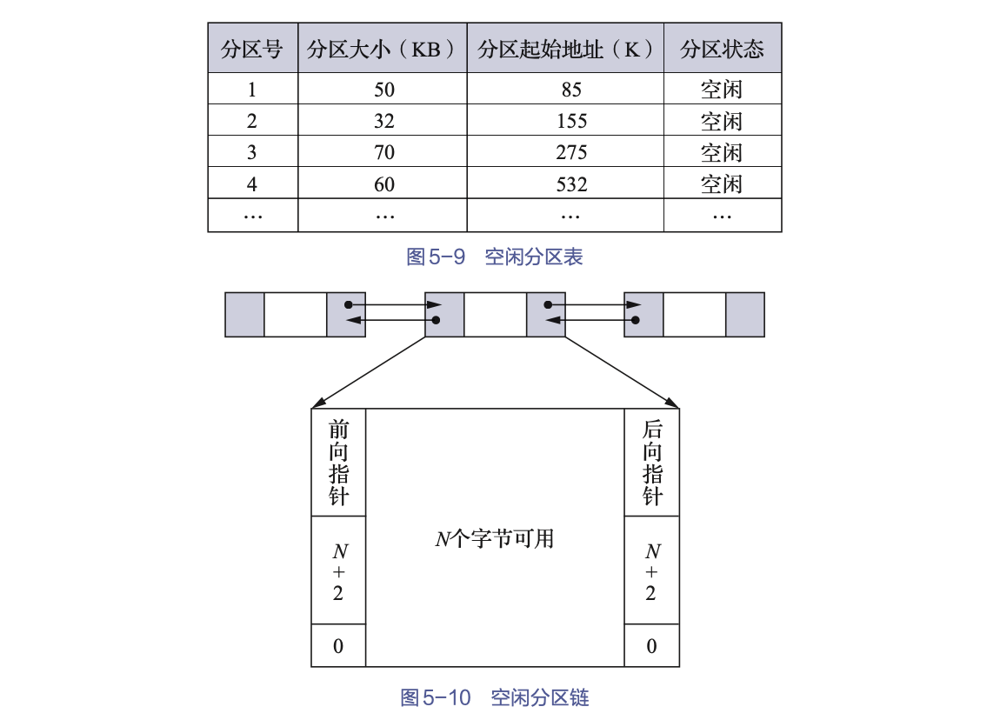

### 4.3.2 动态分区分配算法

#### 基于顺序搜索的动态分区分配算法（顺序分配算法）

通常会将系统中的空闲分区链接成一个链，指依次搜索空闲分区链上的空闲分区，以寻找一个大小能满足要求的分区。

---

1. 首次适应算法

分配内存时
- 从链首开始顺序查找，直至找到一个大小能满足要求的空闲分区为止
- 然后按照作业的大小，从该分区中划出一块内存空间分配给请求者，余下的空闲分区仍留在空闲链中
- 若从链首直至链尾都找不到一个能满足要求的分区，内存分配失败

倾向于优先利用内存中低址部分的空闲分区，从而保留了高址部分的大空闲分区

---

2. 循环首次适应算法

分配内存空间时
- 不再是每次都从链首开始查找
- 而是从上次找到的空闲分区的下一个空闲分区开始查找
- 直至找到一个能满足要求的空闲分区
- 然后从中划出一块与请求的大小相等的内存空间分配给作业

避免首次适应算法中低址部分留下许多很小的空闲分区的缺点

---

3. 最佳适应算法

所谓“最佳”，是指每次为作业分配内存时，总是分配
- 能满足要求
- 又是最小的空闲分区

最佳适应（best fit，BF）算法要求
- 将所有的空闲分区按其容量以从小到大的顺序，排成一个空闲分区链
- 这样，第一次找到的、能满足要求的空闲分区，必然是最佳的。

因为每次分配后所切割下来的剩余部分总是最小的，这样，在存储器中会留下许多难以利用的碎片

---

4. 最坏适应算法

- 扫描整个空闲分区表或空闲分区链时
- 总是会挑选一个最大的空闲区，从中分割一部分存储空间给作业使用
- 以至于存储器中会缺乏大的空闲分区，故把它称为最坏适应算法。

#### 基于索引搜索的动态分区分配算法（索引分配算法）

基本思想都是
- 将空闲分区根据分区大小进行分类
- 对于每类（具有相同大小的）空闲分区，单独设立一个空闲分区链表
- 并设置一张索引表来管理这些空闲分区链表
- 在为进程分配空间时，在索引表中查找所需空间大小对应的表项
- 并从中得到对应的空闲分区链表表头指针，从而实现通过查找得到一个空闲分区。

1. 快速适应算法

- 根据进程的长度，在索引表中找到能容纳它的最小空闲分区链表；
- 从链表中取下第一块进行分配。

该算法在进行空闲分区分配时，不会对任何分区产生分割，因此能保留大的分区，满足对大空间的需求，也不会产生内部碎片。

2. 伙伴系统

无论已分配分区还是空闲分区，其大小均为2的k次幂，k为正整数。对于具有相同大小的所有空闲分区，为它们单独设立一个空闲分区双向链表。当需要为进程分配一个长度为n的存储空间时
- 计算一个$i$值，使$2_{i-1}＜n≤2_i$，然后在空闲分区大小为$2_i$的空闲分区链表中查找。
- 若能找到，则把该空闲分区分配给进程。
- 否则，在分区大小为$2_{i+1}$的空闲分区链表中接着查找
- 若存在大小为$2_{i+1}$的一个空闲分区，则把该空闲分区分为相等的两个分区，这两个分区称为“一对伙伴”
    - 其中的一个分区用于分配
    - 而把另一个分区加入大小为2i的空闲分区链表中
- 若不存在，则需要继续查找，如此循环直至找到为止。

> 回收分区时也可能要进行多次合并。

3. 哈希算法 

- 构造一张以空闲分区大小为关键字的哈希表
- 该表的每个表项均记录了一个对应的空闲分区链表表头指针
- 当进行空闲分区分配时，根据所需空闲分区大小，通过哈希函数计算得到哈希表中的位置
- 从中得到相应的空闲分区链表，最终实现最佳分配策略

### 4.3.3  分区的分配与回收

1. 分配内存

分配内存指利用某种分配算法，从空闲分区链表中找到所需大小的分区
- 设请求的分区大小为u.size，表中每个空闲分区的大小为m.size。
- 若m.size-u.size≤size（size是事先规定的不再切割的剩余分区的大小），则说明多余部分太小，可不再切割，并将整个分区分配给请求者。
- 否则（即多余部分超过size），从该分区中按请求的大小，划分出一块内存空间并分配出去，余下的部分仍留在空闲分区链表中；
- 然后，将分配区的起始地址返回给调用者

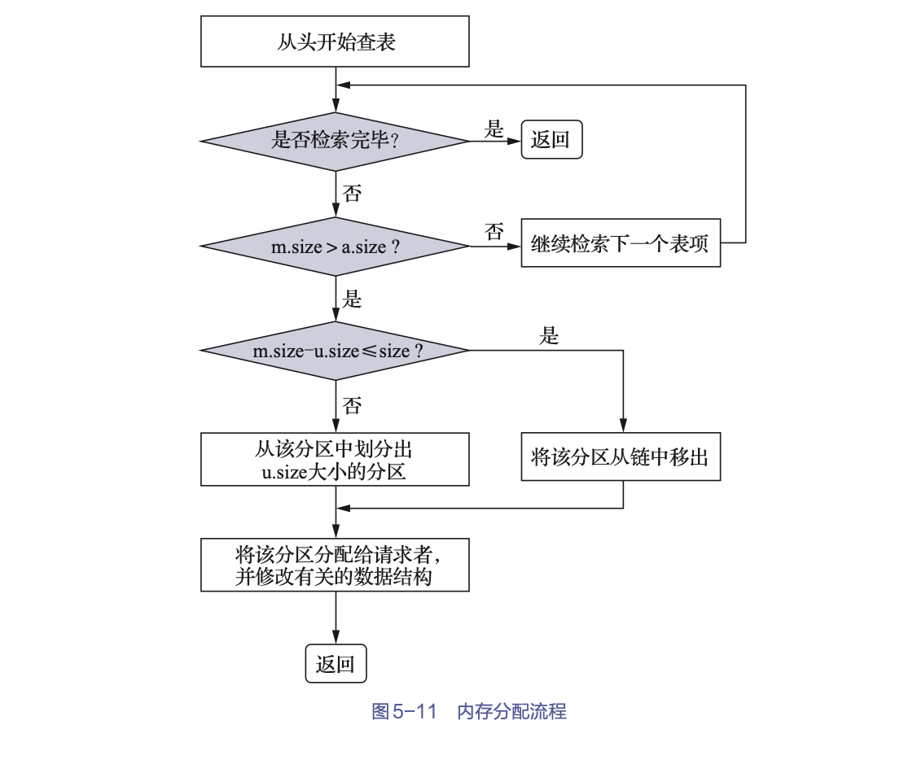

2. 回收内存

当进程运行完毕而须释放内存时，系统会根据回收区的起始地址，从空闲分区链表中找到相应的插入点，此时可能会出现以下四种情况之一:

- 回收区与插入点的前一个空闲分区F1相邻接

    此时应将回收区与插入点的前一分区合并，不必为回收分区分配新表项，而只须修改其前一分区F1的大小。

- 回收区与插入点的后一个空闲分区F2相邻接

    此时可将两分区合并，形成新的空闲分区，但须将回收区的起始地址作为新空闲区的起始地址，分区大小为两者之和。

- 回收区同时与插入点的前、后两个分区邻接

    此时将三个分区合并，使用F1的表项和起始地址，取消F2的表项，分区大小为三者之和。

- 回收区既不与F1邻接，也不与F2邻接。

    这时应为回收区单独建立一个新表项，填写回收区的起始地址和大小，并根据其起始地址将其插入空闲分区链表中的适当位置。

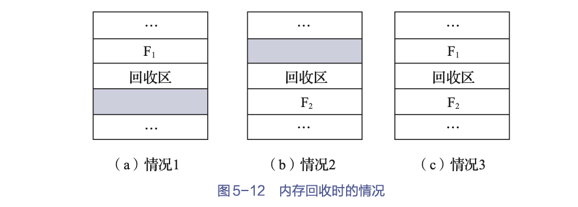

## 4.4 动态重定位分区分配

### 4.4.1 紧凑

计算机系统中的内存空间会被分割成许多小分区，而缺乏大的空闲空间。这种不能被利用的小分区，就是前面已提及的“碎片”

“紧凑”: 通过移动内存中作业的位置，把原来分散的多个小分区拼接成一个大分区

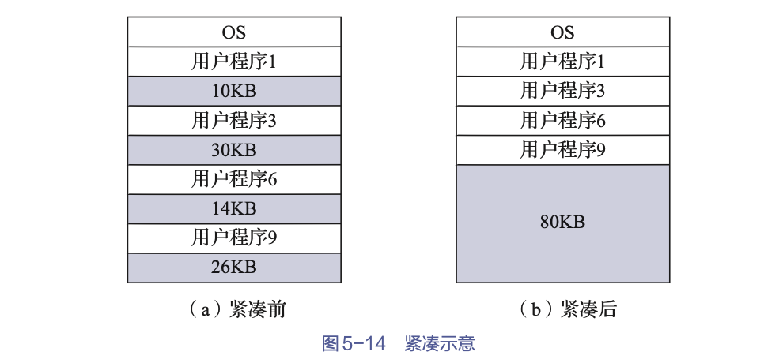

每次“紧凑”后，都必须对移动后的程序或数据进行重定位（对程序和数据的地址加以更新）。下面要介绍的动态重定位方法，可以很好地解决此问题。

### 4.4.2 动态重定位

在动态运行时装入方式中，作业装入内存后的所有地址仍然是相对地址
- 将相对地址变换为物理地址的工作，被推迟到程序指令要真正执行时进行
- 在系统中增设一个重定位寄存器，用它来存放程序（数据）在内存中的起始地址。

$$真正访问的内存地址 = 相对地址 + 重定位寄存器中的地址$$

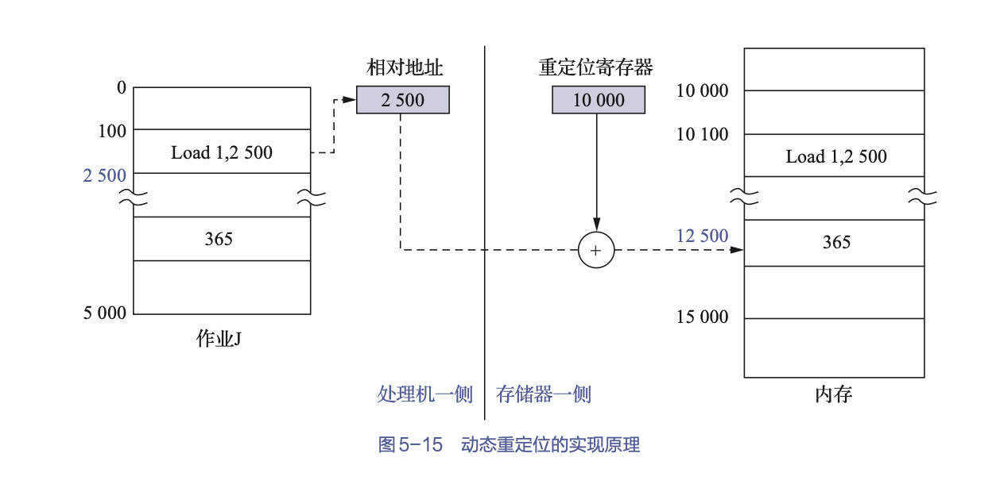

当系统对内存进行了“紧凑”时，无须对程序做任何修改，只要用该程序在内存中的新起始地址去置换原来的起始地址即可。(即修改重定位寄存器的值)

### 4.4.3 动态重定位分区分配算法

动态重定位分区分配算法与动态分区分配算法基本相同，差别仅在于：在这种分配算法中增加了“紧凑”功能。
- 当该算法不能找到一个足够大的空闲分区以满足用户需求时，如果所有小的空闲分区的容量总和大于或等于用户的要求
- 则此时便须对内存进行“紧凑”，并将“紧凑”后所得的大空闲分区分配给用户
- 如果所有小的空闲分区的容量总和仍小于用户的要求，则返回分配失败信息

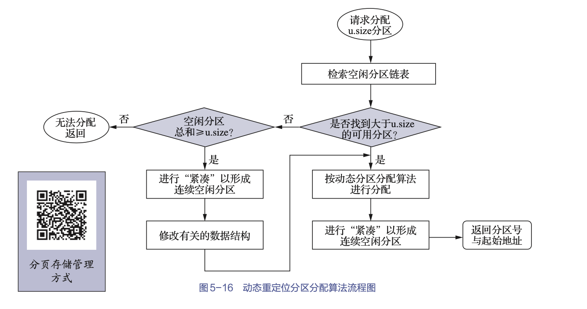

# 5. 分页存储管理方式

1. 概念

连续分配方式会形成许多“碎片”，虽然可以通过“紧凑”方法将许多碎片拼接成可用的大块空间，但须为之付出很大的开销。

离散分配存储管理方式思想：
- 将一个进程直接分散地装入许多不相邻接的分区中
- 则可充分地利用内存空间而无须再进行“紧凑”

2. 分类

根据在离散分配时所分配地址空间的基本单位的不同，可将离散分配方式分为以下3种: 
- 分页存储管理方式
    - 将用户程序的地址空间分为若干个固定大小的区域，称之为“页”
    - 相应地，也将内存空间分为若干个物理块或页框，块和页的大小相同
    - 可将用户程序的任一页放入任一物理块中，进而实现离散分配

- 分段存储管理方式

    - 这是为了满足用户要求而形成的一种离散分配方式
    - 把用户程序的地址空间分为若干个大小不同的段，每段可定义一组相对完整的信息
    - 在存储器分配时，以段为单位，这些段在内存中可以不相邻接，因此也同样实现了离散分配

- 段页式管理存储机制

    分页和分段两种存储管理方式相结合的产物，它同时具有两者的优点，是目前应用较广泛的一种存储管理方式。

## 5.1 分页存储管理的基本方法

### 5.1.1 页面和物理快

1. 页

- 分页存储管理将进程的地址空间分成若干个页，并为每页加以编号
- 相应地，也把内存空间分成若干个块，同样也为它们加以编号
- 在为进程分配内存时，以块为单位，将进程中的若干个页分别装入多个可以不相邻接的物理块中

> 页内碎片: 由于进程的最后一页经常装不满一块，进而形成了不可利用的碎片

2. 页面大小

- 若选择过小的页面大小
    - 则虽然可以减小内部碎片，有利于内存利用率的提高
    - 但是会造成每个进程占用较多的页面，导致进程的页表过长，占用大量内存；此外，还会降低页面换入/换出的效率。
- 如果选择过大的页面大小
    - 虽然可以减少页表的长度，以及提高页面换入/换出的效率
    - 但是又会使页内碎片增大

### 5.1.2 地址结构

- 页号$P$：指定页号
- 位移量$W$：页内偏移地址

### 5.1.3 页表

1. 页表定义

为能在内存中找到每个页面所对应的物理块，系统又为每个进程建立了一张页表
- 在进程地址空间内的所有页，依次在页表中有一页表项
- 记录了相应页在内存中对应的物理块号

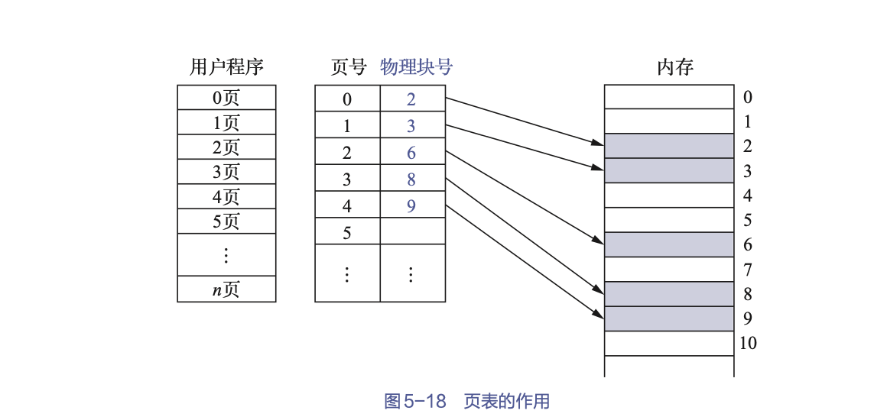

2. 控制字段

在页表的表项中设置一个存取控制字段，用于对该存储块中的内容加以保护
- 当存取控制字段仅有一位时，可用于规定该存储块中的内容是允许读/写，还是只读；
- 若存取控制字段为二位，则可用于规定读/写、只读和只执行等存取方式。

## 5.2 地址变换机构

地址变换机构的任务：
- 借助页表
- 将逻辑地址中的页号变换为内存中的物理块号

### 5.2.1 基本的地址变换机构

1. 页表寄存器

页表大多驻留在内存中。在系统中只设置一个页表寄存器（page-table register，PTR）存放
- 页表（在内存中）的起始地址
- 页表长度

进程未执行时，页表的起始地址和页表长度存放在本进程的PCB中。当调度程序调度到某进程时，才将这两个数据装入页表寄存器中

2. 访问过程

当进程要访问某个逻辑地址中的数据时
- 分页地址变换机构会自动将逻辑地址分为页号和页内地址两部分，再以页号为索引去检索页表
- 查找操作由硬件执行。在执行检索之前，先将页号与页表长度进行比较
- 如果页号大于或等于页表长度，产生一个地址越界中断。
- 若未出现越界错误
    - 则将页表起始地址与“页号和页表项长度的乘积”相加，便可得到该表项在页表中的位置，于是得到该页的物理块号
    - 将之装入物理地址寄存器中
    - 将有效地址寄存器中的页内地址送入物理地址寄存器的块内地址字段中

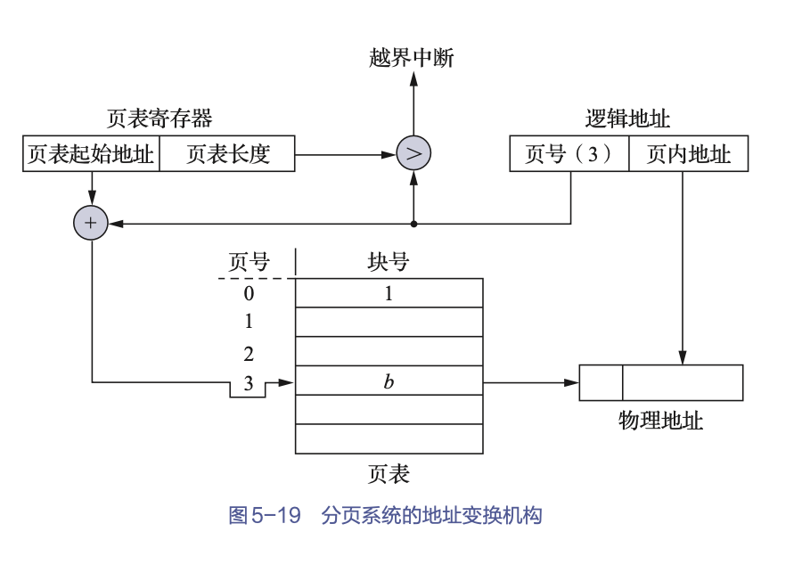

### 5.2.2 具有快表的地址变换机构

页表是存放在内存中的，这使CPU在每次存取一个数据时都要访问内存两次
- 第一次是访问内存中的页表，从中找到指定页的物理块号，再将块号与页内偏移量拼接，以形成物理地址
- 第二次访问是从第一次所得地址访问内存

为了提高地址变换速度，在地址变换机构中增设一个具有并行查寻能力的高速缓冲寄存器（快表），用以存放当前访问的那些页表项。此时的地址变换过程是：
- 在CPU给出有效地址后，地址变换机构将页号送入高速缓冲寄存器，并将此页号与高速缓存寄存器中的所有页号进行比较
- 若其中有与此页号相匹配的页号，则表示所要访问的页表项在快表中，可直接从快表中读出该页所对应的物理块号，并将其送到物理地址寄存器中。
- 若在快表中未找到对应的页表项，则还须再访问内存中的页表，直至找到后，把从页表项中读出的物理块号送到地址寄存器
- 同时，再将此页表项存入快表的一个寄存器单元中，亦即重新修改快表。

### 5.2.3 引入快表后的内存有效访问时间

假设访问内存的时间为$t$

- 对于没有引入快表时的有效访问时间

$$EAT = t  + t = 2t $$

- 对于快表

$a$为命中率，$b$为查找块表所需时间

$$EAT = a \cdot (b + t) + (1 - a)(b + t + t ) $$

## 5.3 多级页表

1. 问题

我们可以采用下述两个方法来解决页表变得很大的问题：
- 难以找到一片连续的大内存块存放页表：对于页表所需的内存空间，可采用离散分配方式
- 页表占有的内存空间大：只将当前需要的部分页表项调入内存，其余的页表项仍驻留在磁盘上，需要时再调入。

2. 两级页表

针对难以找到连续的大内存空间来存放页表的问题
- 可利用将页表进行分页的方法
- 使每个页表的大小与内存物理块的大小相同，并为它们编号
- 然后离散地将各个页表分别存放在不同的物理块中
- 为离散分配的页表再建立一张页表，称之为外层页表（outer page table），在每个页表项中记录页表页面的物理块号。

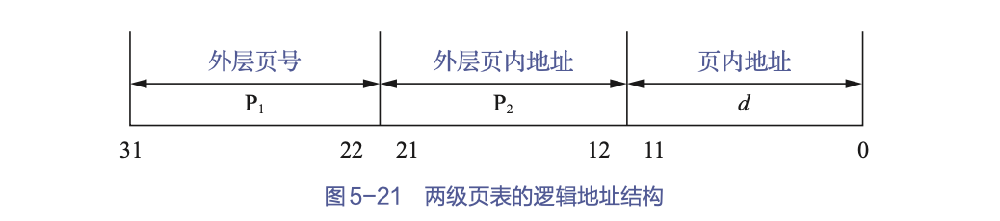

> 多级页表类似于两级页表，增加嵌套的层数，以至于可以装下所需的页表

## 5.4 反置页表

### 5.4.1 引入

为了减少页表占用的内存空间，引入反置页表（inverted page table）
- 为每个物理块设置一个页表项，并将它们按物理块的编号进行排序
- 其中的内容则是页号和其所隶属进程的标识符

### 5.4.2 地址变换

在利用反置页表进行地址变换时，会根据进程标识符pid和页号p检索反置页表
- 如果检索到了与之匹配的页表项，则该表项的序号i便是该页所在的物理块号，可用该块号i与页内地址d一起构成物理地址送往内存地址寄存器。
- 若检索了整个反置页表都未找到匹配的页表项，则表明此页尚未装入内存。 
    - 对不具有请求调页功能的存储器管理系统，报错
    - 对具有请求调页功能的存储器管理系统，此时则产生请求调页中断，系统将把此页调入内存。

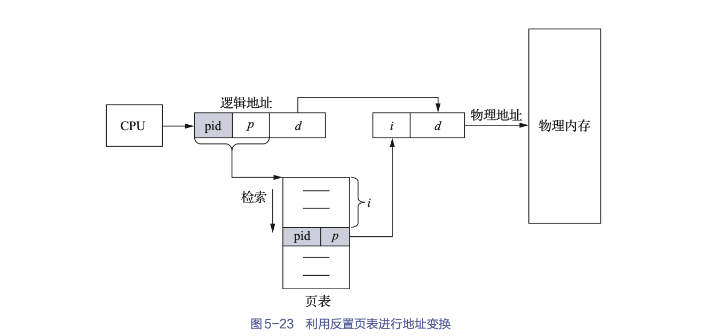

# 6. 分段存储管理方式

## 6.1 优点

1. 方便编程

用户把自己的作业按照逻辑关系划分为若干个段
- 每个段都从0开始编址，并且有自己的名字和长度
- 需要访问的逻辑地址是由段名（段号）和段内偏移量（段内地址）决定的

这不仅可以方便程序员编程，也可使程序非常直观、更具可读性。

2. 信息共享

实现对程序和数据的共享，是以信息的逻辑单位为基础的
- 分页系统中的“页”只是存放信息的物理单位（块），并无完整的逻辑意义，这样，一个可被共享的过程往往可能需要占用数十个页面，这为实现共享增加了难度。
- 段可以是信息的逻辑单位，因此，我们可以为该被共享过程建立一个独立的段，这就极大地简化了共享的实现。

3. 信息保护

信息保护同样是以信息的逻辑单位为基础的，而且经常以一个过程、函数或文件为基本单位进行保护。

4. 动态链接

动态链接要求的是以目标程序（即段）为链接的基本单位，因此，分段存储管理方式非常适用于动态链接。

5. 动态增长

内存管理系统根据进程对段的需求，动态地调整每个段的大小。

## 6.2 分段系统的基本原理

### 6.2.1 分段

在分段存储管理方式中，作业的地址空间被划分为若干段
- 每个段都定义了一组逻辑信息，如有主程序段MAIN、子程序段X、数据段D及栈段S等
- 每个段都有自己的名字。
- 每个段都从0开始编址，并采用一段连续的地址空间。
- 段的长度由相应的逻辑信息组的长度决定

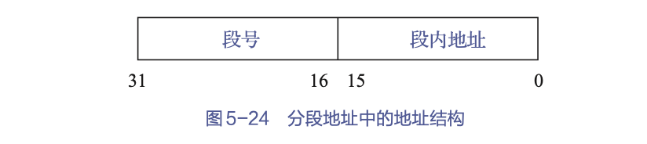

### 6.2.2 段表

在系统中（类似于分页系统）须为每个进程建立一张段映射表，简称“段表”，用于实现从逻辑段到物理内存区映射的。
- 每个段在表中均占有一个表项，其中记录了该段在内存中的起始地址和段的长度
- 段表可以存放在一组寄存器中，以提高地址变换速度，但更常见的方法是将段表存放在内存中。
- 在配置了段表后，执行中的进程可通过查找段表来找到每个段所对应的内存区。  

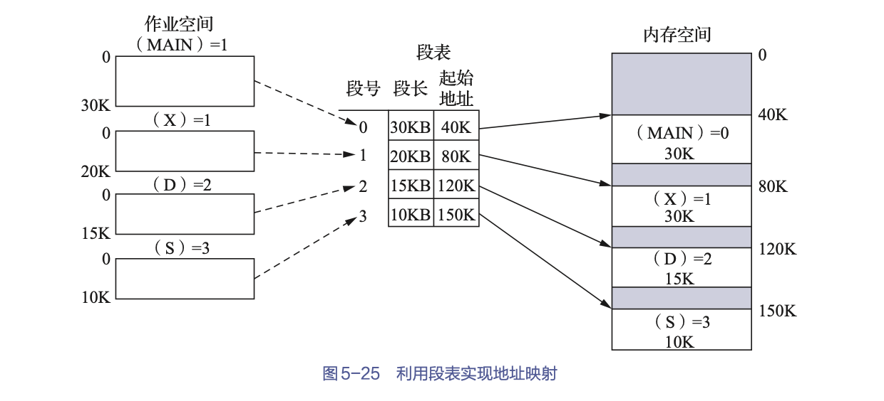

### 6.2.5 地址变换机构

为了实现进程从逻辑地址到物理地址的变换功能，在系统中设置了段表寄存器，用于存放段表起始地址和段表长度TL。

在进行地址变换时，系统将逻辑地址中的段号S与段表长度TL进行比较。
- 若S＞TL，访问越界，产生越界中断信号。
- 若未越界，则根据段表起始地址和该段的段号，计算出该段对应段表项的位置，从中读出该段在内存中的起始地址。

然后，再检查段内地址d是否超过该段的段长SL。
- 若超过，即d＞SL，则同样产生越界中断信号。
- 若未越界，则将该段的起始地址d与段内地址相加，即可得到要访问的内存物理地址。

> 像分页系统一样，当段表放在内存中时，每当要访问一个数据时，都须访问两次内存，解决的方法同分页系统类似，也增设一个联想存储器，用于保存最近常用的段表项。

### 6.2.6 分页和分段的主要区别

分页和分段系统有许多相似之处。例如，两者都采用离散分配方式，且都通过地址映射机构实现地址变换。但在概念上，两者完全不同，主要表现在下列3个方面。
1. 页是信息的物理单位

- 采用分页存储管理方式是为了实现离散分配方式，以消减内存的外零头，提高内存的利用率。
- 分段存储管理方式中的段，则是信息的逻辑单位，它通常包含的是一组意义相对完整的信息。分段的目的主要在于能更好地满足用户的需要。

2. 页的大小固定且由系统决定
    
    段的长度则不固定，其取决于用户所编写的程序，通常由编译程序在对源程序进行编译时根据信息的性质来划分。

3. 分页的用户程序地址空间是一维的

    分页完全是系统的行为，故在分页系统中，用户程序的地址属于单一的线性地址空间，程序员只须利用一个标识符即可表示一个地址。而分段是用户的行为，故在分段系统中，用户程序的地址空间是二维的，程序员在标志一个地址时，既须给出段名，又须给出段内地址。

## 6.3 信息共享

分段系统的一个突出优点是易于实现段的共享，即允许若干个进程共享一个或多个分段，且对段的保护也十分简单易行。

在分页系统中，代码和数据都以页面为单位进行管理。如果共享代码区域（editor的代码段）占用了40个页面，那么每个用户的页表中都必须包含40个页表项。这些页表项会将虚拟页面映射到相同的物理页面（21#至60#），以实现共享。因此，对于40个用户，系统需要维护40 × 40 = 1600个页表项来指向共享的代码页面。

在分段系统中，整个代码区域是作为一个段来管理的，每个用户只需在段表中设置一个段表项，用于指向共享的代码段起始地址。这样，40个用户只需40个段表项，远少于分页系统中的1600个页表项。段表的大小和复杂度明显降低。

# 7. 段页式存储管理方式

- 分页系统以页面为内存分配的基本单位，能有效地提高内存利用率；
- 而分段系统则以段为内存分配的基本单位，能更好地满足用户多方面的需要

如果能对两种存储管理方式“各取所长”，则可形成一种新的存储管理方式——段页式存储管理方式
- 既具有分段系统的便于实现、分段可共享、易于保护、可动态链接等一系列优点
- 又能像分页系统那样很好地解决内存分配中的外部碎片问题

## 7.1 基本原理

段页式存储管理方式的基本原理
- 先将用户程序分成若干段
- 再把每段分成若干页
- 并为每一个段赋予一个段名

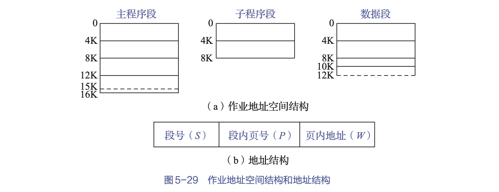

在段页式存储管理方式下，为了实现从逻辑地址到物理地址的变换，系统中需要同时配置段表和页表

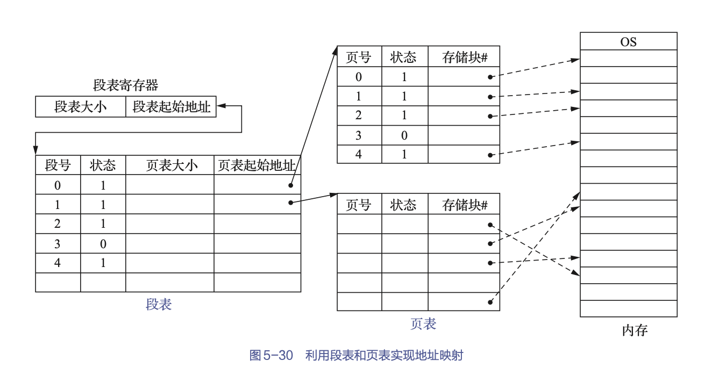

## 7.2 地址变换过程

在段页式存储管理方式下，为了便于实现地址变换
- 须为系统配置一个段表寄存器，其中存放段表起始地址和段长TL。在进行地址变换时
- 首先比较段号S与段长TL。若S＜TL，则表示未越界
- 于是利用段表起始地址和段号来求出该段所对应的段表项在段表中的位置，从中得到该段的页表起始地址
- 并利用逻辑地址中的段内页号P来获得对应页的页表项位置，从中读出该页所在的物理块号b
- 再利用物理块号b和页内地址来构成物理地址。

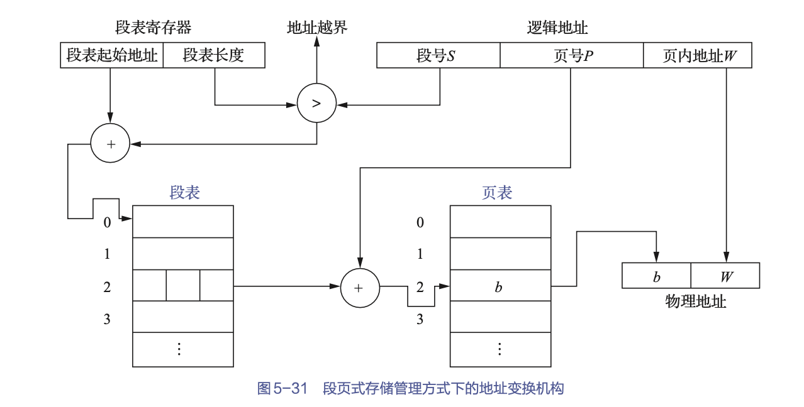

在段页式存储管理方式下，为了获得一条指令或数据，须三次访问内存
- 第一次访问是访问内存中的段表，从中取得页表起始地址
- 第二次访问是访问内存中的页表，从中取得该页所在的物理块号，并利用该物理块号与页内地址来一起构成指令或数据的物理地址
- 第三次访问才是真正地从第二次访问所得的地址中取出指令或数据

显然，这使访问内存的次数增加了近两倍。为了提高执行速度，在地址变换机构中增设一个高速缓冲寄存器。它的基本原理与分页及分段的情况相似

# 8. 本章小结

本章首先介绍了存储器管理的背景知识，包括
- 存储器的层次结构
- 程序的装入与链接
- 对换与覆盖等内容

其次，介绍了连续分配方式，其中重点介绍了
- 动态分区分配
- 动态重定位分区分配；

再次，详细介绍了离散分配存储管理方案中的
- 分页
- 分段
- 段页式存储管理方式；

