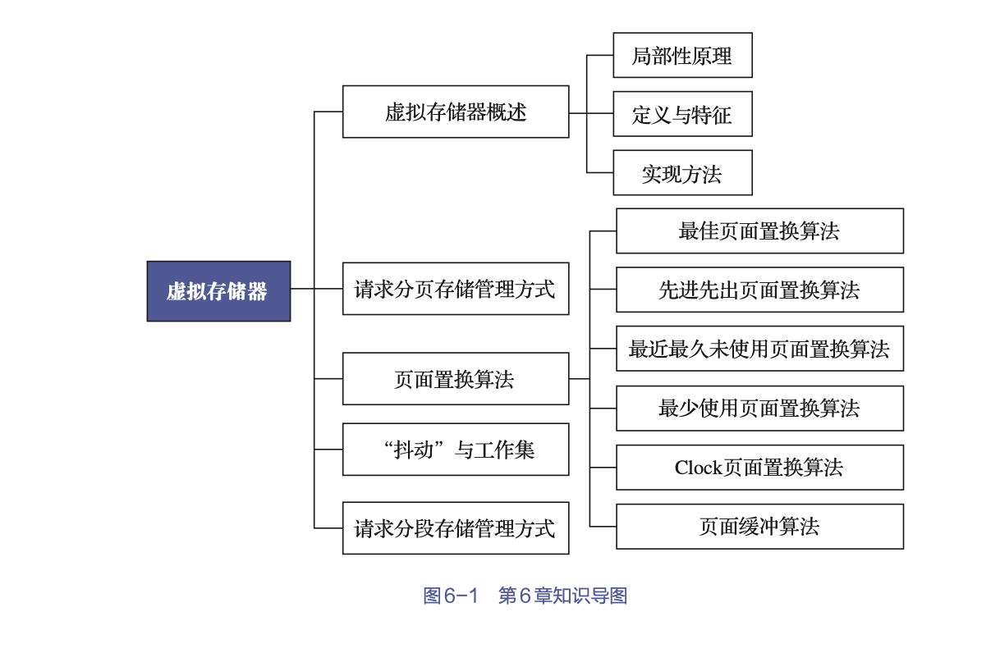
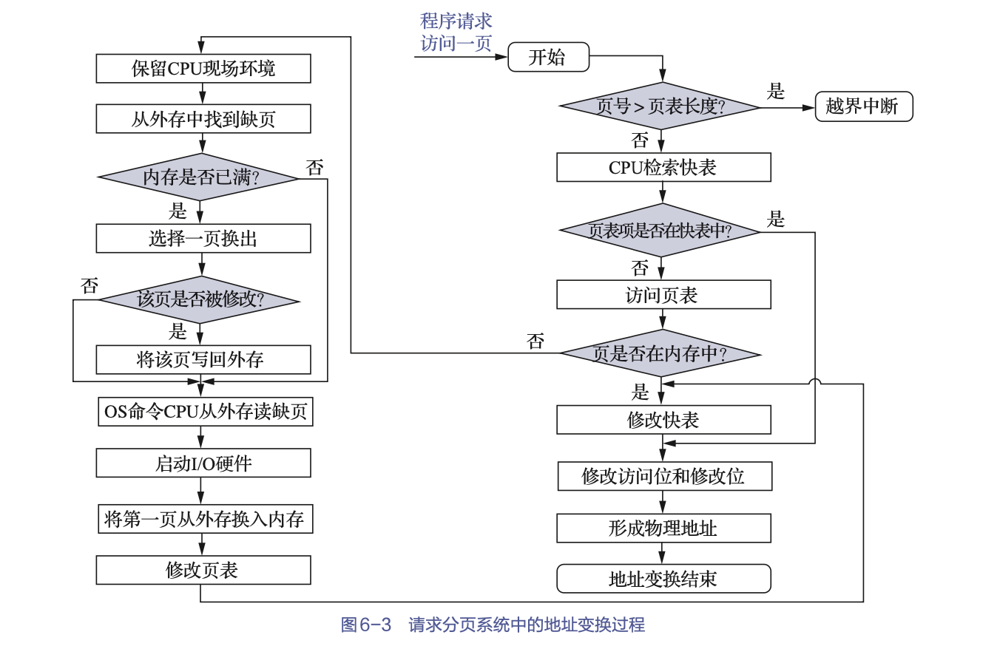
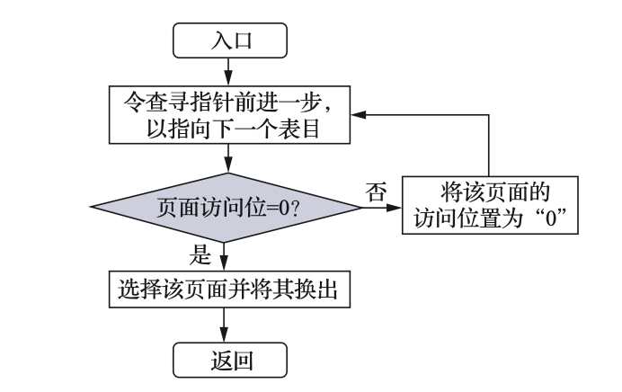
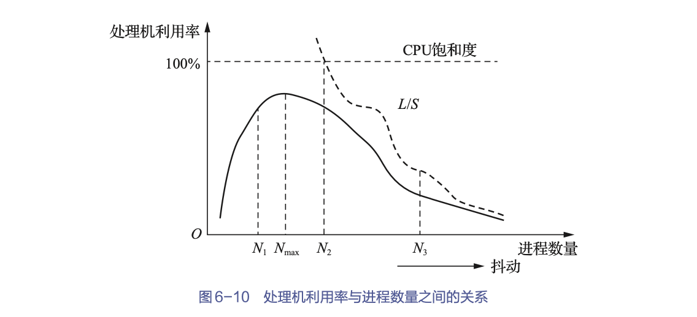
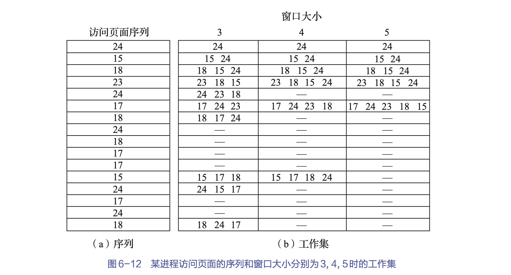
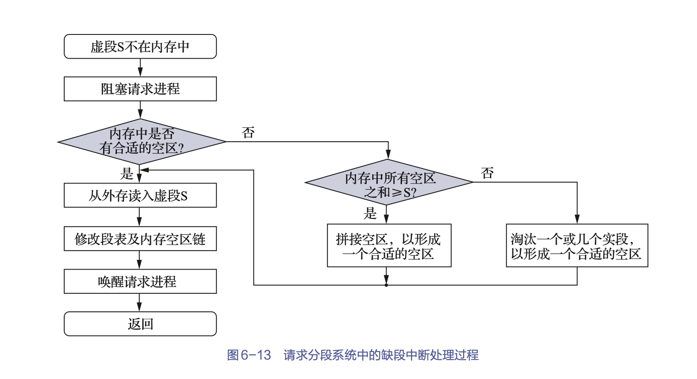
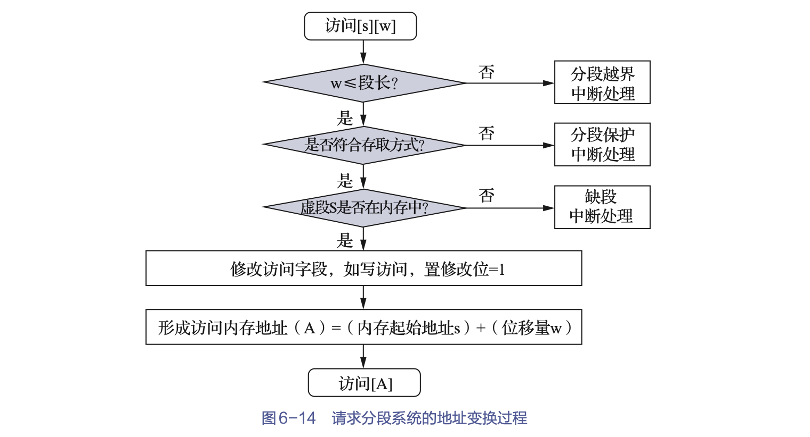
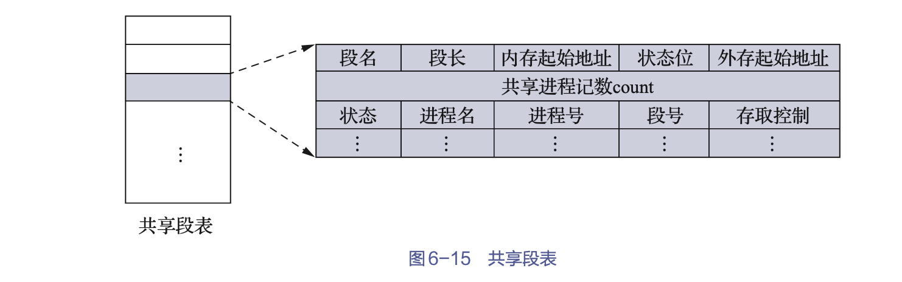
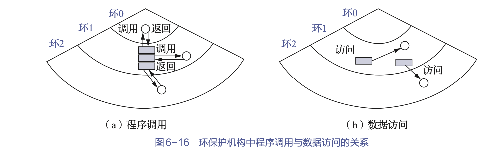

第六章、虚拟存储器

[toc]

内存扩充功能: 并非从物理上去扩大内存容量，而是借助虚拟存储器等技术，从逻辑上扩大内存容量，使用户所感觉到内存容量比实际内存容量大得多，于是便可让比内存空间更大的程序运行，或者让更多的用户程序并发运行。这样既满足了用户的需要，又改善了系统的性能。

# 1.虚拟存储器概述

## 1.1 常规存储器管理方式的特征和局部性原理

### 常规存储方式的特征

把第5章中所介绍的各种存储器管理方式，统称为传统存储器管理方式，它们全都具有以下两个共同的特征

1. 一次性

    指作业必须一次性地全部装入内存后，方能开始运行。导致了下述两种情况的发生
    - 当作业很大时，它所要求的内存空间超过了内存总容量，此时无法将全部作业装入内存，导致该作业无法运行；
    - 在有大量作业要求运行的情况下，由于每个作业都需要全部装入内存后方能运行，因此每次只能装入少量的作业，致使系统的多道程序度下降。

2. 驻留性
    指作业被装入内存后，整个作业都一直驻留在内存中，其中任何部分都不会被换出，直至作业运行结束。
    - 尽管运行中的进程会因I/O等原因而被阻塞，可能处于长期等待状态
    - 或者有的程序模块在运行过一次后就不再需要（运行）了  
    但它们都仍将驻留在内存中，继续占用宝贵的内存资源。

一次性及驻留性特征，使得许多在程序运行中不用或暂时不用的程序（数据）占据了大量的内存空间，而一些需要运行的作业又无法装入内存运行

现在要研究的问题是：一次性及驻留性特征，是否是程序在运行时所必须保留的和不可改变的特征。

### 局部性原理

程序在执行时将呈现出局部性规律，即在一段较短的时间内，程序的执行仅局限于某个部分，它所访问的存储空间也局限于某个区域。布兰农·邓宁提出了下列论点。
- 程序在执行时，除了少部分的转移和过程调用指令外，在大多数情况下是顺序执行的。
- 过程调用将会使程序的执行轨迹由一部分区域转至另一部分区域。但经研究发现，过程调用的深度在大多数情况下都不会超过5。这就是说，程序将会在一段时间内都局限在这些过程的范围内运行。
- 程序中存在许多循环结构，这些结构虽然只由少数指令构成，但是它们将会被多次执行。
- 程序中还包括许多对数据结构的处理，如对数组进行操作，它们往往都局限于很小的范围内。

局限性又表现在下述两个方面

- 时间局限性

    - 如果程序中的某条指令被执行，则不久以后该指令可能会被再次执行
    - 如果某数据被访问过了，则不久以后该数据可能会被再次访问  
    产生时间局限性的典型原因是在程序中存在着大量的循环操作。

- 空间局限性

    一旦程序访问了某个存储单元，不久之后，其附近的存储单元也将会被访问，即程序在一段时间内所访问的地址可能集中在一定的范围之内，其典型情况便是程序的顺序执行。

### 虚拟存储器的基本工作情况

基于局部性原理可知
- 在运行应用程序之前，没有必要将之全部装入内存，而仅须将那些当前要运行的少数页面或段先装入内存便可运行，其余部分暂留在盘上
- 程序在运行时，如果它所要访问的页（段）已被调入内存
    - 则可继续执行下去
- 如果程序所要访问的页（段）尚未被调入内存（称为缺页或缺段）
    - 则须发出缺页（段）中断请求
    - 此时OS将利用请求调页（段）功能，将它们调入内存，以使进程能继续执行下去
        - 如果此时内存已满，无法再装入新的页（段）
            - 则OS还须再利用页（段）的置换功能，将内存中暂时不用的页（段）调至盘上，在腾出足够的内存空间后
            - 再将要访问的页（段）调入内存，使程序继续执行下去
- 这样，便可使一个大的用户程序能在较小的内存空间中运行，也可在内存中同时装入更多的进程，使它们并发执行。

## 1.2 虚拟存储器的定义与特征

### 虚拟存储器的定义

所谓虚拟存储器，指具有请求调入功能和置换功能，能从逻辑上对内存容量加以扩充的一种存储器系统
- 其逻辑容量由内存容量和外存容量之和所决定
- 其运行速度接近于内存速度，而每个存储位的成本却又接近于外存

### 特征

1. 多次性(相对于传统存储器管理方式的一次性而言)

    指一个作业中的程序和数据，无须在作业运行时一次性地全部调入内存，而是允许被分成多次调入内存运行

    正是虚拟存储器的多次性特征，才使它具有从逻辑上扩大内存的功能。
    > 多次性是虚拟存储器最重要的特征，它是任何其他的存储管理方式所不具有的。

2. 对换性(相对于传统存储器管理方式的驻留性而言)

    指一个作业中的程序和数据无须在作业运行时一直常驻内存，而允许它们在作业运行时进行换入、换出；

    换入和换出能有效提高内存利用率。也正是这一特征，才使得虚拟存储器得以正常运行。
    > 试想，如果虚拟存储器不具有换出功能，即不能把那些在内存中暂时不运行的进程或页面（段）换至外存，那么不仅不能充分利用内存，而且会导致在换入时，因无足够的内存空间而经常以失败告终。

3. 虚拟性

    虚拟性是指能够从逻辑上扩大内存容量，使用户所看到的内存容量远大于实际内存容量。

    这是虚拟存储器所表现出来的最重要的特征，也是实现虚拟存储器最重要的目标。
    
    虚拟性是以多次性和对换性为基础的
    > 或者说，仅当系统允许将作业分多次调入内存，并能将内存中暂时不运行的程序和数据换至外存时，才有可能实现虚拟存储器；而多次性和对换性，显然又必须建立在离散分配方式的基础上。

## 虚拟存储器的实现方式

虚拟存储器的实现，都毫无例外地建立在离散分配方式的基础上。

1. 请求分页系统

    请求分页系统是在分页系统的基础上，增加了
    - 请求调页功能
    - 页面置换功能  
    所形成的页式虚拟存储系统。

    它允许
    - 用户程序只装入少数页面的程序（及数据）即可启动运行
    - 以后，再通过请求调页功能和页面置换功能，陆续地把即将运行的页面调入内存
    - 同时把暂不运行的页面换出到外存上。
    > 置换时以页面为单位。

    为了能实现请求调页功能和页面置换功能，系统必须提供必要的硬件支持和实现请求分页的软件。
    - 硬件支持
        - 请求分页的页表机制，它是在纯分页的页表机制上通过增加若干项而形成的，被作为请求分页的数据结构；
        - 缺页中断机构，即每当用户程序要访问的页面尚未调入内存时，便产生一个缺页中断，以请求OS将所缺的页调入内存；
        - 地址变换机构，这同样是在纯分页地址变换机构的基础上发展形成的。
    - 实现请求分页的软件
        - 用于实现请求调页的软件
        - 实现页面置换的软件。
    > 它们在硬件的支持下，将程序运行时所需的（尚未在内存中的）页面调入内存，再将内存中暂时不用的页面从内存置换到外存上。

2. 请求分段系统

    请求分段系统是在分段系统的基础上，增加了
    - 请求调段功能
    - 分段置换功能  
    后所形成的段式虚拟存储系统。

    它允许
    - 用户程序只装入少数段（而非所有的段）的程序和数据即可启动运行；
    - 以后，通过请求调段功能和分段置换功能将暂不运行的段调出
    - 再调入即将运行的段
    > 置换是以段为单位进行的

    为了实现请求分段，系统同样需要必要的硬件支持和实现请求分段的软件。
    - 硬件支持
        - 请求分段的段表机制，它是在纯分段的段表机制上通过增加若干项而形成的，被作为请求分段的数据结构；
        - 缺段中断机构，即每当用户程序要访问的段尚未调入内存时，便产生一个缺段中断，以请求OS将所缺的段调入内存；
        - 地址变换机构，这同样是在纯分段地址变换机构的基础上发展形成的。
    - 实现请求分段的软件
        - 实现请求调段的软件
        - 实现段置换的软件
    > 它们在硬件的支持下，先将内存中暂时不用的段从内存置换到外存上，再将程序运行时所需的（尚未在内存中的）段调入内存。

虚拟存储器在实现上是有一定难度的。  
- 请求分页系统请求分页系统换入与换出的基本单位都是固定大小的页面，所以在实现上要容易些。
- 而请求分段系统换入与换出的基本单位是段，其长度是可变的，且段的分配类似于动态分区分配，它在内存分配和回收上都比较复杂。

# 2.请求分页存储管理机制

请求分页系统是建立在基本分页基础上的，为了能支持虚拟存储器功能，其增加了请求调页功能和页面置换功能。每次换入和换出的基本单位都是长度固定的页面，这使得请求分页系统在实现上要比请求分段系统简单（后者换入和换出的基本单位是长度可变的段）。

因此，请求分页便成为目前最常用的一种实现虚拟存储器的方式。

## 2.1 请求分页的硬件支持

### 2.1.1 请求页表机制

基本作用: 将用户地址空间中的逻辑地址映射为内存空间中的物理地址。

为了满足页面换入与换出的需要，在请求页表中又增加了四个字段

- 状态位P
    
    该字段只有一位，用于指示该页是否已调入内存，供程序访问时参考。

- 访问字段A

    用于记录本页在一段时间内被访问的次数，或记录本页最近已有多长时间未被访问，供页面置换算法（程序）在选择换出页面时参考。

- 修改位M

    标志该页在调入内存后是否被修改过。由于内存中的每一页都在外存中保留一份副本，因此在置换该页时
    - 若未被修改，就无须再将该页写回到外存中，以减少系统的开销和启动磁盘的次数
    - 若已被修改，则必须将该页重写到外存中，以保证外存中所保留的副本始终是最新的。  
    简而言之，修改位M供置换页面时参考。

- 外存地址

    用于指出该页在外存中的地址，通常是物理块号，供调入该页时参考。

### 2.1.2 缺页中断机构

在请求分页系统中，每当所要访问的页面不在内存中时，便产生一个缺页中断，请求OS将所缺之页调入内存。

缺页中断作为中断，它们同样需要经历诸如保护CPU现场环境、分析中断原因、转入缺页中断处理程序进行处理以及在中断处理完成后恢复CPU现场环境等步骤。

但缺页中断又是一种特殊的中断，它与一般的中断相比有着明显的不同，主要表现在以下两个方面。

- 在指令执行期间，产生和处理缺页中断信号。

    CPU通常会在一条指令执行完后，才检查是否有中断请求到达。若有，便去响应；否则，继续执行下一条指令。然而，缺页中断是在指令执行期间，若发现所要访问的指令或数据不在内存中时，便立即产生和处理缺页中断信号，以便能及时将所缺之页调入内存。

- 一条指令在执行期间，可能会产生多次缺页中断。

### 2.1.3 地址变换机构

请求分页系统中的地址变换机构，是在分页系统地址变换机构的基础上，为实现虚拟存储器而通过增加某些功能所形成的，如产生和处理缺页中断，以及从内存中换出一页的功能等。

在进行地址变换时
- 首先会检索快表，试图从中找到所要访问的页
- 若能找到，则修改页表项中的访问位，供页面置换算法选择换出页面时参考
    - 对于写指令，还须将修改位置成“1”，表示该页在调入内存后已被修改。
    - 然后利用页表项中给出的物理块号和页内地址形成物理地址。地址变换过程到此结束。

- 如果在快表中未找到该页的页表项，则应到内存中去查找页表，再通过找到的页表项中的状态位P来了解该页是否已调入内存
    - 若该页已调入内存
        - 则应将该页的页表项写入快表
        - 当快表已满时，则应先调出按某种算法所确定的页的页表项，然后再写入该页的页表项
    - 若该页尚未调入内存，则应产生缺页中断，请求OS从外存把该页调入内存
     

## 2.2 请求分页中的内存分配

1. 最小物理块数的确定

    最小物理块数是指，能保证进程正常运行所需的最小物理块数
    - 当系统为进程分配的物理块数少于此值时，进程将无法运行。
    > 进程应获得的最小物理块数与计算机的硬件结构有关，取决于指令的格式、功能和寻址方式。

2. 内存分配策略

    在请求分页系统中，可采取两种内存分配策略，即
    - 固定分配（fixed allocation）
        为每个进程分配一组数目固定的物理块，在进程运行期间不再改变。
        
    - 可变分配（variable allocation）
        先为每个进程分配一定数目的物理块，然后在进程运行期间，可根据情况做适当的增加或减少。
        
    在进行置换时，也可采取两种置换策略，即
    - 全局置换（globalreplacement）
        如果进程在运行中发现缺页，则将OS所保留的空闲物理块（一般组织为一个空闲物理块队列），取出一块分配给该进程，或者以所有进程的全部物理块为标的，选择一块换出，然后将所缺之页调入。这样，分配给该进程的内存空间就会随之增大。
        
    - 局部置换（local replacement）。
        如果进程在运行中发现缺页，则只能从分配给该进程的n个页面中选出一页换出，然后再调入一页，以保证分配给该进程的内存空间不变。

    于是可组合出以下3种适用的策略。
    - 固定分配局部置换
        
        采用该策略时，为每个进程分配多少物理块，是根据进程类型（如交互型或批处理型等）或程序员、程序管理员的建议来确定的。实现这种策略的困难在于：应为每个进程分配多少个物理块难以确定
        
    - 可变分配全局置换。            

        在采用这种策略时，凡产生缺页（中断）的进程，都将获得新的物理块，仅当空闲物理块队列中的物理块用完时，OS才会从内存中选择一页调出。被选择调出的页可能是系统中任何一个进程中的页，因此这个被选中的进程所拥有的物理块会减少，这将导致其缺页率增加。

    - 可变分配局部置换。

        该策略同样是根据进程的类型或程序员的要求，为每个进程分配一定数目的物理块的；但当某进程发现缺页时，则只允许从该进程在内存的页面中选择一页换出，这样就不会影响其他进程的运行。如果进程在运行中频繁地发生缺页中断，则系统须再为该进程分配若干附加的物理块，直至该进程的缺页率减少到适当程度为止。反之，若一个进程在运行过程中的缺页率特别低，则此时可适当减少分配给该进程的物理块数，但不应引起其缺页率的明显增加。

3. 物理块分配算法

- 平均分配算法

    将系统中所有可供分配的物理块，平均分配给各个进程。

- 按比例分配算法

    根据各个进程所需的页面数大小按比例分配物理块

- 考虑优先权分配算法

    把内存中可供分配的所有物理块分成两部分
    - 一部分按比例分配给各进程
    - 另一部分则根据各进程的优先权进行分配，为高优先权进程适当地增加其相应的分配份额。  
    在有的系统（如重要的实时控制系统）中，可能会完全按优先权来为各进程分配物理块

## 2.3 页面调入策略

### 何时掉入页面

1. 预调页策略

采用一种以预测为基础的预调页策略，将那些预计在不久之后会被访问的页面，预先调入内存。
> 如果预测较准确，那么这种策略显然是很有吸引力的。但遗憾的是，目前预调页的成功率仅约50%。

优点：
- 其可用于在第一次将进程调入内存时，此时可将程序员指出的那些页先调入内存。
- 在采用工作集的系统中，每个进程都具有一张表，表中记录有运行时的工作集，每当程序被调度运行时，就将工作集中的所有页调入内存。
> 关于工作集的概念将在6.4节中进行介绍。

2. 请求调页策略

当进程在运行中需要访问某部分程序和数据时，若发现其所在的页面不在内存中，则立即提出请求，由OS将其所需页面调入内存。

但这种策略每次仅能调入一页，故需要花费较大的系统开销，增加了磁盘I/O的启动频率。

### 何处调入页面

请求分页系统中的外存可分为两部分：
- 用于存放文件的文件区: 采用离散分配方式
- 用于存放对换页面的对换区: 采用连续分配方式

每当发生缺页请求时，系统应从何处将缺页调入内存，可分为以下3种情况
- 系统拥有足够的对换区空间
    - 这时可以从对换区调入全部所需页面，以提高调页速度
    - 为此，在进程运行前，须将与该进程有关的文件从文件区复制到对换区。
- 系统缺少足够的对换区空间
    - 凡是不会被修改的文件都直接从文件区调入；而当换出这些页面时，由于它们未被修改，不必再将它们重写到磁盘（换出），以后再调入时仍从文件区直接调入
    - 但对于那些可能已被修改的部分，在将它们换出时，须将它们调到对换区，以后需要时再从对换区调入
- UNIX方式。
    - 故凡是未运行过的页面，都应从文件区调入。
    - 而对于曾经运行过但又被换出的页面，由于被放在对换区，因此在下次调入时，应从对换区调入。
    - 由于UNIX系统允许页面共享，因此，某进程所请求的页面有可能已被其他进程调入内存，此时也就无须再从对换区调入。

### 如何调入页面

每当程序所要访问的页面未在内存时（存在位为“0”）
- 便向CPU发出一个缺页中断，中断处理程序首先保留CPU现场环境，分析中断原因后转入缺页中断处理程序。
- 该程序通过查找页表得到该页的外存地址后
    - 如果此时内存能容纳新页，则启动磁盘I/O，将所缺之页调入内存，然后修改页表
    - 如果内存已满，则须先按照某种页面置换算法，从内存中选出一页准备换出；
        - 如果该页未被修改过（修改位为“0”），则不必将该页写回磁盘
        - 但如果该页已被修改（修改位为“1”），则必须将该页写回磁盘，然后再把所缺的页调入内存，并修改页表中的相应表项，置其存在位为“1”
        - 并将此页表项写入快表中。
- 在缺页调入内存且利用修改后的页表形成了所要访问数据的物理地址后，再去访问内存数据。
> 整个页面调入过程对用户是透明的。

### 缺页率

假设一个进程的逻辑空间为n页，系统为其分配的内存物理块数为m（m≤n）。如果在进程运行过程中，访问页面成功（即所访问页面在内存中）的次数为S，访问页面失败（即所访问页面不在内存中，需要从外存调入）的次数为F，则该进程总的页面访问次数为：
$$A=S+F$$
该进程在其运行过程中的缺页率为：
$$f=F/A$$

通常，缺页率会受到以下几个因素的影响。
- 页面大小：若页面划分较大，则缺页率较低；反之，则缺页率较高。
- 进程所分配物理块的数目：所分配的物理块数目越多，缺页率越低；反之，缺页率越高。
- 页面置换算法：算法的优劣决定了进程执行过程中缺页中断的次数，因此缺页率是衡量页面置换算法的重要指标。
- 程序固有特性：程序本身的编制方法对缺页中断次数有影响，根据程序执行的局部性原理，程序编制的局部化程度越高，相应执行时的缺页程度就越低。

# 页面置换算法

选择换出页面的算法称为页面置换算法（page-replacementalgorithm）

不适当的算法可能会导致进程发生“抖动”（thrashing），即刚被换出的页，很快又要被访问，因此需要将它重新调入，此时又需要再选一页调出；而此刚被调出的页，很快又被访问，又需要将它调入，如此频繁地更换页面，以致一个进程在运行中把大部分时间都花费在了页面置换工作上，我们称该进程发生了“抖动”。

## 最佳页面置换算法和先进先出页面置换算法

目前有许多页面置换算法，相比而言，最佳页面置换算法和先进先出页面置换算法是两种比较极端的算法。

最佳页面置换算法是一种理想化的算法，它具有最好的性能，但实际上是无法实现的，我们可以将其作为标准来评价其他算法的优劣。

先进先出页面置换算法是最直观的算法，由于与通常的页面使用规律不符，可能是性能最差的算法，故实际应用极少。

### 最佳页面置换算法

所选择的被淘汰页面，将是以后永不使用的或在（未来）最长时间内不会被访问的页面。
> 但是未来无法预知，所以该算法是无法实现的

### 先进先出页面置换算法

先进先出（first in first out，FIFO）页面置换算法总是会淘汰最先进入内存的页面，即选择在内存中驻留时间最久的页面予以淘汰。

该算法实现简单，只要把进程已调入内存的页面按先后次序链接成一个队列，并设置一个指针（称为替换指针），使它总是指向最老的页面。

但该算法与进程实际运行的规律不相适应，因为在进程中，有些页面（如含有全局变量、常用函数、例程等的页面）会经常被访问，而FIFO页面置换算法并不能保证这些页面不被淘汰。

## 最近最久未使用页面置换算法和最少使用页面置换算法

### 最近最久未使用页面置换算法介绍(LRU,Least recently used)

根据页面调入内存后的使用情况来做决策的。
> 由于无法预测各页面将来的使用情况，只能将“最近的过去”作为“最近的将来”的近似
LRU页面置换算法会选择最近最久未使用的页面予以淘汰。该算法赋予每个页面一个访问字段，用来记录一个页面自上次被访问以来所经历的时间t。当须淘汰一个页面时，选择现有页面中t值最大的（即最近最久未使用的）页面予以淘汰。

### LRU页面置换算法的硬件支持

为了了解一个进程在内存中的各个页面各有多少时间未被进程访问，以及如何快速地知道哪一页是最近最久未使用的页面，须有以下两类硬件之一的支持

1. 寄存器

为内存中的每个页面配置一个移位寄存器。该寄存器可表示为：
$$R =R_{n-1}R_{n-2}...R_1R_0$$
- 当进程访问某物理块时，要将相应寄存器的$R_{n-1}$位置成1
- 此时，定时信号将每隔一定的时间（如100ms）就使寄存器右移一位  
如果把$n$位寄存器的数看作一个整数，那么，具有最小数值的寄存器所对应的页面，就是最近最久未使用的页面。

2. 栈

可利用一个特殊的栈，保存当前使用的各个页面的页面号。
- 每当进程访问某页面时，便将该页面的页面号从栈中移出
- 并压入栈顶  
因此，栈顶始终是最新被访问页面的页面号，而栈底则是最近最久未使用页面的页面号。

### 最小使用页面置换算法(LFU,Least Frenquently Used)

为内存中的每个页面设置一个移位寄存器，用来记录该页面被访问的频率。该页面置换算法会将在最近时期使用最少的页面作为淘汰页。

LFU页面置换算法采用了移位寄存器方式
- 每次访问某页面时，便将该移位寄存器的最高位置1
- 再每隔一定时间（如100ms）右移一次  
这样，在最近一段时间内使用最少的页面将是R最小的页面
> 由于对页面的访问次数可能有成百上千次，直接利用计数器来记录某页面被访问的次数是不现实的，只能采用较大的时间间隔来记录对存储器某页面的访问。

LFU页面置换算法的页面访问图，与LRU页面置换算法的页面访问图完全相同；或者说，利用这样一套硬件既可实现LRU页面置换算法，又可实现LFU页面置换算法。

## 3.3 Clock页面置换算法

虽然LRU页面置换算法是一种较好的算法，但由于它要求有较多的硬件支持，其实现所需的成本较高，故在实际应用中大多采用LRU页面置换算法的近似算法。Clock页面置换算法就是用得较多的一种LRU页面置换算法的近似算法。

### 简单的Clock页面置换算法

为每页设置一个访问位，再将内存中的所有页面都通过链接指针链接成一个循环队列即可。
- 当某页被访问时，其访问位被置1。
- Clock页面置换算法在选择一页进行淘汰时，只要检查页的访问位
    - 如果是0，就选择该页换出
    - 如果是1，则重新将它置为0，暂不换出，给予该页第二次驻留内存的机会
        - 再按照FIFO页面置换算法检查下一个页面
        - 当检查到队列中的最后一个页面时
            - 若其访问位仍为1，则再返回队首去检查第一个页面。

由于该算法循环检查各页面的使用情况，故称之为Clock页面置换算法。但因该算法只有一个访问位，只能用它表示该页是否已经使用过，而置换时是将未使用过的页面换出，故又将该算法称为最近未用（not recently used，NRU）页面置换算法或二次机会页面置换算法。

### 改造型Clock页面置换算法

在改进型Clock页面置换算法中，除须考虑页面的使用情况外，还须再增加一个需要考虑的因素——置换代价。这样，选择页面换出时，既要是未使用过的页面，又要是未被修改过的页面，将同时满足这两个条件的页面作为首选淘汰的页面。由访问位A和修改位M可以组合成下面4种类型的页面。
- 第1类（A=0，M=0）：表示该页最近既未被访问，又未被修改，是最佳淘汰页。
- 第2类（A=0，M=1）：表示该页最近未被访问，但已被修改，并不是很好的淘汰页。
- 第3类（A=1，M=0）：表示该页最近已被访问，但未被修改，该页有可能再被访问。
- 第4类（A=1，M=1）：表示该页最近已被访问且被修改，该页有可能再被访问。
在进行页面置换时，可采用与简单Clock页面置换算法类似的改进型Clock页面置换算法，它们的差别在于该算法须同时检查访问位与修改位，以确定该页是4类页面中的哪一类。其执行过程可分成以下3步。

- 从指针所指示的当前位置开始，扫描循环队列，寻找A=0且M=0的第一类页面，将所遇到的第一个此类页面作为所选中的淘汰页。在第一次扫描期间不改变访问位A。
- 如果第一步失败，即查找一轮后未遇到第一类页面，则开始第二轮扫描，寻找A=0且M=1的第二类页面，并将所遇到的第一个此类页面作为淘汰页。在第二轮扫描期间，将所有扫描过的页面的访问位都置0。
- 如果第二步也失败，亦即未找到第二类页面，则将指针返回到开始的位置，并将所有的访问位复0。然后重复第一步，即寻找A=0且M=0的第一类页面，如果仍失败，则必要时再重复第二步，寻找A=0且M=1的第二类页面，此时一定能找到可被淘汰的页。

改进型Clock页面置换算法与简单Clock页面置换算法相比，可减少磁盘的I/O操作次数。但为了找到一个可置换的页，可能需要经过几轮扫描。换言之，实现该算法本身开销将有所增加。

## 3.4 页面缓冲算法

### 影响页面换入 / 换出效率的若干因素

1. 页面置换算法

2. 写回磁盘的频率

3. 读入内存的频率

### 页面缓冲算法

页面缓冲算法（page buffering algorithm，PBA）在原页面置换算法的基础上增设已修改页面链表，保存已修改且需要被换出的页面，等被换出的页面数目达到一定值时，再一起换出至磁盘，以达到减少页面换出开销的目的。

特点：
- 著地降低了页面换入/换出的频率，使磁盘I/O的操作次数大为减少
- 正是由于换入/换出的开销大幅度减小，其采用一种较简单的置换策略（如FIFO页面置换算法）时不需要特殊硬件的支持，实现起来非常简单。

1. 空闲页面链表

一个空闲物理块链表，这些系统掌握的空闲物理块用于分配给频繁发生缺页的进程，以降低这些进程的缺页率。

- 当这些进程需要读入一个页面时，它们便可利用空闲物理块链表中的第一个物理块来装入该页
- 当有一个未被修改的页面要换出时，实际上并不将它换出到磁盘，而是将它所在的物理块挂在空闲链表的末尾。
> 这些挂在空闲链表中的、未被修改的页面中是有数据的，如果以后某进程需要这些页面中的数据，则可从空闲链表上将它们取下，这免除了从磁盘读入数据的操作，减少了页面换入的开销。

2. 修改页面链表

修改页面链表是由已修改的页面所形成的链表。设置该链表的目的是减少已修改页面换出的次数。
- 当进程需要将一个已修改的页面换出时，系统并不会立即把它换出到磁盘上，而是会将它所在的物理块挂在修改页面链表的末尾。
> 这样做的目的是降低将已修改页面写回磁盘的频率，进而降低将磁盘内容读入内存的频率。

### 3.5 请求分页系统的内存有效访问时间

1. 被访问页在内存中，且其对应的页表项在快表中

此时不存在缺页中断情况，内存的有效访问时间分为查找快表时间和访问实际物理地址时间

2. 被访问页在内存中，且其对应的页表项不在快表中

此时也不存在缺页中断情况，但需要访问内存两次，一次读取页表，另一次读取数据；另外还需要更新快表。

3. 被访问页不在内存中

当被访问页不在内存中时，需要进行缺页中断处理，所以在这种情况下，内存的有效访问时间可分为查找快表时间、查找页表时间、处理缺页中断时间、更新快表时间和访问实际物理地址时间。

# 4.抖动与工作集

## 4.1 多道程序度与“抖动”

### 多道程序度与处理机的利用率

由于虚拟存储器系统能从逻辑上扩大内存，这时，只要装入一个进程的部分程序和数据，进程便可开始运行，故人们希望在系统中能运行更多的进程，即增加多道程序度（道数）以提高处理机的利用率。

### 产生抖动的原因

产生“抖动”的根本原因是
- 同时在系统中运行的进程太多，导致分配给每个进程的物理块太少，不能满足进程正常运行的基本要求
- 致使每个进程在运行时会频繁地出现缺页，必须请求系统将所缺之页调入内存。这会使得在系统中排队等待页面换入/换出的进程数量增加。

显然，对磁盘的有效访问时间也会随之急剧增加，造成每个进程的大部分时间都用于页面的换入/换出，而几乎不能再去做任何有效的工作，从而导致发生处理机的利用率急剧下降而趋于0的情况。我们称此时的进程处于“抖动”状态。

由于“抖动”的发生与系统为进程分配物理块的多少有关，因此有人提出了关于进程“工作集”的概念。

> 机械磁盘的读写会有抖动的声音

## 工作集

所谓工作集，是指在某段时间间隔Δ中进程实际要访问页面的集合。

布兰农·邓宁指出，虽然程序只需要少量的几页在内存中便可运行，但为了较少地产生缺页，应使程序的全部工作集装入内存中。

然而我们无法事先预知程序在不同时刻将访问哪些页面，故仍只有像页面置换算法那样，将程序在过去某段时间内的行为作为程序在将来某段时间内行为的近似。

具体来说，是把某进程在时间t的工作集记为w（t, Δ），其中的变量Δ称为工作集的“窗口尺寸”（windowssize）。

图6-12所示为某进程访问页面的序列和窗口大小分别为3, 4, 5时的工作集。由此可将工作集定义为，进程在时间间隔（t-Δ, t）中引用页面的集合。

## 抖动的预防方法

### 局部置换策略

即使该进程发生了“抖动”，也不会对其他进程产生影响，于是可把该进程“抖动”所造成的影响限制在较小的范围内。

该方法虽然简单易行，但效果不是很好，因为在某进程发生“抖动”后，它还会长期地处在磁盘I/O的等待队列中，使队列的长度增加，这会延长其他进程缺页中断的处理时间，也就是会延长其他进程对磁盘的访问时间。

### 把工作集算法融入处理机调度中

当调度程序发现处理机的利用率低下时，它将试图从外存调一个新作业进入内存，以改善处理机的利用率。如果在调度中融入了工作集算法
- 则在调度程序从外存调入作业之前，必须先检查每个进程在内存中的驻留页面是否足够多
- 如果都已足够多，则此时便可从外存调入新的作业，而不会因新作业的调入而导致缺页率的增加
- 如果有些进程的内存页面不足，则应首先为那些缺页率居高的作业增加新的物理块，此时将不再调入新作业。

### 利用"L=S"准则调节缺页率

其中L是缺页之间的平均时间，S是平均缺页服务时间，即用于置换一个页面所需的时间
- 如果L远比S大，则说明很少发生缺页，磁盘的能力尚未得到充分利用
- 如果L比S小，则说明频繁发生缺页，缺页的速度已超过磁盘的处理能力
- 只有当L与S接近时，磁盘和处理机才都可达到它们最大的利用率。

理论和实践都已证明，利用“L=S”准则，对于调节缺页率是十分有效的。

### 选择暂停的进程

当多道程序度偏高且已影响到了处理机的利用率时，为了防止发生“抖动”，系统必须减少多道程序的数量。

此时，应基于某种原则选择暂停某些当前活动的进程，将它们调出到磁盘上，以便腾出内存空间并将其分配给缺页率偏高的进程。

系统通常会采取与调度程序一致的策略，即首先选择暂停优先级最低的进程，若需要，则再选择暂停优先级较低的进程。

当内存还显拥挤时，还可进一步选择暂停一个并不十分重要但却较大的进程（以便释放出较多的物理块）或者剩余执行时间最多的进程等。

# 请求分段存储管理方式

在分页基础上建立的请求分页式虚拟存储器系统，是以页面为单位进行换入/换出的。

而在分段基础上所建立的请求分段式虚拟存储器系统，则是以分段为单位进行换入/换出的。

它们在实现原理以及所需要的硬件支持上都是十分相似的。
- 在请求分段系统中，程序运行之前只要先调入少数几个分段（不必调入所有分段），便可启动运行。
- 当所访问的段不在内存中时，可请求OS将所缺的段调入内存。
- 像请求分页式虚拟存储器系统一样，为实现请求分段存储管理方式，同样需要一定的硬件支持和相应的软件

## 请求分段中的硬件支持

### 请求段表机制

在请求分段存储管理中所需的主要数据结构是请求段表。

- 存取方式

    由于在应用程序中的段是信息的逻辑单位，可根据该信息的属性对它实施保护，故在段表中增加了存取方式字段。如果该字段为两位，则存取属性可以是只执行、只读或允许读/写。

- 访问字段A

    其含义与请求分页的相应字段相同，用于记录该段被访问的频繁程度。其可供页面置换算法在选择换出页面时参考。

- 修改位M 

    用于表示该段在进入内存后是否已被修改过，供置换段时参考。

- 存在位P 

    用于表示该段是否已调入内存，供程序访问时参考。

- 增补位

    增补位是请求分段存储管理中所特有的字段，用于表示该段在运行过程中是否做过动态增长。

- 外村地址

    用于表示该段在外存中的起始地址，即起始盘块号。

### 缺段中断机构

### 地址变换机构

## 分段的共享与保护

### 共享段表

为了实现分段共享，可在系统中配置一张共享段表，所有共享段都在共享段表中占有一表项。

在表项的上面记录了共享段的段名（号）、段长、内存起始地址、状态（存在）位、外存始地址以及共享进程计数count等信息。接下去记录了共享此分段的每个进程的情况。

- 共享进程技术count

    共享段是为多个进程所需要的，为记录有多少进程正在共享该分段，须设置共享进程计数count。当某进程不再需要而释放它后，系统并不会立即回收该段所占的内存区，而是会检查count是否为0。若不是0，则表示还有进程需要它，仅当所有共享该段的进程全都不再需要它（count为0）时，系统才会回收该段所占的内存区。

- 存取控制

    对于一个共享段，其应为不同的进程赋予不同的存取权限。

- 段号

    对于一个共享段，在不同的进程中其可以具有不同的段号。每个进程均可用自己进程的段号去访问该共享段。

    ### 共享段的分配与回收

1. 共享段的分配

    在为共享段分配内存时
    - 对于第一个请求使用该共享段的进程，系统会为该共享段分配一物理区
        - 再把共享段调入该区
        - 同时将该区的起始地址填入请求进程的段表的相应项中
        - 还须在共享段表中增加一表项，填写请求使用该共享段的进程名、段号和存取控制字段等有关数据，把count置为1
    - 当又有其他进程需要调用该共享段时
        - 由于该共享段已被调入内存，故此时无须再为该共享段分配内存，而只要在调用进程的段表中增加一表项，填写该共享段的物理地址即可。
        - 在共享段的段表中增加一个表项，填上调用进程的进程名、该共享段在本进程中的段号、存取控制字段等，再执行count=count+1操作，以表明有两个进程共享该共享段
    - 以后，凡有进程需要访问该共享段，都按上述方式在共享段的段表中增加一个表项。

2. 共享段的回收

当共享此段的某进程不再需要该段时，应将该段释放，包括
- 撤销在该进程段表中共享段所对应的表项
- 并执行count=count-1操作
    - 若结果为0，则须由系统回收该共享段的物理内存，并取消共享段表中该段所对应的表项，表明此时已没有进程使用该段
    - 否则（减1后结果不为0），只取消调用者进程在共享段表中的有关记录。

### 分段保护

由于每个分段在逻辑上都是相对独立的，因而比较容易实现信息保护。

1. 越界检查

    越界检查是利用地址变换机构来完成的。

2. 存取控制检查

    在段表的每个表项中，都设置了一个“存取控制”字段，用于规定对该段的访问方式。通常的访问方式有
    - 只读，即只允许进程对该段中的程序或数据进行读访问；
    - 只执行，即只允许进程调用该段去执行，但不允许读该段的内容，更不允许对该段的内容执行写操作；
    - 读/写，即允许进程对该段进行读/写访问。

    对于共享段，存取控制显得尤为重要，因此应为不同的进程赋予不同的读/写权限。

### 环保护机制

该机制规定低编号的环具有高优先权。OS核心处于0号环内，某些重要的实用程序和OS服务占居中间环，而一般的应用程序则被安排在外环上。在环系统中，程序的访问和调用应遵循以下规则
- 一个程序可以调用驻留在相同环或较高特权环（内环）中的服务
- 一个程序可以访问驻留在相同环或较低特权环（外环）中的数据

# 虚拟存储器实现示例

<!-- TODO: 累了，以后看吧 -->

## winxp

## linux

# 本章小结

用户期望能够执行逻辑地址空间大于物理地址空间的进程。

虚拟存储器是一种技术，能够将较大的逻辑地址空间映射到较小的物理内存上。

虚拟存储器允许运行极大的进程，提高了多道程序度与处理机利用率。

虚拟存储器的实现通常采用请求分页存储管理方式和请求分段存储管理方式；

由于页的大小相同、管理方便，请求分页存储管理更加常用。

本章在
- 介绍虚拟存储器的基本概念、实现原理的基础上
- 详细介绍了请求分页存储管理方式，包括
    - 缺页中断
    - 页面置换算法
    - 系统性能分析、
    - 抖动”和工作集等
- 并简要介绍了请求分段系统的实现。

围绕页面置换算法，本章详细介绍了
- 最佳页面置换算法
- FIFO页面置换算法
- LRU页面置换算法
- LFU页面置换算法
- Clock页面置换算法
- 改进型Clock页面置换算法  
等的基本原理与具体实现。
