第七章、输入/输出系统

[toc]

输入/输出（input/output，I/O）系统是OS的重要组成部分，用于管理
- 诸如打印机和扫描仪等I/O设备
- 以及用于存储数据的各种存储设备，如磁盘和磁带机等。  
由于设备类型繁多，差异又非常大，I/O系统成为了OS中最繁杂且与硬件最紧密相关的部分。本章将在简要介绍I/O设备的基础上，着重阐述OS对I/O的管理。


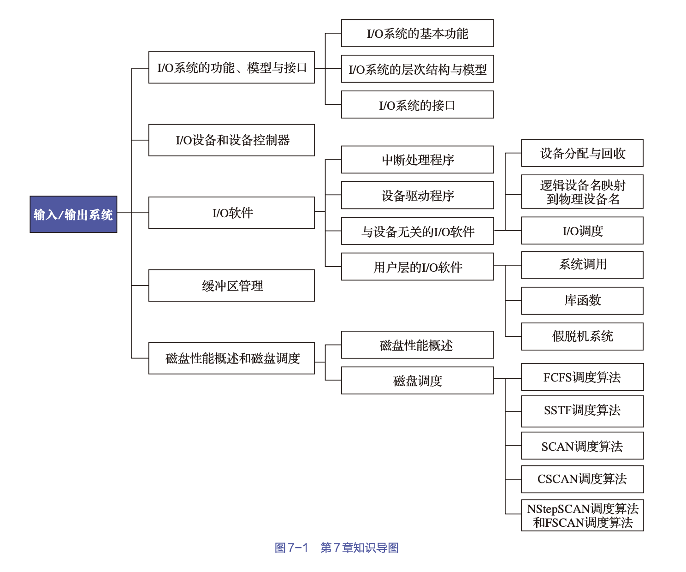


# 1.I/O系统的功能、模型和接口

I/O系统管理的
- 主要对象: I/O设备和相应的设备控制器  
- 主要的任务
    - 满足用户进程提出的I/O请求
    - 提高I/O速度
    - 提高设备的利用率
    - 以及为更高层的进程方便地使用I/O设备提供手段。


## 1.1 I/O系统的基本功能


### 1.1.1 能够隐藏 I/O 设备的细节

I/O设备的类型非常多，且彼此间在很多方面都存在差异
> 如它们接收和产生数据的速度、数据传输方向、数据粒度、数据的表示形式以及可靠性等方面。

为了对这些千差万别的I/O设备进行控制，通常会为它们配置相应的设备控制器。这是一种硬件设备，其中包含若干个用于存放控制命令和参数的寄存器。

用户通过这些命令和参数，可以控制I/O设备执行所要求的操作。显然，对于不同的I/O设备，需要有不同的命令和参数。
> 例如，在对磁盘进行操作时，不仅要给出本次是读命令还是写命令，还要给出源数据或目标数据的位置，包括磁盘的盘面号、磁道号和扇区号。

由此可见，要求程序员或用户编写直接面向这些I/O设备的程序是极其困难的。因此，I/O系统必须通过对I/O设备加以适当的抽象，以隐藏I/O设备的实现细节，仅向上层进程提供少量的、抽象的读/写命令，如read、write等。

### 保证设备无关性


### 提高处理机和I/O设备的利用率


### 能够对I/O设备进行控制

对I/O设备进行控制是设备驱动程序的功能之一

目前对I/O设备有4种控制方式：
- 轮询的可编程I/O方式；
- 中断的可编程I/O方式；
- 直接存储器访问（direct memory access，DMA）方式；
- I/O通道方式。

### 能够确保对设备的正确共享

根据设备的(同一时刻的)共享属性，可将系统中的设备分为两类
- 独占设备
- 共享设备

### 能正确处理错误

<!-- TODO: 还是有点抽象的嘞，到时候再想想 -->


## I/O系统的层次结构与模型

### I/O系统的层次结构

1. 用户层软件: 提供与用户交互的接口，用户可直接调用该层所提供的与I/O操作有关的库函数对设备进行操作。

2. 与设备无关的I/O软件: 实现用户程序与设备驱动程序的统一接口、设备命名、设备保护以及设备的分配与释放等，同时为设备管理和数据传输提供必要的存储空间。

3. 设备驱动程序: 与硬件直接相关，用于执行系统对I/O设备发出的操作指令

4. 中断处理程序: 用于保存被中断进程的CPU现场环境，保存完成后转入相应的中断处理程序处理中断，处理完成后再恢复被中断进程的CPU现场环境，最后返回被中断进程。

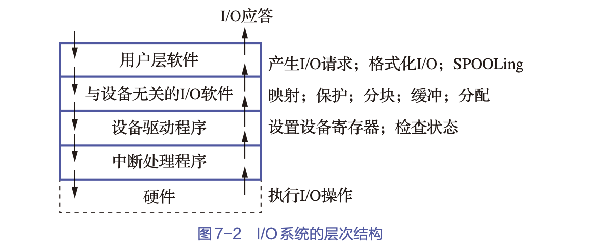

### I/O系统模型


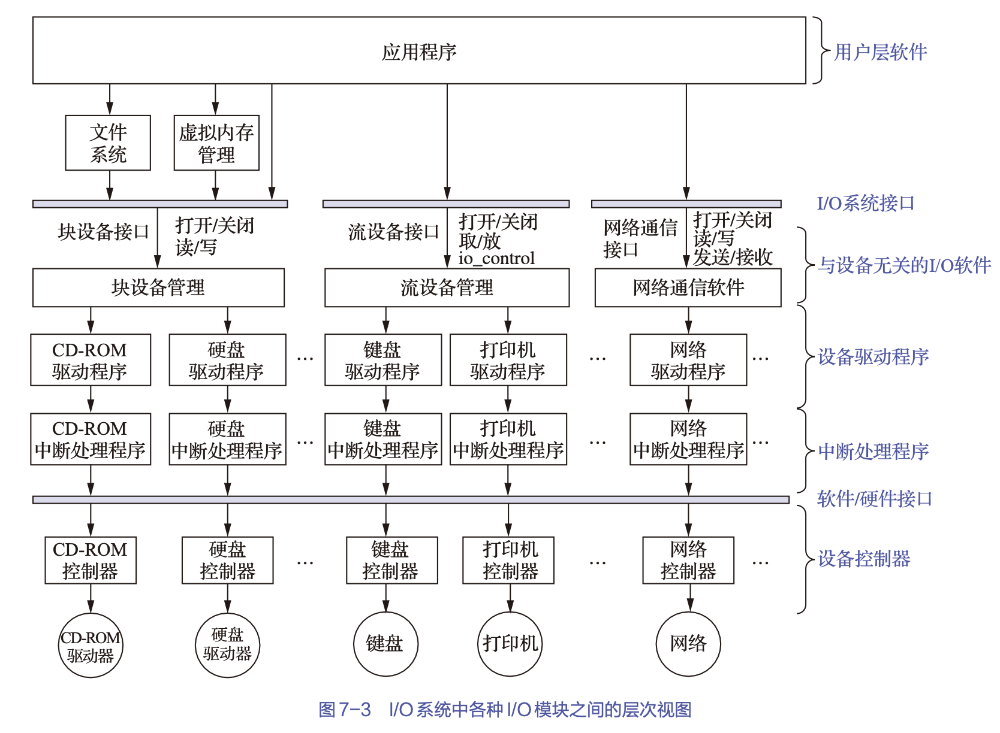

1. I/O系统的上/下接口

- I/O系统接口

I/O系统与上层系统之间的接口，向上层系统提供对设备进行操作的抽象I/O命令，以方便上层系统对设备进行使用。有不少OS在用户层提供了与I/O操作有关的库函数供用户使用。

- 软件/硬件接口

上面是中断处理程序和用于不同设备的设备驱动程序。它的下面是各种设备的控制器，

2. I/O系统的分层

与前面所述的I/O软件的分层相对应，I/O系统本身也可分为以下3个层次。


- 中断处理层

    处于I/O系统的最低层，直接与硬件进行交互。
    - 当有I/O设备发来中断请求信号时，在中断硬件做了初步处理后，便转向中断处理程序
    - 它首先保存被中断进程的CPU现场环境，然后转入相应设备的中断处理程序处理中断
    - 在中断处理完成后又恢复被中断进程的CPU现场环境，并返回断点继续运行。

- 设备驱动程序

    它处于I/O系统的次低层，是进程和设备控制器之间的通信程序
    - 功能：将上层发来的抽象I/O请求转换为针对I/O设备的具体命令和参数，并把它们装入设备控制器中的命令寄存器和参数寄存器中，或者相反。
    > 由于设备之间的差异很大，每类设备的驱动程序都不同，故必须由设备制造厂商提供设备驱动程序

- 与设备无关的I/O设备

    基本含义是：I/O软件独立于具体使用的物理设备。
    > 与设备无关的I/O软件的内容包括设备命名、设备分配、数据缓冲和数据高速缓
冲等。


## I/O系统的接口

I/O系统与上层的接口，根据设备类型的不同，可分为块设备接口、流设备接口和网络通信接口

### 块设备接口

块设备接口是块设备管理程序与上层之间的接口，该接口反应了大部分磁盘存储器、光盘存储器、闪存等本质特征，用于控制该类设备的I/O

1. 块设备

所谓块设备，是指数据的存取和传输都是以数据块为单位的设备。典型设备是 磁盘


块设备的特征：
- 传输效率高: 通常为每秒几十MB到几百MB
- 可寻址: 能指定数据的输入源地址以及输出的目标地址,可随机存取
- 磁盘设备的I/O通常采用DMA方式

2. 隐藏了磁盘的二维结构

块设备接口将磁盘上的所有扇区从0到n-1依次编号，n是磁盘中的扇区总数。经过这样编号后，就可以把磁盘的二维结构变为线性序列。

3. 将抽象命令映射为第几操作

块设备接口支持上层发来的、面向文件或设备的打开、读、写和关闭等抽象命令，并将上述命令映射为设备能识别的较低层的具体操作

虚拟存储器系统也需要使用块设备接口，因为在进程运行期间，每当它所访问的页面不在内存中时，便会发生缺页中断，此时就需要利用I/O系统（通过块设备接口）从磁盘存储器中将所缺页面调入内存。

### 流设备接口

流设备接口是流设备管理程序与上层之间的接口。该接口又称为字符设备接口，它反映了大部分字符设备的本质特征，用于控制字符设备的I/O。

1. 字符设备

所谓字符设备，是指数据的存取和传输是以字符（字节）为单位的设备

流设备的基本特征：
- 不可寻址，即不能指定数据的输入源地址以及输出的目标地址
- 传输速率较低，通常为每秒几B至数千B
- 字符设备在I/O时通常采用中断驱动I/O方式

2. get操作和put操作

由于字符设备是不可寻址的，因而对它只能采取顺序存取方式。通常会为字符设备建立一个字符缓冲区（队列），设备的I/O字节流顺序地进入字符缓冲区（读入），或从字符缓冲区顺序地送出到设备（输出）。

- get操作: 从字符缓冲区取得一个字节（到内存），并将它返回给调用者
- put操作: 将一个新字节（从内存）输出到字符缓冲区，以待送出到设备


3. in-control指令

因字符设备的类型非常多，且差异甚大，所以为了以统一的方式来处理它们，通常会在字符设备接口中提供一种通用的in-control指令。

该指令中包含了许多参数，每个参数均表示一个与具体设备相关的特定功能。

因为大多数字符设备都属于独占设备，所以必须采取互斥方式实现共享。为此，字符设备接口提供了打开操作和关闭操作。在使用此类设备时，必须先用打开操作来打开设备。如果设备已被打开，则表示它正被其他进程使用


### 网络通信接口

OS也必须提供相应的网络软件和网络通信接口，以使计算机能通过网络同网络上的其他计算机进行通信，或上网浏览信息。

# 2. I/O设备和设备控制器

I/O设备一般是由
- 一般的I/O设备: 执行I/O操作的机械部分
- 设备控制器或适配器（adapter）: 执行I/O控制的电子部件  
组成的

## 2.1 I/O设备

### 类型

1. 按使用特性分类

- 存储设备

也称为外存、辅存，是用于存储信息的主要设备。该类设备存取速度较内存慢，但容量较内存却大得多，价格也便宜

- I/O设备，

又可分为
- 输入设备: 用于接收外部信息
- 输出设备: 输出设备用于将计算机处理后的信息送向处理机外部的设备
- 交互式设备: 集成了上述两类设备


2. 按传输速率分类

- 低速设备: 其传输速率仅为每秒几字节至数百字节，键盘、鼠标等
- 中速设备: 其传输速率为每秒数千字节至数十万字节，行式打印机、激光打印机等
- 高速设备: 其传输速率为每秒数十万字节至千兆字节，磁带机、磁盘机、光盘机等。


### 设备与设备控制器间的接口


1. 数据信号线

用于在设备和设备控制器之间传送数据信号

对输入设备而言，由外界输入的信号经转换器转换所形成的数据，通常会先送入缓冲器中，当数据量达到一定的比特（字节）数后，再从缓冲器通过一组数据信号线传送给设备控制器

对输出设备而言，则是将从设备控制器经过数据信号线传送来的一批数据，先暂存于缓冲器中，经转换器做适当转换后再逐个字符地输出。


2. 控制信号线

作为由设备控制器向I/O设备发送控制信号的通路

该控制信号规定了设备将要执行的操作，如
- 读操作（由设备向设备控制器传送数据）
- 写操作（从设备控制器接收数据）
- 执行磁头移动操作等。

3. 状态信号线

用于传送指示设备当前状态的信号

设备的当前状态有
- 正在读（或写）
- 设备已读（或写）完成
- 准备好了新的需要传送的数据
等


## 设备控制器

设备控制器的主要功能: 控制一个或多个I/O设备，以实现I/O设备和计算机之间的数据交换


可把设备控制器分成两类
- 一类是用于控制字符设备的控制器
- 另一类是用于控制块设备的控制器

### 设备控制器的基本功能

1. 接受和识别命令

设备控制器能接收并识别处理机发来的多种命令，去控制I/O设备工作。

在控制器中具有相应的控制寄存器，用于存放接收的命令和参数，并对所接收的命令进行译码


2. 数据交换

设备控制器能实现
- CPU与设备控制器之间

    通过数据总线，由CPU并行地把数据写入设备控制器，或从设备控制器中并行地读出数据

- 设备控制器与设备之间的数据交换

    通过数据寄存器，由设备将数据输入设备控制器，或由设备控制器传送数据给设备

3. 标志和报告设备的状态

设备控制器中有一状态寄存器，用其中的某一位来反映设备的某一种状态。当CPU将该寄存器的内容读入后，便可了解该设备的状态。

4. 地址识别

设备控制器是一个可编址的设备，其必须能够识别自身所控制的每个设备的地址
- 当控制一个设备时，其只有一个唯一的设备地址
- 当控制多个设备时，其含有多个设备地址，并使每个设备地址对应一个设备

此外，为使CPU能向（或从）寄存器中写入（或读出）数据，这些寄存器都应具有唯一的地址。设备控制器应能正确识别这些地址，为此，在设备控制器中应配置地址译码器。

5. 数据缓冲区

由于I/O设备的数据传输速率较低，而CPU和内存的速率却很高，故在设备控制器中必须设置一缓冲区。

6. 差错控制

对于由I/O设备传送来的数据，设备控制器还兼管差错检测。若发现传送中出现了错误，则通常会将差错检测码置位，并向CPU报告，于是CPU将本次传送来的数据作废，并重新进行一次传送。这样便可保证数据输入的正确性


### 控制器的组成


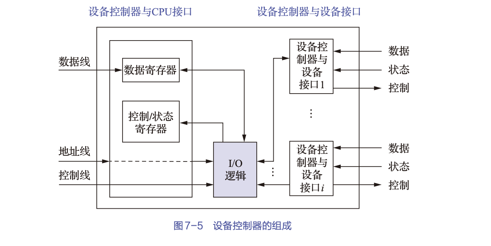

1. 设备控制器与CPU的接口

该接口用于实现CPU与设备控制器之间的通信，在该接口中共有三类信号线：数据线、地址线和控制线。

数据线通常与两类寄存器相连接：
- 数据寄存器: 存放从设备传送来的数据（输入），或从CPU传送来的数据（输出）；

- 控制/状态寄存器: 存放从CPU送来的控制信息或设备的状态信息


2. 设备控制器与设备的接口

在一个设备控制器上，可以连接一个或多个设备。相应地，在设备控制器中便有一个或多个设备接口。

在每个接口中都存在数据、控制和状态这三种类型的信号。设备控制器中的I/O逻辑会根据处理机发来的地址信号去选择一个设备接口。

3. I/O逻辑: 用于实现对设备的控制

它通过一组控制线与CPU交互，CPU利用该逻辑，向控制器发送I/O命令

CPU每当要启动一个设备时
- 一方面会将启动命令发送给设备控制器
- 另一方面又会通过地址线把地址发送给设备控制器  
由设备控制器根据I/O逻辑对地址进行译码，再根据所译出的命令对所选设备进行控制。


## 设备寻址方式

驱动程序将抽象I/O命令转换出的一系列具体的命令、参数等数据，装入设备控制器的相应寄存器中，由设备控制器来执行这些命令


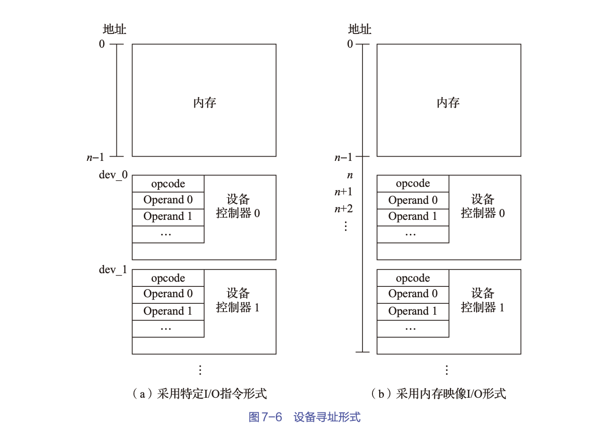

### 采用特定I/O指令形式

在早期的计算机中
- 为每个控制寄存器分配一个I/O端口，端口号是一个8位或16位的整数
- 另外还设置了一些特定的I/O指令
```bash
io-move cpu-reg,dev-no,dev-reg
```
- io-move是特定的I/O移动指令
- cpu-reg是CPU的某个寄存器
- dev-no是指定的设备控制器的地址
- dev-reg是指定设备控制器中的寄存器


### 采用内存映像I/O形式

编址上不再区分内存单元地址和设备控制器中的寄存器地址，都采用k，不需要特定的I/O命令
- 当k值处于0～n-1这一范围时，被认为是内存地址
- 若k≥n，则被认为是某个设备控制器的寄存器地址


## I/O通道

### 引入

虽然在CPU与I/O设备之间增加了设备控制器后，能大大减少CPU对I/O设备的干预，但当主机所配置的I/O设备有很多时，CPU的负担仍然会很重

为此，在CPU和设备控制器之间又增设了通道（channel），其主要目的是建立独立的I/O操作，即不仅使数据的传送能独立于CPU，而且使对I/O操作的组织、管理及其结束处理尽量独立，以保证CPU有更多的时间进行数据处理 

设置了通道后
- CPU只须向通道发送一条I/O指令
- 通道在接收到该指令后
- 便会从内存中取出本次要执行的通道程序，然后执行该程序
- 仅当通道完成了规定的I/O任务后，才向CPU发送中断信号。

实际上，I/O通道是一种特殊的处理机(CPU)，它具有执行I/O指令的能力，并能通过执行（I/O）通道程序来控制I/O操作。但I/O通道又与一般的处理机不同，主要表现在以下两个方面
- I/O通道指令类型单一，其所能执行的命令主要局限于与I/O操作有关的指令
- I/O通道没有自己的内存，所执行的通道程序是放在主机的内存中的，换言之，是I/O通道与CPU共享内存。


### 通道类型

1. 字节多路通道

字节多路通道按字节交叉方式工作

它通常含有许多非分配型子通道，其数量可为几十到数百个，每个子通道均连接一台I/O设备，并控制该设备的I/O操作。这些子通道按时间片轮转方式共享主通道。

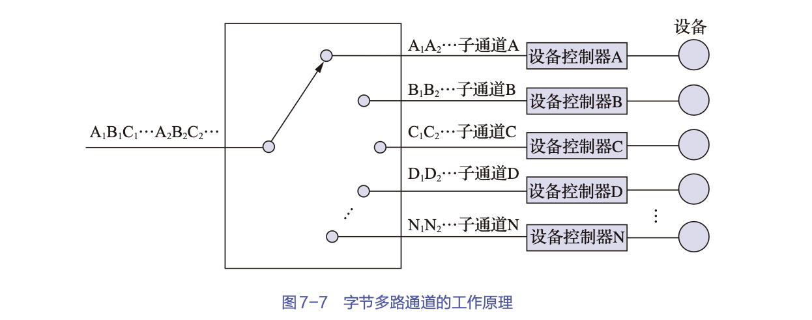


2. 数组选择通道

数组选择通道可以连接多台高速设备，但由于它只含有一个分配型子通道，在一段时间内只能执行一道通道程序，控制一台设备进行数据传送，这致使当某台设备占用了该通道后，便会一直由它独占，即使它无数据传送，闲置的通道也不允许其他设备使用，直至该设备传送完毕并释放该通道


3. 数组多路通道

数组多路通道是通过结合两个优点（即数组选择通道传输速率高和字节多路通道能使各子通道分时并行操作）而形成的一种新通道


### 瓶颈问题

由于通道价格昂贵，机器中所设置的通道数量势必较少，这往往又会使它成为I/O的瓶颈，进而造成整个系统吞吐量下降。


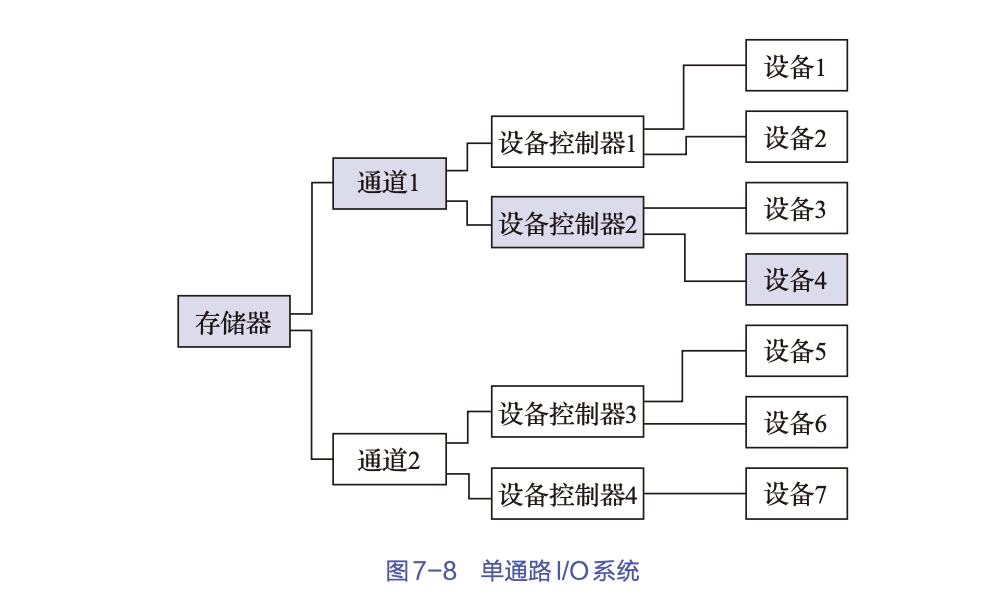

在图7-8中，假设设备1至设备4是四个磁盘，为了启动磁盘4，必须用通道1和设备控制器2；但若这两者已被其他设备占用，则必然无法启动磁盘4。这就是由通道不足所造成的“瓶颈”问题

解决“瓶颈”问题最有效的方法，便是增加设备到主机间的通路而不增加通道


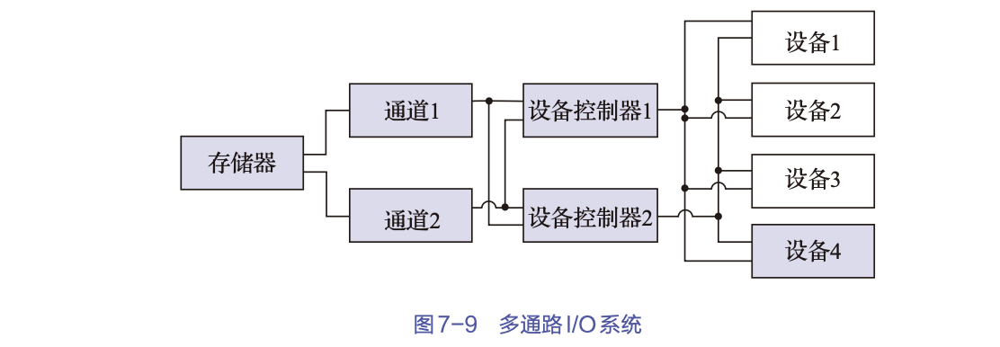


## I/O设备的控制方式

对I/O设备的控制
- 早期是使用轮询的可编程I/O方式
- 后来发展为使用中断的可编程I/O方式
- 随着DMA控制器的出现，以字节为单位进行传输变为了以数据块为单位进行传输，这大大改善了块设备的I/O性能
- I/O通道的出现，又使对I/O操作的组织和数据的传输都能独立进行，而无需CPU的干预

应当指出，在I/O设备的控制方式的整个发展过程中，始终贯穿着这样一条宗旨：尽量减少主机对I/O控制的干预，把主机从繁杂的I/O控制事务中解脱出来，以便其能更多地去完成数据处理任务。


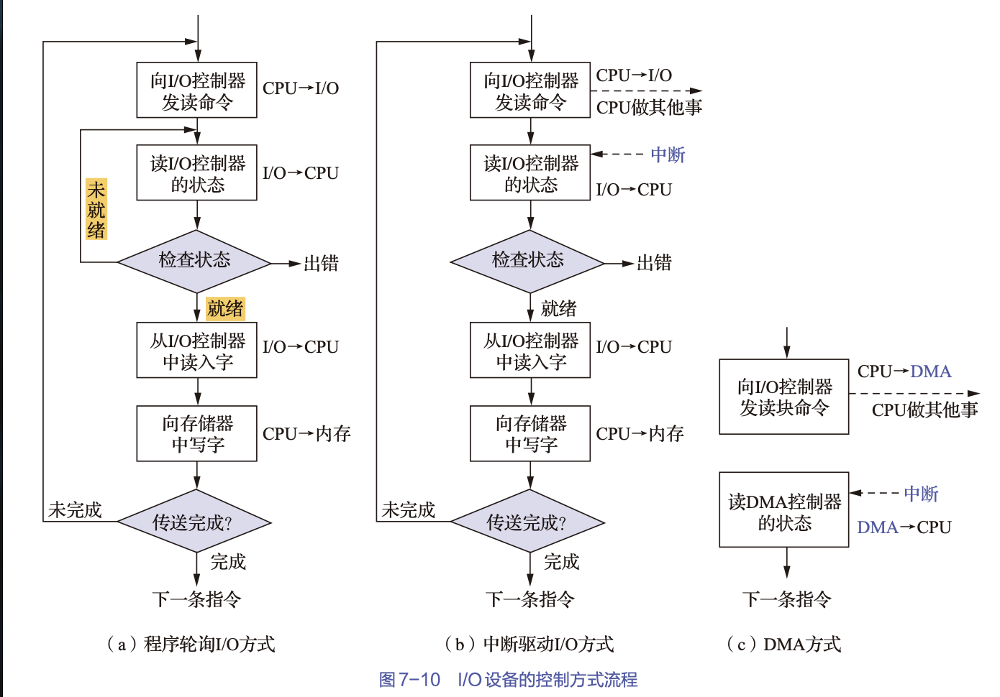

### 使用轮询的可编程I/O方式

即在处理机向设备控制器发出一条I/O指令，启动输入设备输入数据时，要同时把状态寄存器中的忙/闲标志busy置为1，然后便**不断地循环测试**busy（称为轮询）
- 当busy=1时，表示输入机尚未输完一个字（节），处理机应继续对该标志进行测试
- 直至busy=0，表明输入机已将输入数据送入控制器的数据寄存器中。  

于是处理机将数据寄存器中的数据取出于是处理机将数据寄存器中的数据取出，送入内存的指定单元中，这样便完成了一个字（节）的I/O操作。接着再去读下一个数据，并置busy=1。


### 使用中断的可编程I/O方式

当某进程要启动某个I/O设备工作时
- 由CPU向相应的设备控制器发出一条I/O命令，然后立即返回继续执行原来的任务
- 设备控制器接收到命令后会按照该命令的要求去控制指定的I/O设备
- 此时，CPU与I/O设备并行操作
    - 一旦数据进入数据寄存器，设备控制器便会通过控制线向CPU发送一中断信号，由CPU检查输入过程中是否出错
    - 若无错，便向设备控制器发送取走数据的信号，然后再通过设备控制器以及数据线将数据写入内存指定单元中


### 直接存储器访问(DMA)方式

1. 引入

虽然中断驱动I/O方式比程序轮询I/O方式更有效，但它仍是以字（节）为单位进行I/O操作的。每当完成一个字（节）的I/O操作，设备控制器便要向CPU请求一次中断。

DMA的特点
- 数据传输的基本单位是数据块，而不是字符
- 所传送的数据是从I/O设备直接送入内存的，或者相反，而不是数据寄存器
- 仅在传送一个或多个数据块的开始和结束时，才须CPU干预，整块数据的传送是在DMA控制器的控制下完成的


2. DMA控制器的组成

DMA控制器由3部分组成：
- 主机与DMA控制器的接口
- DMA控制器与块设备的接口
- I/O控 制逻辑

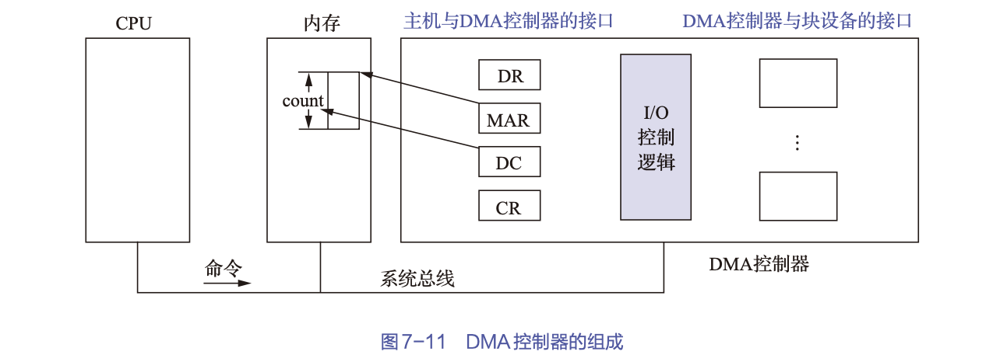

为了实现在主机与DMA控制器之间直接交换成块的数据，必须在DMA控制器中设置如下4类寄存器: 
- 命令寄存器(CR,Command Register)
    接收从CPU发来的I/O命令，或有关控制信息，或设备的状态

- 内存地址寄存器(MAR,Memory Address Register)
    - 输入时，它存放把数据从设备传送到内存的起始目标地址
    - 输出时，它存放由内存到设备的内存源地址；

- 数据寄存器(DR,Data Register)
    暂存从设备到内存或从内存到设备的数据

- 数据计数器(DC,Data Counter)
    存放本次CPU要读或写的字（节）数


3. DMA工作流程

当CPU要从磁盘读入一个数据块时
- 其便会向磁盘控制器发送一条读命令
    - 将该命令会送入命令寄存器中
    - 将本次要读入的数据在内存中的起始目标地址送入内存地址寄存器中
    - 将要读数据的字（节）数送入数据计数器中
    - 将磁盘中的源地址直接送至DMA控制器的I/O控制逻辑上
- 启动DMA控制器数据传送进行控制。以后，CPU便可去处理其他任务了
- 当DMA控制器已从磁盘中读入一个字（节）的数据并送入数据寄存器后，再挪用一个存储器周期，以将该字（节）传送到内存地址寄存器所指示的内存单元中。
- 然后便对内存地址寄存器的内容加1，将数据计数器的内容减1
    - 若减1后数据计数器的内容不为0，则表示传送未完，继续传送下一个字（节）
    - 否则，表示传送结束，并由DMA控制器发出中断请求


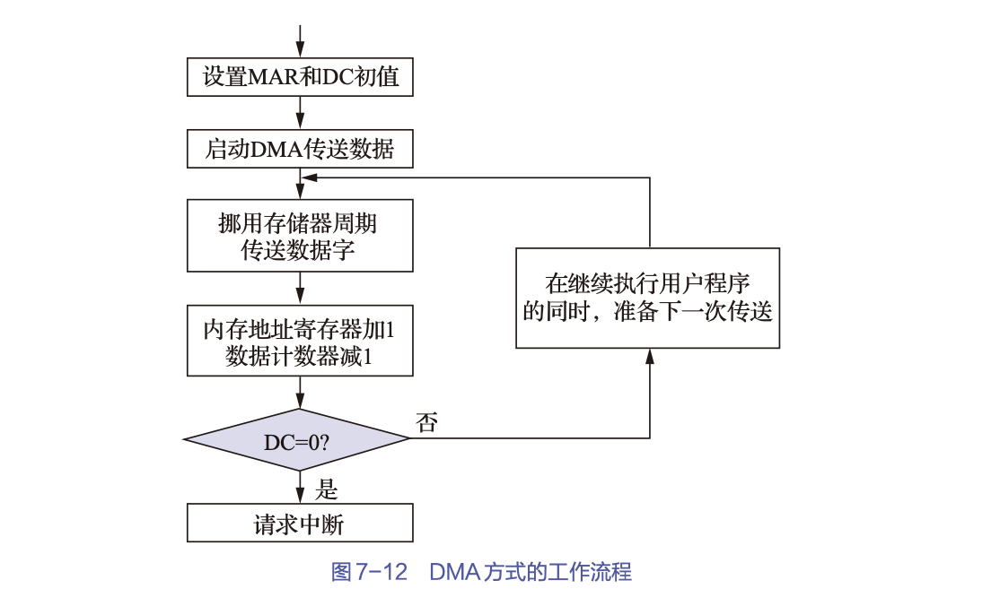


### I/O通道方式

1. 引入

虽然DMA方式比中断驱动I/O方式已经显著减少了CPU的干预，即已由以字（节）为单位的干预减少到了以数据块为单位的干预，但CPU每发出一条I/O指令，也只能去读（或写）一个连续的数据块。而当我们需要一次去读多个数据块且将它们分别传送到不同的内存区域（或者相反）时，就须由CPU分别发出多条I/O指令并进行多次中断处理。


I/O通道方式是DMA方式的发展，它可进一步减少CPU的干预，即把对一个数据块以读（或写）为单位的干预，减少为对一组数据块以读（或写）及有关的控制和管理为单位的干预


当CPU要完成一组相关的读（或写）操作及有关控制时，只须
- 向I/O通道发送一条I/O指令
- 以给出其所要执行的通道程序的起始地址和要访问的I/O设备
- 通道接到该指令后，通过执行通道程序便可完成CPU指定的I/O任务。


2. 通道程序

通道程序是由一系列通道指令（或称为通道命令）所构成的。通道指令与一般的机器指令不同，在它的每条指令中都包含了下列信息: 
- 操作码: 规定了指令所执行的操作，如读、写、控制等
- 内存地址: 表示字节送入内存（读操作）和从内存取出数据（写操作）时的内存起始地址
- 计数: 表示本条指令所要读（或写）的数据的字节数
- 通道程序结束标志位P: P=1表示本条指令是通道程序的最后一条指令
- 记录结束标志R: R=0表示本通道指令与下一条指令所处理的数据同属于一个记录，R=1表示这是处理某记录的最后一条指令。


# 3. 中断和中断处理程序

中断在OS中有着特殊且重要的地位
- 是多道程序得以实现的基础，进程之间的切换是通过中断来完成的
- 是设备管理的基础，为了提高CPU的利用率并实现CPU与I/O设备并行执行，也必须有中断的支持。  
中断处理程序是I/O系统中最低的一层，它是整个I/O系统的基础。

## 中断简介

### 中断与陷入

1. 中断(interrupt)

中断是指CPU对I/O设备发来的中断信号的一种中断及其处理响应
- CPU暂停正在执行的程序，保存CPU现场环境后
- 自动转去执行该I/O设备的中断处理程序
- 执行完后再回到断点，继续执行原来的程序。


2. 陷入或陷阱(trap)

由CPU内部事件所引起的中断，例如进程在运算过程中发生了上溢或下溢，再如程序出错以及执行到程序中预设的软中断指令。通常把这类中断称为内中断，或软中断，或陷入。

与中断一样，若系统发现了陷入事件，CPU也将暂停正在执行的程序，转去执行该陷入事件的处理程序。

中断和陷入的主要区别是信号的来源不同，即来自CPU外部还是CPU内部。


### 中断向量和中断优先级

1. 中断向量表

为了实现处理上的方便，通常会
- 为每种设备配以相应的中断处理程序
- 并把该程序的入口地址放在中断向量表的一个表项中
- 为每个设备的中断请求规定一个中断号，直接对应中断向量表的一个表项

2. 中断优先级

实际情况经常会有多个中断信号源，每个中断信号源对服务要求的紧急程度并不相同。为此，系统就需要为它们分别规定不同的优先级


### 处理多中断信号源的方式

1. 屏蔽（禁止）中断

当处理机正在处理一个中断时
- 此时将“屏蔽”掉所有的中断
- 让他们等待，直到处理机已完成本次中断的处理后，才去检查是否有新的中断发生
    - 若有，再去处理新的中断
    - 若无，则返回被中断的程序。


2. 嵌套中断

在设置了中断优先级的系统中，通常按以下规则来控制优先级: 
- 当同时有多个优先级不同的中断请求时，CPU优先响应最高优先级的中断请求
- 高优先级的中断请求可以抢占正在运行的低优先级中断的处理机，该方式类似于基于优先级的抢占式进程调度。


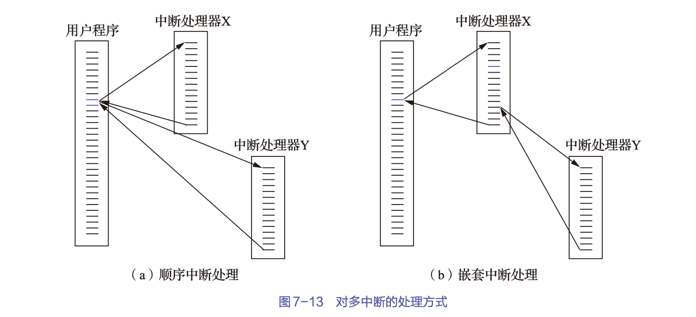


## 中断处理程序

当一个进程请求I/O操作时
- 该进程将被挂起
- 直到I/O设备完成I/O操作后，设备控制器才会向CPU发送一中断请求
- CPU响应后便转向中断处理程序
- 中断处理程序执行相应的处理，并在处理完后解除相应进程的阻塞状态

中断处理程序的处理过程可分成以下几个步骤


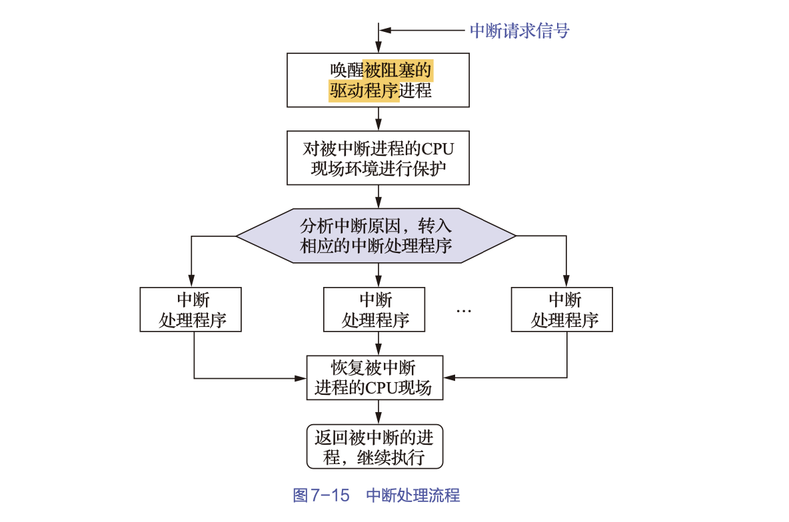

1. 测定是否为响应的中断信号

程序每当执行完当前指令后，CPU都要测试是否有未响应的中断信号
- 若没有，则继续执行下一条指令
- 若有，则停止原有进程的执行，准备转去执行中断处理程序，即为把CPU的控制权转交给中断处理程序做准备。


2. 保护被中断进程的CPU现场环境

在把控制权转交给中断处理程序之前，需要先保护被中断进程的CPU现场环境，以便以后能恢复运行。

- 保存当前程序信息
    - 由硬件自动将处理机状态字(PSW,Processor Status Word)和程序计数器(PC,Program Counter)保存在中断保留区（中断栈）中
    - CPU现场信息，即所有CPU寄存器（如通用寄存器、段寄存器等）的内容，都压入中断栈中

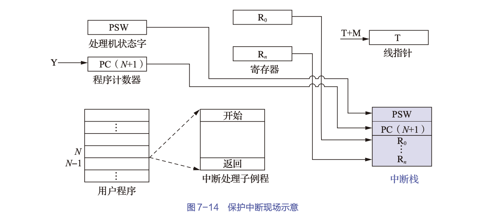


3. 转入相应设备的中断处理程序

- 由CPU对各个中断信号源进行测试，以确定引起本次中断的I/O设备，并向提供中断信号的设备发送确认信号。
- 然后，将相应设备的中断处理程序的入口地址装入程序计数器中
- 这样，当CPU运行时，便可自动转入相应设备的中断处理程序

4. 处理中断

对不同的设备有不同的中断处理程序

该程序首先会从设备控制器中读出设备状态，以判别本次中断是正常完成中断还是异常结束中断
- 若是正常完成中断，中断处理程序便做结束处理
- 若是异常结束中断，则根据发生异常的原因做相应的处理。

5. 恢复CPU现场环境后退出中断

当中断处理完成以后，需要恢复CPU现场并退出中断。但是，此刻是否返回被中断的进程，取决于两个因素：
- 本中断是否采用了屏蔽（禁止）中断驱动I/O方式
    - 若是，则返回被中断的进程；
- 针对中断处理方式为中断嵌套方式的情况
    - 如果没有优先级更高的中断来请求I/O，则在中断处理完成后仍返回被中断的进程
    - 反之，系统将处理优先级更高的中断请求。

如果要返回到被中断的进程，则可将保存在中断栈中的被中断进程的CPU现场信息取出，并装入相应的寄存器中，其中包括
- 该程序下一次要执行的指令的地址N+1
- 处理机状态字
- 各通用寄存器和段寄存器的内容。


# 4. 设备驱动程序

设备驱动程序通常又称为设备处理程序，它是I/O系统的上层与设备控制器之间的通信程序，其主要任务是
- 接收上层软件发来的抽象I/O要求，把它们转换为具体要求后发送给设备控制器，进而使其启动设备去执行任务
- 反之，它也会将设备控制器发来的信号传送给上层软件
> 由于设备驱动程序与硬件密切相关，故通常会为每类设备配置一种设备驱动程序


## 4.1 设备驱动程序概述

### 功能

为了实现I/O系统的上层与设备控制器之间的通信，设备驱动程序应具有以下功能:
1. 接收由与设备无关的软件发来的命令和参数，并将命令中的抽象I/O要求转换为与设备相关的低层操作序列；

2. 检查用户I/O请求的合法性，了解I/O设备的工作状态，传递与I/O设备操作有关的参数，设置I/O设备的工作方式

3. 发出I/O命令，如果I/O设备空闲，则立即启动它，完成指定的I/O 操作；如果I/O设备忙碌，则将请求者的请求块挂在I/O设备队列上等待

4. 及时响应由设备控制器发来的中断请求，并根据其中断类型，调用相应的中断处理程序进行处理。

### 特点

1. 设备驱动程序是实现在与设备无关的软件和设备控制器之间通信和转换的程序

2. 设备驱动程序与设备控制器以及I/O设备的硬件特性紧密相关，对于不同类型的I/O设备，应配置不同的设备驱动程序，但可以为相同的多个I/O设备设置一个设备驱动程序

3. 设备驱动程序应允许可重入，一个正在运行的设备驱动程序常会在一次调用完成前被再次调用

4. 由于设备驱动程序与硬件紧密相关，因而其中的一部分必须用汇编语言书写，目前有很多设备驱动程序的基本部分都已固化在ROM中

5. 设备驱动程序与I/O设备所采用的I/O控制方式紧密相关，常用的I/O控制方式是中断驱动I/O方式和DMA方式


### 设备处理方式

1. 为每类设备设置一个进程，专门用于执行这类设备的I/O操作

2. 在整个系统中设置一个I/O进程，专门用于执行系统中各类设备的I/O操作；

3. 不设置专门的设备处理进程，而只为各类设备设置相应的设备驱动程序，供用户或系统进程调用。这种方式使用的较多


## 设备驱动程序的执行过程

1. 将抽象要求转换为具体要求

通常在每个设备控制器中都含有若干个寄存器，分别用于暂存命令、参数和数据等。由于用户及上层软件对设备控制器的具体情况毫无了解，因而只能发出命令（抽象要求)，这些命令是无法传送给设备控制器的。

因此，就需要将这些抽象要求转换为具体要求。

例如，将抽象要求中的盘块号转换为磁盘的盘面号、磁道号及扇区号。而这一转换工作只能由设备驱动程序来完成，因为在OS中只有设备驱动程序是同时了解抽象要求和设备控制器中的寄存器情况的，也只有它才知道命令、数据和参数应分别送往哪个寄存器


2. 检验服务请求

设备驱动程序在启动I/O设备之前，必须先检查该用户的I/O请求是不是该设备能够执行的。

3. 检查设备的状态

启动某个设备进行I/O操作，其前提条件应是该设备正处于就绪状态。

为此，在每个设备控制器中都配置有一个状态寄存器。

设备驱动程序在启动设备之前，要先把状态寄存器中的内容读入CPU的某个寄存器中，通过测试寄存器中的不同位来了解设备的状态


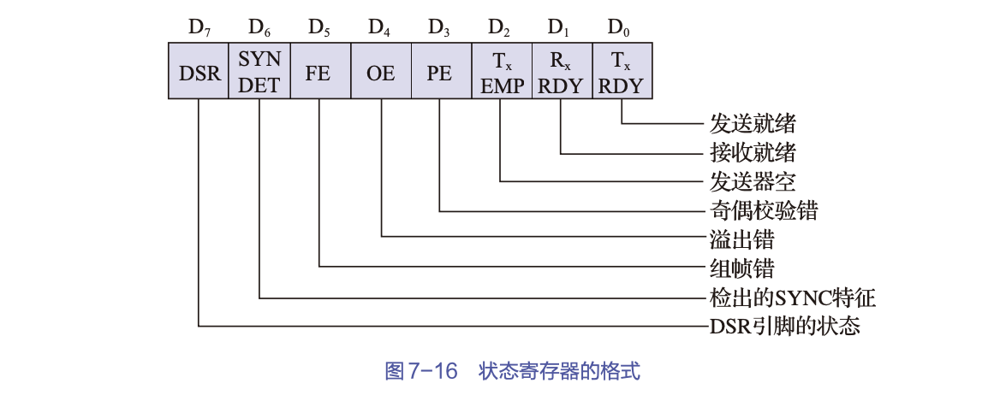


4. 传送必要的参数

在确定设备处于接收（发送）就绪状态后，便可向设备控制器的相应寄存器传送数据以及同控制本次数据传送有关的参数。


5. 启动I/O设备

在完成上述各项准备工作后，驱动程序便可向设备控制器中的命令寄存器传送相应的控制命令


## 设备驱动程序的框架

### 设备驱动程序与外界的接口

1. 设备驱动程序与OS内核的接口

为了实现设备无关性，在UNIX和Linux系统中，设备被作为特别文件处理，用户的I/O请求、对命令的合法性检查以及参数处理任务等，都在文件系统中统一处理。只在需要各种设备执行具体操作时，系统才会通过相应的数据结构（如UNIX系统的块设备转接表、字符设备转接表等）转入不同的设备驱动程序。

2. 设备驱动程序与系统引导的接口

这一部分利用设备驱动程序对设备进行初始化，初始化内容包括为管理设备而分配的数据结构、设备的请求队列等。

3. 设备驱动程序与设备的接口

这一部分与具体设备密切相关，描述了设备驱动程序如何与设备交互作用。


### 设备驱动的组成

1. 设备驱动程序的注册与注销

初始化的一项重要工作就是设备登记（或注册），即把设备驱动程序的地址登记在设备表的相应表项中。经登记后，只要知道设备的主设备号，就可以找到该类设备的各种驱动函数。这样，在设备驱动程序上的其他内核模块中就可以“看见”这个模块了。当关闭设备时，要从内核中注销设备驱动程序。

2. 设备的打开与释放

打开设备需要完成以下工作:
- 增加设备的使用计数
- 检查设备的状态
- 以及是否存在设备尚未准备好或者类似的硬件问题
- 若是首次打开
    - 则初始化设备
    - 识别次设备号
    - 根据需要更新相关的数据结构

释放设备又称关闭设备，是打开设备的逆过程。主要需要完成以下工作:
- 释放打开设备时所分配的内存
- 若是最后一个释放
    - 则关闭设备
    - 减少设备的使用计数。


3. 设备的读/写操作

设备驱动程序接受来自上层与设备无关软件的抽象请求，并使该请求得以执行
- 如果请求到来时设备驱动程序是空闲的，它就会立即执行该请求
- 它若正忙于处理前面的请求，则把新请求放入未完成队列中，并尽快处理。  
设备驱动程序确定发给设备控制器的命令后，会把它们写入设备控制器的设备寄存器中。

4. 设备的控制操作

除了需要执行读/写操作外，有时还需要控制设备，该控制主要用于对特殊文件的低层参数进行操作

如果对象是设备文件且有相应的I/O控制函数，则转到该函数，依据上层模块提供的I/O控制命令读取并设置有关的参数。


5. 设备的中断与轮询

如果设备支持中断，则按照中断驱动I/O方式进行处理；对于不支持中断的设备，读/写时需要轮询设备状态，以决定是否继续进行数据传送


# 5. 与设备无关的I/O软件

基本含义：应用程序中所用的设备不局限于使用某个具体的物理设备

为了实现设备独立性，必须再在设备驱动程序之上设置一层软件，称之为与设备无关的I/O软件，或设备独立性软件

## 与设备无关软件的基本概念

1. 通过物理设备名使用设备

当应用进程运行时，如果所请求的物理设备（独占设备类型）已分配给其他进程，而此时尽管还有几台其他的相同设备空闲可用

但系统只能根据设备的物理名来进行分配，因而无法将另外相同的设备（仅物理设备名不同）分配给它，致使该应用进程请求I/O失败而被阻塞。


2. 引入逻辑设备名

逻辑设备名是抽象的设备名，如/dev/printer，该设备名只是说明用户需要使用打印机来打印输出，但并没有指定具体是哪一台打印机，应用进程就不会由于某台指定设备退役而无法在本系统中运行

3. 实现逻辑设备名到物理设备名的转换

通过逻辑设备名使用设备虽然方便了用户，但系统只识别物理设备名，因此在实际执行时还必须使用物理设备名

为实现从逻辑设备名到物理设备名的转换，在系统中需要配置一张逻辑设备表


## 与设备无关软件的共有操作


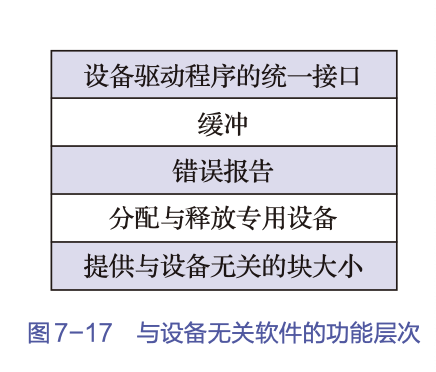

与设备无关软件是I/O系统的最高层软件，在它下面是设备驱动程序

1. 提供设备驱动程序的统一接口

- 要求每个设备驱动程序与OS之间都有相同的接口，或者相近的接口
- 将抽象的设备名转换为具体的物理设备名，并进一步找到相应物理设备的设备驱动程序入口


2. 缓冲管理

为了缓和CPU与I/O设备之间的矛盾、提高CPU的利用率，在现代OS中都无一例外地分别为字符设备和块设备配置了相应的缓冲区。

3. 差错控制

由于设备中有着许多的机械和电气部件，它们比主机更容易出现故障，这就导致I/O操作中的绝大多数错误都与设备有关
- 暂时性错误
- 持久性错误

一般来说，设备出现故障后，主要由设备驱动程序对其进行处理。而与设备无关的I/O软件只处理那些设备驱动程序无法处理的错误


4. 独占设备的分配与回收

为了避免各进程对独占设备的争夺，必须由系统来统一分配此类设备，而不允许进程自行使用。每当进程需要使用某独占设备时
- 必须先提出申请
- OS接到对设备的请求后，先对进程所请求的独占设备进行检查，看该设备是否空闲
    - 若空闲，则把该设备分配给请求进程
    - 否则，进程将被阻塞，并放入该设备的请求队列中等待
        - 等到其他进程释放该设备后，如果该设备的请求队列中存在进程，则将队列中的第一个进程唤醒，该进程得到设备后继续运行
        - 否则，将该设备的状态置为“空闲”，实现设备回收。


5. 提供独立于设备的逻辑数据块

不同类型的设备的数据交换单位是不同的，读取和传输数据的速率也各不相同,与设备无关软件应能隐藏这些差异而使用逻辑设备，并向上层软件提供大小统一的逻辑数据块


## 设备分配与回收

### 设备分配中的数据结构

1. 设备控制表DCT

系统为每个设备都配置了一张设备控制表（device control table，DCT），用于记录设备的情况

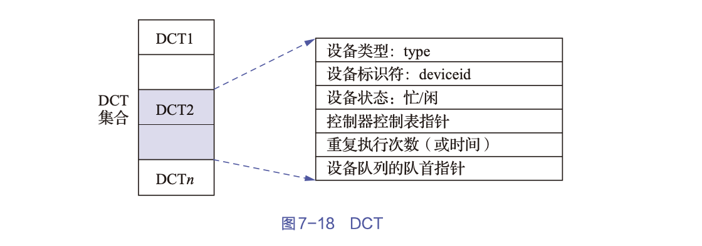

- type: 指示设备类型
- deviceid: 设备标识符

- 设备队列的队首指针: 凡因请求本设备而未得到满足的进程，应将其PCB按照一定的策略排成一个设备请求队列，其队首指针指向队首PCB；
- 设备状态: 用于表示当前设备的状态（忙/闲）
- 与设备连接的控制器控制表指针: 该指针指向该设备所连接的控制器的控制表；
- 重复执行次数（或时间）: 由于外部设备在传送数据时较易发生数据传送错误，因而在许多系统中规定了设备在工作中发生错误时应重复执行的次数
    - 在重复执行时，若能恢复正常传送，则仍认为传送成功
    - 仅当重复执行次数达到规定值而仍不成功时，才认为传送失败。

> 当某进程释放某设备，且无其他进程请求该设备时，系统将该设备DCT中的设备状态改为空闲，即可实现“设备回收”


2. 控制器控制表、通道控制表和系统设备表

- 控制器控制表(controller control table，COCT)
    系统为每个控制器都设置了用于记录控制器情况的控制器控制表

- 通道控制表(channel control table，CHCT)
    每个通道都有一张通道控制表

- 系统设备表(system device table，SDT)
    系统范围的数据结构，记录了系统中全部设备的情况，每个设备占一个表目，其中包含设备类型、设备标识符、DCT及设备驱动程序入口等项

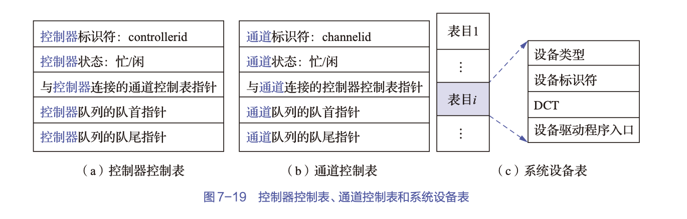


### 设备分配时应考虑的因素

1. 设备的固有属性

- 独占设备
    将一个设备分配给某进程后，便由该进程独占该设备，直至该进程完成或释放该设备

- 共享设备
    可将其同时分配给多个进程使用，此时须注意对这些进程访问该设备的先后次序进行合理调度

- 虚拟设备
    - 虚拟设备属于可共享设备，可以将它同时分配给多个进程使用
    > 物理上是独占的，虚拟上是共享的


2. 设备分配算法

- FCFS算法
    该算法根据各进程对某设备提出请求的先后次序，将这些进程排成一个设备请求队列，设备分配程序总会把设备首先分配给队首进程

- 最高优先级算法
    在利用该算法形成设备队列时，优先级高的进程会排在设备队列前面，而对于优先级相同的I/O请求，则按FCFS原则排队

3. 设备分配中的安全性

根据进程运行的安全性，设备分配有以下两种方式: 
- 安全分配方式
    每当进程发出I/O请求后，便进入阻塞状态，直到其I/O操作完成时才被唤醒 

- 不安全分配方式
    进程在发出I/O请求后仍继续运行，需要时又会发出第二个I/O请求、第三个I/O请求等。仅当进程所请求的设备已被另一进程占用时，才进入阻塞状态
    > 分配不安全，因为这种分配方式可能具备“请求和保持”条件，从而可能造成死锁

    应先对本次的设备分配是否会发生死锁进行安全性计算，仅当计算结果表明分配安全时，才进行设备分配


### 独占设备的分配程序

1. 基本的设备分配程序

- 分配设备    
    - 首先根据I/O请求中的物理设备名，查找SDT，从中找出该设备的DCT
    - 再根据DCT中的设备状态字段获知该设备是否正忙
        - 若忙，则将请求I/O的进程的PCB挂在设备队列上
        - 否则，按照一定的算法计算本次设备分配的安全性
            - 如果不会导致系统进入不安全状态，则将设备分配给请求进程 
            - 否则，仍将其PCB插入设备等待队列。

- 分配控制器
    - 在系统把设备分配给请求I/O的进程后，再到其DCT中找出与该设备连接的控制器的COCT
    - 从COCT的状态字段中可知该控制器是否正忙
        - 若忙，则将请求I/O进程的PCB挂在该控制器的等待队列上
        - 否则，将该控制器分配给进程

- 分配通道
    - 在该COCT中又可找到与该控制器连接的通道的CHCT
    - 根据CHCT内的状态信息可知该通道是否正忙
        - 若忙，则将请求I/O的进程挂在该通道的等待队列上
        - 否则，将该通道分配给进程

只有在设备、控制器和通道三者都分配成功时，这次的设备分配才算成功。然后，便可启动该I/O设备进行数据传送


2. 设备分配程序的改进

为获得设备的独立性，进程应使用逻辑设备名请求I/O。这样
- 系统首先会从SDT中找出第一个该类设备的DCT
- 若该设备忙，则查找第二个该类设备的DCT
- 仅当所有该类设备都忙时，才把进程挂在该类设备的等待队列上
- 而只要有一个该类设备可用，系统便会进一步计算分配该设备的安全性
    - 若安全，则把设备分配给进程。


## 逻辑设备名到物理设备名的映射


为了实现与设备的无关性，当应用程序请求使用I/O设备时，应当使用逻辑设备名。但系统只识别物理设备名，因此在系统中需要配置一张逻辑设备表，用于将逻辑设备名映射为物理设备名。

1. 逻辑设备表的结构

如下图a，在逻辑设备表的每个表目中包含3项内容：
- 逻辑设备名
- 物理设备名
- 设备驱动程序的入口地址

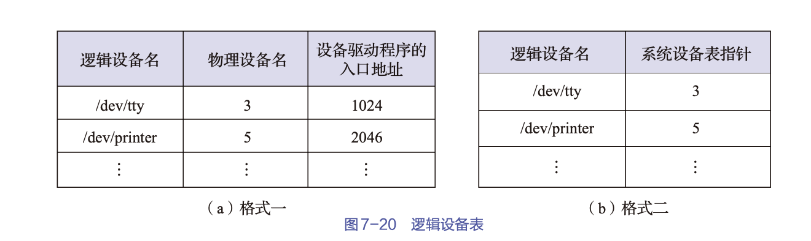


2. 逻辑设备表的设置

- 是在整个系统中只设置一张逻辑设备表

    不允许在逻辑设备表中存在相同的逻辑设备名，这就要求所有用户都不能使用相同的逻辑设备名。在多用户系统中这通常是难以做到的，因而这种方式主要用于单用户系统。

- 是为每个用户设置一张逻辑设备表

    当用户登录系统时，系统便会为该用户建立一个进程，同时也会为之建立一张逻辑设备表，并将该表放入进程的PCB中。  
    由于通常在多用户系统中都配置了系统设备表，故此时的逻辑设备表可以采用图7-20(b)所示的格式

## I/O调度

调度一组I/O请求意味着，按照确定好的顺序来执行它们

OS开发人员通过为每个设备维护一个请求等待队列来实现其调度。当应用程序发出阻塞I/O的系统调用时，该请求会被添加到相应设备的队列中。I/O调度程序重新安排队列顺序，以便提高系统的总体效率和应用程序的平均响应时间。


# 6. 用户层的I/O软件

## 系统调用与库函数

### 系统调用

- 一方面，为使各进程能有条不紊地使用I/O设备，且能保护设备的安全性，不允许运行在用户态的应用进程直接调用运行在内核态的OS过程
- 另一方面，应用进程在运行时，又必须取得OS所提供的服务，否则，应用程序几乎无法运行

为了解决此矛盾，OS在用户层中引入了一个中介过程——系统调用。应用程序可以通过它间接地调用OS中的I/O过程，对I/O设备进行操作

1. 系统调用的执行过程

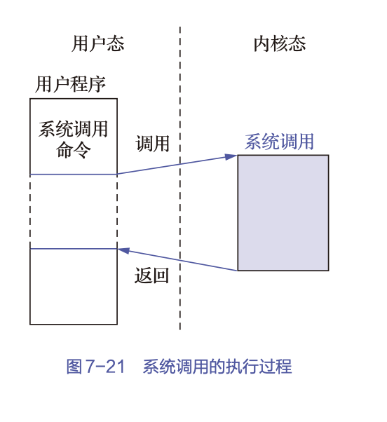

- 当OS捕获到应用程序中的该系统调用后
- 便会将CPU的状态从用户态转换到内核态，然后转向OS中的相应过程，由该过程执行所需的I/O操作
- 执行完成后，系统又将CPU状态从内核态转换到用户态，返回应用程序继续执行
> 系统调用是应用程序取得OS所有服务的唯一途经

### 库函数

在早期的OS中，系统调用是以汇编语言形式提供的，因此只有在用汇编语言书写的程序中才能直接使用系统调用，这对用户是非常不方便的；后来在C语言中，首先提供了与系统调用相对应的库函数

用户程序通过调用对应的库函数使用系统调用，这些库函数与调用程序连接在一起，并被嵌入在运行时装入内存的二进制程序中


## 假脱机系统


如果说，通过多道程序技术可将一台物理CPU虚拟为多台逻辑CPU，从而允许多个用户共享一台主机，那么通过假脱机技术就可以将一台物理I/O设备虚拟为多台逻辑I/O设备，这样就可以允许多个用户共享一台物理I/O设备


### 假脱机技术

在20世纪50年代，为了缓和CPU的高速性与I/O设备的低速性之间的矛盾，引入了脱机输入/脱机输出技术。该技术是利用专门的外围控制机先将低速I/O设备上的数据传送到高速磁盘上，或者相反
- 这样，当CPU需要输入数据时，便可以直接从磁盘中读取数据，极大地提高了输入速度
- 反之，在CPU需要输出数据时，也能以很快的速度把数据先输出到磁盘上，然后CPU便可去做自己的事情了。

事实上，当系统中引入多道程序技术后
- 系统便完全可以利用其中的一道程序来模拟脱机输入时的外围控制机功能
- 进而把低速I/O设备上的数据传送到高速磁盘上；再用另一道程序模拟脱机输出时外围控制机的功能，把数据从磁盘传送到低速输出设备上

这样，便可在主机的直接控制下实现以前的脱机输入/脱机输出功能。此时的外围操作与CPU对数据的处理同时进行，我们把这种在联机情况下实现的同时外围操作技术，称为SPOOLing（全称：simultaneausperiphernal operating online）技术，或称为假脱机技术。


### 假脱机的组成

如前所述，假脱机技术是对脱机输入/脱机输出系统的模拟，假脱机系统建立在通道技术和多道程序技术的基础上，以高速随机外存（通常为磁盘）为后援存储器，其主要由4部分组成。


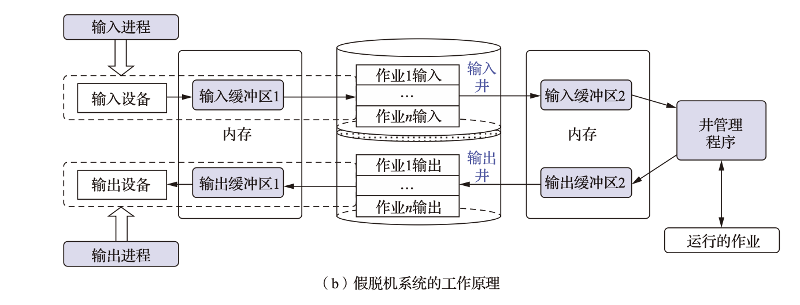

1. 输入井和输出井

在磁盘上开辟出来的两个存储区域

输入井模拟脱机输入时的磁盘，用于收容I/O设备输入的数据

其中的数据一般以文件的形式组织管理，我们把这些文件称为井文件

一个文件仅存放某一个进程的输入（或输出）数据，所有进程的数据输入（或输出）文件可链接成为一个输入（或输出）队列。


2. 输入缓冲区和输出缓冲区

在内存中开辟的两个缓冲区

用于缓和CPU和磁盘之间速度不匹配的矛盾，暂存它们之间传输的文件

3. 输入进程和输出进程    
- 输入进程，用于模拟脱机输入时的外围控制机
    - 将用户要求的数据从输入设备传送到输入缓冲区
    - 再存放到输入井
    - 当CPU须输入数据时，直接从输入井读入内存
- 输出进程，用于模拟脱机输出时的外围控制机
    - 把用户要求输入的数据从内存传送（并存放）到输出井
    - 待输出设备空闲时，再将输出井中的数据经输出缓冲区输出至输出设备

4. 井管理程序    

用于控制作业与磁盘井之间信息的交换
- 当作业执行过程中向某台设备发出启动输入或输出操作请求时
- 由OS调用井管理程序，由该程序控制从输入井读取信息或将信息输出至输出井

### 假脱机的特点

1. 提高了I/O速度

从对低速I/O设备执行的I/O操作演变为对磁盘缓冲区中的数据进行的存取操作

2. 将独占设备改造为共享设备

假脱机打印机系统中，实际上并没有为任何进程分配设备，而只是在磁盘缓冲区中为进程分配了一个空闲盘块和建立了一张I/O请求表。这样，便把独占设备改造成了共享设备。

3. 实现了虚拟设备功能

虽然多个进程在同时使用一台独占设备，但对于每个进程而言，它们都会认为自己独占了一个设备


### 假脱机打印机系统

打印机是经常会被用到的输出设备，属于独占设备。利用假脱机技术可将它改造为一台可供多个用户共享的打印设备


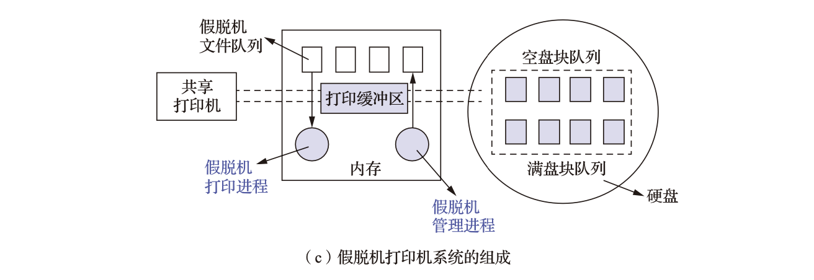

1. 组成

- 磁盘缓冲区

    是在磁盘上开辟的一个存储空间，用于暂存用户程序的输出数据，在该缓冲区中可以设置几个盘块队列，如空盘块队列、满盘块队列等。

- 打印缓冲区

    用于缓和CPU和磁盘之间速度不匹配的矛盾，设置在内存中，用于暂存从磁盘缓冲区发送来的数据，以后会再传送给打印设备进行打印。

- 假脱机管理进程和假脱机打印进程

    由假脱机管理进程为每个要求打印的用户数据建立一个假脱机文件，并把它放入假脱机文件队列中，由假脱机打印进程依次对队列中的文件进行打印


2. 过程

每当用户进程发出打印输出请求时，假脱机打印机系统并不会立即把打印机分配给该用户进程，而是会由假脱机管理进程完成两项工作：
- 在磁盘缓冲区中为之申请一个空闲盘块，并将要打印的数据送入其中暂存；
- 为用户进程申请一张空白的用户请求打印表，并将用户的打印要求填入其中，再将该表挂到假脱机文件队列上

在这两项工作完成后，虽然还没有进行任何实际的打印输出，但对于用户进程而言，其打印请求已经得到了满足，打印输出任务已经完成。

真正的打印输出是假脱机打印进程负责的
- 当打印机空闲时    
    - 该进程首先从假脱机文件队列的队首摘取一张请求打印表
    - 然后根据表中的要求将要打印的数据由磁盘缓冲区传送到内存缓冲区，再交付打印机进行打印
- 一个打印任务完成后，假脱机打印进程将会再次查看假脱机文件队列
    - 若队列非空，则重复上述工作，直至队列为空
    - 此后，假脱机打印进程会将自己阻塞起来，仅当再次有打印请求时，其才会被重新唤醒运行。


### 守护进程


守护进程是允许使用指定独占设备的唯一进程
- 所有其他进程都不能直接使用该设备，而只能将对该设备的使用要求写入一份文件中，并将该文件放在假脱机目录中
- 由守护进程按照目录中的文件，依次来完成各进程对该设备的请求

这样就把一台独占设备改造成了可为多个进程共享的设备。


# 7. 缓冲区管理

在现代OS中，几乎所有的I/O设备在与CPU交换数据时，都使用了缓冲区

缓冲区是一个存储区域
- 可以由专门的硬件寄存器组成
    但由于硬件的成本较高，故容量较小，一般仅用于对速度要求非常高的场合，如存储器管理中所用的联想存储器、设备控制器中用的数据缓冲区等

- 在一般情况下，更多的是将内存作为缓冲区


## 缓冲区的引入

1. 缓和CPU和I/O设备间速度不匹配的矛盾

2. 减少对CPU中断的频率，放开对CPU中断响应的限制

3. 解决数据粒度不匹配的问题

4. 提高CPU和I/O设备间的并行性

## 单缓冲区和双缓冲区

### 单缓冲区

每当用户进程发出一个I/O请求时，OS便会在内存中为之分配一缓冲区


1. 块设备


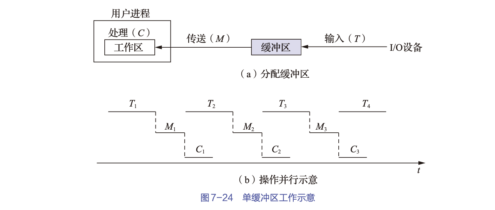

在块设备输入时，假定
- I/O设备把一块数据输入缓冲区的时间为T
- OS将该缓冲区中的数据传送到工作区的时间为M
- 而CPU对这一块数据进行处理（计算）的时间为C

由于T和C是可以并行的(见图7-24(b))
- 当T＞C时，系统对每块数据的处理时间为M+T
- 反之则为M+C  
因此可把系统对每块数据的处理时间表示为Max(C,T)+M


2. 字符设备

在字符设备输入数据时，缓冲区用于暂存用户输入的一行数据
- 在输入期间，用户进程被挂起以等待数据输入完毕
- 在输出时，用户进程将一行数据输入缓冲区后，继续进行处理  
    - 当用户进程已有第二行数据输出时，如果第一行数据尚未被提取完毕，则此时用户进程应阻塞


### 双缓冲区

由于缓冲区是共享资源，生产者与消费者在使用缓冲区时必须互斥。如果消费者尚未取走缓冲区中的数据，则即使生产者又生产出新的数据，也无法将它送入缓冲区，此时生产者需要等待

如果为生产者与消费者设置了两个缓冲区，便能解决这一问题
- 在设备输入数据时，先将数据送入第一缓冲区，装满后便转向第二缓冲区
- 此时OS可以从第一缓冲区中移出数据，并送入用户进程(见图7-25(a))
- 接着由CPU对数据进行计算

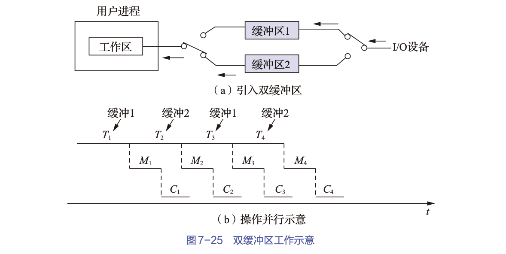

在双缓冲区情况下，系统处理一块数据的时间可以认为是Max(C+M,T)
- 如果C+M＜T，则可使块设备连续输入
- 如果C+M＞T，则可使CPU不必等待设备输入

对于字符设备，在行输入方式下，若采用双缓冲区，则通常能消除用户的等待时间，即用户在输入完第一行数据后，在CPU执行第一行中的命令时，用户可以继续向第二缓冲区输入下一行数据。


## 环形缓冲区

### 环形缓冲区的组成


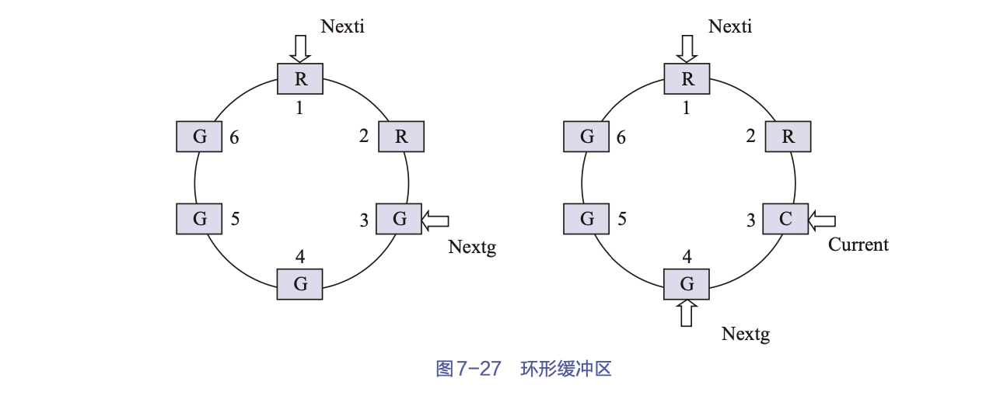

1. 多个缓冲区

在环形缓冲区中包含多个缓冲区，各缓冲区的大小相同
- 用于装输入数据的空缓冲区R
- 已装满数据的缓冲区G
- 计算进程正在使用的现行工作缓冲区C

2. 多个指针

作为输入的缓冲区可设置3个指针
- 用于指示计算进程下次可用缓冲区G的指针Nextg
- 用于指示输入进程下次可用空缓冲区R的指针Nexti
- 以及用于指示计算进程正在使用的缓冲区C的指针Current。


### 环形缓冲区的使用

1. Getbuf过程

当计算进程要使用缓冲区中的数据时，可调用Getbuf过程。该过程
- 将由指针Nextg所指示的缓冲区提供给进程使用
- 相应地，须把它改为现行工作缓冲区，并令Current指针指向该缓冲区的第一个单元
- 同时将Nextg移向下一个可用缓冲区G

类似地，当输入进程要使用空缓冲区来装入数据时，也调用Getbuf过程，由该过程
- 将指针Nexti所指示的缓冲区提供给输入进程使用
- 同时将Nexti指针移向下一个空缓冲区R

2. Releasebuf过程

当计算进程把C缓冲区中的数据提取完毕时，便调用Releasebuf过程，将缓冲区C释放
- 把该缓冲区由当前（现行）工作缓冲区C改为空缓冲区R

类似地，当输入进程把缓冲区装满时，也应调用Releasebuf过程
- 将该缓冲区释放，并将其改为可用缓冲区G。


### 进程间的同步问题

1. Nexti指针追赶上Nextg指针

    意味着输入进程输入数据的速度大于计算进程处理数据的速度，已把全部可用的空缓冲区装满，再无缓冲区可用

2. Nextg指针追赶上Nexti指针

    意味着输入数据的速度小于计算进程处理数据的速度，使装有输入数据的缓冲区都被抽空，再无装有数据的缓冲区供计算进程提取数据


## 缓冲池

前述缓冲区是专门为特定的生产者与消费者设置的，它们属于专用缓冲。

为了提高缓冲区的利用率，引入并广泛应用既可用于输入、又可用于输出的（公用）缓冲池（buffer pool）

缓冲池与缓冲区的区别在于：
- 缓冲区仅是一组内存块的链表
- 而缓冲池则是包含了
    - 一个用于管理自身的数据结构
    - 一组操作函数的管理机制，用于管理多个缓冲区。


### 缓冲池的组成

缓冲池管理着多个缓冲区，每个缓冲区由两部分组成:
- 用于标志和管理的缓冲首部
    一般包括缓冲区号、设备号、设备上的数据块号、同步信号量以及队列链接指针等

- 用于存放数据的缓冲体  


为了管理上的方便，一般将缓冲池中具有相同类型的缓冲区链接成一个队列，于是可形成3个队列。

- 空白缓冲队列emq
    这是由空缓冲区所链成的队列，其队首指针F(emq)和队尾指针L(emq)分别指向该队列的首缓冲区和尾缓冲区。

- 输入队列inq
    这是由装满输入数据的缓冲区所链成的队列，其队首指针F(inq)和队尾指针L(inq)分别指向输入队列的队首缓冲区和队尾缓冲区。

- 输出队列outq
    这是由装满输出数据的缓冲区所链成的队列，其队首指针F(outq)和队尾指针L(outq)分别指向该队列的队首缓冲区和队尾缓冲区

除了上述3个队列外，还应具有4种工作缓冲区：
- 用于收容输入数据的工作缓冲区
- 用于提取输入数据的工作缓冲区
- 用于收容输出数据的工作缓冲区
- 用于提取输出数据的工作缓冲区


### Getbuf过程和Putbuf过程

因为缓冲池中的队列本身是临界资源，多个进程在访问一个队列时，既应互斥，又应同步
- 为使各进程能互斥地访问缓冲池队列，可为每一队列设置一个互斥信号量MS(type)
- 为了保证各进程同步地使用缓冲区，可为每个缓冲队列设置一个资源信号量RS(type)

```c
// 从type所指示的队列的队首摘下一缓冲区
void Getbuf(unsigned type){
    Wait(RS(type))；
    Wait(MS(type))；
    B(number) =Takebuf(type)；
    Signal(MS(type))；
}

// 将由参数number所指示的缓冲区B挂在type队列上
void Putbuf(type，number){
    Wait(MS(type))；
    Addbuf(type，number)；
    Signal(MS(type))；
    Signal(RS(type))；
}
```


### 缓冲区的工作方式

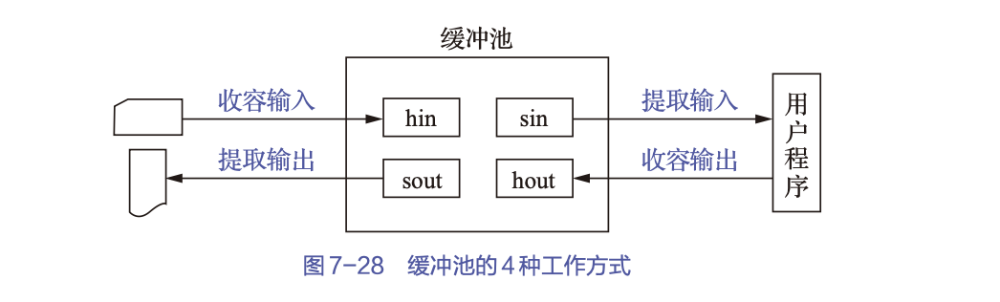

1. 收容输入

输入进程可调用`Getbuf(emq)`
- 从空缓冲区队列emq的队首摘下一空缓冲区， 并把它作为收容输入工作缓冲区hin
- 然后，把数据输入其中
- 装满后再调用`Putbuf(inq,hin)`，将它挂在输入队列inq上。

2. 提取输出

计算进程可调用`Getbuf(inq)`
- 从输入队列inq的队首取得一缓冲区，并将它作为提取输入工作缓冲区sin
- 计算进程从中提取数据
- 计算进程用完该数据后，再调用`Putbuf(emq,sin)`，将它挂到空缓冲区队列emq上。

3. 收容输出

计算进程可调用`Getbuf(emq)`
- 从空缓冲区队列emq的队首取得一空缓冲区，并将它作为收容输出工作缓冲区hout
- 当其中装满输出数据后
- 再调用`Putbuf(outq,hout)`，将它挂在输出队列outq末尾。

4. 提取输出

输出进程可调用`Getbuf(outq)`
- 从输出队列的队首取得一装满输出数据的缓冲区，并将它作为提取输出工作缓冲区sout
- 在数据提取完后
- 再调用`Putbuf(emq,sout)`，将它挂在空缓冲区队列emq末尾。


## 缓存cache

缓存（cache）是保存数据副本的高速内存区域

它主要是为了缓和CPU运行速率与内存读/写速率不匹配的矛盾

其工作原理是：
- 当CPU要读取一个数据时，首先从CPU缓存中进行查找
- 找到就立即读取并将其送给CPU处理
- 若没有找到
    - 则从速率相对较慢的内存中读取并将其送给CPU处理
    - 同时把这个数据所在的数据块调入缓存中，这可以使得以后对整块数据的读取都从缓存中进行，而不必再调用内存

正是这样的读取机制使CPU读取缓存的命中率变得非常高（大多数CPU可达90%左右），这大大节省了CPU直接读取内存的时间，也使CPU读取数据时基本无须等待。


缓存和缓冲的区别：
- 缓冲可以保存数据项的唯一的现有版本；
- 缓存只提供一个位于其他地方的数据项的更快存储副本。


# 8. 磁盘性能概述和磁盘调度

磁盘存储器是计算机系统中最重要的存储设备，其中存放了大量的文件。对文件的读/写操作都将涉及对磁盘的访问

磁盘I/O速度的高低和磁盘系统的可靠性将直接影响系统的性能。可以通过多种途经来改善磁盘系统的性能
- 第一可以选择好的磁盘调度算法，以减少磁盘的寻道时间
- 第二可以提高磁盘I/O速度，以提高对文件的访问速度
- 第三可以采取冗余技术，以提高磁盘系统的可靠性，建立高度可靠的文件系统
> 第二点和第三点将在第9章“磁盘存储器管理”中进行具体介绍。


## 磁盘性能概述

### 数据的组织与格式

1. 磁盘的组成


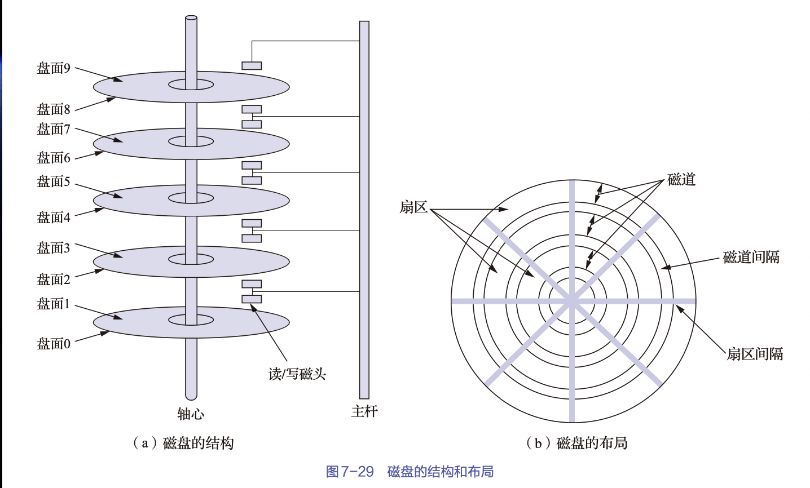

- 一个或多个物理盘片
- 每个盘片有一个或两个盘面(surface)
- 每个盘面上有若干条磁道(track)，磁道之间留有必要的间隙。
- 每条磁道又从逻辑上被划分成若干个扇区(sectors)


一个物理记录存储在一个扇区上，磁盘上能存储的物理记录数目是由扇区数、磁道数以及磁盘面数所决定的

2. 低级格式化

为了在磁盘上存储数据，必须先将磁盘低级格式化

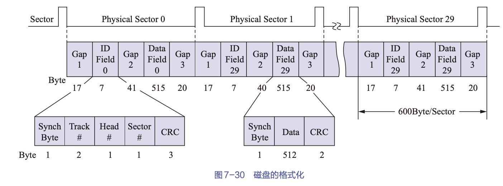

其中每条磁道含有30个固定大小的扇区，每个扇区容量为600B
- GAP: 空位
- 标识符字段ID Field
    - Synch: 特定的位图像，其作为该字段的定界符
    - 可利用磁道号、磁头号及扇区号三者来标志一个扇区
    - CRC: 用于段校验；
- 数据字段Data Field: 
    - Synch: 特定的位图像，作为该字段的定界符
    - Data: 存放512B的数据
    - CRC: 段检验


3. 分区

在磁盘格式化完成后，一般要对磁盘进行分区
- 在逻辑上，每个分区就是一个独立的逻辑磁盘
- 每个分区的起始扇区和大小都记录在磁盘0扇区的主引导记录所包含的分区表中
- 在这个分区表中必须有一个分区被标记成是活动的（即引导块），以保证能够从硬盘引导系统


4. 高级格式化

但是，在真正可以使用磁盘前，还需要对磁盘进行一次高级格式化，即设置
- 一个引导块
- 空闲存储管理
- 根目录
- 一个空文件系统
- 同时在分区表中标记该分区所使用的文件系统。


### 磁盘的类型

1. 固定头磁盘

    每条磁道上都有一个读/写磁头，所有的磁头都被装在一刚性磁臂中。通过这些磁头可访问所有磁道，并进行并行读/写

2. 移动头磁盘

    每个盘面仅配有一个磁头，其也被装入磁臂中。为能访问该盘面上的所有磁道，该磁头必须能移动以进行寻道


### 磁盘的访问时间

磁盘设备在工作时，以恒定转速旋转。

为了读/写，磁头必须能移动到所指定的磁道上，并等待所指定的扇区的开始位置旋转到磁头下，然后再开始读/写数据。

因此，可把对磁盘的访问时间分成以下3部分:

1. 寻道时间$T_s$

这是指把磁臂（磁头）移动到指定磁道上所经历的时间

$$T_s = m x n + k$$

- n: 磁头移动条磁道所花费的时间
- k: 启动磁臂的时间
- m: 是一个常数，其与磁盘驱动器的速度有关
    - 对于一般的磁盘，m=0.2
    - 对于高速磁盘，m≤0.1
    - 磁臂的启动时间约为2ms

对于一般的温盘，其寻道时间将随寻道距离的增大而增加，为5ms～30ms。


2. 平均旋转延迟时间$T_x$

指某扇区移动到磁头下面所经历的时间

$$T_x = \frac{1}{2r}$$

- r: 磁盘每秒的转数

3. 传输时间$T_t$

指从磁盘读出数据或向磁盘写入数据所经历的时间

$$T_t = \frac{b}{rN}$$

- b: 每次所读/写的字节数
- r: 旋转速度
- N: 为一条磁道上的字节数


综上所述，可以
$$T = T_s + \frac{1}{2r} + \frac{b}{rN}$$
寻道时间和平均旋转延迟时间基本上都与所读/写数据的多少无关，而且它们通常占据了访问时间中的大头


## 早起的磁盘调度算法

### FCFS调度算法

根据进程请求访问磁盘的先后次序进行调度，但未对寻道进行优化，平均寻道时间可能较长

### SSTF调度算法

SSTF调度算法会选择这样的进程，其要求访问的磁道与当前磁头所在的磁道距离最近，以使每次的寻道时间最短，但这种算法不能保证平均寻道时间最短

## 基于扫描的磁盘调度算法

### SCAN调度算法

SSTF调度算法的实质是基于优先级进行调度，因此可能导致优先级低的进程出现“饥饿”现象。因为只要不断有新进程的请求到达，且其所要访问的磁道距离磁头当前所在的磁道较近，这种新进程的I/O请求就必然会被优先满足。在对SSTF调度算法略加修改后，即可防止低优先级进程出现“饥饿”现象。

SCAN调度算法不仅会考虑欲访问的磁道与当前磁道间的距离，还会优先考虑磁头当前的移动方向

例如当磁头正在自里向外移动时，SCAN调度算法所考虑的下一个访问对象，应
- 既在当前磁道之外
- 又是距离最近的磁道

### CSCAN调度算法

SCAN调度算法的问题：当磁头刚自里向外移动而越过某一磁道后，恰好又有一进程请求访问此磁道，这时，该进程必须等待，待磁头继续自里向外、然后再自外向里扫描完处于外面的所有要访问的磁道后，才处理该进程的请求，这致使该进程的请求被大大地推迟

CSCAN调度算法规定磁头单向移动，如只是自里向外移动
- 当磁头移到最外的磁道并完成访问后
- 磁头立即返回到最里的欲访问磁道

亦即将最小磁道号紧接最大磁道号以构成循环，进而实现循环扫描。


### NStepSCAN调度算法和FSCAN调度算法

这两种算法解决了上述算法都可能出现磁臂停留在某处不动的情况

1. NStepSCAN调度算法

N步SCAN调度算法（NStep SCAN调度算法）是
- 将磁盘请求队列分成若干个长度为N的子队列，磁盘调度将按FCFS调度算法依次处理这些子队列
- 而每处理一个子队列时又采用SCAN调度算法，处理完一个子队列后，再处理其他子队列。
- 当正在处理某个子队列时，如果又出现新的磁盘I/O请求，则将新请求进程放入其他子队列，这样就可避免出现磁臂粘着现象。


2. FSCAN调度算法

SCAN调度算法实质上是NStepSCAN调度算法的简化，即FSCAN调度算法只将磁盘请求队列分成两个子队列
- 一个是由当前所有请求磁盘I/O的进程所形成的队列，由磁盘调度按SCAN调度算法进行处理
- 在扫描期间，将新出现的所有请求磁盘I/O的进程放入另一个等待处理的请求队列。这样，所有的新请求都将被推迟到下一次扫描时进行处理


# 本章小结

各种I/O设备是整个计算机系统的重要组成部分

由于I/O设备种类繁多，因此设备管理很复杂。任何OS都有很大一部分代码与I/O有关

本章首先介绍了
- I/O系统的功能: 管理和控制I/O操作和I/O设备
- 模型和接口

其次，描述了I/O硬件，包括
- I/O设备
- 设备控制器
- 中断机构  

再次，详细讨论了I/O软件，包括
- 中断处理程序
- 设备驱动程序
- 与设备无关的I/O软件
- 用户层I/O软件等

设备驱动程序负责处理设备工作中的所有细节，并面向OS的其他部分提供统一接口，在该部分介绍了控制I/O的方式，最主要的是
- 程序轮询I/O方式
- 中断驱动I/O方式
- DMA方式
- I/O通道方式

与设备无关的I/O软件负责完成如
- 提供接口
- 缓冲管理
- 差错控制
- 独立设备的分配与回收等工作

用户层I/O软件中的假脱机系统是个典型的虚拟设备系统，能够把独占设备模拟成共享设备

最后，详细介绍了
- 缓冲: 在缓冲区管理中，介绍了引入缓冲的原因和缓冲区的各种组成方式
- 缓存
- 磁盘调度
    - 首先概述了磁盘的性能，并在此基础上详细介绍了磁盘的各种调度算法，包括
        - FCFS调度算法
        - SSTF调度算法
        - SCAN调度算法
        - CSCAN调度算法等
