第八章、文件管理

[toc]

由于内存是易失性设备，断电后其所存储的信息即会丢失，容量又十分有限，因此在现代计算机系统中，都必须配置外存，目的是将系统和用户需要用到的大量程序和数据，以“文件”的形式存放在其中，待需要的时候再随时将它们调入内存

如果由用户来直接管理存放在外存上的文件，则
- 不仅要求用户  
    - 熟悉外存的特性
    - 了解各种文件的属性
    - 以及它们在外存上的位置
- 而且在多用户环境下
    - 还必须保持数据的安全性和一致性  
显然，这是用户所不能胜任的。

于是在OS中又增加了文件管理功能，专门负责
- 管理外存中的文件
- 并把对文件的存取、共享和保护等手段提供给用户  
这不仅方便了用户，保证了文件的安全性，还可有效提高系统资源的利用率。

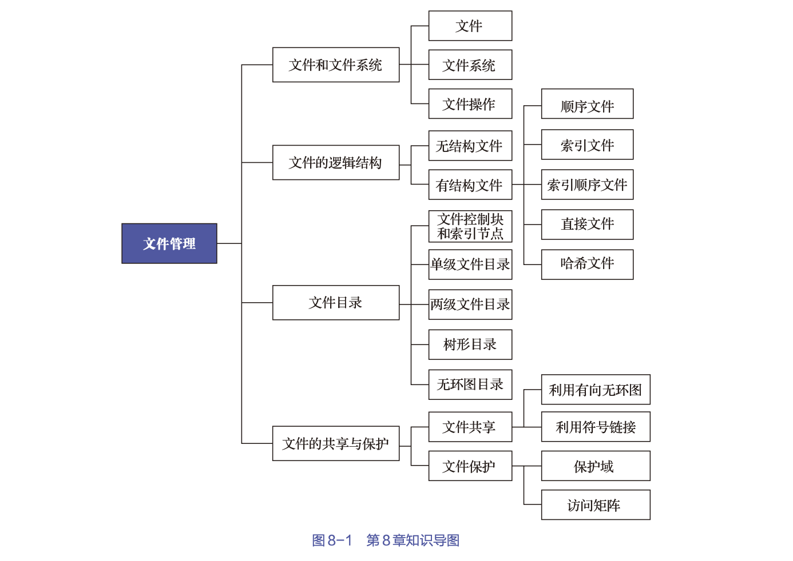

# 1. 文件和文件系统

文件系统由两部分组成：
- 文件集合
- 目录

文件系统是OS的一部分，它提供了一种管理机制，通过将其管理的程序和数据组织成一系列文件的方式实现的，而文件则是指具有文件名的若干相关元素的集合
- 元素通常是记录
- 记录又是一组有意义的数据项的集合

由此可见，基于文件系统的概念，可以把数据的组成分为文件、记录和数据项三级。

## 1.1 文件、记录和数据项

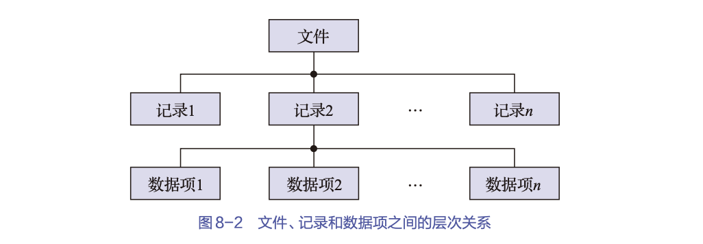

### 数据项

在文件系统中，数据项是最低级的数据组织形式，它可被分成两种类型: 
1. 基本数据项

    描述一个对象的某种属性的字符集，是数据组织中可以命名的最小逻辑数据单位，又称为字段。
    - 基本数据项的名字和数据类型这两者共同定义了一个基本数据项的“型”
    - 而表征一个实体在基本数据项上的数据则称为“值”

2. 组合数据项

    若干个基本数据项所组成的，简称组项

### 记录

记录是一组相关数据项的集合，用于描述一个对象在某方面的属性

在诸多记录中，为了能唯一地标志一个记录，必须在其各个数据项中确定出一个或几个数据项，并把它们的集合称为关键字（key）

### 文件

1. 文件的定义

文件是指由创建者所定义的、具有文件名的一组相关元素的集合，可分为有结构文件和无结构文件两类

- 有结构文件中，文件由若干个相关记录组成
- 无结构文件则被看成一个字节流

文件在文件系统中是一个最大的数据单位，它描述了一个对象集

2. 文件的四个属性

- 文件类型
- 文件长度
- 文件的物理位置
- 文件的建立时间

## 文件名和文件类型

### 文件名和扩展名

1. 文件名

    不同的系统对文件名的规定是不同的，包括文件名长度、可包含字符大小写区分

1. 扩展名
    
    扩展名是添加在文件名后面的若干个附加字符，又称为后缀名，用于指示文件的类型

### 文件类型

1. 按性质和用途分类

- 系统文件

    指由系统软件构成的文件
    - 大多数的系统文件只允许用户调用，但不允许用户去读，更不允许用户修改
    - 有的系统文件不直接对用户开放

- 用户文件
    
    指由用户的源代码、目标文件、可执行文件或数据等所构成的文件  
    用户将此类文件委托给系统进行保管。

- 库文件
    
    由标准子例程及常用的例程等所构成的文件  
    此类文件允许用户调用，但不允许用户修改。

2. 按文件中数据的形式分类

- 源文件
    
    指由源程序和数据构成的文件。通常
    - 由终端或输入设备输入的源程序和数据所形成的文件都属于源文件
    - 由美国信息交换标准代码ASCII或汉字所组成的

- 目标文件

    指由“把源程序经过编译程序编译后、但尚未经过链接程序链接的目标代码”所构成的文件，其后缀名是“.obj”。

- 可执行文件

    指源程序经过编译程序编译后所产生的目标代码，再经过链接程序链接后所形成的文件，在Windows系统中，其后缀名是.exe或.com。

3. 按存取控制属性分类

根据系统管理员或用户所规定的存取控制属性，可将文件分为3类：
- 可执行文件，该类文件只允许被核准的用户调用执行，不允许读和写；
- 只读文件，该类文件只允许文件拥有者及被核准的用户去读，不允许写；
- 读/写文件，指允许文件拥有者和被核准的用户去读/写的文件。

4. 按组织形式和处理方式分类

根据文件的组织形式和系统对其处理方式的不同，可将文件分为3类：
- 普通文件

    由ASCII或二进制码所组成的字符文件

- 目录文件
    
    指由文件目录所组成的文件，通过目录文件可以对其下属文件的信息进行检索，对其可执行的文件进行（与普通文件一样的）操作；

- 特殊文件

    特指系统中的各类I/O设备，为了便于统一管理，系统将所有的I/O设备都视为文件，并按文件的使用方式提供给用户使用，如目录的检索、权限的验证等操作都与普通文件相似，只是对这些文件的操作将由设备驱动程序来完成。

## 1.3 文件系统的层次结构

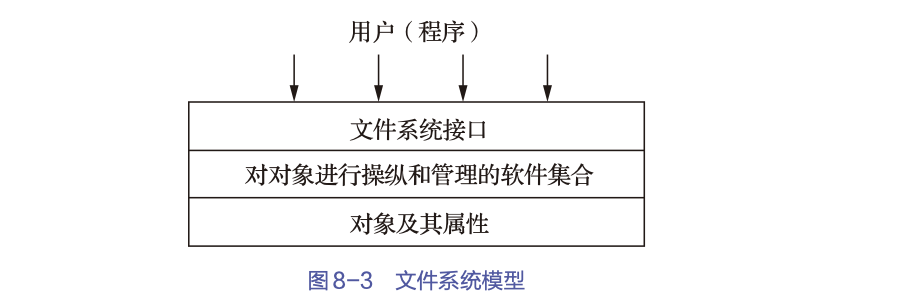

### 对象及其属性

文件系统所管理的对象有3类:
- 文件
    
    在文件系统中有着各种不同类型的文件，它们都作为文件系统的直接管理对象。

- 目录

    为了方便用户对文件进行存取和检索，在文件系统中必须配置目录，且目录的每个目录项中必须含有文件名、对文件属性的说明以及该文件所在的物理地址（或指针）  
    对目录的组织和管理，是方便用户和提高文件存取速度的关键。

- 磁盘（磁带）存储空间

    文件和目录必定会占用磁盘存储空间，对这部分空间进行有效管理，不仅能提高外存的利用率，而且能提高文件存取速度。

### 对对象进行操纵和管理的软件集合

该层是文件系统的核心部分，文件系统的功能大多是在这一层实现的，其中包括：
- 文件存储空间管理功能；
- 文件目录管理功能；
- 用于将文件的逻辑地址变换为物理地址的机制；
- 文件读/写管理功能；
- 文件的共享与保护功能等。

在实现这些功能时，OS通常会采取层次组织结构，即在每一层中都包含一定的功能，处于某个层次的软件只能调用同层或更低层中的功能模块。

与文件系统有关的软件分为4个层次：
- I/O控制层(设备驱动程序层)
    主要由磁盘驱动程序等组成

- 基本文件系统
    主要用于实现内存与磁盘之间数据块的交换；

- 文件组织模块(基本I/O管理程序)
    完成与磁盘I/O有关的事务，如将文件逻辑块号变换为物理块号、管理磁盘中的空闲盘块、指定I/O缓冲等；

- 逻辑文件系统
    用于处理并记录同文件相关的操作，如允许用户和应用程序使用符号文件名访问文件和记录、保护文件和记录等。

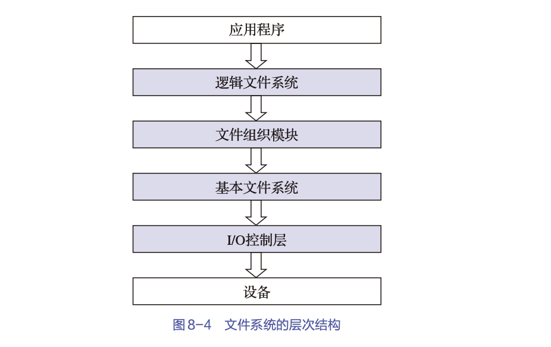

### 文件系统接口

为方便用户使用，文件系统以接口的形式提供了一组对文件和记录进行操作的方法和手段。常用的两类接口是：
- 命令接口
    指用户与文件系统直接进行交互的接口  
    用户可通过该类接口输入命令，进而获得文件系统的服务；

- 程序接口
    
    指用户程序与文件系统的接口，用户程序可通过系统调用获得文件系统的服务

## 文件操作

用户可以通过文件系统提供的系统调用对文件进行操作

### 最基本的文件操作

1. 创建文件

在创建一个新文件时
- 要为新文件分配必要的外存空间
- 并在文件目录中为之建立一个目录项
> 目录项中应记录新文件的文件名及其在外存中的地址等属性。

2. 删除文件

在删除文件时
- 应先从目录中找到要删除文件的目录项，并使之成为空项
- 然后回收该文件所占用的存储空间。

3. 读文件

- 在读文件时，根据用户给出的文件名去查找目录，从中得到被读文件在外存中的地址
- 在目录项中，还有一个指针用于对文件进行读操作。

4. 写文件

在写文件时
- 根据文件名查找目录
- 找到指定文件的目录项后，再利用目录中的写指针进行写操作设置文件的读/写位置

通过设置文件读/写指针的位置，可以从所设置的位置开始操作，从而改顺序存取为随机存取。

### 文件的open和close操作

当用户要求对一个文件实施多次读/写或其他操作时，每次都要从检索目录开始

为了避免多次重复地检索目录，在大多数OS中都引入了“打开”（Open）这一文件系统调用。

当用户第一次请求对某文件进行操作时，须先利用系统调用Open将该文件打开

所谓“打开”，是指
- 系统将指定文件的属性（包括该文件在外存中的物理位置），从外存复制到内存中的打开文件表的一个表目中
- 并将该表目的编号（或称为索引号）返回给用户。
- 当用户再次向系统发出文件操作请求时，系统可以根据用户提供的索引号，直接在打开文件表中查找到文件信息。

换言之，“打开”就是在用户和指定文件之间建立一个连接。此后，用户可通过该连接直接得到文件信息，从而避免再次通过目录检索文件

如果用户已不再需要对该文件实施相应的操作，则可利用“关闭”（Close）系统调用来关闭此文件，即断开此连接，而后OS将会把此文件从打开的文件表中的表目上删除。

### 其他文件操作

OS为用户提供了一系列面向文件操作的系统调用
- 最常用的一类是关于对文件属性进行操作的，即允许用户直接设置和获得文件的属性
- 另一类是关于目录的，如创建一个目录、删除一个目录、改变当前目录和工作目录等
- 此外，还有用于实现文件共享的系统调用，以及用于对文件系统进行操作的系统调用等。

# 文件的逻辑结构

用户所看到的文件称为逻辑文件，它是由一系列的逻辑记录所组成的。

系统中的所有文件都存在着以下两种形式的文件结构

- 文件的逻辑结构

    指从用户角度出发所观察到的文件组织形式，即文件是由一系列的逻辑记录所组成的，是用户可以直接处理的数据及其结构，它独立于文件的物理特性，又称为文件组织（file organization）。对应的文件通常称为逻辑文件。

- 文件的物理结构(存储结构)

    指系统将文件存储在外存上所形成的一种存储组织形式，是用户所看不见的。文件的物理结构不仅与存储介质的存储性能有关，而且与所采用的外存分配方式也有关

    无论是文件的逻辑结构，还是文件的物理结构，都会影响系统对文件的检索速度。

## 文件逻辑结构的类型

### 按文件是否有结构来分

按文件是否有结构来分，可将文件分为两类:
- 有结构文件: 指由一个以上的记录所构成的文件，故又将其称为记录式文件
- 无结构文件: 指由字节流所构成的文件，故又将其称为流式文件。

1. 有结构文件

在记录式文件中，每个记录都用于描述实体集中的一个实体，各记录有着相同或不同数目的数据项。记录的长度可分为定长和变长两类。

- 定长记录

    指文件中所有记录的长度都是相同的
    - 所有记录中的各数据项都处在记录中相同的位置，具有相同的顺序和长度
    - 文件的长度用记录数目表示
    - 定长记录能有效地提高检索记录的速度和效率，用户能方便地对文件进行处理  

- 变长记录

    指文件中各记录的长度不一定相同
    - 产生变长记录的原因
        - 可能是一个记录中所包含的数据项（如书的著作者、论文中的关键词等）数目并不相同
        - 也可能是数据项本身的长度不定
    - 在处理前，每个记录的长度都是可知的
    - 对变长记录的检索速度慢，这不便于用户对文件进行处理。

2. 无结构文件

此类文件的长度是以字节为单位的

对流式文件的访问，则是指利用读/写指针来指出下一个要访问的字节

可以把流式文件看作记录式文件的一个特例：一个记录仅有一个字节。

### 按文件的组织方式来分类

1. 顺序文件

指由一系列记录按某种顺序排列所形成的文件，其中的记录可以是定长记录或可变长记录；

2. 索引文件

为可变长记录文件建立一张索引表，为每个记录设置一个索引表项，以加速对记录的检索速度；

3. 索引顺序文件

顺序文件和索引文件相结合的产物，为每个文件建立一张索引表时，并不是为每个记录建立一个索引表项，而是为一组记录中的第一个记录建立一个索引表项

## 顺序文件

### 顺序文件的排序方式

1. 串结构

串结构文件中的记录，通常是按存入文件的先后时间进行排序的，各记录之间的顺序与关键字无关

在对串结构文件进行检索时，每次都必须从头开始逐个地查找记录，直至找到指定的记录或者查完所有的记录为止

显然，对串结构文件进行检索是比较费时的。

2. 顺序结构

由用户指定一个字段作为关键字，它可以是任意类型的变量，其中最简单的是正整数，如0到N-1

为了能唯一地标志每个记录，必须使每个记录的关键字值在文件中具有唯一性。这样，文件中的所有记录就可以按关键字来排序，如按关键字值的大小或其对应英文字母的顺序进行排序

在对顺序文件进行检索时，还可以利用某种有效的查找算法（如折半查找法、插值查找法、跳步查找法等）来提高检索效率。因此，顺序文件可以有更高的检索速度和效率。

### 顺序文件的优缺点

1. 优点

顺序文件的最佳应用场合是在对文件中的记录进行批量存取时，即每次要读/写一大批记录时。

在所有逻辑文件中，顺序文件的存取效率是最高的。

此外，对于顺序存储设备（如磁带），也只有顺序文件才能被存储并有效地工作。

2. 缺点

如果用户（程序）要求查找或修改单个记录，则系统需要在文件的记录中逐个地进行查找，所表现出的性能就可能很差

顺序文件的另一个缺点是，不论是想增加还是删除一个记录，都比较困难。

为了解决这一问题，可以为顺序文件配置一个运行记录文件或称之为事务文件，把试图增加、删除或修改的信息记录于其中，规定每隔一定时间（例如4小时）就将运行记录文件与原来的主文件加以合并，产生一个按关键字排序的新文件。

## 顺序文件记录寻址

为了访问顺序文件中的一条记录，首先应找到该记录的地址

### 隐式寻址方式

对于定长记录的顺序文件，如果已知当前记录的逻辑地址，便很容易确定下一个记录的逻辑地址。

1. 定长记录文件寻址

在读一个文件时，为了读文件
- 在系统中应设置一个读指针Rptr(见图8-5)，令它指向下一个记录的始址；
- 每当读完一个记录，便执行Rptr=Rptr+L操作，使之指向下一个记录的始址
> 其中的L为当前记录长度

类似地，为了写文件
- 也应设置一个写指针Wptr，使之指向要写的记录的始址
- 同样，在每写完一个记录时，须执行Wptr=Wptr+L操作。

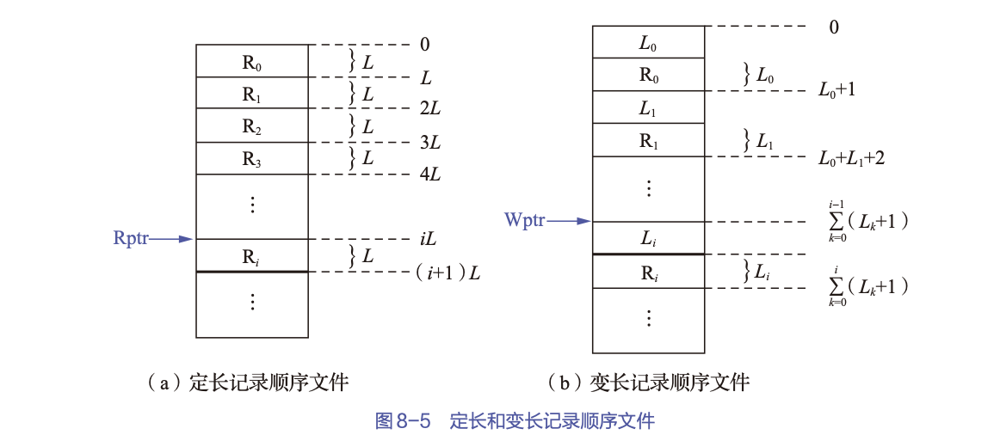

2. 变长记录文件寻址

对于变长记录的顺序文件，在顺序读/写时的情况与定长记录的顺序文件相似，只是每次都需要从正在读/写的记录中读出该记录的长度。

3. 问题

这种寻址方式主要问题是：访问一个指定记录i，必须扫描或读取前面第0～i-1个记录。这实际上是顺序访问，因此访问速度比较慢。

### 显式寻址方式

对于变长记录的顺序文件，不能利用显式寻址方式实现直接访问或随机访问，而必须增加适当的支持机构方能实现;以下两种方式对定长记录实现随机访问:

1. 利用文件中记录的位置

用一个整数来唯一标识文件中的一条记录

2. 利用关键字

必须指定一个字段作为关键字，通过指定的关键字来查找该记录。

- 当用户给出要检索记录的关键字时
- 系统将利用该关键字顺序地从第1个记录开始**比较**指定关键字和每个记录的关键字
- 直至找到相匹配的记录。

## 索引文件

1. 优点

- 将一个需要顺序查找的文件，改造成了一个可随机查找的文件
- 极大地提高了用户（程序）对文件的查找速度
- 也便于进行记录插入与删除

故索引文件成为了当今应用最为广泛的一种文件形式

2. 缺点

除了有主文件外，还须配置一张索引表，而且每个记录都要有一个索引项，因此增加了存储开销。

### 按关键字建立索引

为变长记录顺序文件建立一张索引表，为目标文件中的每个记录在索引表中分别设置一个索引表项，用于记录
- 指向记录的指针（即记录在逻辑地址空间的起始地址）
- 记录的长度。

索引表按关键字排序，因此其本身也是一个定长记录的顺序文件，这样就把对变长记录顺序文件的顺序检索，转变成了对定长记录索引文件（index file）的随机检索，从而加快了记录检索速度，实现了直接存取。

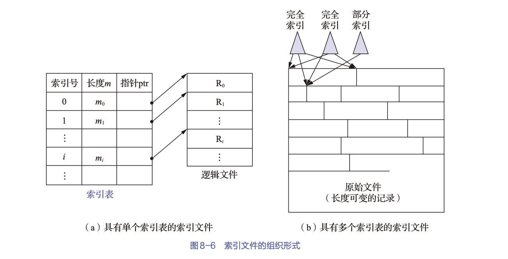

### 具有多个索引表的索引文件

现实: 不同的用户为了不同的目的，希望能按不同的属性（或不同的关键字）来检索一条记录。

为实现此要求，需要为顺序文件建立多个索引表，即为每种可能成为检索条件的域（属性或关键字）都配置一张索引表。每张索引表都按相应的一种属性或关键字进行排序。

## 索引顺序文件

### 特征

索引顺序文件（index sequential file）
- 是对顺序文件的一种改进
    - 基本上克服了变长记录的顺序文件不能被随机访问以及不便于删除和插入记录等缺点
    - 但同时保留了顺序文件的关键特征，即记录是按关键字的顺序组织起来的
- 又增加了两个特征：
    - 引入了文件索引表，通过该表可实现对索引顺序文件的随机访问
    - 增加了溢出（overflow）文件，用它来记录新增加的、删除的和修改的记录

可见，索引顺序文件是顺序文件和索引文件相结合的产物，能有效克服变长记录顺序文件的缺点，而且所付出的代价也不算太大。

### 一级索引顺序文件

1. 建表过程

- 首先将变长记录顺序文件中的所有记录分为若干组
- 然后为文件建立一张索引表
- 并为每组中的第一个记录在索引表中建立一个索引项，其中包含该记录的关键字和指向该记录的指针

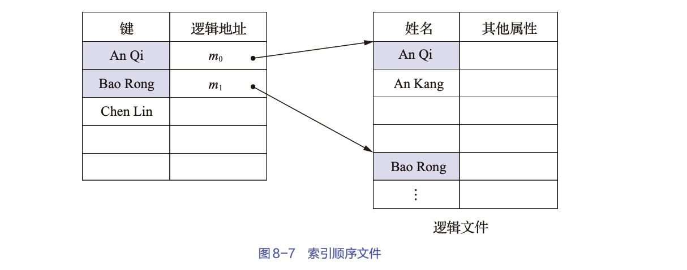

2. 索引顺序文件检索过程

- 首先也是利用用户（程序）所提供的关键字以及某种查找算法检索索引表
- 找到该记录所在记录组中第一个记录的表项
- 从中获知该记录组第一个记录在主文件中的位置
- 然后，利用顺序查找法查找主文件，从中找到所要的记录。

### 两级索引顺序文件

对于一个非常大的文件，为了进一步提高检索效率，可以为顺序文件建立多级索引，即为索引顺序文件再建立一张索引表，从而形成两级索引表。

## 直接文件和哈希文件

1. 直接文件

直接文件，可根据给定的关键字直接获得指定记录的物理地址，而不用利用给定的记录键值先对线性表或链表进行检索

换言之，关键字本身决定了记录的物理地址。

这种由关键字（的值）到记录的物理地址的变换，被称为键值变换（key to address transformation）。

组织直接文件的关键在于，通过什么方法进行从关键字的值到记录的物理地址的变换。

2. 哈希文件

哈希（Hash）文件是目前应用最为广泛的一种直接文件。

它利用Hash函数（或称散列函数）可将关键字变换为相应记录的地址。

但为了实现文件存储空间的动态分配，利用Hash函数所求得的结果通常并不是相应记录的地址，而是指向某一目录表相应表目的指针，该表目的内容指向了相应记录所在的物理块

# 文件目录

为了能对大量文件实施有效的管理，主要通过文件目录来实现。

文件目录也是一种数据结构，用于
- 标志系统中的文件及其物理地址
- 供检索时使用

对目录管理的要求如下:

- 实现“按名存取”

    即用户只须向系统提供所须访问文件的名字，便能快速准确地找到指定文件在外存中的存储位置

- 提高对目录的检索速度

    通过合理地组织目录结构，可加快对目录的检索速度，从而提高对文件的存取速度

- 文件共享

    在多用户系统中，应允许多个用户共享一个文件，只须在外存中保留一份该文件的副本供不同用户使用即可

- 允许文件重名

    系统应允许不同用户对不同文件采用相同的名字，以便用户按照自己的习惯给文件命名和使用文件。

## 文件控制块和索引节点

为了能对一个文件进行正确的存取，必须为文件设置用于描述和控制文件的数据结构，称之为文件控制块（file control block，FCB）。

文件管理程序可借助于FCB中的信息对文件施以各种操作。

文件与FCB一一对应，而人们把FCB的有序集合称为文件目录，即一个FCB就是一个文件目录项。通常，一个文件目录也被看作一个文件，称为目录文件。

### FCB的组成

1. 基本类信息

- 文件名，用于标志一个文件的符号名，用户利用该名字进行存取；
- 文件物理位置，指文件在外存中的存储位置，它包括
    - 存放文件的设备名
    - 文件在外存上的起始盘块号
    - 指示文件所占用的盘块数或字节数的文件长度；
- 文件逻辑结构
    - 指示文件是流式文件还是记录式文件
    - 文件中的记录数
    - 文件是定长记录还是变长记录等；
- 文件的物理结构，指示文件在外存中的组织方式，如
    - 连续组织方式
    - 链接组织方式
    - 索引组织方式等

2. 存取控制信息类

包括
- 文件拥有者的存取权限
- 核准用户的存取权限
- 以及一般用户的存取权限

3. 使用信息类

- 文件的建立日期和时间
- 文件上一次修改的日期和时间，以及当前使用的信息，这些信息包括
    - 当前已打开该文件的进程数
    - 是否被其他进程锁住
    - 文件在内存中是否已被修改但尚未复制到盘上等。

对于不同OS的文件系统，由于功能不同，它们可能只含有上述信息中的部分信息。

### 索引节点

1. 索引节点的引入

如果将文件的全部信息都存在目录文件中，在查找用户指定的文件时，需掉入大量内容到内存中，但是检索目录文件的过程中只用到了文件名

因此，有的系统(如UNIX系统)中便采用了把文件名与文件描述信息分开的办法

即使文件描述信息单独形成一个称为索引节点（iNode）的数据结构，简称为i节点

文件目录中的每个目录项，仅由文件名和指向该文件所对应的索引节点的指针所构成。

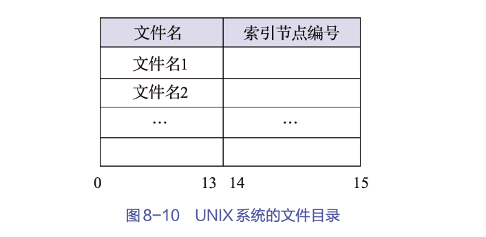

2. 磁盘索引节点

磁盘索引节点是指存放在磁盘上的索引节点，每个文件都有唯一的一个磁盘索引节点，它包括:

- 文件拥有者标识符
    拥有该文件的个人或小组的标识符； 

- 文件类型
    包括正规文件、目录文件或特别文件；

- 文件存取权限
    指各类用户对该文件的存取权限；

- 文件物理地址
    每个索引节点中均含有13个地址项，即i.addr(0)～i.addr(12)，它们以直接或间接方式给出数据文件所在盘块的编号；

- 文件长度
    指以字节为单位的文件长度；

- 文件连接计数
    表明在本文件系统中，所有指向该（文件的）文件名的指针计数；

- 文件存取时间
    指出本文件最近被进程存取的时间、本文件最近被修改的时间以及索引节点最近被修改的时间。

3. 内存索引节点

内存索引节点是指存放在内存中的索引节点

当文件被打开时，要将磁盘索引节点复制到内存索引节点中，便于以后使用。

增加了以下内容：
- 索引节点编号
    用于标志内存索引节点；

- 状态
    指示索引节点是否上锁或被修改；

- 访问计数
    每当有一进程要访问此索引节点时，就将该访问计数加1，访问完再减1；

- 文件所属文件系统的逻辑设备号；

- 链接指针
    设置有分别指向空闲链表和散列队列的指针。

## 简单的文件目录

目前，最简单的文件目录形式是单级文件目录和两级文件目录。

### 单级文件目录

1. 目录表的组成

在整个文件系统中只建立一张目录表，每个文件占一个目录项，目录项中含有
- 文件名
- 扩展名
- 文件长度
- 文件类型
- 物理地址
- 文件说明
- 其他文件属性
- 此外，为表明每个目录项是否空闲，又设置了一个状态位。

2. 增删文件

建立一个新文件时
- 都必须先检索所有的目录项，以保证新文件名在目录中是唯一的
- 然后再从目录表中找出一个空白目录项，填入新文件的文件名及其他信息，并置状态位为1

在删除文件时
- 先从目录中找到要删除文件的目录项
- 回收该文件所占用的存储空间
- 然后再清除该目录项。

3. 评价

单级文件目录的优点是简单，但它只能实现目录管理中最基本的功能——按名存取

不能满足对文件目录的其他3方面的要求，具体说明如下: 
- 查找速度慢
- 不允许重名
- 不便于实现文件共享。通常，每个用户都有自己的名字空间或命名习惯。因此，应当允许不同用户使用不同的文件名来访问同一个文件。然而，单级文件目录却要求所有用户都只能用同一个名字来访问同一个文件。

因此只适用于单用户环境。

### 两级文件目录

为了克服单级文件目录所存在的缺点，可以为每个用户再建立一个单独的用户文件目录(User File Directory)

1. 定义

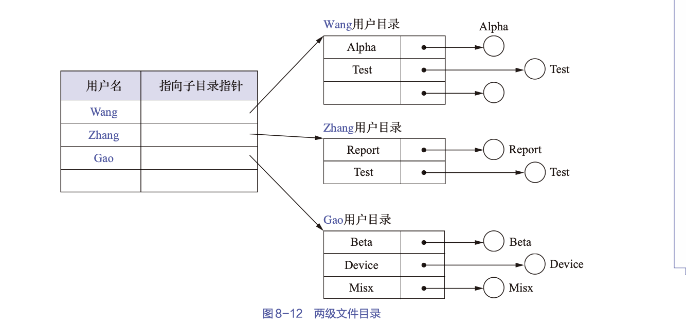

- 在系统中再建立一个主文件目录(master file directory，MFD)
- MFD中，每个用户都占有一个目录项，其目录项中包括用户名和指向相应UFD的指针
- UFD具有相似的结构，它们由用户所有文件的FCB组成。

2. 评价

- 提高了检索目录的速度
- 不同的UFD中可以使用同名文件，只需用户在自己的UFD中每个文件名都是唯一的即可
- 不同的用户可以使用不同的文件名访问系统中的同一个文件

## 树形目录

### 简介

MFD在树形目录里被称为根目录
- 在每个文件目录中，只能有一个根目录
- 每个文件和每个目录都只能有一个父目录
- 把数据文件称为树叶
- 其他的目录均作为树的节点，或称它们为子目录。

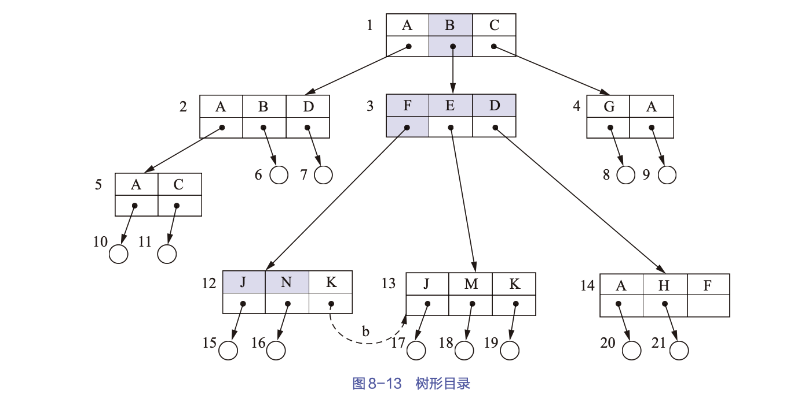

图中
- 方框代表目录文件
- 圆圈代表数据文件

### 路径名和当前目录

1. 路径名

树形目录中，从根目录到任何数据文件都只有一条唯一的通路，因此系统中的每个文件都有唯一的路径名。

在该路径上
- 从树的根（即主目录）开始
- 把全部目录文件名与数据文件名依次用“/”连接起来  
即可构成该数据文件的路径名

2. 当前目录

- 当一个文件系统含有许多级时，每访问一个文件，都要使用从树根开始到树叶（数据文件）为止的、包括各中间节点（目录）名的全路径名，这是相当麻烦的一件事。

- 一个进程在运行时其所访问的文件大多仅局限于某个范围

基于这一点，可为每个进程设置一个“当前目录”(“工作目录”)。进程对各文件的访问都是相对于当前目录而进行的

绝对路径和相对路径: 
- 相对路径名(relative path name): 从当前目录开始到数据文件为止所构成的路径名称
- 绝对路径名(absolute path name): 从树根开始的路径名

较两级文件目录而言，树形目录的
- 查询速度更快
- 同时其层次结构更加清晰
- 能够更加有效地进行文件的管理和保护。

### 目录操作

1. 创建目录

在树形目录中，用户可为自己建立UFD，并可再创建子目录

当用户要创建一个新文件时
- 只须查看在自己的UFD及其子目录中有无与新建文件相同的文件名
- 若无，便可在UFD或其某个子目录中增加一个新目录项

2. 删除目录

对于一个已不再需要的目录，应如何删除其目录项，须视情况而定
- 如果所要删除的目录是空的
    - 则可简单地将该目录项删除
    - 使它在其上一级目录中对应的目录项为空
- 如果要删除的目录不空，即其中尚有几个文件或子目录
    - 不删除非空目录。若要删除，则必须先删除目录中的所有文件。
    - 删除非空目录。要删除一个目录时，如果在该目录中还包含有文件，则目录中的所有文件和子目录也会同时被删除。

3. 改变目录

用户可利用改变目录的命令，通过指定目录的绝对或相对路径名来设置当前目录。

> 如果在使用改变目录的命令时没有明确指明任何目录，则在默认的情况下当前目录通常会自动地改变到主目录（与指定用户相关的最顶层目录，家目录）。

4. 移动目录

文件或子目录经移动后，它们的路径名将随之改变。

5. 链接操作

对于树形目录，每个文件和每个目录都只允许有一个父目录，这样不利于文件共享，但可以通过链接操作让指定文件具有多个父目录，从而方便了文件共享

6. 查找操作

当文件目录非常庞大时，要查找一个指定文件是比较困难的。因此在所有的OS中都支持以多种方式进行查找，例如
- 可以从根目录或当前目录位置开始进行查找
- 查找方式可选用精确匹配或局部匹配等。

## 无环图目录

在严格的树形目录中，每个文件只允许有一个父目录，父目录可以有效地拥有该文件，其他用户要想访问它，都必须经过其所属主目录来实现，不适合文件共享

有向无环图，即没有循环的有向图，它允许目录共享子目录或文件。同一个文件或子目录可出现在两个或多个目录中

无环图目录是树形目录的自然扩展，如下图，$F_8$存在多个父目录

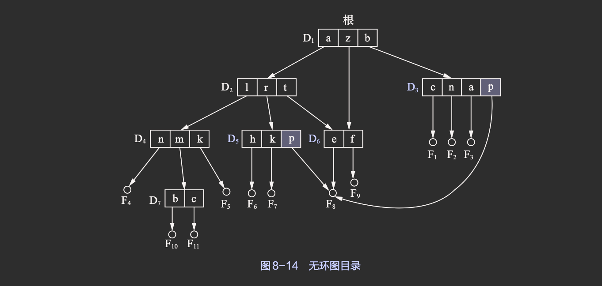

## 目录查询技术

当用户要访问一个已保存的文件时
- 系统首先会利用用户提供的文件名对目录进行查询，找出该文件的FCB或对应的索引节点
- 然后，根据FCB或索引节点中记录的文件物理地址（盘块号），换算出文件在磁盘上的物理位置
- 最后，通过磁盘驱动程序将所需文件读入内存。

### 线性检索法

1. 单级文件目录

基于用户提供的文件名，可以利用顺序查找法直接从文件目录中找到指定文件的目录项

2. 树形目录中

用户提供的文件名是由多个文件分量名所组成的路径名，此时须对多级文件目录进行查找。

3. 举例

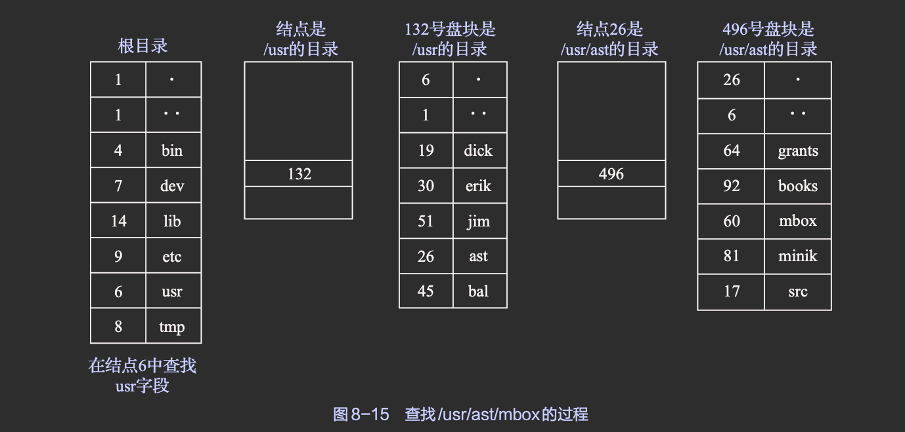

- 首先，系统应读入第一个文件分量名usr，用它与根目录文件（或当前目录文件）中各目录项中的文件名依次进行比较，从中找出匹配项，并得到匹配项的索引节点编号为6
- 再从6号索引节点中得知usr目录文件放在132号盘块中，将该盘块内容读入内存
- 然后，系统读入路径名中的第二个分量名ast，用它与放在132号盘块中的第二级目录文件中各目录项的文件名依次进行比较，从中找到匹配项，并得知ast的目录文件放在26号索引节点中
- 再从26号索引节点中得知/usr/ast存放在496号盘块中，将该盘块的内容读入内存
- 最后，系统读入该文件的第三个分量名mbox，用它与第三级目录文件/usr/ast中各目录项中的文件名依次进行比较，得知/usr/ast/mbox的索引节点编号为60，即在60号索引节点中存放了指定文件的物理地址

目录查询操作到此结束。如果在顺序查询过程中发现有一个文件分量名不能被找到，则应停止查询，并返回“文件未找到”信息。

### Hash方法

1. 简介

如果我们建立了一张Hash索引文件目录，则可利用Hash方法进行查询，即
- 系统将用户提供的文件名变换为文件目录的索引值
- 再利用该索引值到目录中去查询

2. 通配符处理

如果在文件名中使用了通配符，如“*”“？”等。对于使用了通配符的文件名，系统无法利用Hash方法查询目录，此时，系统还是需要利用线性查找法来查询目录。

3. Hash冲突处理
在进行文件名的转换时，有可能把n个不同的文件名转换为相同的Hash值，即出现所谓的“冲突”。一种处理此类“冲突”的有效规则介绍如下: 
- 在利用Hash方法查询目录时，如果目录表中相应的目录项是空的，则表示系统中并无指定文件。
- 如果目录项中的文件名与指定文件名相匹配，则表示该目录项正是所要寻找的文件所对应的目录项，故而可从中找到该文件的物理地址
- 如果在目录表的相应目录项中的文件名与指定文件名并不匹配，则表示发生了“冲突”，此时须将其Hash值再加上一个常数（该常数应与目录的长度值互质）以形成新的索引值，然后返回第一步重新开始查询。

# 文件共享

文件共享手段，即指系统应允许多个用户（进程）共享同一份文件。这样，在系统中只须保留该共享文件的一份副本即可。

## 利用有向无环图实现文件共享

在之前介绍

<!-- TODO: don't really understand -->

## 利用索引节点实现文件共享

将诸如文件的物理地址及其他文件属性等信息不再放入目录项中，而是放在索引节点中。在文件目录中只设置文件名及指向相应索引节点的指针

> 该方法在UNIX系统中被称为硬链接（hard link）

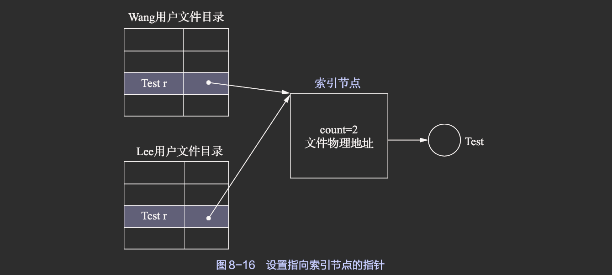

在索引节点中还应有一个链接计数count，用于表示链接到本索引节点（亦即文件）上的用户目录项的数目。

文件拥有者不能随意删除被共享的文件，否则会导致其他文件共享者的指针悬空

## 利用符号链接实现文件共享

1. 基本思想

允许一个文件或子目录有多个父目录，但其中仅有一个作为主（属主）父目录，其他父目录都是通过符号链接方式与之相链接的，故将它们简称为链接父目录

2. 实现

每创建一个符号链接
- 由系统创建一个LINK类型的新文件，其只包含被链接文件的路径名
- 当用户通过LINK文件访问目标文件时
- OS将次要求截取，并通过该LINK文件中的路径名去查询被链接文件，对它进行读写

# 文件保护

- 通过存取控制机制，防止人为因素导致文件不安全；
- 采取系统容错技术，防止系统某部分的故障导致文件不安全；
- 建立后备系统，防止自然因素导致文件不安全

本节主要介绍第一方面的措施——存取控制机制，第二方面和第三方面的措施将会在第12章中进行介绍。

## 保护域

规定每一个进程仅能在保护域（protection domain）内执行操作，而且只允许进程访问它们具有“访问权”的对象。

1. 访问权

我们把一个进程能对某对象进行操作的权力，称为访问权（access right）

每个访问权都可以用一个有序对（对象名，权集）来表示，例如，某进程有对文件F1进行读和写操作的权力，则可将该进程的访问权表示成（F1, {RW}）。

2. 保护域

保护域简称为“域”，是进程对一组对象的访问权的集合。

进程只能在指定域内执行操作，这样，“域”也就规定了进程所能访问的对象和所能执行的操作。

3. 进程和域间的链接

- 静态联系

进程和域之间可以一一对应，即一个进程只联系着一个域。这意味着，在进程的整个生命期中，其可用资源是固定的，我们把这种进程联系的域称为“静态域”

- 动态联系

在进程和域之间，也可以是一对多的关系，即一个进程可以联系着多个域。在此情况下，可将进程的运行分为若干个阶段，每个阶段联系着一个域，这样便可根据运行的实际需要来规定在运行的每个阶段中进程所能访问的对象。

## 访问矩阵

### 访问矩阵的概念

1. 基本的访问矩阵

我们可以利用一个矩阵来描述系统的访问控制，并把该矩阵称为访问矩阵（accessmatrix）。

访问矩阵中的行代表域，列代表对象，矩阵中的每一项都是由一组访问权所组成的

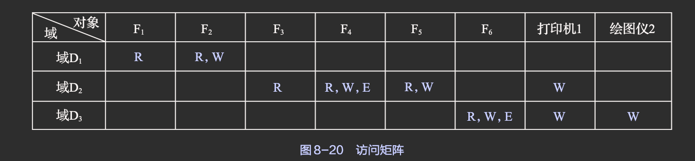

2. 具有域切换权的访问矩阵

如下图所示，标为S的(i,j)的含义是：允许在域i中的进程切换到域j中

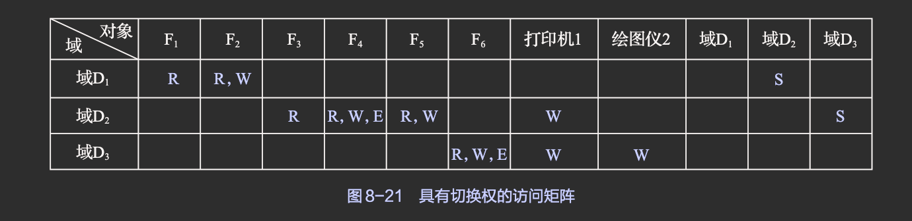

### 访问矩阵的修改

<!-- TODO: P294 next -->

### 访问矩阵的实现

在稍具规模的系统中，域的数量和对象的数量都可能很大

事实上，每个用户（进程）所须访问的对象通常很有限，其访问矩阵是一个非常稀疏的矩阵。目前针对这一问题的解决方法是，将访问矩阵按列或按行划分，以分别形成访问控制表或访问权限表。

1. 访问控制表

对访问矩阵按列（对象）进行划分，并为每一列建立一张访问控制表。在该表中，已把矩阵中属于该列的所有空项删除，此时的访问控制表由一有序对（域，权集）组成。

域是一个抽象的概念，可用各种方式实现: 
- 最常见的一种情况是，每个用户是一个域，而对象则是文件。此时，用户能够访问的文件集和访问权限取决于用户的身份。通常，在一个用户退出而另一个用户进入（即用户发生改变）时，要进行域的切换
- 另一种情况是，每个进程是一个域，此时，进程能够访问的对象集中的各访问权取决于进程的身份。

2. 访问权限表

对访问矩阵按行（即域）进行划分，并为每一行建立一张访问权限表，该表是由一个域对每个对象可以执行的一组操作所构成的表。表中的每一项即该域对某对象的访问权限。当域为用户（进程）、对象为文件时，访问权限表便可用于描述一个用户（进程）对每个文件所能执行的一组操作。

# 本章小结

本章主要介绍了
- 文件和文件系统的基本概念
- 文件逻辑结构的类型
- 文件目录
- 文件的共享与保护等内容

文件是由OS定义和实现的抽象数据类型。它是逻辑记录的一个序列，而逻辑记录可以是字节、记录或更为复杂的数据项。

文件的逻辑结构是指从用户角度所看到的文件组织形式，分为
- 有结构文件: 可分为
    - 顺序文件
    - 索引文件
    - 索引顺序文件
- 无结构文件(流式文件)

文件目录是用来管理文件的数据结构，可分为
- 单级文件目录
- 两级文件目录
- 树形目录
- 无环图目录等

为了防止浪费存储空间，系统提供文件共享功能显得尤为必要。文件的共享取决于系统所提供的语义，可以在单处理机系统、多处理机系统甚至计算机网络中进行文件共享。

因为文件是大多数计算机存储信息的主要机制，其如果处于不安全状态，则可能会产生难以估量的影响，所以需要进行文件保护。文件保护可以通过存取控制机制或其他技术来实现。
