第九章、磁盘存储器管理

[toc]

磁盘存储器
- 不仅容量大、存取速度快
- 而且可以实现随机存取  
是当前实现虚拟存储器和文件存放最理想的外存，因此在现代计算机系统中都无一例外地配置了磁盘存储器。

磁盘存储器管理的目的和要求如下
- 有效利用存储空间
    采取合理的文件分配方式，为文件分配必要的存储空间，并能有效地减少磁盘碎片，改善存储空间的利用率。

- 提高磁盘的I/O速度
    通过各种途径（包括采用磁盘高速缓存等）来提高磁盘的I/O速度，以提高系统对文件的访问速度，从而改善文件系统的性能。

- 提高磁盘系统的可靠性
    采取多种技术，包括必要的冗余措施和后备系统，来提高磁盘系统的可靠性。

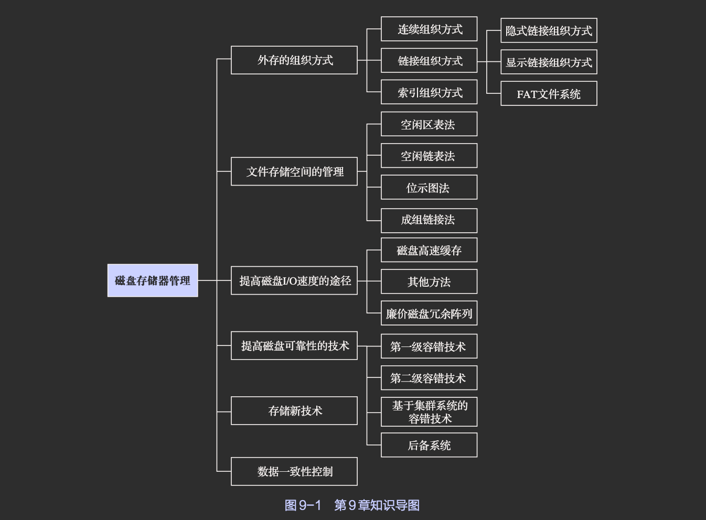

# 外存的组织方式

## 连续组织(分配)方式

1. 概念

连续组织方式要求为每个文件分配一组相邻的盘块。

在采用连续组织方式时，可把逻辑文件中的记录顺序地存储到邻接的各个物理盘块中，这样所形成的文件结构称为顺序式文件结构，此时的物理文件称为顺序文件。

2. 组织方式

连续组织方式保证了逻辑文件中的记录顺序与存储器中文件占用盘块顺序的一致性。为使系统能找到文件存放的地址，应在目录项的“文件物理地址”字段中记录该文件第一个记录所在的盘块号和文件长度（以盘块为单位）。

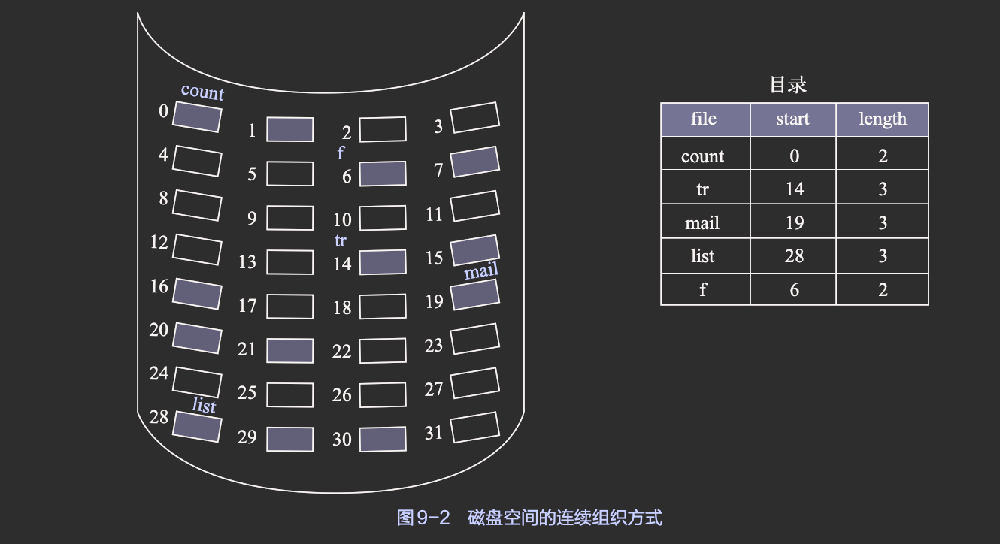

3. 碎片问题

如同内存的动态分区分配一样，随着文件建立时空间的分配和文件删除时空间的回收，磁盘空间将被分割成许多小块，这些小块已难以用来存储文件，此即外部碎片

同样，我们也可以利用紧凑的方法使盘上所有的文件紧靠在一起，将所有的碎片拼接成一大片连续的存储空间。但是，将外存空闲空间进行一次紧凑所花费的时间远比将内存进行一次紧凑所花费的时间多。

4. 优点

- 顺序访问容易
    系统可从目录中找到该顺序文件所在的第一个盘块号，从此开始逐个盘块地往下读/写即可

- 顺序访问速度快
    采取连续组织方式所装入的文件，其所占用的盘块可能位于一条或几条相邻的磁道上，磁头的移动距离最少

5. 缺点

- 要求为一个文件分配连续的存储空间
    会产生许多外部碎片，严重降低了外存空间的利用率。如果定期利用紧凑方法来消除外部碎片，则又会花费大量的机器时间。

- 必须事先知道文件的长度

- 不能灵活地删除和插入记录
    为保持文件的有序性，在删除和插入记录时，不仅需要对相邻的记录做物理上的移动，还需要动态地改变文件的大小

- 对于动态增长的文件，采用连续组织方式可能会覆盖物理上相邻的后续文件，因此无法满足文件动态增长的要求。

## 链接组织方式

1. 概念

在采用链接组织方式时
- 可为文件分配多个不连续的盘块
- 再通过每个盘块上的链接指针，将同属于一个文件的多个离散的盘块链接成一个链表  
由此所形成的物理文件称为链接文件。

2. 优点

- 消除了外部碎片，提高了外存的利用率；
- 非常容易插入、删除和修改记录；
- 能适应文件的动态增长，而无须事先知道文件的大小。

### 隐式链接组织方式

1. 定义

在文件目录的每个目录项中，都须含有指向链接文件第一个盘块和最后一个盘块的指针，其中每个盘块都有指向下一个盘块的指针

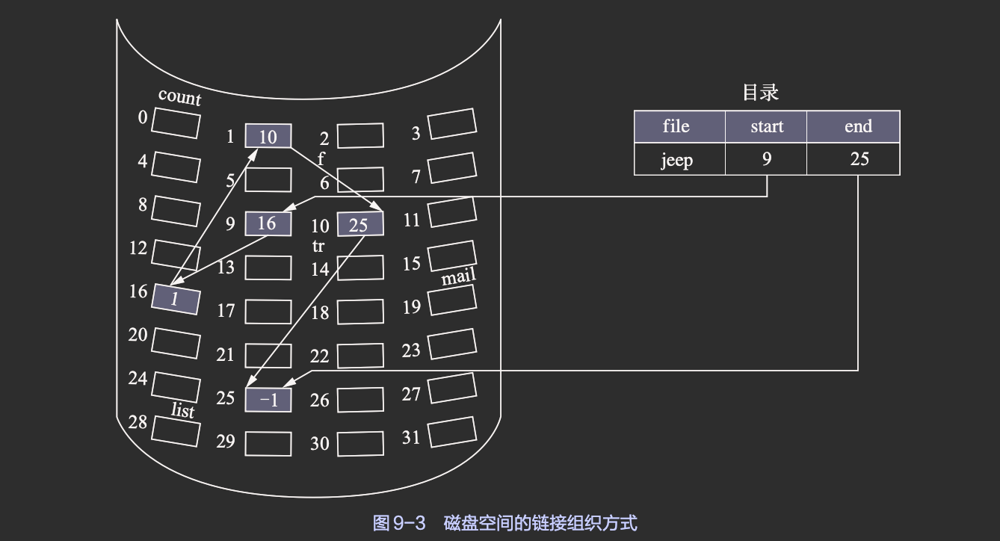

2. 缺点

只适用于顺序访问，而对随机访问是极其低效的

为了提高检索速度和减小指针所占用的存储空间，可以将几个盘块一起组成一个簇。例如，一个簇可包含4个盘块，在进行盘块分配时是以簇为单位进行的，链接文件中的每个元素也是以簇为单位的。这样将会大幅减少查找指定块的时间，而且也可减小指针所占用的存储空间；但是增大了内部碎片，同时这种改进的效果也是非常有限的。

### 显示链接组织方式

显式链接组织方式是指把用于链接文件各物理盘块的指针，显式地存放在内存的一张链接表中。

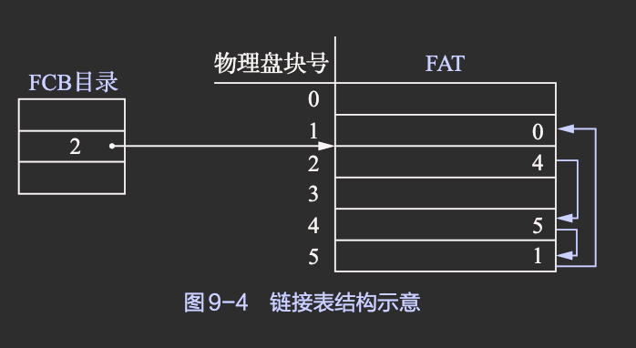

- 该表在整个磁盘中仅设置一张
- 每个表项中存放指向下一个盘块的链接
- 该表中，凡是属于某一文件的第一个盘块号，或者说是每一条链的链首指针所对应的盘块号，均作为文件地址被填入相FAT应文件的FCB的“物理地址”字段中

由于查找记录的过程是在内存中进行的，因而链接表不仅显著地提高了检索速度，而且大大减少了访问磁盘的次数。由于分配给文件的所有盘块链接指针都存放在该表中，因此把该表称为文件分配表（file allocation table，FAT）。

### FAT文件系统

FAT技术：利用FAT来记录每个文件中所有盘块之间的链接

在FAT中引入了“卷”（volume）的概念后，其便支持将一个物理磁盘分成四个逻辑磁盘，每个逻辑磁盘就是一个卷（也称为分区）
- 每个卷都是一个能够被单独格式化和使用的逻辑单元，供文件系统分配空间时使用
- 一个卷中包含文件系统信息、一组文件以及空闲空间
- 每个卷都专门划出一个单独区域来存放自己的目录、FAT以及逻辑驱动器字母

> 在现代OS中，一个物理磁盘可以被划分为多个卷，一个卷也可以由多个物理磁盘组成。

1. 以盘块为单位的FAT文件系统

早期的FAT12以盘块为基本分配单位

由于FAT是文件系统中最重要的数据结构，为了安全起见，在每个分区中都配有两张相同的文件分配表，即FAT1和FAT2

- 在FAT的每个表项中均存放下一个盘块号，它实际上是用于盘块之间进行链接的指针
- FAT会将文件的第一个盘块号放在自己的FCB中

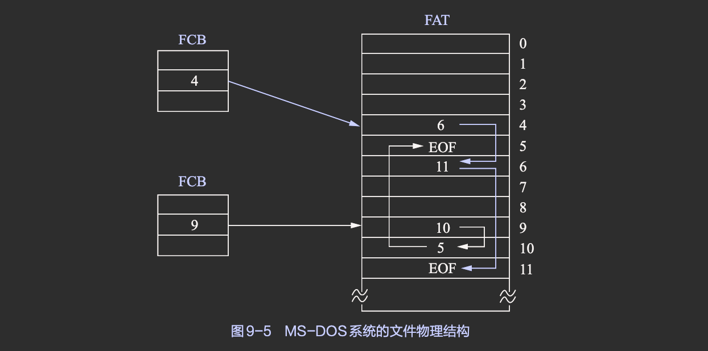

> 由于每个FAT表项为12位二进制数组成，可索引的盘块数有限$(2^12)$，因此在以盘块为分配单位的文件系统允许的最大磁盘容量有限，因此引入了新的分配单位--簇

2. 以簇为单位的FAT文件系统

如果把每个盘块（扇区）的容量均增大n倍，则磁盘的最大容量便可增加n倍。但要增加盘块的容量是不方便和不灵活的。由此引入族

簇是一组相邻的扇区，其在FAT中被视作一个虚拟扇区。在进行盘块分配时，以簇为基本分配单位。簇的大小一般是$2^n$个盘块。

以簇为基本分配单位的好处是
- 可使系统能够适应磁盘容量不断增大的情况
- 还可以减少FAT中的项数（在相同的磁盘容量下，FAT的项数与簇的大小成反比）
- 使FAT占用更少的存储空间，并且可以减少访问FAT的开销

但也会造成更大的簇内碎片（它与存储器管理中的页内零头相似），即簇的容量越大，簇内碎片也越大。为了解决这一问题，微软公司推出了FAT32。

<!-- TODO: P306 FAT32 -->

## 索引组织方式

1. 连续组织方式存在的问题

连续组织方式解决了连续组织方式所存在的问题，但还有两个问题
- 不能支持搞笑的直接存取
    若想对一个较大的文件进行存取，则须在FAT中顺序查找许多盘块号；
        
- FAT须占用较大的内存空间
    由于一个文件所占用盘块的盘块号随机分布在FAT中，因此只有将整个FAT调入内存，才可保证在FAT中能够找到一个文件的所有盘块号。

2. 索引组织方式的引出

事实上，在打开某个文件时，只须把该文件占用的盘块的编号调入内存即可，完全没有必要将整个FAT调入内存。

为此，应将每个文件所对应的盘块号集中地放在一起，在访问到某个文件时，将该文件所对应的盘块号一起调入内存即可。

索引组织方式就是基于这一思想所形成的一种外存组织方式
- 它为每个文件分配一个索引块（表）
- 把分配给该文件的所有盘块号都记录在该索引块中

在建立一个文件时，只须在为之建立的目录项中填上指向该索引块的指针即可

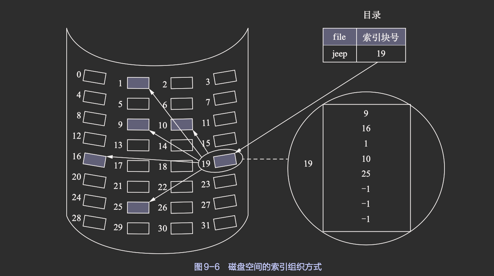

### 单级索引组织方式

1. 优点

- 索引组织方式的主要优点是支持直接访问
    当要读文件的第i个盘块时，可以方便地直接从该文件的索引块中找到第i个盘块的盘块号
- 此外，索引组织方式也不会产生外部碎片。
- 当文件较大时，索引组织方式无疑要优于链接组织方式。

2. 缺点

每当建立一个索引文件时，都须为该文件分配一个索引块，并将分配给该文件的所有盘块号记录于其中。

在每个索引块中可存放数百个盘块号。但对于中、小型文件，其本身通常只占数十个到数个盘块，甚至更少，此时该方式仍会为之分配一个索引块。

可见，针对中、小型文件，当采用索引组织方式时，索引块的利用率将会很低

### 多级索引组织方式

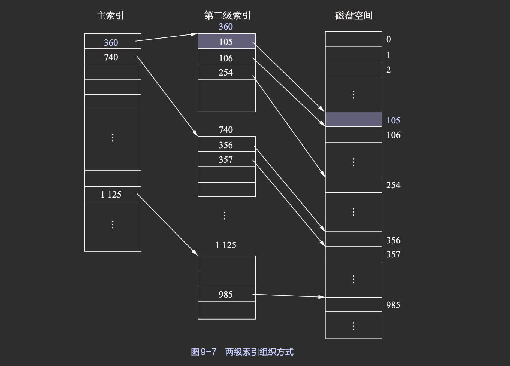

1. 优点

大大加快了系统对大型文件的查找速度

2. 缺点

系统在访问一个盘块时，所须启动磁盘的次数会随着索引级数的增加而增多，即使对于小文件也是如此

实际情况通常是以中、小文件居多，而大文件较少。因此，如果在文件系统中仅采用多级索引组织方式，则并不能获得理想的效果。

### 增量式索引组织方式

1. 基本思想

所谓增量式索引组织方式(混合索引组织方式)，既采用了直接寻址方式，又采用了单级和多级索引组织方式（间接寻址方式）。
> UNIX系统中所采用的就是这种组织方式

如果盘块的大小为1KB或4KB
- 对于小文件（如大小为1KB～10KB或4KB～40KB）

    小文件最多只会占用10个盘块，为了能提高对数量众多的小型作业的访问速度，将它们的每个盘块地址都直接放入FCB（或索引节点）中，可直接从索引节点中获得该文件的盘块地址，称为“直接寻址”

- 中型文件（如大小为11KB～256KB或5KB～4MB）

    采用单级索引组织方式，此时为了获得该文件的盘块地址，只须从索引节点中找到该文件的索引表，即可从中获得该文件的盘块地址，可将该地址称为“一次间址”。

- 大型和特大型文件
    
    采用两级和三级索引组织方式，此时可将所获得的文件的盘块地址称为“二次间址”和“三次间址”。

2. UNIX System V 组织方式

在UNIX System V的索引节点中，设有13个地址项，即i.addr(0)～i.addr(12)

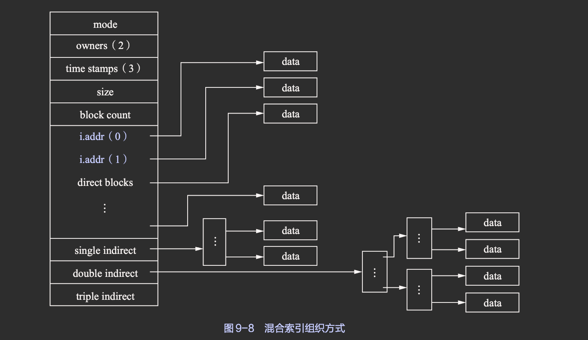

- 直接地址

为了提高进程对文件的检索速度，在索引节点中可设置10个直接地址项

即用i.addr(0)～i.addr(9)来存放直接地址，在这10个直接地址项中所存放的都是该文件数据所在盘块的盘块号或盘块地址

- 一次间接寻址

对于大、中型文件，只采用直接地址是不现实的。

为此，可利用索引节点中的地址项i.addr(10)来提供一次间接地址。

这种方式的实质就是一级索引组织方式

在一次间接地址块中可存放1K个盘块号，因而允许文件长达4MB

- 多次间接寻址

当文件长度大于4MB+40KB时，使用一次间接地址与10个直接地址项仍不足，系统还须采用二次间接地址，即用地址项i.addr(11)提供二次间接地址

该方式的实质是两级索引组织方式。系统此时是在二次间接地址块中记入所有一次间接地址块的盘块号

在采用两级索引组织方式时，文件的最大长度可达4GB

同理，地址项i.addr(12)作为三次间接地址，所允许的文件最大长度可达4TB

# 文件存储空间的管理

## 空闲区表法和空闲链表法

### 空闲区表法

1. 空闲区表

空闲区表法属于连续组织方式，它与内存的动态分配方式类似，会为每个文件分配一块连续的存储空间。

此外，系统也会为外存上的所有空闲区建立一张空闲表，每个空闲区对应一个空闲表项，其中包括
- 表项序号
- 该空闲区的第一空闲盘块号
- 该空闲区的空闲盘块数等信息

将所有空闲区按它们的起始盘块号递增的次序排列，即可形成空闲盘块表

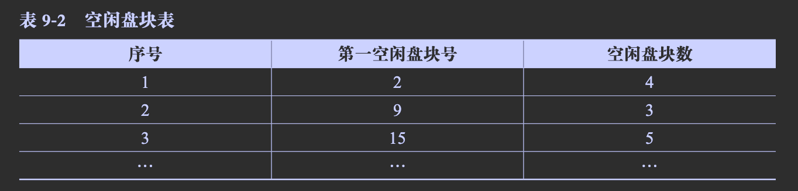

2. 存储空间的分配与回收

空闲区的分配与内存分区的动态分配方式类似，同样是采用首次适应算法和最佳适应算法等，它们对存储空间的利用率大体相当，都优于最坏适应算法。

在系统为某新创建的文件分配空闲盘块时
- 先顺序地检索空闲表的各表项，直至找到第一个大小能满足要求的空闲区
- 然后将该空闲区分配给用户（进程）
- 同时修改空闲盘块表

系统在对用户所释放的存储空间进行回收时，也采取了类似于内存回收的方法
- 即要考虑回收区是否与空闲盘块表中插入点的前区和后区相邻接
- 对相邻接者应予以合并

需要说明的是，在内存分配上，虽然较少采用连续组织方式，但在外存的管理中，由于这种组织方式具有较高的分配速度，可减少访问磁盘的I/O频率，因此其在诸多组织方式中仍占有一席之地。

例如
- 在前面所介绍的对换方式中，对换空间一般都采用连续组织方式
- 对于文件系统，当文件较小（占1～4个盘块）时，仍采用连续组织方式为文件分配相邻接的几个盘块；当文件较大时，便采用离散组织方式
- 对于多媒体文件，为了能减少磁头的寻道时间，也应采用连续组织方式

### 空闲链表法

空闲链表法是将所有空闲盘区拉成一条空闲链

根据构成空闲链所用的基本元素的不同，可把链表分成两种形式

1. 空闲盘块链

将磁盘上的所有空闲空间以盘块为单位拉成一条链，其中的每个盘块都有指向后继盘块的指针。

- 创建文件

    当用户因创建文件而请求分配存储空间时，系统便从链首开始，依次摘下适当数目的空闲盘块分配给用户

- 删除文件
    当用户因删除文件而释放存储空间时，系统便将回收的盘块依次挂在空闲盘块链的末尾

- 评价

这种方法的优点是用于分配和回收一个盘块的过程非常简单；但在为一个文件分配盘块时，可能要重复操作多次，分配和回收的效率较低

此外，因为它是以盘块为单位的，所以相应的空闲盘块链会很长。

2. 空闲盘区链

将磁盘上的所有空闲盘区（每个盘区可包含若干个盘块）拉成一条链。在每个盘区上除了含有用于指示下一个空闲盘区的指针外，还应含有能指明本盘区大小（所含盘块数）的信息。

- 分配盘区

分配盘区的方法与内存分区的动态分配方法类似，通常采用首次适应算法

在采用首次适应算法时，为了提高对空闲盘区的检索速度，可以采用显式链接组织方式，即在内存中为空闲盘区建立一张链表。

- 回收盘区

在回收盘区时，同样也要将回收区与相邻接的空闲盘区合并。

- 评价

这种方法的优缺点刚好与空闲链表法的优缺点相反，即分配与回收的过程比较复杂，但分配与回收的效率较高，每次会为文件分配多个连续的盘块，且空闲盘区链较短。

## 位图示意法

1. 位示图

位示图是指利用二进制的一位来表示磁盘中一个盘块的使用情况，在这里
- 值为“0”时，表示对应的盘块空闲
- 值为“1”时，表示对应的盘块已被分配。

磁盘上的所有盘块都有一个二进制位与之对应，这样，由所有盘块所对应的位构成的一个集合，称为位示图

通常可用m×n个位来构成位示图，并使m×n等于磁盘的总块数。位示图也可被描述为一个二维数组map\[i, j]。

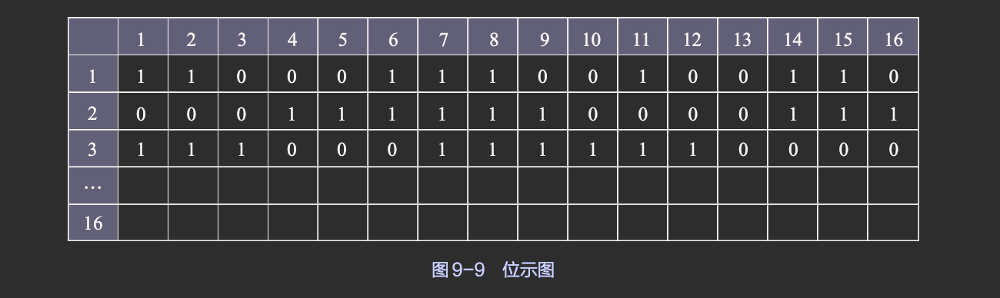

2. 盘块的分配

- 顺序扫描位示图，从中找出一个或一组值为“0”的二进制位（“0”表示空闲）

- 将所找到的一个或一组二进制位转换成与之相对应的盘块号。假定找到值为“0”的二进制位处在位示图的第i行、第j列，则其对应的盘块号应按下式进行计算
$$b=n×(i-1)+j$$
，式中，n表示每行的位数。

- 修改位示图，令map\[i, j]=1。

3. 盘块的回收

- 将回收盘块的盘块号转换成位示图中的行号和列号，转换公式为：
$$i = ( b - 1 ) DIV ( n + 1 )$$
$$j = ( b - 1 ) MOD ( n + 1 )$$

- 修改位示图，令map\[i,j]=0

4. 评价

位示图法的主要优点是，从位示图中很容易找到一个或一组相邻接的空闲盘块

此外，由于位示图很小，占用空间少，因此可将它保存在内存中，这使得在每次进行盘块分配时无须首先把空闲盘块表读入内存，从而节省了许多磁盘启动操作

因此，位示图常用于微机和小型计算机（如CP/M、Apple-DOS等）中。

## 成组链接法

空闲区表法和空闲链表法都不适用于大型文件系统，因为此类系统会使空闲区表或空闲链表太长。

在UNIX系统中采用的是成组链接法，这是将上述两种方法相结合而形成的一种空闲盘块管理方法，它兼备上述两种方法的优点而克服了两种方法均有的“表太长”这一缺点。

1. 空闲盘块的组织实现

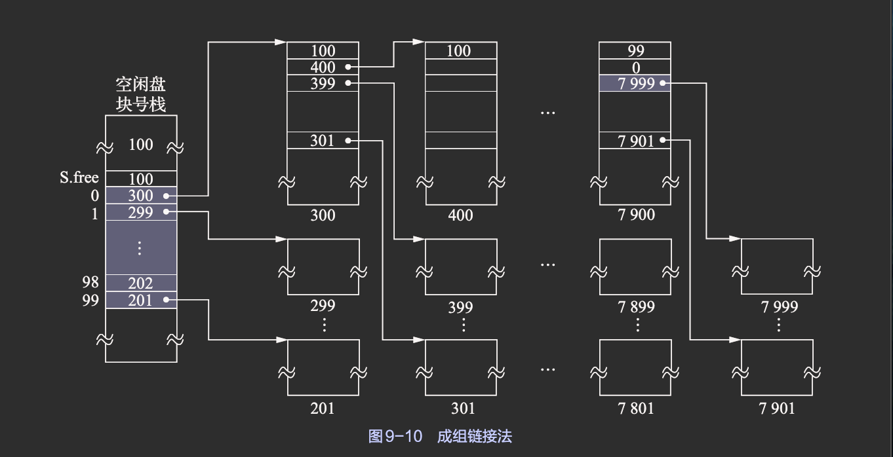

- 空闲盘块号栈

    - 用于存放
        - 当前可用的一组空闲盘块的盘块号（最多含100个盘块号）
        - 以及栈中尚有的空闲盘块（号）数N，N还兼作栈顶指针用
   - 由于栈是临界资源，故系统为栈设置了一把锁

- 文件区中的所有空闲盘块被分成若干个组

- 将每组含有的盘块总数N和该组所有的盘块号记入其前一组的第一个盘块中，这样，由各组的第一个盘块可链接成一条链

- 将第一组的盘块总数和所有的盘块号记入空闲盘块号栈中，作为当前可供分配的空闲盘块号。

- 最末一组只有99个盘块，其盘块号分别记入其前一组的S.free(1)～S.free(99)中，而在S.free(0)中则存放“0”，作为空闲盘块链的结束标志

2. 空闲盘块的分配

当系统要为用户分配文件所需的盘块时，须调用盘块分配过程来完成。该过程
- 首先会检查空闲盘块号栈是否上锁
- 若未上锁，则从栈顶取出一空闲盘块号，并将与之对应的盘块分配给用户
- 其次，将栈顶指针下移一格
- 若该盘块号已是栈底，即S.free(0)，这是当前栈中最后一个可分配的盘块号，则由于在该盘块号所对应的盘块中记有下一组可用的盘块号，因此须调用磁盘读过程，将栈底盘块号所对应盘块的内容读入栈中，作为新的盘块号栈的内容，并把原栈底对应的盘块分配出去（其中有用的数据已读入栈中）。再次，分配一个相应的缓冲区，作为该盘块的缓冲区
- 最后，把栈中的空闲盘块数减1并返回

2. 磁盘回收

在系统回收空闲盘块时，须调用盘块回收过程
- 将回收盘块的盘块号记入空闲盘块号栈的顶部，并执行空闲盘块数加1操作
- 当栈中的空闲盘块号数目已达100时，表示栈已满
- 将现有栈中的100个空闲盘块号记入新回收的盘块中，并将新回收盘块号作为新栈底

<!-- TODO: 成组链接法：不是很懂 -->

# 提高磁盘I/O速度的途径

采用的最主要的技术便是磁盘高速缓存(disk cache)

## 磁盘告诉缓存

在内存中为磁盘盘块所设置的一个缓冲区，在该缓冲区中保存了某些盘块的副本

当出现一个磁盘访问请求时
- 由内核先去查看所请求的盘块内容是否已在磁盘高速缓存中
- 如果在，则可从磁盘高速缓存中直接获取，这样就省去了启动磁盘的操作，而且可使本次访问速度提高几个数量级
- 如果不在，则需要启动磁盘以将所需要的盘块内容读入，并把读入的盘块内容送到磁盘高速缓存中，以便于以后又需要访问该盘块的内容时直接从磁盘高速缓存中获取

1. 数据交付方式

所谓的数据交付（data delivery），是指将磁盘高速缓存中的数据传送给请求进程

系统可以采取两种方式将数据交付给请求进程: 
- 数据交付
    直接将磁盘高速缓存中的数据传送到请求进程的内存工作区中

- 指针交付
    只将指向磁盘高速缓存中某区域的指针交付给请求进程
    > 后一种方式所传送的数据量少，节省了数据从磁盘高速缓存传递到进程的内存工作区的时间。

2. 置换算法

如同请求调页(段)一样，在将磁盘中的盘块数据读入磁盘高速缓存时，同样会出现因磁盘高速缓存中已装满盘块数据而需要将其中某些盘块的数据先换出的问题。

也存在采用哪种置换算法的问题。较常用的算法仍是
- LRU置换算法
- Clock置换算法
- 最少使用置换算法等

由于请求调页中的联想存储器与磁盘高速缓存（磁盘I/O中）的工作情况不同，现在不少系统在设计其磁盘高速缓存的置换算法时，除了考虑最近最久未使用这一原则外，还会考虑以下几点: 
- 访问频率
    - 每执行一条指令便可能访问一次联想存储器，即对联想存储器的访问频率基本上与指令执行的频率相当
    - 而对磁盘高速缓存的访问频率则与磁盘I/O的频率相当

- 可预见性
    在磁盘高速缓存中的各盘块数据中，哪些数据可能在较长时间内都不会被再次访问或可能很快就会被再次访问，这些信息中会有相当一部分是可预知的

- 数据的一致性
    由于磁盘高速缓存在内存中，而内存又是一种易失性存储器，一旦系统发生故障，存放在磁盘高速缓存中的数据就会丢失；而其中有些盘块（如索引节点盘块）中的数据已被修改但尚未拷回磁盘。因此，系统发生故障可能会造成数据不一致

基于上述考虑，在有的系统中便将磁盘高速缓存中的所有盘块数据拉成了一条LRU链
- 对于那些会严重影响数据一致性的盘块数据和很久都可能不再使用的盘块数据，将它们都放在LRU链的头部，使它们能被优先写回磁盘，以减少发生数据不一致情况的概率，同时可以尽早地腾出磁盘高速缓存的空间
- 对于那些可能在不久之后便要再使用的盘块数据，将它们挂在LRU链的尾部，以便在以后需要时，只要该盘块中的数据尚未被写回磁盘，便可直接从LRU链中找到它们。

3. 周期性的写回磁盘

还有一种情况值得注意，即根据LRU置换算法，那些经常要被访问的盘块数据可能会一直保留在磁盘高速缓存中，长期不会被写回磁盘。

这是因为LRU链中的任一元素在被访问之后，都会被挂到链的尾部而不被写回磁盘，只有一直未被访问的元素才有可能移到链的头部而被写回磁盘。

为了解决这一问题，在UNIX系统中专门增设了一个修改(update)程序在后台运行
- 该程序会周期性地调用一个SYNC，其主要功能是强制性地将所有在磁盘高速缓存中已修改的盘块数据写回磁盘。
- 一般会把两次调用SYNC的时间间隔定为30s，这样，系统故障所造成的工作损失就不会超过30s的工作量。

## 提高磁盘I/O速度的其他方法

除了磁盘高速缓存外，还包括

1. 提前读

如果采用顺序访问方式对文件进行访问，则可以预知下一次要读的盘块。

此时可采取预先读的方式，即在读当前块的同时要求将下一个盘块（提前读的盘块）中的数据也读入缓冲区。

当下一次要读该盘块中的数据时，由于其已被提前读入缓冲区，因而此时可直接从缓冲区中取得下一个盘块的数据，而无须再去启动磁盘I/O

2. 延迟写

延迟写是指缓冲区A中的数据本应立即写回磁盘，但考虑到该缓冲区中的数据可能会在不久之后再次被本进程或其他进程访问（共享资源），因而并不会立即将该缓冲区A中的数据写回磁盘，而是会将它挂在空闲缓冲区队列的末尾。

随着空闲缓冲区的使用，缓冲区也会缓缓往前移动，直至移到空闲缓冲队列之首。当再有进程申请到该缓冲区时，就将该缓冲区中的数据写回磁盘，同时把该缓冲区作为空闲缓冲区分配出去。

只要该缓冲区仍在队列中，任何访问该缓冲区中的数据的进程就都可以直接读出其中的数据而不必访问磁盘

3. 优化物理块的分配

在采用链接组织方式和索引组织方式时，可以将一个文件分散存储在磁盘的任意位置，但如果过于分散，则会增加磁头的移动距离

如果统一文件的数据块安排在相邻的盘块上，则显然会由于消除了磁头在磁道间的移动而大大提高对这两个盘块的访问速度

4. 虚拟盘

由于访问内存的速度远高于访问磁盘的速度，于是有人试图利用内存空间去仿真磁盘，进而形成所谓的虚拟盘，又称为RAM盘。

该盘的设备驱动程序可以接受所有标准的磁盘操作，但这些操作的执行不是在磁盘上而是在内存中进行。

> 它们对用户而言都是透明的。换言之，用户不会发现这与真正的磁盘操作有何不同，仅是略微快了些而已。

虚拟盘存在的主要问题是：它是易失性存储器，一旦系统或电源发生故障，或系统重启，原来保存在虚拟盘中的数据就会丢失。

因此，虚拟盘通常用于存放临时文件，如编译程序所产生的目标程序等。

虚拟盘与磁盘高速缓存的主要区别在于：
- 虚拟盘中的内容完全由用户控制
- 磁盘高速缓存中的内容则是由OS控制的

## 廉价磁盘冗余阵列

廉价磁盘冗余阵列（redundant array of inexpensive disk，RAID）

RAID利用一台磁盘阵列控制器来统一管理和控制一组（几台到几十台）磁盘驱动器，进而组成一个大型磁盘系统

RAID
- 不仅大幅度增加了磁盘的容量
- 而且极大地提高了磁盘的I/O速度和整个磁盘系统的可靠性。

### 并行交叉存取

把在大、中型计算机中用于提高访问内存速度的并行交叉存取技术应用到磁盘存储系统中，可以提高磁盘的I/O速度。

在这样的系统中，有多台磁盘驱动器
- 系统将每一盘块中的数据分为若干个子盘块数据
- 再把每一子盘块的数据分别存储到不同磁盘中的相同位置上

以后，当要将一个盘块的数据传送到内存时
- 采取并行传输方式
- 将各个盘块中的子盘块数据同时向内存中传输，从而使传输时间大大减少

### RAID的分级

1. RAID0级

该级仅提供并行交叉存取功能
- 优点是能够实现高效传输，并能实现高速I/O请求
- 缺点是无冗余校验功能，致使磁盘系统的可靠性并不是很高

2. RAID1级

该级具有磁盘镜像功能，在每次访问磁盘时，可利用并行读/写特性将数据分块同时写入数据盘和镜像盘
- 优点是可靠性好，且从故障中恢复很简单
- 主要缺点是磁盘容量的利用率只有50%(一半做数据盘，一半做镜像盘)

3. RAID2级

该级也称为内存方式的差错纠正组织

内存系统长期以来实现了基于奇偶位的错误检测，内存中的每个字节都是一个关联的奇偶位，以记录字节中为1的个数是偶数还是奇数

4. RAID3级

该级所对应的RAID是具有并行传输功能的磁盘阵列  
它只利用一个奇偶校验盘来实现数据的校验功能

5. RAID4级

该级与块交错奇偶校验结构均采用块级分条，这与RAID0级一样；

此外，该级会在一个单独的磁盘上保存其他N个磁盘的块的奇偶校验块。如果有一个磁盘出现故障，则可以通过奇偶校验块和其他磁盘的相应块恢复故障磁盘的块

6. RAID 5级

该级所对应的RAID是具有独立传送功能的磁盘阵列。每个驱动器都有各自独立的数据通路，独立地进行读/写，且无专门的校验盘。

用来进行纠错的校验信息是以螺旋（spiral）方式散布在所有数据盘上的

7. RAID6级和RAID7级

这两级是强化后的RAID

在RAID 6级的磁盘阵列中，设置了一个专用的、可快速访问的异步校验盘，该盘具有独立的数据通路，具有比RAID 3级与RAID5级更好的性能，但其性能改进得很有限且代价较大。

RAID 7级是对RAID 6级的改进，在该级的磁盘阵列中，所有磁盘都具有较高的传输速率和优异的性能。

RAID 7级是目前最高档次的磁盘阵列，但其价格较高

### RAID的优点

1. 可靠性高

除了RAID 0级外，其余各级都采用了容错技术。当阵列中某一磁盘损坏时，并不会造成数据的丢失；此时可根据其他未损坏磁盘中的数据来恢复已损坏磁盘中的数据。因此，其可靠性比单个磁盘高出一个数量级。

2. 磁盘I/O速度快

由于采取了并行交叉存取方式，磁盘I/O速度提高了N-1倍。

3. 性价比（性能/价格）高

RAID的体积与具有相同容量和速度的大型磁盘系统相比，只是后者的1/3，价格也只是后者的1/3，且可靠性高。换言之，它仅以牺牲1/N的容量为代价换取了高可靠性。

# 提高磁盘可靠性的技术

容错技术是通过在系统中设置冗余部件来提高系统可靠性的一种技术。

磁盘容错技术则是通过增加冗余的磁盘驱动器、磁盘控制器等方法来提高磁盘系统可靠性的一种技术，即当磁盘系统的某部分出现缺陷或故障时，磁盘仍能正常工作，且不致造成数据的丢失或错误。

目前广泛采用磁盘容错技术来改善磁盘系统的可靠性。磁盘容错技术可分成三个级别
- 第一级容错技术是指低级磁盘容错技术
- 第二级容错技术是指中级磁盘容错技术
- 第三级容错技术是指基于集群系统的容错技术，该技术也被人们称为系统容错（system fault tolerant，SFT）技术。

## 第一级容错技术

主要用于防止因磁盘表面缺陷所造成的数据丢失。

1. 双份目录和双份FAT

在磁盘上存放的文件目录和FAT，是管理文件时所用的重要数据结构。

为了防止这些表格被破坏，可以在不同的磁盘上或磁盘的不同区域中分别建立（双份）文件目录和FAT
- 其中一份为主文件目录及主FAT
- 另一份为备份文件目录及备份FAT

一旦由于磁盘表面缺陷而造成主文件目录或主FAT损坏，系统便会自动启用备份文件目录或备份FAT，从而可以保证磁盘上的数据仍可访问

2. 热修复重定向和写后读校验

当磁盘表面有少量缺陷时，可在采取某种补救措施后继续使用。一般主要可以采取以下两种补救措施。
- 热修复重定向
    系统将磁盘容量的很小一部分（如2%～3%）作为热修复重定向区
    - 存放发现磁盘有缺陷时的待写数据
    - 并对写入该区的所有数据进行登记，以便今后对这些数据进行快速访问

- 写后读校验
    为保证写入磁盘的所有数据都能写到完好的盘块中
    - 应该在每次向磁盘中写入一个数据块后立即将它读出来，并送至另一缓冲区中
    - 再将该缓冲区的内容与内存缓冲区中写后仍保留的数据进行比较
    - 若两者一致，则认为此次写入成功
    - 否则重写。若重写后两者仍不一致，则认为该盘块有缺陷，此时便将应写入该盘块的数据写入热修复重定向区。

## 第二级容错技术

主要用于防止系统因磁盘驱动器和磁盘控制器故障而无法正常工作这一情况的发生

1. 磁盘镜像

为了避免因磁盘驱动器发生故障而丢失数据，系统增设了磁盘镜像（disk mirroring）功能。

为了实现该功能，须在同一磁盘控制器下增设一个完全相同的磁盘驱动器

当采用磁盘镜像方式时
- 在每次向主磁盘写入数据后，都需要将数据再写到备份磁盘上
- 以使两个磁盘上具有完全相同的位像图

把备份磁盘看作主磁盘的一面镜子。当主磁盘驱动器发生故障时，由于有备份磁盘的存在，在进行切换后，主机仍能正常工作。

磁盘镜像虽然实现了容错功能，却使磁盘的利用率降至原来的50%，也未能使服务器的磁盘I/O速度得到提高。

2. 磁盘双工

将两台磁盘驱动器分别接到两个磁盘控制器上，同样使这两个磁盘控制器镜像成对，防止磁盘镜像情况下唯一的通道或磁盘控制器发生故障

### 基于集群系统的容错技术

所谓集群，是指由一组互连的自主计算机组成统一的计算机系统，给人们的感觉是，它们是一台机器

1. 双机热备份模式

在具有双机热备份模式的系统中，备有两台服务器
- 两者的处理能力通常是完全相同的
- 一台作为主服务器，另一台作为备份服务器

平时
- 主服务器运行，备份服务器则时刻监视着主服务器的运行情况
- 一旦主服务器出现故障，备份服务器便立即接替主服务器的工作而成为系统中新的主服务器
- 修复后的原来的主服务器此时会被作为备份服务器。

为使这两台服务器之间能保持镜像关系，应在这两台服务器上各装入一块网卡，并通过一条镜像服务器链路（mirrored server link，MSL）将两台服务器连接起来。

两台服务器之间保持一定的距离，其所允许的最长距离取决于所配置的网卡和传输介质。

此外，还必须在系统中设置某种机制以检测主服务器中数据的改变
- 一旦该机制检测到主服务器中有数据变化
- 便立即通过通信系统将修改后的数据传送到备份服务器的相应数据文件中

为了保证在两台服务器之间通信的高速性和安全性，通常会选用高速通信信道并设置备份线路

在双机热备份模式下，一旦主服务器发生故障
- 系统能自动将主要业务的用户切换到备份服务器上
- 为保证切换时间足够快（通常为数分钟），要求在系统中配置用于切换硬件的开关设备
- 在备份服务器上事先建立好通信配置，并使其能迅速处理客户机的重新登录等事宜

双机热备份模式是早期使用的一种集群技术
- 它的最大优点是提高了系统的可用性，易于实现，而且主服务器与备份服务器完全独立，可支持远程热备份，从而能消除由于火灾、爆炸等非计算机因素所造成的隐患
- 其主要缺点是备份服务器处于被动等待状态，整个系统的使用效率只有50%。

2. 双机互为备份模式

在双机互为备份模式中，两台服务器在平时均为在线服务器（如一台作为数据库服务器，另一台作为电子邮件服务器），它们各自完成自己的任务。

为了实现两者互为备份的功能，应通过某种专线将两台服务器连接起来。

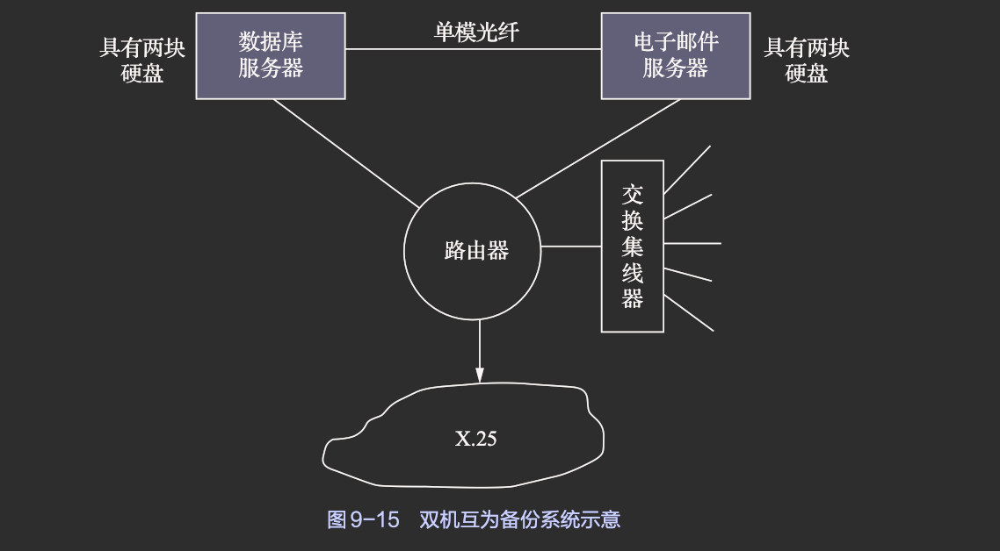

在双机互为备份模式中，最好在每台服务器内都配置两块硬盘
- 一块用于装载系统程序/应用程序
- 另一块用于接收由另一台服务器发来的备份数据，即作为另一台服务器的镜像盘

如果仅有一块硬盘，则可通过建立虚拟盘的方式或分区方式
- 分别存放系统程序/应用程序
- 另一台服务器发来的备份数据。
> 在正常运行时，镜像盘对本地用户是锁死的

当通过专线链接检查到某台服务器发生故障后
- 再通过路由器去验证这台服务器是否真的发生了故障
- 如果故障被证实，则由正常服务器向故障服务器的客户机发出广播信息，表明要进行切换
- 在切换成功后，客户机无须重新登录便可继续使用网络提供的服务并访问服务器上的数据
- 对于连接在非故障服务器上的客户机，此时它们只会感到网络服务速度稍有减慢，而不会有其他的感觉
- 当故障服务器修复并重新联网后，已被迁移到无故障服务器上的服务功能将返回到修复后的服务器上

双机互为备份模式的优点是两台服务器都可用于处理任务，因而系统效率较高。现在已将这种模式从两台服务器增加到4台、8台、16台甚至更多。系统中的所有服务器都可用于处理任务，而当其中一台发生故障时，系统可指定另一台服务器来接替它的工作。

3. 公用磁盘模式

为了减少信息复制的开销，可以将多台计算机连接到一个公用磁盘上。该公用磁盘被划分为若干个卷，每台计算机使用一个卷

如果某台计算机发生故障
- 则系统将重新进行配置，即根据某种调度策略来选择另一台机器进行替代
- 后者对发生故障的机器的卷拥有所有权，从而可接替故障计算机来承担其任务

这种模式的优点是消除了信息的复制时间，从而减少了网络和服务器的开销。

## 后备系统

在一个完整的系统中必须配置后备系统
- 这一方面是因为磁盘系统不够大
    不可能将系统在运行过程中产生的所有数据都装在磁盘中，应当把暂时不需要但仍然有用的数据存放在后备系统中并保存起来

- 另一方面是为了防止系统发生故障或被计算机病毒感染
    进而将系统中的数据弄错或丢失，同时也可以将比较重要的数据存放在后备系统中

1. 磁带机

磁带机是最早作为计算机系统外部存储器的设备，但由于它只适合存储顺序文件，故现在主要把它作为后备设备。

- 主要优点
    容量大，价格便宜，故在许多大、中型系统中都配置了磁带机。

- 缺点
    只能顺序存取且速度比较慢（一般为数百KB每秒到数MB每秒）

2. 硬盘

- 移动硬盘

小型系统和个人计算机常将移动磁盘作为后备系统

其最大的优点是速度快，脱机保存方便，且保存时间较长，可比磁带机长出3～5年，但单位容量的费用较高

- 固定硬盘驱动器

在大、中型系统中可使用大容量硬盘兼作后备系统，为此需要在一个系统中配置两个大容量硬盘。每个硬盘都被划分为两个分区
- 一个为数据区
- 另一个为备份区

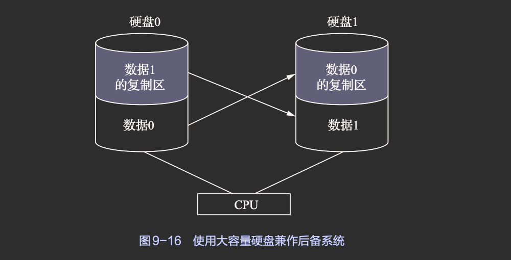

可在每天晚上将硬盘0中的“数据0”复制到硬盘1中的复制区中进行保存；同样也将硬盘1中的“数据1”复制到硬盘0中的复制区中进行保存

这种后备系统，不仅复制速度非常快，而且还具有容错功能，即当其中任何一个硬盘驱动器发生故障时，都不会引起系统瘫痪。

3. 光盘驱动器

- 只读光盘驱动器: 只能读不能写，难以用作后备设备
- 可读写光盘驱动器: 既能读又能写，可用作后备设备，存储数字信息

# 存储新技术

## 传统存储系统

1. 直连式存储

直连式存储（direct attached storage，DAS）
- 通过总线适配器直接将硬盘等存储介质连接到主机上的存储方式
- 在存储设备和主机之间通常没有任何网络设备的参与。

2. 网络附加存储

网络附加存储（network attached storage，NAS）
- 提供文件级别访问接口的网络存储系统架构，通常采用NFS、SMB/CIFS等网络文件共享协议进行文件存取
- 可以直接连接在计算机网络上，对不同类型OS的使用者提供集中式资料存取服务

NAS支持多客户端同时访问，为服务器提供了大容量的集中式存储，从而方便了服务器间的数据共享

使用者可以通过某种方式（如Linux系统中的mount命令）将存储服务挂载到本地进行访问，在本地呈现的就是一个文件目录树

NAS的缺点是：由于存储数据通过普通数据网络进行传输，会消耗数据网络的带宽，从而会加重网络通信的延迟，这对于大型客户机-服务器环境可能影响较大

3. 存储区域网络

存储区域网络（storage area network，SAN）
- 通过光纤交换机等高速网络设备在服务器和磁盘阵列等存储设备间搭设专门的存储网络，从而提供高性能存储系统的架构

SAN的优势在于灵活性，多个主机和多个存储阵列（磁盘阵列）可以连接到同一个SAN上，存储任务可以被动态地分配到各个主机上

SAN与NAS的区别在于，SAN提供块级别的访问接口，一般不会同时提供一个文件系统级别的访问接口。通常情况下，服务器需要通过SCSI等I/O总线架构将SAN映射到本地磁盘，然后在其上创建文件系统后进行使用。目前，主流的企业级NAS或SAN存储产品一般都可以提供TB级的存储容量，高端的存储产品甚至可以提供高达几个PB（1PB=1024TB）的存储容量。

## 新型存储系统

1. 分布式存储系统

分布式存储系统多采用普通的硬件设备作为基础设施，因此，单位容量的存储成本得以大大降低

另外，分布式存储系统在性能、维护性和容灾性等方面，相比传统存储系统也具有不同程度的优势

分布式存储系统需要解决的关键技术问题包括可扩展性、数据冗余、数据一致性、全局命名空间缓存等

根据系统架构的不同，大体上可将分布式存储系统架构分为两种
- C/S(client/server)架构
- P2P((peer-to-peer)架构
> 也有一些分布式存储系统中会同时存在这两种架构

分布式存储系统面临的一个共性问题是
- 如何组织和管理成员节点
- 如何建立数据与节点之间的映射关系

成员节点的动态增加或者删除，在分布式存储系统中基本上可以算是一种常态

2. 云存储系统

云存储系统是由第三方运营商提供的在线存储系统

云存储系统的运营商负责数据中心的部署、运营和维护等工作，其会将数据存储包装成服务的形式提供给用户

云存储系统作为云计算的延伸和重要组件之一，为云计算的实现提供了“按需分配、按量计费”的数据存储服务，因此，云存储系统的用户
- 不需要搭建自己的数据中心和基础架构
- 也不需要关心低层存储系统的管理与维护等工作
- 同时还可以根据业务需求动态地扩大或减少自己对存储容量的需求。

## 硬盘存储新技术

1. 机械硬盘技术革新

从1956年发明第一个机械硬盘开始，从5MB发展到现在的20TB，容量大幅增加，读/写速度也逐步提升

2. 固态硬盘

固态硬盘是用固态电子存储芯片阵列所制成的硬盘

- 固态硬盘在接口的规范与定义、功能以及使用方法上与普通硬盘完全相同，在产品的外形和尺寸上也基本与普通硬盘一致
- 但是，新兴的U.2、M.2等接口形式的固态硬盘，它们的尺寸与外形与SATA架构的机械硬盘完全不同

根据存储介质的不同，可讲固态硬盘分为一下三类

- 基于闪存的固态硬盘

将Flash芯片作为存储介质，此类固态硬盘即通常所说的固态硬盘

此类固态硬盘最大的优点是可以移动，而且数据保护不受电源控制，能适应各种环境，适合个人用户使用

此类固态硬盘的使用寿命根据不同的闪存介质而有所不同，可靠性很高，高品质的家用固态硬盘的故障率可轻松保持在普通家用机械硬盘故障率的十分之一甚至更低。

- 基于DRAM的固态硬盘

基于DRAM的固态硬盘将DRAM作为存储介质，应用范围较窄

此类固态硬盘效仿了机械硬盘的设计，因此可被绝大部分OS的文件系统工具进行卷设置和卷管理，并能提供外设互连（peripheral component interconnect，PCI）标准接口和FC标准接口用于连接主机或服务器，应用方式可分为固态硬盘和固态硬盘阵列两种

此类固态硬盘是一种高性能的存储器，理论上可以无限写入，缺点是需要独立电源来保护数据安全，属于非主流存储设备

- 基于XPoint类的固态硬盘

基于XPoint类的固态硬盘在原理上接近基于DRAM的固态硬盘，但其属于非易失性存储器，读取时延极低，可轻松达到现有固态硬盘的百分之一，并且有接近无限的存储寿命。

其缺点是密度相对于基于闪存的固态硬盘较低，成本极高，因此多用于发烧级台式计算机和数据中心。

# 数据一致性控制

数据一致性问题，是指保存在多个文件中的同一个数据，在任何情况下都必须保证相同。

## 事务

### 事务的定义

事务是用于访问和修改各种数据项的一个程序单位，事务也可被看作一系列读/写操作。

被访问的数据可以分散地存放在同一文件的不同记录中，也可以存放在多个文件中。

- 只有对分布在不同位置的同一数据进行的读/写操作（含修改）全部完成时，才能通过托付操作（commitoperation）来终止事务
- 只要有一个读/写操作失败，便须执行夭折操作（abort operation）。

一个被“夭折”的事务，通常已执行了一些操作，因而可能已对某些数据做了修改。为了使“夭折”的事务不会引起数据的不一致性，须将该事务内刚被修改的数据项恢复成原来的情况，以使系统中各数据项与该事务未执行时系统中各数据项的内容完全相同。此时，可以说该事务“已被退回”（rolled back）。

不难看出，一个事务在对一批数据执行修改操作时，要么全部完成并用修改后的数据代替原来的数据，要么一个也不修改。事务操作所具有的这种特性，就是本书第1章中曾讲过的“原子性”。

### 事务记录

为了实现上述“原子性”修改，通常须借助于称为“事务记录”（transaction record）的数据结构。

这些数据结构被放在一个非常可靠的存储器（又称为稳定存储器）中，用于记录在事务运行过程中与数据项修改相关的全部信息，这些信息又被称为“运行记录”（log）。

该记录中包含下列字段
- 事务名：用于标志该事务的唯一名字
- 数据项名：它是被修改数据项的唯一名字
- 旧值：修改前数据项的值
- 新值：修改后数据项将具有的值。

在事务记录表中的每一项记录，都描述了在事务运行过程中的重要事务操作，如修改操作、开始操作、托付操作、夭折操作等
- 在一个事务Ti开始执行时，〈Ti开始〉记录被写入事务记录表中；
- 在Ti执行期间，在Ti的任何写（修改）操作之前，均须先在事务记录表中写一项适当的新记录；
- 当Ti进行托付时，要把一个〈Ti托付〉记录写入事务记录表中。

### 恢复算法

恢复算法存在两个过程
- undo〈Ti〉：该过程把所有被事务Ti修改过的数据恢复为修改前的值。
- redo〈Ti〉：该过程把所有被事务Ti修改过的数据设置为新值。

如果系统发生故障，系统应对以前所发生的事务进行清理。通过查找事务记录表，可以把尚未清理的事务分成两类
- 一类是所包含的各类操作都已完成的事务
    在事务记录表中既包含了〈Ti开始〉记录，又包含了〈Ti托付〉记录，可确定位该类事务，系统会利用redo〈Ti〉过程把所有已被修改的数据设置成新值

- 另一类是所包含的各个操作并未全部完成的事务
    如果在事务记录表中只有〈Ti开始〉记录而无〈Ti托付〉记录，则此Ti便属于此类事务，这时，系统会利用undo〈Ti〉过程将所有已被修改的数据恢复为修改前的值。

## 检查点

1. 作用

引入检查点（check points）的主要目的是，使事务记录表中事务记录的清理工作经常化，即每隔一定的时间就做一次下述工作
- 首先，将驻留在易失性存储器（内存）中的当前事务记录表中的所有记录输出到稳定存储器中
- 其次，将驻留在易失性存储器中的所有已修改数据输出到稳定存储器中
- 再次，将事务记录表中的〈检查点〉记录输出到稳定存储器中
- 最后，每当出现一个〈检查点〉记录，系统便执行一次的恢复操作，即利用redo〈Ti〉和undo〈Ti〉过程实现数据恢复
<!-- TODO: 最后一点是为什么 -->

如果一个事务Ti在检查点前就做了托付，则在事务记录表中便会出现一个在检查点记录前的〈Ti托付〉记录。在这种情况下，所有被Ti修改过的数据，都会在检查点前写入稳定存储器，或者是作为检查点记录自身的一部分写入稳定存储器。因此，以后在系统出现故障时，就不必再执行redo〈Ti〉过程了。
> 即检查点之前的已交付的操作已经存入磁盘

2. 添加检查点后的恢复算法

在引入检查点后，大大减少了恢复处理的开销。因为在发生故障后，并不需要对事务记录 表中的所有事务记录都进行处理，而只需要对最后一个检查点之后的事务记录进行处理。

具体而言
- 恢复例程首先会查找事务记录表，确定最近检查点以前开始执行的最后事务Ti
- 在找到这样的事务后，返回去搜索事务记录表，此时便可找到第一个检查点记录
- 恢复例程从该检查点开始，返回搜索各个事务的记录，并利用redo〈Ti〉和undo〈Ti〉过程对它们进行处理
- 如果把所有在事务Ti以后开始执行的事务表示为事务集T，则新的恢复操作要求：
- 对所有在T中的事务Tk，如果在事务记录表中出现了〈Tk托付〉记录，则执行redo〈Tk〉过程
- 如果在事务记录表中并未出现〈Tk托付〉记录，则执行undo〈Tk〉过程。

## 并发控制

由于事务具有原子性，这使各个事务必然会按某种次序依次执行，只有在一个事务执行完后，才允许另一事务执行，即各事务对数据项的修改是互斥的。我们把这种特性称为顺序性，而把用于实现事务顺序性的技术称为并发控制（concurrent control）。

1. 利用互斥锁实现顺序性

在利用互斥锁实现顺序性时，应为每个共享对象设置一把互斥锁。当某一事务Ti要去访问某个对象时
- 应先获得该对象的互斥锁
- 若成功，则用该锁将该对象锁住，此时事务Ti便可对该对象执行读/写操作，而其他事务由于未获得该锁，故不能访问该对象
- 如果事务Ti需要对一批对象进行访问，则为了保证事务操作的原子性，Ti应先获得这一批对象的互斥锁，以将这一批对象全部锁住
- 若成功，则可对这一批对象执行读/写操作
- 操作完成后再将所有的这些锁释放
- 但如果这一批对象中的某个对象已被其他事务锁住，则此时事务Ti应对此前已被Ti锁住的其他对象进行开锁，宣布此次事务运行失败，但这不会引起数据变化。

2. 利用互斥锁和共享锁实现顺序性

利用互斥锁存在着效率不高的问题。因为一个共享文件虽然只允许一个事务去写，但却允许多个事务同时去读；而在利用互斥锁来锁住这个文件后，其就只允许一个事务去读

为了提高运行效率，又引入了另一种形式的锁——共享锁（shared lock）。共享锁与互斥锁的区别在于
- 互斥锁仅允许一个事务对相应的对象执行读/写操作
- 而共享锁则允许多个事务对相应的对象执行读操作，但不允许其中任何一个事务对相应的对象执行写操作

在为一个对象设置了互斥锁和共享锁的情况下
- 如果事务Ti要对对象Q执行读操作，则只须获得对象Q的共享锁
    - 如果对象Q已被互斥锁锁住，则事务Ti必须等待
    - 否则，即可获得共享锁而对Q执行读操作
- 如果Ti要对Q执行写操作，则Ti还须获得Q的互斥锁
- 若失败，则须等待
- 否则，即可获得互斥锁而对Q执行写操作

## 重复数据的一致性问题

为了保证数据的安全性，最常见的做法是把关键文件或数据结构复制多份，分别存储在不同的地方，当主文件（数据结构）失效时，还有备份文件（数据结构）可以使用

显然，主文件（数据结构）中的数据应与各备份文件中的对应数据相一致。此外，有些数据结构（如空闲盘块表等）在系统运行过程中总是会被不断地修改，因此，同样应保证不同处的同一数据结构中（可能已被修改的）数据的一致性。

1. 重复文件的一致性

对于一般的UNIX类型的目录，其每个目录项中均含有
- 一个ASCII的文件名
- 一个索引节点编号，指向一个索引节点

当有重复文件时，一个目录项可由
- 一个文件名
- 若干个索引节点编号组成，每个索引节点编号都会指向各自的索引节点

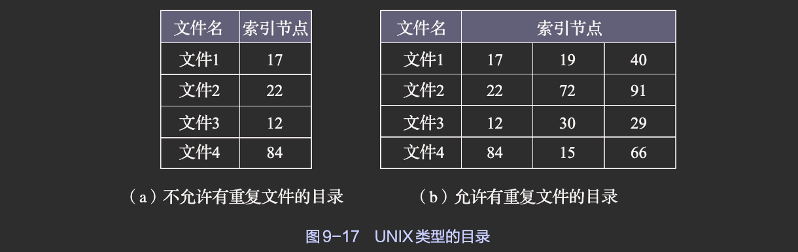

当有重复文件时，如果一个文件复制被修改，则必须同时修改其他几个文件复制，以保证各相应文件中数据的一致性。这可采用两种方法来实现
- 第一种方法
    - 当一个文件被修改后
    - 可查找文件目录以得到其他几个文件复制的索引节点编号
    - 再利用这些索引节点编号找到各文件复制的物理位置
    - 然后对这些文件复制做同样的修改
- 第二种方法
    - 为新修改的文件建立几个文件复制
    - 并用新文件复制去取代原来的文件复制。

2. 链接数一致性检查

在UNIX类型的目录中，每个目录项内都含有一个索引节点编号，用于指向该文件的索引节点

对于一个共享文件
- 其索引节点编号会在目录中出现多次
- 该共享文件的索引节点中还有一个链接计数值count，用于指出共享本文件的用户(进程)数  
在正常情况下，这两个数据应该一致，否则就会出现数据不一致性差错。

为了检查这种数据不一致性差错，需要配置一张计数器表，并且应为每个文件建立一个表项，其中含有各文件索引节点编号的计数值。在进行检查时
- 从根目录开始查找
- 每当在目录中遇到该索引节点编号时，便在该计数器表中相应文件的表项上加1
- 当把所有目录都检查完后，便可将该计数器表中每个表项中的索引节点编号计数值与该文件索引节点中的链接计数值count进行比较
- 如果两者一致，则表示数据正确
- 否则，说明发生了数据不一致性差错

- 如果索引节点中的链接计数值count大于计数器表中相应索引节点编号的计数值
    则即使所有共享此文件的用户都不再使用此文件，其count仍不为0，浪费存储空间
    - 解决方法是用计数器表中正确的计数值去为count重新赋值

- 如果出现count小于计数器表中相应索引节点编号计数值的情况
    假如有两个用户共享一个文件，但是count仍为1，此时只要其中一个用户不再需要此文件，count就会减为0，从而使系统将此文件删除，并释放其索引节点及文件所占用的盘块，这会导致另一个需要共享此文件的用户所对应的目录项指向一个空索引节点，最终会导致该用户无法访问此文件。如果该索引节点很快又被分配给了其他文件，则还会带来潜在危险
    - 解决方法是将count置为正确值。

# 本章小结

磁盘驱动器是大多数计算机系统的主要外存I/O设备，大多数外存设备均为磁盘或磁带

现代磁盘驱动结构是一个大的一维的逻辑盘块数组。一般来说，这些逻辑盘块的大小为512B。

磁盘连接到计算机系统的方式有两种：
- 通过主机的本地I/O接口连接；
- 通过网络连接

磁盘存储器管理的任务之一，是有效利用存储空间
- 即采用合适的文件组织方式为文件分配存储空间
- 以改善存储空间的利用率

而文件组织方式与外存组织方式密切相关，常用的外存组织方式包括
- 连续组织方式
- 链接组织方式
- 索引组织方式

在现代OS中，由于存在多种类型的文件，因此对文件可能会采取多种类型的组织方式。存储空间的管理方法有
- 空闲区表法
- 空闲链表法
- 位示图法
- 成组链接法等

磁盘存储器管理的任务之二，是通过
- 采用磁盘高速缓存
- RAID等途径来提高磁盘的I/O速度

磁盘存储器管理的任务之三，是通过
- 采用各种容错技术
- 和后备系统来提高磁盘的可靠性

磁盘发展至今，已形成多种存储技术且在不断革新中，固态硬盘在存储领域的地位也在日渐提升  
- 传统存储系统
    - DAS
    - NAS
    - SAN存储系统外  
- 正在发展的新型存储系统有
    - 分布式存储系统
    - 云存储系统等

